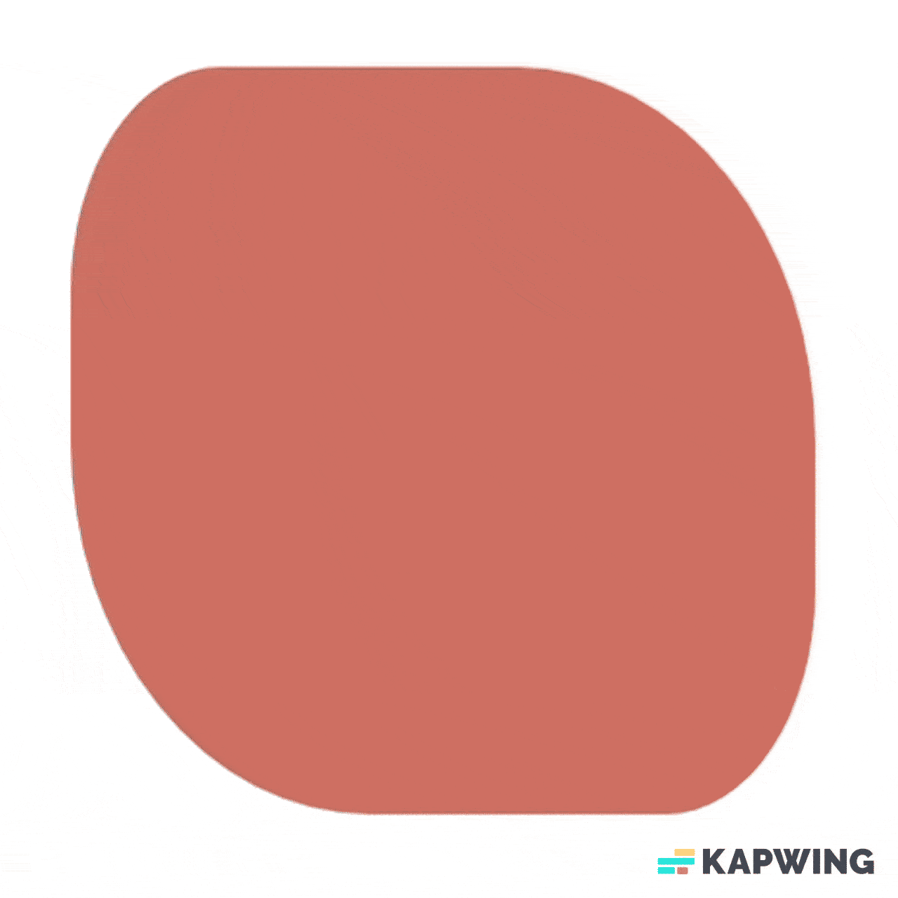

# CSS

CSS (Cascading Style Sheets) é uma linguagem usada para definir o estilo e o layout visual de páginas web escritas em HTML ou XHTML. Com CSS, desenvolvedores podem controlar a aparência de elementos na página, como cores, fontes, tamanhos, espaçamentos, e até animações e responsividade para diferentes dispositivos. O termo "cascading" (em cascata) refere-se à maneira como o CSS aplica as regras de estilo, priorizando as mais específicas quando há conflitos entre diferentes estilos. CSS permite separar o conteúdo (HTML) da apresentação (CSS), facilitando a manutenção e a reutilização de estilos em múltiplas páginas. Isso torna as páginas web mais consistentes e visualmente atraentes, além de melhorar a experiência do usuário.

## Seletores

### 1. Seletores simples

- **Seletor de elemento**: seleciona todos os elementos de um tipo específico. Por exemplo, aplica a cor da fonte azul para todas as tags `p`.
  ```css
  p {
    color: blue;
  }
  ```
- **Seletor de Classe**: Seleciona elementos com uma classe específica. Por exemplo, aplica a cor da fonte vermelha a todos os elementos com a classe `alert`.
  ```css
  .alert {
    color: red;
  }
  ```
- **Seletor de ID**: Seleciona um elemento com um ID específico. Por exemplo, define o tamanho da fonte para 24px no elemento com o ID `header`.
  ```css
  #header {
    font-size: 24px;
  }
  ```

### 2. Seletores Combinadores

- **Seletor Descendente**: Seleciona elementos que estão dentro de outro elemento.
  ```css
  div p {
    margin: 10px;
  }
  ```
  Adiciona margem de 10px a `<p>` que estão dentro de um `<div>`.
- **Seletor de Filho Direto**: Seleciona elementos filhos diretos de um pai.
  ```css
  ul > li {
    list-style-type: square;
  }
  ```
  Define o estilo da lista como quadrado apenas para `<li>` diretamente dentro de `<ul>`.
- **Seletor de Irmão Adjacente**: Seleciona um elemento que vem logo após outro.
  ```css
  h1 + p {
    font-weight: bold;
  }
  ```
  Torna o texto em negrito em `<p>` que segue imediatamente após um `<h1>`.

### 3. Seletores de Atributo

- **Seletor de Atributo**: Seleciona elementos que possuem um atributo específico. Por exemplo, adiciona uma borda aos campos de entrada `<input>` do tipo "text".
  ```css
  input[type="text"] {
    border: 1px solid black;
  }
  ```

### 4. Pseudo-classes

- **`:hover`**: Aplica estilo quando o mouse passa sobre um elemento.
  ```css
  a:hover {
    color: green;
  }
  ```
  Muda a cor de um link para verde ao passar o mouse.
- **`:nth-child()`**: Seleciona o enésimo filho de um elemento pai.
  ```css
  li:nth-child(2) {
    font-style: italic;
  }
  ```
  Torna o segundo `<li>` em itálico.
- `:nth-of-type()`: Seleciona elementos do mesmo tipo, como `<div>`, `<p>`, `<li>`, etc., dentro de um contêiner, sem que outros tipos sejam afetados. Ele é útil para aplicar estilos alternados ou específicos a certos elementos em uma lista ou grupo, por exemplo. Exemplo, seleciona o segundo elemento do mesmo tipo. Neste caso, apenas o segundo `<p>` dentro de um contêiner será azul.
  ```css
  p:nth-of-type(2) {
    color: blue;
  }
  ```
- Outro exemplo, seleciona o terceiro, sexto, nono, etc., elementos do mesmo tipo. Aqui, cada terceiro `<div>` dentro do pai terá o texto em negrito.
  ```css
  div:nth-of-type(3n) {
    font-weight: bold;
  }
  ```

### 5. Pseudo-elementos

- **`::before` e `::after`**: Permitem adicionar conteúdo antes ou depois de um elemento.
  ```css
  p::before {
    content: "Nota: ";
    font-weight: bold;
  }
  ```
  Adiciona "Nota: " antes de cada `<p>`.
- **`::first-line`**: Aplica estilo à primeira linha do texto.
  ```css
  p::first-line {
    color: purple;
  }
  ```
  Define a cor da primeira linha de todos os `<p>` para roxo.

## Transições

Exemplo de transição:

```html
<!DOCTYPE html>
<html lang="en">
  <head>
    <meta charset="UTF-8" />
    <meta name="viewport" content="width=device-width, initial-scale=1.0" />
    <title>Transitions</title>
    <link rel="stylesheet" href="app.css" />
  </head>
  <body>
    <div class="element">
      <div>Olá!</div>
    </div>
  </body>
</html>
```

```css
.element {
  width: 300px;
  height: 300px;
  background-color: #d77a61;
  border-radius: 20% 40% / 30% 50%;
  border: 3px solid #d77a61;
  transition: 1s;
  text-align: center;
  line-height: 300px;
}

.element div {
  color: rgba(215, 123, 97, 0);
  transition: 2s 1s;
  font-size: 30px;
}

.element:hover {
  border-radius: 50% 15% 30% 20% / 20% 40% 25% 35%;
  background-color: white;
}

.element:hover div {
  color: rgb(215, 123, 97);
}
```

Resultado:



**[← Voltar ao índice](README.md)**
