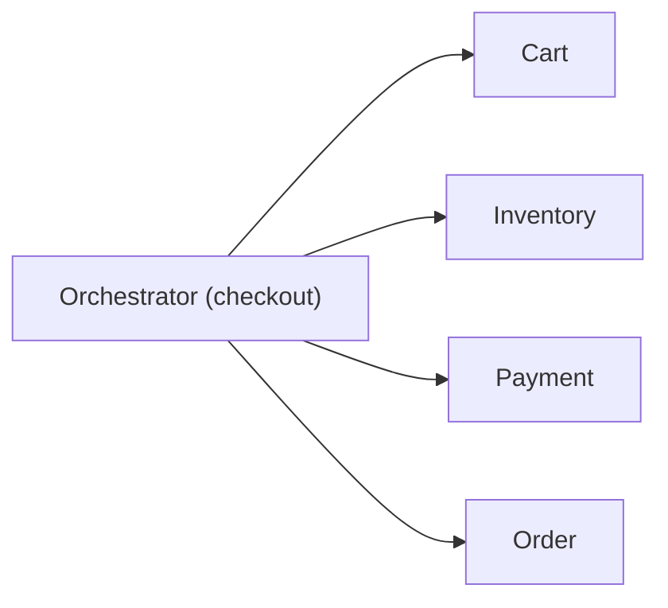
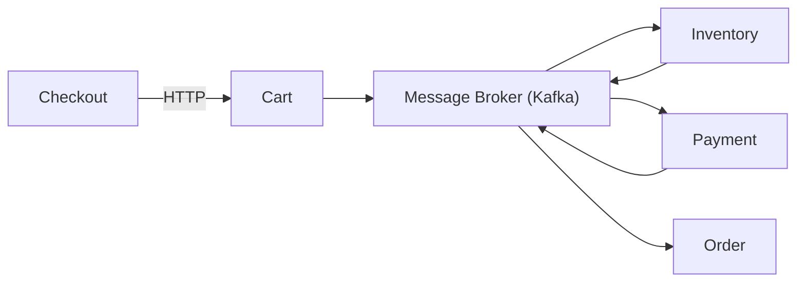

# Consistência Transacional: Monólito vs Microsserviços

## Monólito (modelo tradicional)

No monólito, consistência é simples porque:

- Existe **um único banco de dados**
- Usa-se **transações ACID**

Características:

- **Atomicidade**: tudo ou nada
- **Consistência forte**
- **Rollback automático**

Exemplo: criar pedido + debitar saldo em mesma transação. Se falhar, rollback completo.

Simples, porém pouco escalável e com forte acoplamento.

## Microsserviços (modelo distribuído)

Cada serviço tem seu próprio banco e é independente.

Resultado: **não existe transação ACID global**.

Você entra no mundo de:

- **Consistência eventual**
- **Sistemas distribuídos**
- **Falhas parciais**

### Problema central

Como garantir consistência em algo como:

1. Criar pedido
2. Cobrar pagamento
3. Atualizar estoque

Se cada passo está em um serviço diferente?

## Solução: Sagas (padrão principal)

Uma saga é uma sequência de transações locais:

- Cada serviço executa sua parte
- Em caso de erro, executa ações compensatórias

Exemplo de Saga:

1. Pedido criado ✅
2. Pagamento falhou ❌
3. Cancelar pedido (compensação)

## Orquestração vs Coreografia

### Orquestração

Existe um **orquestrador central** que controla o fluxo - decide quem executa, quando executa e o que fazer em caso de erro.

**Vantagens**: fluxo explícito e centralizado, mais fácil de entender/debugar, controle total da saga.

**Desvantagens**: ponto único de falha, maior acoplamento, menos flexível.

**Quando usar**: fluxos complexos, regras de negócio bem definidas, quando precisa de controle forte.

### Coreografia

Não existe controlador central - cada serviço reage a eventos.

**Vantagens**: baixo acoplamento, alta escalabilidade, sistema mais resiliente.

**Desvantagens**: difícil de entender o fluxo, debug complexo, pode virar "event spaghetti".

**Quando usar**: sistemas altamente distribuídos, arquitetura orientada a eventos, times independentes.

## Comparação direta

| Aspecto             | Orquestração | Coreografia  |
| ------------------- | ------------ | ------------ |
| Controle            | Centralizado | Distribuído  |
| Acoplamento         | Médio        | Baixo        |
| Observabilidade     | Mais fácil   | Mais difícil |
| Escalabilidade      | Menor        | Maior        |
| Complexidade mental | Baixa        | Alta         |

## Insight principal

> Consistência em microsserviços não é sobre evitar falhas - é sobre saber lidar com elas.

Você aceita inconsistência temporária, projeta compensações e trabalha com eventual consistency.

## Boas práticas

- Idempotência (evitar duplicação de eventos)
- Retries com backoff
- Dead letter queues
- Observabilidade (logs, tracing distribuído)
- Versionamento de eventos

## Resumo

- Monólito - ACID, simples, consistente
- Microsserviços - distribuído, falho por natureza
- Sagas - solução para consistência
- Orquestração - controle central
- Coreografia - eventos distribuídos

> Você troca consistência imediata por escalabilidade e resiliência.

## Referências

- [System Design Interview. A pergunta mais comum em entrevista sobre microsserviços | Leonardo Zamariola](https://www.youtube.com/watch?v=bBYjxqLSXeU)

**[← Voltar ao índice](README.md)**
