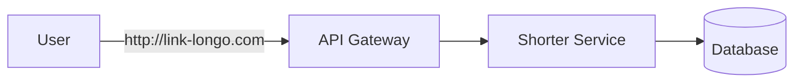

# Encurtador de URL - visão geral do problema

Um encurtador de URL (tipo Bitly) é um sistema que:

- Recebe uma URL longa
- Gera uma URL curta única
- Redireciona usuários da URL curta para a original

## 1. Estrutura de raciocínio (FENCAFA)

Framework útil para entrevistas de system design:

1. **F**uncional
2. **E**scala
3. **N**ão-funcional
4. **C**omponentes
5. **A**rquitetura
6. **F**luxo
7. **A**justes (trade-offs)

Isso mostra organização mental - mais importante que a solução final.

## 2. Requisitos do sistema

### Funcionais

- Criar URL curta
- Redirecionar URL
- (opcional) métricas de acesso

### Não-funcionais

- **Alta disponibilidade**
- **Baixa latência** (redirecionamento precisa ser rápido)
- **Escalabilidade massiva**
- **Consistência eventual aceitável**

## 3. Estimativa de escala

Você deve estimar:

- Número de URLs criadas por dia
- Número de redirecionamentos (muito maior que writes)
- Volume de armazenamento

> Sistema é **read-heavy (muito mais leitura que escrita)**

## 4. Modelo básico (primeira solução)

### Fluxo simples

1. Usuário envia URL longa
2. Sistema gera código curto
3. Salva o mapping: `short_code → original_url`
4. Redirecionamento consulta esse mapping

## 5. Geração da URL curta (ponto crítico)

### Requisitos do ID

- Único
- Curto
- Não previsível (ideal)
- Escalável

### Estratégias

**1. Auto-increment + Base62**

ID numérico convertido para Base62 (a-zA-Z0-9). Simples e determinístico, mas pode ser previsível.

**2. Hash da URL**

`hash(original_url)`. Pode colidir e dificulta controle.

**3. ID distribuído (Snowflake-like)**

Geração distribuída de IDs únicos. Escalável e evita bottleneck.

> Geração de ID é um dos principais gargalos de escala.

## 6. Problema de escala

Redirecionamento acontece em altíssimo volume - leitura é o gargalo.

### Otimizações

**Cache (essencial)**: Redis/memória com `short_code → URL`. Reduz latência e alivia o banco.

**CDN**: Cache geográfico para redirecionamento mais rápido globalmente.

**Banco distribuído**: Sharding por chave (short_code).

## 7. Arquitetura proposta

### Componentes principais

- API Service
- DB (mapping)
- Cache (Redis)
- Load Balancer
- (Opcional) Analytics pipeline

### Fluxo de leitura

1. Recebe short URL
2. Busca no cache
3. Se miss, busca no DB
4. Retorna redirect (HTTP 301/302)

### Fluxo de escrita

1. Gera ID
2. Salva mapping
3. Atualiza cache

## 8. Problemas avançados

### Cache invalidation

Dados podem ficar inconsistentes. Estratégias: TTL, write-through.

### Hot keys

Algumas URLs podem explodir de acesso. Soluções: replicação, cache agressivo, CDN.

### Consistência

Eventual consistency é aceitável - pequeno delay não quebra o sistema.

### Abuso / segurança

Spam, links maliciosos, rate limiting.

### Analytics

Contagem de cliques exige sistema separado (event-driven).

## 9. Trade-offs importantes

| Decisão         | Trade-off    |
| --------------- | ------------ |
| Cache agressivo | Consistência |
| ID sequencial   | Segurança    |
| Hash            | Colisão      |
| DB único        | Escala       |
| DB distribuído  | Complexidade |

> O problema não é encurtar URL - é escalar leitura massiva com baixa latência.

## Como responder em entrevista

1. Clarificar requisitos
2. Estimar escala
3. Solução simples (baseline)
4. Identificar gargalos
5. Evoluir arquitetura
6. Discutir trade-offs

## Resumo

- Sistema simples conceitualmente, difícil na escala
- Leitura domina o sistema
- Cache é essencial
- Geração de ID é crítica
- Trade-offs definem a arquitetura

## Referências

- [System Design: Encurtador de URL - Desafio Real de Entrevista RESOLVIDO | Leonardo Zamariola](https://www.youtube.com/watch?v=JHavVCLQT4k)

**[← Voltar ao índice](README.md)**
