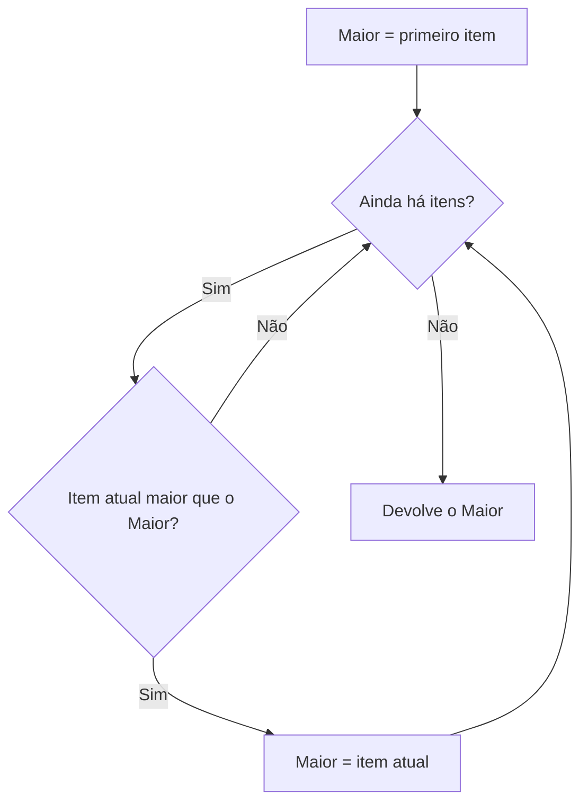

# Lógica de Programação e Pensamento Computacional

Antes de escrever a primeira linha de código existe uma etapa que ninguém vê: pensar em como resolver o problema. Esta nota trata dessa etapa, em duas camadas. A **lógica de programação** é a parte mais concreta, montar as instruções. O **pensamento computacional** é o raciocínio mais amplo por trás disso, que também serve para projetar sistemas e depurar bugs.

## Lógica de programação

Lógica de programação é a capacidade de construir uma sequência coerente de instruções para resolver um problema. Uma receita de bolo é um bom exemplo: ingredientes na ordem certa, um passo depende do anterior, e se pular uma etapa o resultado sai errado.

Toda solução, em qualquer linguagem, é montada com três ferramentas:

- **sequência:** fazer as coisas em ordem, uma depois da outra
- **decisão:** escolher um caminho conforme uma condição (`if`)
- **repetição:** fazer a mesma coisa várias vezes (`for`, `while`)

Veja como isso funciona num problema simples, achar o maior número de uma lista. Em português, antes do código:

1. Considere que o primeiro número é o maior até agora.
2. Olhe cada número da lista. Se ele for maior que o maior até agora, ele passa a ser o novo maior.
3. Ao terminar a lista, o que ficou guardado é a resposta.



```js
function maiorNumero(numeros) {
  let maior = numeros[0];
  for (const numero of numeros) {
    if (numero > maior) maior = numero;
  }
  return maior;
}

maiorNumero([4, 9, 2, 7]); // 9
```

Repare que o raciocínio existia antes do código e não depende de JavaScript. Escrito em Python, Java ou Go, o esqueleto é o mesmo: só muda a sintaxe. Por isso a lógica é o pilar que se transfere entre linguagens, e quem tem ela sólida aprende uma linguagem nova em bem menos tempo.

Uma pergunta que ajuda a testar a lógica: "e se a lista vier vazia?". No exemplo acima, `numeros[0]` seria `undefined`. Pensar nos casos de borda é parte da lógica, não um detalhe de depois.

## Pensamento computacional

Pensamento computacional é o conjunto de processos de pensamento usados para formular um problema de modo que uma solução possa ser executada por um computador (uma máquina ou até uma pessoa seguindo os passos). O termo ganhou força com o artigo de Jeannette Wing, de 2006, que defendeu que essa forma de pensar é útil para todo mundo, e não só para quem programa.

Existem duas formulações comuns, e as duas aparecem na literatura e no ensino. Nenhuma é "a definição certa".

### Os três pilares: abstração, automação e análise

É a formulação usada no artigo em português "Entendendo o Pensamento Computacional" (Ribeiro, Foss e Cavalheiro, 2017):

- **abstração:** deixar os detalhes de lado e ficar com o essencial do problema
- **automação:** transformar a solução em passos que uma máquina consegue executar
- **análise:** avaliar se a solução está correta e quanto ela custa (tempo, memória)

O artigo de Wing (2006) coloca a abstração e a automação no centro da ideia: pensar computacionalmente é, em boa parte, definir abstrações e automatizá-las.

### Os quatro pilares: decomposição, padrões, abstração e algoritmos

É a versão mais comum em currículos de escola:

- **decomposição:** quebrar um problema grande em partes menores
- **reconhecimento de padrões:** perceber o que se repete ou se parece com algo já resolvido
- **abstração:** focar no que importa
- **algoritmos:** escrever os passos da solução

As duas versões descrevem quase o mesmo caminho, só cortam o processo em fatias diferentes.

### Um exemplo: o encurtador de URL

Pegue o problema do [Encurtador de URL](/labs/web-dev/estudos-de-caso/01-encurtador-de-url/) e passe pelas ideias:

| Ideia | Como aparece no problema |
| ----- | ------------------------ |
| Decomposição | Separar em gerar o código curto, guardar o mapeamento e redirecionar |
| Reconhecimento de padrões | Guardar `código -> URL` é um problema de "chave e valor", já conhecido (veja [Tabelas Hash](/labs/web-dev/algoritmos-e-estruturas-de-dados/06-tabelas-hash/)) |
| Abstração | Ignorar por enquanto o layout da página, o login, a cor do botão: só importa a relação entre código e URL |
| Algoritmo / automação | Os passos que geram o código, gravam e consultam |
| Análise | Estimar quantas leituras por segundo o sistema aguenta e onde está o gargalo |

### Onde isso aparece no dia a dia

- **Design de sistemas:** decompor em serviços ou módulos e abstrair o que cada um esconde. A nota de [Trade-offs Arquiteturais](/labs/web-dev/system-design/05-trade-offs-arquiteturais/) é análise aplicada: comparar custos de cada decisão.
- **Debugging:** decompor o bug (em qual camada acontece?), reduzir ao menor caso que reproduz o erro e testar uma hipótese de cada vez.
- **Decisão técnica:** analisar as opções antes de escolher, em vez de usar a primeira que veio à cabeça.

## Referências

- [Entendendo o Pensamento Computacional](https://arxiv.org/abs/1707.00338) - Leila Ribeiro, Luciana Foss e Simone André da Costa Cavalheiro (2017), pt-BR
- [Computational thinking](https://dl.acm.org/doi/10.1145/1118178.1118215) - Jeannette M. Wing (Communications of the ACM, 2006), en
- [Lógica de Programação e Algoritmos com JavaScript, 2ª edição](https://novatec.com.br/livros/logica-programacao-algoritmos-com-javascript-2ed/) - Edécio Fernando Iepsen (Novatec), pt-BR
