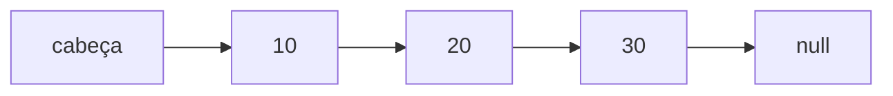

# Estruturas de Dados Lineares

Uma estrutura **linear** guarda os elementos em sequência, um depois do outro. As quatro mais importantes são o array, a lista ligada, a pilha e a fila. Elas parecem parecidas por fora, mas cada uma deixa certas operações baratas e outras caras (se precisar, revise [Complexidade e Big O](/labs/web-dev/algoritmos-e-estruturas-de-dados/04-complexidade-e-big-o/) antes).

## Array

Um array guarda os elementos lado a lado na memória, cada um com um índice (0, 1, 2...). Como o computador sabe onde o array começa e quanto cada elemento ocupa, ele calcula o endereço de qualquer posição com uma conta simples, sem percorrer nada. Por isso acessar `lista[i]` é O(1).

O outro lado da moeda: se os elementos ficam lado a lado, inserir ou remover no meio obriga a **deslocar todos os elementos seguintes** para abrir ou fechar espaço. Isso custa O(n).

```js
const lista = [10, 20, 30, 40];

lista[2]; // 30, O(1)
lista.indexOf(40); // busca, O(n)
lista.push(50); // no fim, O(1) na maioria das vezes
lista.splice(1, 0, 15); // insere no meio, O(n): desloca 20, 30, 40, 50
```

O `push` é O(1) "na maioria das vezes": arrays dinâmicos reservam espaço extra e, quando ele acaba, copiam tudo para um espaço maior. Essa cópia é cara (O(n)), mas acontece raramente, então o custo médio por `push` continua O(1) (chamado de custo amortizado).

Os arrays do JavaScript são dinâmicos e o motor pode representá-los de formas diferentes por baixo, mas o modelo acima é o suficiente para raciocinar sobre custos.

## Lista ligada (linked list)

Na lista ligada, cada elemento é um **nó** que guarda o valor e uma referência para o próximo. Os nós podem estar espalhados pela memória, quem mantém a ordem são as referências.



Inserir no começo é barato: cria um nó novo apontando para o antigo primeiro. Em compensação, chegar ao quinto elemento exige seguir as referências uma a uma, então acessar por posição é O(n).

```js
class No {
  constructor(valor, proximo = null) {
    this.valor = valor;
    this.proximo = proximo;
  }
}

class ListaLigada {
  constructor() {
    this.cabeca = null;
  }

  inserirNoInicio(valor) {
    this.cabeca = new No(valor, this.cabeca); // O(1)
  }

  buscar(valor) {
    let atual = this.cabeca;
    while (atual !== null) {
      if (atual.valor === valor) return atual;
      atual = atual.proximo;
    }
    return null; // O(n)
  }
}
```

Existe também a lista **duplamente ligada**, em que cada nó aponta para o próximo e para o anterior. Ela permite remover um nó em O(1) quando você já tem a referência dele, e é a peça que faz certos caches funcionarem (veja a política LRU em [Cache e Redis](/labs/web-dev/escalabilidade/08-cache-e-redis/)).

Na prática de JavaScript, a lista ligada raramente é a melhor escolha: o array é mais simples, e por percorrer memória contínua costuma ser mais rápido. Ela vale mais como conceito, porque aparece dentro de outras estruturas (filas, caches, tabelas hash).

## Pilha (stack)

Uma pilha funciona como uma pilha de pratos: o último que entra é o primeiro que sai. Isso se chama **LIFO** (last in, first out). Só se mexe no topo, com duas operações principais: `push` (empilhar) e `pop` (desempilhar). Ambas são O(1).

```js
const pilha = [];
pilha.push("a");
pilha.push("b");
pilha.push("c");
pilha.pop(); // "c"
pilha.pop(); // "b"
```

Você já usa pilhas sem perceber:

- o **desfazer** (Ctrl+Z) de um editor: a última ação feita é a primeira desfeita
- o botão **voltar** do navegador
- a **pilha de chamadas** de funções (mais na nota de [Recursão](/labs/web-dev/algoritmos-e-estruturas-de-dados/09-recursao-busca-e-ordenacao/))

Um problema clássico que a pilha resolve bem é conferir se os parênteses estão balanceados:

```js
function parentesesBalanceados(texto) {
  const pares = { ")": "(", "]": "[", "}": "{" };
  const pilha = [];

  for (const char of texto) {
    if (char === "(" || char === "[" || char === "{") {
      pilha.push(char);
    } else if (pares[char]) {
      if (pilha.pop() !== pares[char]) return false;
    }
  }
  return pilha.length === 0;
}

parentesesBalanceados("{[()]}"); // true
parentesesBalanceados("{[(])}"); // false
```

Cada fechamento precisa casar com a abertura mais recente que ainda está em aberto, e "o mais recente" é exatamente o topo da pilha.

## Fila (queue)

Uma fila funciona como a fila do caixa do mercado: quem chega primeiro é atendido primeiro. Isso é **FIFO** (first in, first out). As operações são `enqueue` (entrar no fim) e `dequeue` (sair do começo).

Usos comuns: fila de impressão, tarefas em segundo plano e a busca em largura de grafos (veja [Grafos](/labs/web-dev/algoritmos-e-estruturas-de-dados/08-grafos/)). A mesma ideia, só que entre sistemas, é o que os brokers de [Filas e Mensageria](/labs/web-dev/mensageria/01-filas-e-mensageria/) fazem.

Dá para usar um array com `push` e `shift`, e para filas pequenas funciona:

```js
const fila = [];
fila.push("primeiro");
fila.push("segundo");
fila.shift(); // "primeiro"
```

Só que `shift()` remove o primeiro elemento e desloca todos os outros, o que em teoria custa O(n) (os motores de JavaScript otimizam vários casos, mas não dá para contar com isso em filas grandes). Uma implementação que mantém dois índices evita o problema:

```js
class Fila {
  constructor() {
    this.itens = {};
    this.inicio = 0;
    this.fim = 0;
  }

  enqueue(item) {
    this.itens[this.fim++] = item;
  }

  dequeue() {
    if (this.inicio === this.fim) return undefined;
    const item = this.itens[this.inicio];
    delete this.itens[this.inicio++];
    return item;
  }

  get tamanho() {
    return this.fim - this.inicio;
  }
}
```

## Comparação de custos

Para uma lista ligada simples que guarda só a referência da cabeça:

| Operação                   | Array           | Lista ligada                               | Pilha         | Fila             |
| -------------------------- | --------------- | ------------------------------------------ | ------------- | ---------------- |
| Acesso por posição         | O(1)            | O(n)                                       | não se usa    | não se usa       |
| Busca por valor            | O(n)            | O(n)                                       | não se usa    | não se usa       |
| Inserir no início          | O(n)            | O(1)                                       | não se usa    | não se usa       |
| Inserir no fim             | O(1) amortizado | O(n)                                       | O(1) (`push`) | O(1) (`enqueue`) |
| Remover do início          | O(n)            | O(1)                                       | não se usa    | O(1) (`dequeue`) |
| Inserir ou remover no meio | O(n)            | O(n) para achar a posição, O(1) para ligar | não se usa    | não se usa       |

Na dúvida, comece pelo array. Use pilha ou fila quando a **ordem de saída** for o ponto do problema (o último que entrou ou o primeiro que entrou).

## Referências

- [Algoritmos em Linguagem C](https://www.ime.usp.br/~pf/algoritmos-livro/) - Paulo Feofiloff (Elsevier, 2009), pt-BR
- [Estruturas de dados e tipos de dados em JavaScript](https://developer.mozilla.org/pt-BR/docs/Web/JavaScript/Guide/Data_structures) - MDN Web Docs, pt-BR
- [Introduction to Algorithms, 4th ed.](https://mitpress.mit.edu/9780262046305/introduction-to-algorithms/) - Cormen, Leiserson, Rivest e Stein (MIT Press, 2022), en
