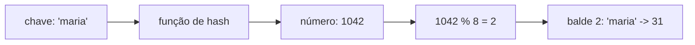

# Tabelas Hash

Uma tabela hash guarda pares de **chave e valor** e devolve o valor de uma chave quase instantaneamente, sem varrer os dados. É a ideia por trás do `Map`, do `Set` e dos objetos que você usa como dicionário em JavaScript, e uma das mais úteis para trocar memória por tempo.

## Como funciona uma tabela hash (hash map)

Por baixo, a tabela é um **array** dividido em posições chamadas _baldes_ (buckets). O truque está em como se decide em qual balde cada chave vai: uma **função de hash** recebe a chave e devolve um número, e esse número (com um `%` pelo tamanho do array) vira o índice.



Para buscar, o caminho é o mesmo: aplica a função de hash na chave, chega ao balde e pega o valor. Não importa se há 10 ou 10 milhões de chaves, o trabalho é praticamente o mesmo.

Uma versão de brinquedo, só para ver o mecanismo (implementações reais usam funções de hash bem melhores):

```js
class TabelaHash {
  constructor(tamanho = 8) {
    this.baldes = Array.from({ length: tamanho }, () => []);
  }

  #indice(chave) {
    let soma = 0;
    for (const char of String(chave)) soma += char.charCodeAt(0);
    return soma % this.baldes.length;
  }

  set(chave, valor) {
    const balde = this.baldes[this.#indice(chave)];
    const existente = balde.find(([c]) => c === chave);
    if (existente) existente[1] = valor;
    else balde.push([chave, valor]);
  }

  get(chave) {
    const balde = this.baldes[this.#indice(chave)];
    const par = balde.find(([c]) => c === chave);
    return par ? par[1] : undefined;
  }
}
```

## Custo de acesso

| Operação           | Caso médio | Pior caso |
| ------------------ | ---------- | --------- |
| Buscar (`get`)     | O(1)       | O(n)      |
| Inserir (`set`)    | O(1)       | O(n)      |
| Remover (`delete`) | O(1)       | O(n)      |

O "caso médio" é o que vale na prática, e o pior caso acontece quando muitas chaves caem no mesmo balde (a seção de colisões explica). Duas informações complementares:

- Quando a tabela fica cheia demais, as implementações reais **crescem** o array e redistribuem todas as chaves (rehash). Essa operação custa O(n), mas é rara, então o custo médio continua O(1).
- Uma tabela hash **não mantém as chaves ordenadas** por valor. Para "todas as chaves entre 10 e 20", ela não ajuda, e é por isso que os índices padrão dos bancos usam árvore, e não hash (veja [Árvores](/labs/web-dev/algoritmos-e-estruturas-de-dados/07-arvores/)).

## Colisões

Uma **colisão** acontece quando duas chaves diferentes caem no mesmo balde. Ela é inevitável: existem infinitas chaves possíveis e um número finito de baldes. O que muda é como a tabela reage. Duas estratégias comuns:

- **Encadeamento (chaining):** cada balde guarda uma lista com todos os pares que caíram ali, como na versão de brinquedo acima. A busca vai ao balde e percorre essa lista curta.
- **Endereçamento aberto:** se o balde está ocupado, a tabela procura outra posição livre seguindo uma regra (por exemplo, a próxima).

Uma boa função de hash espalha as chaves de forma uniforme e mantém os baldes quase vazios, garantindo o O(1) médio. Se todas as chaves caírem no mesmo balde, a tabela degenera em uma lista comum e o acesso vira O(n). É o pior caso da tabela.

## Onde aparecem no dia a dia

Em JavaScript, `Map` e `Set` são a tabela hash pronta para uso. A especificação da linguagem só exige que o acesso seja mais rápido que percorrer tudo, mas na prática os motores implementam com tabelas hash. Um exemplo clássico é contar frequências:

```js
function contarPalavras(texto) {
  const contagem = new Map();
  for (const palavra of texto.toLowerCase().split(/\s+/)) {
    contagem.set(palavra, (contagem.get(palavra) ?? 0) + 1);
  }
  return contagem;
}

contarPalavras("a casa é a casa"); // Map { 'a' => 2, 'casa' => 2, 'é' => 1 }
```

Outro clássico é achar dois números que somam um alvo, em O(n), guardando o que já foi visto:

```js
function doisSomam(numeros, alvo) {
  const vistos = new Map(); // valor -> índice
  for (let i = 0; i < numeros.length; i++) {
    const complemento = alvo - numeros[i];
    if (vistos.has(complemento)) return [vistos.get(complemento), i];
    vistos.set(numeros[i], i);
  }
  return null;
}
```

Dica de uso: para um dicionário de chaves dinâmicas, prefira `Map` ao objeto simples. O `Map` aceita qualquer tipo de chave, mantém a ordem de inserção e não esbarra em chaves herdadas do protótipo do objeto.

Fora do código de aplicação, a ideia aparece em vários lugares deste lab:

- **Cache:** um cache é, na essência, uma tabela chave-valor. A política LRU descrita em [Cache e Redis](/labs/web-dev/escalabilidade/08-cache-e-redis/) costuma ser implementada combinando uma tabela hash (para achar o item rápido) com uma lista duplamente ligada (para saber qual foi usado há mais tempo).
- **Distribuição de dados:** decidir em qual servidor uma chave mora é aplicar `hash(chave)` e mapear para um nó. A nota de [Consistent Hashing e Gossip](/labs/web-dev/sistemas-distribuidos/04-consistent-hashing-e-gossip/) mostra o problema que essa ideia simples tem quando servidores entram e saem.
- **Encurtador de URL:** o mapeamento `código -> URL` é uma tabela hash em grande escala (veja [Encurtador de URL](/labs/web-dev/estudos-de-caso/01-encurtador-de-url/)).

## Referências

- [Map - JavaScript](https://developer.mozilla.org/pt-BR/docs/Web/JavaScript/Reference/Global_Objects/Map) - MDN Web Docs, pt-BR
- [Introduction to Algorithms, 4th ed.](https://mitpress.mit.edu/9780262046305/introduction-to-algorithms/) - Cormen, Leiserson, Rivest e Stein (MIT Press, 2022), en
