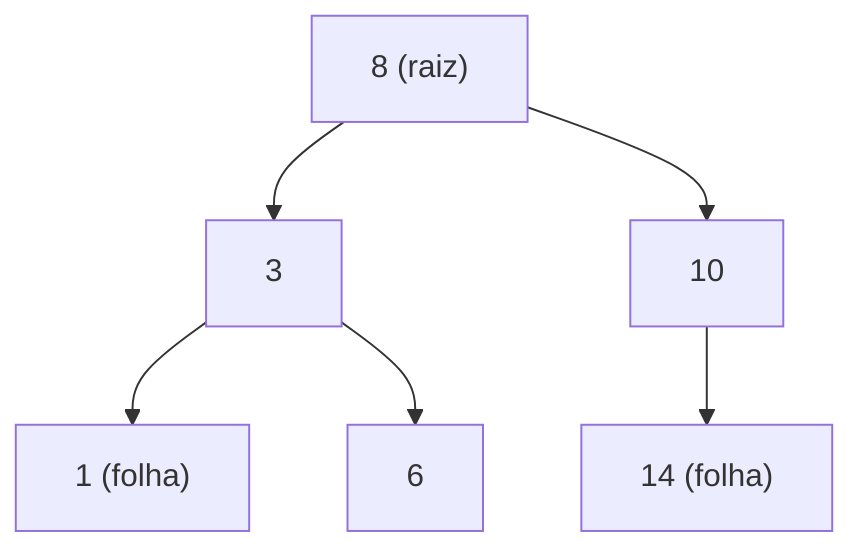

# Árvores

Arrays, listas e filas guardam dados em fila indiana. Árvores guardam dados em **hierarquia**: um elemento no topo, que se divide em filhos, que se dividem em outros filhos. Você já convive com árvores o tempo todo: as pastas do seu computador, o HTML de uma página (cada tag dentro de outra) e o organograma de uma empresa.

## Árvore binária

Uma árvore é feita de **nós**. O nó de cima se chama **raiz**, os que não têm filhos são as **folhas** e a **altura** é o tamanho do maior caminho da raiz até uma folha. Numa **árvore binária**, cada nó tem no máximo dois filhos, o esquerdo e o direito.



```js
class No {
  constructor(valor) {
    this.valor = valor;
    this.esquerda = null;
    this.direita = null;
  }
}
```

Para passar por todos os nós existem quatro percursos clássicos. Os três primeiros usam recursão (veja [Recursão](/labs/web-dev/algoritmos-e-estruturas-de-dados/09-recursao-busca-e-ordenacao/)) e diferem na hora em que "visitam" o nó:

- **pré-ordem:** visita o nó, depois a esquerda, depois a direita
- **em ordem:** esquerda, nó, direita
- **pós-ordem:** esquerda, direita, nó
- **por nível:** camada por camada, de cima para baixo, usando uma fila (é a busca em largura da nota de [Grafos](/labs/web-dev/algoritmos-e-estruturas-de-dados/08-grafos/))

```js
function emOrdem(no, visitar) {
  if (no === null) return;
  emOrdem(no.esquerda, visitar);
  visitar(no.valor);
  emOrdem(no.direita, visitar);
}
```

## Árvore de busca binária

Uma **árvore de busca binária** (BST, de _binary search tree_) é uma árvore binária com uma regra: para todo nó, os valores da subárvore esquerda são **menores** e os da direita são **maiores**. A árvore do desenho acima segue essa regra.

Com essa regra, buscar vira um "acerta ou descarta metade": compara com o nó atual. Se o valor procurado é menor, o resultado só pode estar à esquerda, então tudo à direita é ignorado. E assim por diante.

```js
class ArvoreBusca {
  constructor() {
    this.raiz = null;
  }

  inserir(valor) {
    const novo = new No(valor);
    if (this.raiz === null) {
      this.raiz = novo;
      return;
    }
    let atual = this.raiz;
    while (true) {
      if (valor < atual.valor) {
        if (atual.esquerda === null) {
          atual.esquerda = novo;
          return;
        }
        atual = atual.esquerda;
      } else {
        if (atual.direita === null) {
          atual.direita = novo;
          return;
        }
        atual = atual.direita;
      }
    }
  }

  buscar(valor) {
    let atual = this.raiz;
    while (atual !== null) {
      if (valor === atual.valor) return atual;
      atual = valor < atual.valor ? atual.esquerda : atual.direita;
    }
    return null;
  }
}
```

Uma consequência elegante: o percurso **em ordem** de uma BST devolve os valores já ordenados.

O custo de buscar, inserir e remover é proporcional à **altura** da árvore:

- se ela está equilibrada, a altura é cerca de log n e as operações custam O(log n)
- se ela degenera numa "reta", a altura é n e as operações custam O(n). Isso acontece, por exemplo, se você inserir valores que já vêm em ordem crescente (1, 2, 3, 4...), pois cada novo nó vai para a direita do anterior

Para evitar esse cenário existem as **árvores balanceadas**, que se reorganizam sozinhas ao inserir e remover para manter a altura baixa (as mais conhecidas são a AVL e a rubro-negra). A implementação delas foge do escopo desta nota.

## Heap (fila de prioridade)

Um **heap** é uma árvore binária _completa_ (todos os níveis cheios, com o último preenchido da esquerda para a direita) com uma regra diferente da BST. Num **min-heap**, todo nó é menor ou igual aos seus filhos. Consequência: **o menor elemento está sempre na raiz**.

Por ser completa, a árvore cabe num array sem nenhum ponteiro. Para o nó no índice `i`:

- os filhos estão em `2i + 1` e `2i + 2`
- o pai está em `Math.floor((i - 1) / 2)`

| Operação             | Custo    |
| -------------------- | -------- |
| Ver o menor (`peek`) | O(1)     |
| Inserir              | O(log n) |
| Remover o menor      | O(log n) |

Inserir coloca o item no fim do array e o "sobe" enquanto for menor que o pai. Remover o menor troca a raiz pelo último item e o "desce" enquanto for maior que algum filho.

```js
class MinHeap {
  constructor() {
    this.itens = [];
  }

  inserir(valor) {
    this.itens.push(valor);
    let i = this.itens.length - 1;
    while (i > 0) {
      const pai = Math.floor((i - 1) / 2);
      if (this.itens[pai] <= this.itens[i]) break;
      [this.itens[pai], this.itens[i]] = [this.itens[i], this.itens[pai]];
      i = pai;
    }
  }

  removerMenor() {
    if (this.itens.length === 0) return undefined;
    const menor = this.itens[0];
    const ultimo = this.itens.pop();
    if (this.itens.length > 0) {
      this.itens[0] = ultimo;
      let i = 0;
      while (true) {
        const esq = 2 * i + 1;
        const dir = 2 * i + 2;
        let menorIdx = i;
        if (esq < this.itens.length && this.itens[esq] < this.itens[menorIdx])
          menorIdx = esq;
        if (dir < this.itens.length && this.itens[dir] < this.itens[menorIdx])
          menorIdx = dir;
        if (menorIdx === i) break;
        [this.itens[i], this.itens[menorIdx]] = [
          this.itens[menorIdx],
          this.itens[i],
        ];
        i = menorIdx;
      }
    }
    return menor;
  }
}

const heap = new MinHeap();
[5, 3, 8, 1].forEach((n) => heap.inserir(n));
heap.removerMenor(); // 1
heap.removerMenor(); // 3
```

O heap é a estrutura ideal para uma **fila de prioridade**: uma fila em que sai o mais urgente, e não o mais antigo. Aparece em agendadores de tarefas, no "os k maiores itens" de uma lista e no algoritmo de ordenação heapsort. O JavaScript não traz um heap pronto na linguagem, por isso o código acima.

## Onde aparecem no dia a dia

- **Índices de banco de dados:** o índice B-tree da nota de [Índices e Planos de Execução](/labs/web-dev/banco-de-dados/13-indices-e-planos-de-execucao/) é uma árvore balanceada de busca, parente da BST desta nota, ajustada para ler poucos blocos de disco. É por isso que uma busca em milhões de linhas leva poucos passos.
- **Sistema de arquivos e DOM:** hierarquias de pastas e de tags HTML são árvores.
- **Agendadores e filas de prioridade:** costumam usar heaps.

## Referências

- [Heaps](https://www.ime.usp.br/~pf/analise_de_algoritmos/aulas/heap.html) - Paulo Feofiloff (IME-USP), pt-BR
- [Algoritmos em Linguagem C](https://www.ime.usp.br/~pf/algoritmos-livro/) - Paulo Feofiloff (Elsevier, 2009), pt-BR
- [Introduction to Algorithms, 4th ed.](https://mitpress.mit.edu/9780262046305/introduction-to-algorithms/) - Cormen, Leiserson, Rivest e Stein (MIT Press, 2022), en
