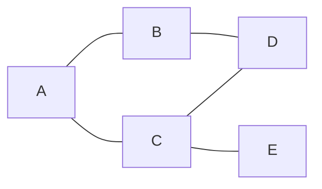

# Grafos

Grafos são a estrutura para tudo que tem **conexões**: pessoas que se seguem numa rede social, cidades ligadas por estradas, páginas que apontam para outras páginas, pacotes que dependem de outros pacotes. Uma árvore é um caso especial de grafo (um grafo sem ciclos, com uma raiz).

## O que é um grafo

Um grafo é feito de **vértices** (ou nós), as "coisas", e **arestas**, as conexões entre elas.

- **Não direcionado:** a conexão vale nos dois sentidos. A amizade no Facebook é assim: se A é amigo de B, B é amigo de A.
- **Direcionado:** a conexão tem sentido. Seguir alguém no Instagram é assim: A pode seguir B sem que B siga A.
- **Com peso:** cada aresta tem um valor, como a distância entre duas cidades. Achar o caminho mais curto em grafo com pesos exige algoritmos como o de Dijkstra, que ficam fora desta nota.



Um **ciclo** é um caminho que volta ao ponto de partida (A, B, D, C, A no desenho). Ciclos são a razão de um cuidado que aparece em todo código de grafo: é preciso lembrar por onde já se passou, ou a busca gira em círculos para sempre.

## Como representar

Existem duas formas comuns.

**Lista de adjacência:** para cada vértice, uma lista dos vizinhos dele. É a forma mais usada, porque gasta espaço O(V + E) (V vértices, E arestas) e só guarda as conexões que existem.

```js
const grafo = new Map([
  ["A", ["B", "C"]],
  ["B", ["A", "D"]],
  ["C", ["A", "D", "E"]],
  ["D", ["B", "C"]],
  ["E", ["C"]],
]);
```

**Matriz de adjacência:** uma tabela V x V em que a posição `[i][j]` diz se existe aresta entre `i` e `j`. Consultar "existe aresta entre A e B?" é O(1), mas ocupa O(V²) de espaço mesmo quando quase não há conexões.

Para grafos com poucas conexões (o caso comum), use lista de adjacência.

## Busca em largura (BFS)

A **busca em largura** (BFS, de _breadth-first search_) explora o grafo em camadas: primeiro o vértice inicial, depois todos os vizinhos dele, depois os vizinhos dos vizinhos. Quem organiza isso é uma **fila** (veja [Estruturas Lineares](/labs/web-dev/algoritmos-e-estruturas-de-dados/05-estruturas-lineares/)): os vértices descobertos primeiro são visitados primeiro.

Um efeito útil: num grafo sem pesos, a BFS encontra o caminho com **menos arestas** até cada vértice.

```js
function bfs(grafo, inicio) {
  const visitados = new Set([inicio]);
  const fila = [inicio];
  const ordem = [];
  let i = 0; // índice no lugar de shift(), para o dequeue ser O(1)

  while (i < fila.length) {
    const atual = fila[i++];
    ordem.push(atual);
    for (const vizinho of grafo.get(atual)) {
      if (!visitados.has(vizinho)) {
        visitados.add(vizinho);
        fila.push(vizinho);
      }
    }
  }
  return ordem;
}

bfs(grafo, "A"); // ["A", "B", "C", "D", "E"]
```

O `Set` de visitados é o que impede o ciclo infinito. O custo total é O(V + E): cada vértice entra na fila uma vez e cada aresta é olhada uma ou duas vezes.

## Busca em profundidade (DFS)

A **busca em profundidade** (DFS, de _depth-first search_) faz o contrário: escolhe um vizinho e vai o mais fundo possível, e só volta quando chega a um beco sem saída, para tentar o próximo caminho. Quem organiza isso é uma **pilha**, que na versão recursiva é a própria pilha de chamadas de funções.

```js
function dfs(grafo, atual, visitados = new Set(), ordem = []) {
  visitados.add(atual);
  ordem.push(atual);
  for (const vizinho of grafo.get(atual)) {
    if (!visitados.has(vizinho)) dfs(grafo, vizinho, visitados, ordem);
  }
  return ordem;
}

dfs(grafo, "A"); // ["A", "B", "D", "C", "E"]
```

Repare na diferença de ordem para o mesmo grafo: a BFS visitou `A, B, C, D, E` (por camada), a DFS visitou `A, B, D, C, E` (desceu por B até D antes de voltar). O custo também é O(V + E).

Para grafos muito profundos, a versão recursiva pode estourar a pilha de chamadas (veja [Recursão](/labs/web-dev/algoritmos-e-estruturas-de-dados/09-recursao-busca-e-ordenacao/)), e daí a DFS é escrita com uma pilha explícita (um array com `push` e `pop`).

## Quando usar cada busca

| Pergunta                                                 | Busca indicada               |
| -------------------------------------------------------- | ---------------------------- |
| Qual o caminho com menos passos entre A e B (sem pesos)? | BFS                          |
| Tudo que está a até 2 conexões de distância?             | BFS                          |
| Existe algum caminho entre A e B?                        | Qualquer uma                 |
| O grafo tem ciclo? Quantos grupos conectados existem?    | DFS costuma ser mais natural |
| Explorar todas as possibilidades de um jogo ou labirinto | DFS (base do backtracking)   |

Os dois algoritmos custam o mesmo, a escolha é sobre o que o problema pede. Como reconhecer que um problema é um grafo disfarçado (uma matriz, um labirinto, "menor número de passos") está em [Padrões de Resolução de Problemas](/labs/web-dev/algoritmos-e-estruturas-de-dados/11-padroes-de-resolucao-de-problemas/).

## Referências

- [Busca em largura (BFS) num grafo](https://www.ime.usp.br/~pf/algoritmos_para_grafos/aulas/bfs.html) - Paulo Feofiloff (IME-USP), pt-BR
- [Busca em profundidade (DFS) num grafo](https://www.ime.usp.br/~pf/algoritmos_para_grafos/aulas/dfs.html) - Paulo Feofiloff (IME-USP), pt-BR
- [Introduction to Algorithms, 4th ed.](https://mitpress.mit.edu/9780262046305/introduction-to-algorithms/) - Cormen, Leiserson, Rivest e Stein (MIT Press, 2022), en
