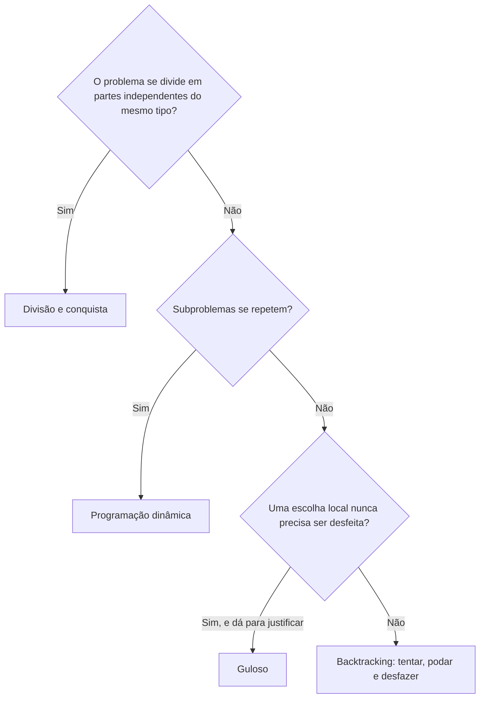

# Paradigmas de Projeto de Algoritmos

Um **paradigma** de projeto é uma forma geral de pensar para construir um algoritmo, uma estratégia que se repete em problemas diferentes. Esta nota apresenta quatro: divisão e conquista, programação dinâmica, algoritmos gulosos e backtracking. Quase toda solução de problema clássico cai em um deles (ou numa mistura).

Todos eles usam recursão em algum momento, então vale ter lido [Recursão, Busca e Ordenação](/labs/web-dev/algoritmos-e-estruturas-de-dados/09-recursao-busca-e-ordenacao/) antes.

## Divisão e conquista

A ideia: **dividir** o problema em partes menores do mesmo tipo, **resolver** cada parte (em geral por recursão) e **combinar** os resultados. As partes são independentes entre si.

Você já viu dois exemplos na nota anterior: a busca binária (divide o espaço de busca ao meio e descarta uma metade) e o merge sort (divide a lista, ordena as metades e intercala). Um terceiro, que mostra bem o ganho: calcular potência.

```js
function potenciaLenta(base, expoente) {
  let resultado = 1;
  for (let i = 0; i < expoente; i++) resultado *= base; // O(n) multiplicações
  return resultado;
}

function potencia(base, expoente) {
  if (expoente === 0) return 1;
  const metade = potencia(base, Math.floor(expoente / 2));
  return expoente % 2 === 0 ? metade * metade : metade * metade * base;
}
```

A versão de divisão e conquista usa o fato de que `x^10 = (x^5)^2`. Ela calcula a metade **uma vez** e reaproveita, então faz só O(log n) multiplicações em vez de O(n).

## Programação dinâmica

A programação dinâmica vale quando o problema tem **subproblemas que se repetem**: a mesma conta aparece várias vezes, e a solução do problema grande se monta a partir das soluções dos menores. A ideia é calcular cada subproblema uma única vez e **guardar** o resultado.

O exemplo clássico é a sequência de Fibonacci. A versão recursiva direta recalcula os mesmos valores um monte de vezes:

```js
function fibLento(n) {
  if (n <= 1) return n;
  return fibLento(n - 1) + fibLento(n - 2); // cresce de forma exponencial (limitado por O(2^n))
}
```

`fibLento(5)` chama `fibLento(3)` duas vezes, `fibLento(2)` três vezes, e assim por diante. Para `n = 50` já são bilhões de chamadas. Guardando os resultados, cada valor é calculado uma vez só. Há duas formas de fazer isso:

**De cima para baixo (memoização):** continua recursivo, mas anota o que já calculou.

```js
function fibMemo(n, memo = new Map()) {
  if (n <= 1) return n;
  if (memo.has(n)) return memo.get(n);
  const resultado = fibMemo(n - 1, memo) + fibMemo(n - 2, memo);
  memo.set(n, resultado);
  return resultado;
}
```

**De baixo para cima (tabulação):** começa pelos casos pequenos e monta até chegar em `n`, sem recursão.

```js
function fibTabela(n) {
  if (n <= 1) return n;
  let anterior = 0;
  let atual = 1;
  for (let i = 2; i <= n; i++) {
    [anterior, atual] = [atual, anterior + atual];
  }
  return atual;
}
```

As duas custam O(n), contra o custo exponencial da versão ingênua. Um problema mais interessante é o **troco mínimo**: qual o menor número de moedas para formar um valor?

```js
function trocoMinimo(moedas, valor) {
  const dp = Array(valor + 1).fill(Infinity);
  dp[0] = 0; // zero moedas para formar zero
  for (let v = 1; v <= valor; v++) {
    for (const moeda of moedas) {
      if (moeda <= v && dp[v - moeda] + 1 < dp[v]) {
        dp[v] = dp[v - moeda] + 1;
      }
    }
  }
  return dp[valor] === Infinity ? -1 : dp[valor];
}

trocoMinimo([1, 3, 4], 6); // 2 (3 + 3)
```

Aqui `dp[v]` guarda a resposta para o valor `v`, e cada resposta usa as anteriores. O custo é O(valor × número de moedas). Para reconhecer que um problema pede programação dinâmica, procure duas marcas: os subproblemas se repetem, e a melhor solução do todo é composta pelas melhores soluções das partes.

## Algoritmos gulosos (greedy)

Um algoritmo **guloso** resolve o problema fazendo, a cada passo, a escolha que parece melhor **naquele momento**, sem nunca voltar atrás. É simples e rápido. O risco é que a melhor escolha de agora nem sempre leva à melhor solução no final.

Veja o troco de novo, agora com a regra "pegue sempre a maior moeda que couber":

```js
function trocoGuloso(moedas, valor) {
  const ordenadas = [...moedas].sort((a, b) => b - a);
  const usadas = [];
  let restante = valor;
  for (const moeda of ordenadas) {
    while (restante >= moeda) {
      usadas.push(moeda);
      restante -= moeda;
    }
  }
  return restante === 0 ? usadas : null;
}

trocoGuloso([1, 5, 10, 25], 30); // [25, 5]   -> ótimo
trocoGuloso([1, 3, 4], 6); // [4, 1, 1] -> 3 moedas, mas o ótimo são 2 (3 + 3)
```

Com as moedas do dia a dia (1, 5, 10, 25), o guloso acerta. Com `[1, 3, 4]` ele erra, e a programação dinâmica da seção anterior acerta. A lição: **o guloso só é correto quando o problema tem uma estrutura que garante isso**, e é preciso provar (ou saber de antemão que se aplica). Bons exemplos em que funciona: escolher o maior número de atividades que não se sobrepõem, o algoritmo de Huffman de compressão e o caminho mínimo de Dijkstra.

Se você não sabe provar que o guloso serve, desconfie e teste com casos pequenos contra uma solução mais lenta e segura.

## Backtracking

**Backtracking** (retrocesso) é tentar construir uma solução passo a passo, escolhendo uma opção de cada vez. Quando percebe que aquele caminho não leva a lugar nenhum, **desfaz** a última escolha e tenta a próxima. É uma busca sistemática por todas as possibilidades, mas com uma vantagem sobre a força bruta pura: a **poda**, que abandona um ramo assim que vê que ele já é inválido, sem explorar o que viria depois.

Um exemplo direto é gerar todos os subconjuntos de uma lista:

```js
function subconjuntos(itens) {
  const resultado = [];

  function explorar(inicio, atual) {
    resultado.push([...atual]); // registra o subconjunto atual
    for (let i = inicio; i < itens.length; i++) {
      atual.push(itens[i]); // escolhe
      explorar(i + 1, atual); // explora a partir daí
      atual.pop(); // desfaz a escolha
    }
  }

  explorar(0, []);
  return resultado;
}

subconjuntos([1, 2, 3]);
// [[], [1], [1,2], [1,2,3], [1,3], [2], [2,3], [3]]
```

O padrão de três passos, **escolher, explorar, desfazer**, aparece em todos os problemas de backtracking: gerar permutações, resolver Sudoku, posicionar as 8 rainhas no tabuleiro de xadrez. Se em algum desses problemas você conseguir descartar cedo (por exemplo, parar de somar quando a soma já passou do alvo), o custo cai muito em relação à busca completa. Mesmo assim, o custo tende a ser exponencial no pior caso: backtracking é para problemas em que não há atalho melhor.

## Como escolher o paradigma

Um roteiro de perguntas que ajuda, sem ser regra absoluta:



Na vida real os problemas misturam paradigmas, e às vezes o mesmo problema tem soluções em dois deles (o troco tem versão gulosa e versão em programação dinâmica, com garantias diferentes). O que importa é reconhecer o formato, tema da nota [Padrões de Resolução de Problemas](/labs/web-dev/algoritmos-e-estruturas-de-dados/11-padroes-de-resolucao-de-problemas/).

## Referências

- [Divisão e conquista](https://www.ime.usp.br/~pf/analise_de_algoritmos/aulas/divide-and-conquer.html) - Paulo Feofiloff (IME-USP), pt-BR
- [Programação dinâmica](https://www.ime.usp.br/~pf/analise_de_algoritmos/aulas/dynamic-programming.html) - Paulo Feofiloff (IME-USP), pt-BR
- [Algoritmos gulosos](https://www.ime.usp.br/~pf/analise_de_algoritmos/aulas/guloso.html) - Paulo Feofiloff (IME-USP), pt-BR
- [Introduction to Algorithms, 4th ed.](https://mitpress.mit.edu/9780262046305/introduction-to-algorithms/) - Cormen, Leiserson, Rivest e Stein (MIT Press, 2022), en
