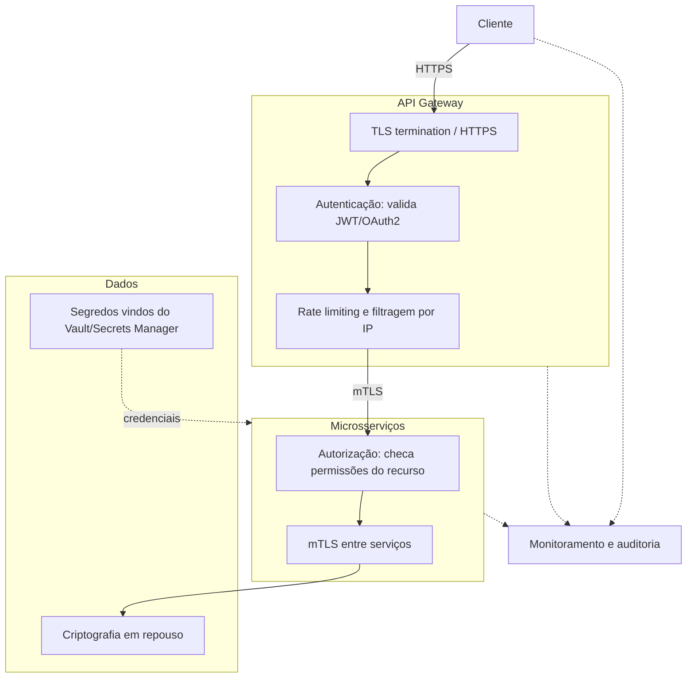

# Segurança e Evolução de APIs

## Por que segurança importa em sistemas distribuídos

Num monólito, boa parte da comunicação entre partes do sistema acontece dentro do mesmo processo, sem passar pela rede. Em sistemas distribuídos isso muda por completo: cada chamada entre serviços viaja pela rede, cruza fronteiras de times diferentes e, frequentemente, passa por infraestrutura que a própria empresa não controla (provedores de nuvem, CDNs, redes de terceiros).

Isso multiplica a superfície de ataque. Uma API exposta é um convite tanto para quem deveria usá-la quanto para quem não deveria. E como serviços diferentes costumam ser mantidos por times diferentes, com deploys independentes, não dá pra confiar que "alguém já cuidou disso em outro lugar". Segurança precisa ser construída em cada camada, não só na borda do sistema: se o gateway falha em barrar uma requisição maliciosa, o serviço por trás dele ainda precisa estar protegido.

## Camadas de segurança

Pensar em segurança como uma pilha de camadas, cada uma resolvendo um problema diferente, ajuda a não deixar buracos. O diagrama abaixo mostra onde cada tipo de proteção entra numa requisição típica, do cliente até o dado armazenado:



### Autenticação

Autenticação responde a uma pergunta só: quem está fazendo essa requisição? Pode ser um usuário final (login com senha, biometria, magic link) ou um outro serviço (uma API key, um certificado, um token de serviço). Sem autenticação, qualquer requisição é anônima e não dá pra aplicar nenhuma regra em cima de "quem é você".

### Autorização

Autorização vem depois da autenticação e responde outra pergunta: agora que eu sei quem você é, você pode fazer isso? Um usuário autenticado pode estar tentando acessar um recurso que não é dele, ou executar uma ação (deletar, por exemplo) para a qual não tem permissão. Autenticação sem autorização é só meio caminho: o sistema sabe quem bateu na porta, mas deixa qualquer um entrar em qualquer sala.

### Comunicação segura: HTTPS e mTLS

**HTTPS** é HTTP rodando sobre TLS: os dados trafegam criptografados entre cliente e servidor, o que impede que alguém capturando o tráfego na rede (um Wi-Fi público, um proxy comprometido) leia ou altere o conteúdo. É o mínimo inegociável para qualquer API exposta na internet.

**mTLS** (mutual TLS) vai um passo além: em TLS comum, só o servidor apresenta um certificado para o cliente confirmar que fala com quem esperava. Em mTLS, os dois lados apresentam certificado, cliente e servidor se autenticam mutuamente antes de trocar qualquer dado. Isso é comum na comunicação interna entre microsserviços: dentro de uma malha de serviços (service mesh), cada serviço só aceita conexão de outro serviço que apresente um certificado válido, o que impede que um serviço não autorizado (ou um atacante que conseguiu entrar na rede interna) se passe por um consumidor legítimo.

### Segurança baseada em token: JWT e OAuth2

É comum tratar JWT e OAuth2 como sinônimos, mas eles resolvem problemas diferentes:

- **JWT (JSON Web Token)** é um **formato** de token. Define como empacotar informação (quem é o usuário, quais permissões tem, quando expira) de um jeito compacto, assinado digitalmente e verificável sem consultar um banco de dados.
- **OAuth2** é um **protocolo de autorização**. Define o fluxo pelo qual um cliente obtém permissão para acessar um recurso em nome de um usuário, sem nunca ver a senha desse usuário.

Na prática, os dois costumam trabalhar juntos: um fluxo OAuth2 termina emitindo um **access token**, e esse access token é, na maioria das implementações modernas, um JWT.

**Como o JWT funciona:** um JWT é uma string com três partes separadas por ponto, `header.payload.signature`, cada uma codificada em Base64:

```
eyJhbGciOiJIUzI1NiJ9.eyJzdWIiOiIxMjMiLCJyb2xlIjoiYWRtaW4iLCJleHAiOjE3MjAwMDAwMDB9.4f8a3d...
```

Decodificando as duas primeiras partes:

```json
// header
{
  "alg": "HS256",
  "typ": "JWT"
}

// payload
{
  "sub": "123",
  "role": "admin",
  "exp": 1720000000
}
```

O ponto importante é que o `payload` não é criptografado, só codificado, qualquer um consegue ler o conteúdo. O que garante que ninguém alterou esses dados é a `signature`, calculada a partir do header, do payload e de uma chave secreta (ou par de chaves, em algoritmos assimétricos como RS256) que só o servidor conhece. Quando o servidor recebe o token de volta, recalcula a assinatura e compara: se bater, o token é autêntico e não foi adulterado. É isso que torna o JWT **stateless**: o servidor não precisa guardar sessão nenhuma, toda a informação necessária para validar a requisição já está no próprio token.

**Como o OAuth2 funciona na prática**, no fluxo mais comum (Authorization Code):

1. O usuário clica em "Entrar com Google" numa aplicação terceira.
2. A aplicação redireciona o usuário para o servidor de autorização (Google), que pede login e consentimento.
3. O usuário aprova, e o servidor de autorização redireciona de volta para a aplicação com um `authorization code` de uso único.
4. A aplicação troca esse código, em uma chamada servidor-a-servidor, por um `access token` (e opcionalmente um `refresh token`).
5. A aplicação usa o `access token` (o JWT) no header `Authorization: Bearer <token>` em toda requisição subsequente à API.

O `refresh token` existe porque access tokens costumam ter vida curta (minutos a poucas horas): quando expira, a aplicação usa o refresh token para obter um novo access token sem pedir login de novo ao usuário.

### Segurança no API Gateway

O gateway é o ponto natural para concentrar autenticação, autorização de alto nível e rate limiting, porque toda requisição externa passa por ele antes de chegar em qualquer serviço. Isso evita que cada microsserviço reimplemente validação de token do zero. Esse papel do gateway é aprofundado em [API Gateway](/labs/web-dev/escalabilidade/api-gateway/), incluindo a diferença entre o que o gateway resolve e o que um load balancer resolve.

Vale reforçar um ponto: o gateway validar o token não elimina a necessidade de autorização mais granular dentro de cada serviço. O gateway normalmente confirma "esse token é válido e pertence a alguém autenticado", mas a regra de negócio específica ("esse usuário pode editar esse pedido em particular") costuma viver no serviço dono do recurso.

### Segurança de dados: criptografia em trânsito e em repouso

**Em trânsito** é o dado se movendo pela rede, protegido por HTTPS e mTLS como já descrito acima.

**Em repouso** é o dado parado, guardado em disco, num banco de dados, num bucket de armazenamento. Criptografia em repouso (tipicamente AES-256) garante que, se alguém conseguir acesso físico ou lógico não autorizado ao armazenamento (um disco roubado, um snapshot de banco vazado), os dados continuam ilegíveis sem a chave de decriptação. A maioria dos provedores de nuvem oferece isso de forma praticamente transparente (criptografia de disco no RDS, no S3, etc), mas dados especialmente sensíveis (CPF, cartão de crédito, senha) costumam merecer uma camada extra de criptografia em nível de aplicação, específica para aquele campo.

### Gestão de segredos

Senhas de banco, chaves de API de terceiros, chaves usadas para assinar JWT: tudo isso é segredo, e segredo hardcoded no código-fonte ou solto num arquivo `.env` versionado é uma das causas mais comuns de vazamento. Ferramentas como **HashiCorp Vault** e **AWS Secrets Manager** resolvem isso centralizando o armazenamento de segredos fora do código:

- A aplicação busca o segredo em tempo de execução, autenticando-se no cofre com sua própria identidade (não com o segredo em si).
- Segredos podem ser rotacionados automaticamente (uma senha de banco trocada a cada 30 dias, por exemplo) sem precisar de novo deploy da aplicação.
- Acesso a cada segredo fica registrado, é possível auditar quem acessou o quê e quando.
- Alguns cofres emitem **segredos dinâmicos**: em vez de uma senha fixa de banco, a aplicação pede uma credencial temporária, válida só por aquela sessão, o que reduz o impacto de um vazamento.

### Monitoramento e auditoria

Prevenção nunca é 100% eficaz, então detectar rápido quando algo deu errado é parte da segurança tanto quanto impedir o ataque. Monitoramento de segurança envolve logar tentativas de autenticação (sucesso e falha), acessos a recursos sensíveis e mudanças de permissão, e alimentar isso em ferramentas que consigam sinalizar padrões anormais (muitas tentativas de login falhando na mesma conta em segundos, um IP fazendo requisições em volume muito acima do normal). Auditoria é a trilha permanente desses eventos, guardada de um jeito que não pode ser alterada depois, usada tanto para investigar incidentes quanto para atender exigências de compliance (LGPD, PCI-DSS). Esse tema tem uma camada própria, aprofundada em [Logs, Metrics e Traces](/labs/web-dev/observabilidade/logs-metrics-e-traces/).

## Ameaças comuns

| Ameaça                             | O que é                                                                                                                        |
| ----------------------------------- | ------------------------------------------------------------------------------------------------------------------------------ |
| Acesso não autorizado               | Alguém sem credencial válida consegue chegar a um recurso protegido, geralmente por falha de configuração (endpoint sem checagem de auth) |
| Autenticação quebrada                | Falhas no próprio mecanismo de login: senhas fracas aceitas, tokens que não expiram, sessões que não são invalidadas no logout |
| Insecure Direct Object References (IDOR) | O sistema expõe o identificador interno de um recurso (`/pedidos/123`) e confia nele sem checar se quem pediu é dono daquele recurso. Trocar `123` por `124` na URL não deveria dar acesso ao pedido de outra pessoa |
| Exposição excessiva de dados         | O endpoint devolve o objeto inteiro (incluindo campos sensíveis como senha com hash, CPF, dados internos) e deixa o filtro do que mostrar a cargo do cliente, em vez de já retornar só o necessário |
| Man-in-the-middle                    | Alguém intercepta a comunicação entre cliente e servidor para ler ou alterar dados em trânsito; mitigado com HTTPS/mTLS e, em casos críticos, certificate pinning |
| Injeção                              | Entrada do usuário é interpretada como código ou comando (SQL injection, command injection) porque a aplicação concatena a entrada direto numa query ou comando em vez de tratá-la como dado |
| DoS (Denial of Service)              | Volume de requisições (intencional ou não) suficiente para esgotar os recursos do serviço e tirá-lo do ar; mitigado com rate limiting na borda, aprofundado em [Rate Limiting](/labs/web-dev/escalabilidade/rate-limiting/) |
| Dependências inseguras               | Bibliotecas de terceiros com vulnerabilidades conhecidas (ou comprometidas por um ataque de supply chain) acabam rodando dentro da própria aplicação; mitigado mantendo dependências atualizadas e rodando scanners (`npm audit`, Dependabot, Snyk) no pipeline |

## Por que evoluir APIs

Uma API raramente fica parada. Times adicionam funcionalidades, corrigem bugs, melhoram performance e, às vezes, precisam mudar a forma como um recurso é representado. O problema é que uma API, diferente de código interno, tem consumidores externos: outros times, aplicativos mobile já publicados nas lojas, parceiros que integraram há dois anos e não vão atualizar o código deles amanhã.

Isso cria uma tensão: a API precisa evoluir, mas não pode simplesmente quebrar quem já depende dela. Mudar o formato de um campo de resposta, remover um endpoint ou renomear um parâmetro sem aviso derruba integrações que estavam funcionando perfeitamente bem até então. É esse problema que versionamento e compatibilidade retroativa resolvem.

## Estratégias de versionamento

### URI Path Versioning

A versão fica embutida no próprio caminho da URL:

```
GET /api/v1/pedidos/42
GET /api/v2/pedidos/42
```

**Vantagens**: extremamente explícito, fácil de entender só olhando a URL, fácil de rotear (o gateway ou load balancer pode direcionar `/v1/*` e `/v2/*` para versões diferentes do serviço sem lógica especial). É a abordagem mais usada na prática.

**Trade-off**: tecnicamente, a URL deveria identificar um recurso, não uma versão de API, então isso quebra um pouco a pureza do REST. Além disso, o mesmo recurso passa a ter URLs diferentes em cada versão, o que pode confundir cache e bookmarks.

### Query Parameter Versioning

A versão vai como parâmetro de query:

```
GET /pedidos/42?version=1
GET /pedidos/42?version=2
```

**Vantagens**: a URL base do recurso continua a mesma, a versão é só um detalhe opcional (pode ter um default quando omitido).

**Trade-off**: mais fácil de esquecer ou omitir sem querer, e menos comum em APIs públicas conhecidas, o que pode confundir quem consome.

### Header Versioning

A versão vai num header customizado, fora da URL:

```
GET /pedidos/42
Accept-Version: 1
```

**Vantagens**: mantém a URL limpa e semanticamente focada só no recurso, a versão é tratada como metadado da requisição, que é o que ela realmente é.

**Trade-off**: menos visível, alguém explorando a API só pela URL não percebe que existe versionamento, e fica mais difícil de testar rapidamente num navegador (exige ferramenta que permita configurar headers).

### Media Type Versioning (Content Negotiation)

A versão é parte do próprio tipo de mídia aceito, usando o header `Accept` padrão do HTTP:

```
GET /pedidos/42
Accept: application/vnd.empresa.v2+json
```

**Vantagens**: é a abordagem mais alinhada com os princípios originais do REST, usa um mecanismo HTTP já existente (content negotiation) em vez de inventar um novo. Permite inclusive versionar recursos individualmente, sem versionar a API inteira de uma vez.

**Trade-off**: é a menos intuitiva das quatro, exige que o consumidor entenda e monte corretamente um media type customizado, o que aumenta o atrito de adoção. Poucas APIs públicas usam isso como estratégia principal.

## Boas práticas de compatibilidade retroativa

- **Nunca remover ou quebrar campos/endpoints existentes** numa versão que já está em produção. Se o formato precisa mudar, isso vira uma nova versão, a antiga continua funcionando como estava.
- **Adicionar é seguro, remover ou renomear não é.** Novo campo opcional no JSON de resposta normalmente não quebra ninguém, porque a maioria dos clientes ignora campos que não reconhece. Remover um campo que algum cliente já lê, quebra.
- **Depreciar gradualmente**: marcar uma versão ou endpoint como deprecated (documentação, e às vezes um header `Deprecation` ou `Sunset` na resposta) antes de desligar de vez, dando tempo para os consumidores migrarem.
- **Manter versões antigas disponíveis por um tempo definido**, com uma data de desligamento comunicada com antecedência, não indefinidamente.
- **Guias de migração claros**: documentar exatamente o que mudou entre uma versão e outra, e como adaptar o código que consome a API.
- **Feature flags para rollout controlado**: quando a mudança é grande, liberar para uma fração dos consumidores primeiro, observar o comportamento, e só então expandir para todo mundo.
- **Comunicar mudanças com antecedência**: changelog, aviso por e-mail, painel de desenvolvedor, o canal importa menos do que garantir que quem depende da API saiba que algo vai mudar antes que mude.

## Documentação com OpenAPI/Swagger

OpenAPI é uma especificação (um formato, escrito em YAML ou JSON) para descrever uma API REST de forma padronizada: quais endpoints existem, quais métodos cada um aceita, quais parâmetros e headers são esperados, qual o formato do body de requisição e resposta, quais status codes cada endpoint pode retornar, e como a autenticação funciona.

Um trecho de especificação OpenAPI se parece com isto:

```yaml
paths:
  /pedidos/{id}:
    get:
      summary: Busca um pedido pelo id
      parameters:
        - name: id
          in: path
          required: true
          schema:
            type: integer
      responses:
        "200":
          description: Pedido encontrado
          content:
            application/json:
              schema:
                $ref: "#/components/schemas/Pedido"
        "404":
          description: Pedido não encontrado
```

**Swagger** é o conjunto de ferramentas construído em cima da especificação OpenAPI (o nome do formato mudou para OpenAPI quando o projeto foi doado à Linux Foundation, mas "Swagger" ainda é usado no dia a dia como sinônimo). A peça mais visível é o **Swagger UI**: a partir do arquivo de especificação, ele gera uma página web interativa onde qualquer pessoa consegue ver todos os endpoints, ler a descrição de cada campo e, mais importante, **testar chamadas reais direto do navegador**, preenchendo parâmetros e vendo a resposta de verdade, sem precisar abrir Postman ou escrever código.

Na prática, existem dois jeitos de chegar nessa especificação:

- **Code-first**: a especificação é gerada automaticamente a partir de anotações no próprio código (`@Operation`, `@ApiResponse` em Spring, decorators equivalentes em outros frameworks). Vantagem: a documentação nunca fica desatualizada em relação ao código, porque ela nasce dele.
- **Contract-first (Design-first)**: o arquivo OpenAPI é escrito antes do código, como um contrato acordado entre quem consome e quem implementa a API. Times de frontend e backend podem trabalhar em paralelo a partir do mesmo contrato, e ferramentas conseguem gerar tanto o esqueleto do servidor quanto clientes HTTP tipados a partir do mesmo arquivo.

Qualquer que seja a abordagem, o ponto central é o mesmo: manter a especificação como fonte da verdade evita o cenário clássico de documentação manual em wiki, que fica desatualizada na primeira mudança de endpoint que alguém esquece de anotar em outro lugar.
