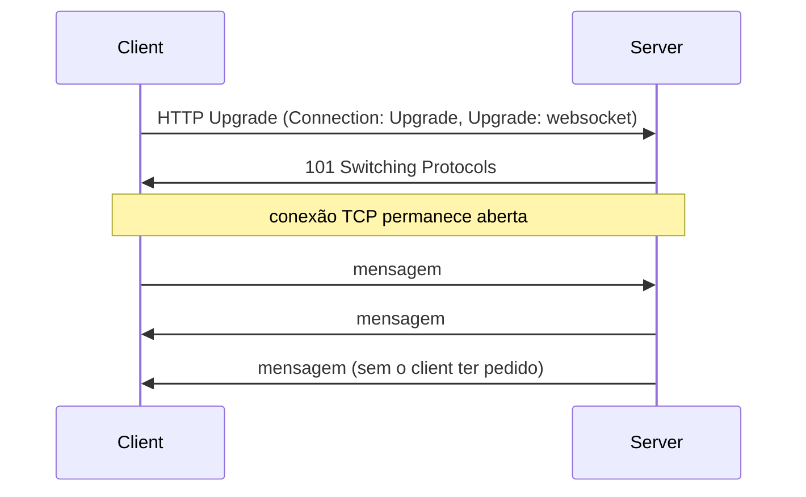
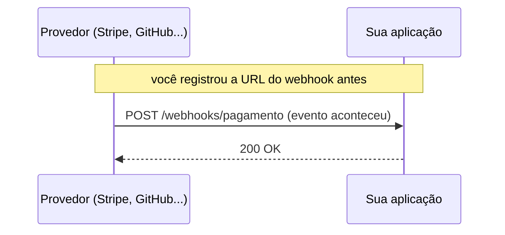

# Estilos de Comunicação de API

A nota de [HTTP, APIs e REST](/labs/web-dev/apis/01-http-rest/) cobre REST em profundidade porque é, disparado, o estilo mais comum para expor uma API na web. Mas REST não é a única opção, e não é a melhor em todo cenário. Esta nota cobre outros estilos que aparecem com frequência no dia a dia de backend: GraphQL, gRPC, WebSocket, Server-Sent Events e Webhooks. Cada um nasceu para resolver um problema que o modelo requisição-resposta do REST não resolve bem.

## Por que existem alternativas ao REST

REST modela tudo como recursos acessados via HTTP, um request, uma response, fim. Isso funciona bem para a maioria dos casos, mas expõe algumas limitações estruturais:

- O cliente não controla quanto dado volta numa resposta, o servidor decide o formato fixo de cada endpoint. Isso gera **over-fetching** (a resposta vem com campos que o cliente não precisa) e **under-fetching** (o cliente precisa encadear várias chamadas para juntar os dados que precisa).
- REST é fundamentalmente síncrono e unidirecional: o cliente pergunta, o servidor responde, e a conexão se fecha. Não existe um jeito nativo do servidor avisar o cliente quando algo muda sem o cliente perguntar de novo.
- Para comunicação interna de altíssima performance entre serviços, o custo de serializar/desserializar JSON texto sobre HTTP/1.1 é maior do que o necessário.

Cada estilo desta nota resolve uma dessas limitações específicas. Nenhum deles substitui REST por completo, eles coexistem: é comum um sistema usar REST para o CRUD básico, WebSocket para o chat em tempo real, e Webhooks para receber notificações de um provedor de pagamento, tudo na mesma arquitetura.

## GraphQL

GraphQL é uma linguagem de consulta (query language) para APIs, criada pelo Facebook para resolver justamente o problema de over-fetching e under-fetching. Em vez de vários endpoints fixos, uma API GraphQL expõe um **único endpoint**, e é o cliente quem descreve exatamente quais campos quer receber.

```graphql
query {
  user(id: "1") {
    name
    posts {
      title
    }
  }
}
```

A resposta espelha exatamente a forma da query, nem mais nem menos:

```json
{
  "data": {
    "user": {
      "name": "Alert",
      "posts": [{ "title": "Primeiro post" }]
    }
  }
}
```

Se o cliente também precisasse do e-mail do usuário, bastaria adicionar `email` na query, sem exigir um endpoint novo nem uma versão nova da API. Isso é o que elimina o over-fetching (o servidor nunca manda campo que não foi pedido) e o under-fetching (numa chamada só, o cliente já busca usuário e posts relacionados, sem encadear `GET /users/1` seguido de `GET /users/1/posts`).

Por trás do endpoint único existe um **schema**: uma definição de quais tipos existem, quais campos cada tipo tem e como eles se relacionam. Cada campo do schema é resolvido por uma função chamada **resolver**, responsável por buscar aquele dado específico (num banco, noutra API, em cache). Isso dá bastante flexibilidade, mas também move complexidade para o servidor: uma query mal pensada pelo cliente pode acionar dezenas de resolvers em cascata, então proteções como limite de profundidade de query e análise de custo costumam ser necessárias em produção.

**Quando faz sentido:** dados com muitos relacionamentos e formas de consumo variadas, como um feed social onde apps diferentes (mobile, web) precisam de subconjuntos diferentes dos mesmos dados. Times de frontend ganham autonomia para buscar só o que a tela precisa, sem depender do backend criar um endpoint novo a cada mudança de UI.

## gRPC

gRPC é um framework de RPC (Remote Procedure Call) criado pelo Google, pensado para comunicação de altíssima performance, tipicamente entre microsserviços internos, o mesmo cenário citado de passagem em [Comunicação entre Serviços](/labs/web-dev/microsservicos/03-comunicacao-entre-servicos/). Duas escolhas técnicas explicam a diferença de desempenho em relação a REST sobre JSON:

- **Protocol Buffers (Protobuf)** como formato de serialização: em vez de texto (JSON), as mensagens trafegam como binário compacto, definido por um contrato de tipos fortes escrito num arquivo `.proto`. Isso reduz o tamanho da mensagem e o custo de serializar/desserializar.
- **HTTP/2** como protocolo de transporte: permite multiplexar várias streams numa única conexão TCP, ou seja, várias chamadas acontecendo em paralelo sem abrir uma conexão nova para cada uma, o que reduz overhead de rede.

```protobuf
service PedidoService {
  rpc CriarPedido (PedidoRequest) returns (PedidoResponse);
}

message PedidoRequest {
  string usuarioId = 1;
  repeated string itens = 2;
}
```

A partir desse arquivo `.proto`, ferramentas geram automaticamente o código de cliente e servidor em várias linguagens, o que dá tipagem forte nos dois lados sem escrever esse código à mão.

gRPC suporta quatro modos de chamada, não só o clássico "um pedido, uma resposta":

- **Unário**: um request, um response, equivalente a uma chamada REST comum.
- **Server streaming**: um request, vários responses ao longo do tempo (ex: acompanhar o progresso de um processamento longo).
- **Client streaming**: vários requests, um response no final (ex: enviar um arquivo em pedaços).
- **Bidirecional**: as duas pontas enviam mensagens de forma independente, na mesma conexão (ex: um chat).

**Trade-off:** o ganho de performance vem com um custo de acessibilidade. Diferente de REST, não dá para simplesmente abrir uma chamada gRPC no navegador ou testar com `curl` sem ferramentas específicas (como `grpcurl`), porque o payload é binário e o navegador não fala HTTP/2 com os detalhes que o gRPC exige nativamente. Por isso gRPC aparece muito mais em comunicação interna entre serviços do que em APIs públicas voltadas a clientes externos.

## WebSocket

WebSocket resolve o problema da comunicação unidirecional do HTTP tradicional: ele abre um **canal full-duplex e persistente** entre cliente e servidor, onde os dois lados podem enviar mensagens a qualquer momento, sem precisar de um request novo a cada mensagem.

A conexão começa como uma requisição HTTP comum, mas com um header especial que pede para "trocar de protocolo":



Esse handshake inicial é chamado de **HTTP Upgrade**: o cliente pede para trocar de HTTP para o protocolo WebSocket, o servidor concorda com um `101 Switching Protocols`, e a partir daí a mesma conexão TCP vira um canal onde ambos os lados mandam mensagens livremente, sem o overhead de abrir uma requisição HTTP nova a cada troca.

**Quando faz sentido:** qualquer cenário onde o servidor precisa empurrar dados para o cliente sem o cliente pedir, e onde a latência de ida e volta importa: chat em tempo real, jogos multiplayer, ferramentas de colaboração (várias pessoas editando o mesmo documento ao mesmo tempo), painéis com atualização ao vivo.

## Server-Sent Events (SSE)

SSE cobre um pedaço do problema que o WebSocket resolve por inteiro: quando o servidor só precisa **empurrar** dados para o cliente, sem o cliente nunca precisar mandar nada de volta pelo mesmo canal, abrir um WebSocket completo é mais complexidade do que o necessário. SSE entrega exatamente essa via única (servidor → cliente), usando HTTP comum, sem handshake especial nenhum.

O servidor mantém a conexão HTTP aberta e vai escrevendo eventos num formato de texto simples, com `Content-Type: text/event-stream`:

```
id: 101
data: {"symbol": "AAPL", "price": 249.25}

id: 102
data: {"symbol": "AAPL", "price": 249.30}

id: 103
data: {"symbol": "AAPL", "price": 249.28}
```

No navegador, o cliente consome esse stream com a API `EventSource`, que já cuida de reconectar automaticamente se a conexão cair, retomando a partir do último `id` recebido:

```javascript
const stream = new EventSource("/cotacoes");

stream.onmessage = (event) => {
  const dado = JSON.parse(event.data);
  console.log(dado.price);
};
```

**Quando faz sentido:** feeds ao vivo, notificações, cotações de bolsa, barra de progresso de um processo longo no servidor, qualquer situação de "só o servidor fala" onde reconexão automática e simplicidade importam mais do que a via de volta que o WebSocket oferece.

## Webhooks

Todos os estilos anteriores partem do princípio de que o cliente inicia a conversa, seja com uma query GraphQL, uma chamada gRPC ou abrindo uma conexão WebSocket/SSE. Webhook inverte esse fluxo: em vez do seu sistema ficar perguntando "aconteceu alguma coisa nova?" em intervalos (polling), você registra uma URL sua num provedor externo, e é o **provedor** quem faz uma requisição HTTP POST para essa URL sempre que um evento relevante acontece.



Exemplos comuns: o Stripe chama um webhook seu quando um pagamento é confirmado, o GitHub chama um webhook para disparar um pipeline de CI/CD a cada push. Do lado de quem recebe, o endpoint de webhook é uma API HTTP comum, geralmente REST, então nada de novo tecnicamente, a diferença está em quem inicia a chamada.

**Cuidados na prática:** como qualquer endpoint que aceita POST de fora, um webhook precisa validar que a requisição realmente veio do provedor esperado (normalmente conferindo uma assinatura HMAC enviada num header), e precisa ser **idempotente**, porque provedores costumam reenviar o mesmo evento se não receberem confirmação a tempo, um tema aprofundado em [Idempotência](/labs/web-dev/resiliencia/02-idempotencia/).

**Quando faz sentido:** integração com sistemas de terceiros que precisam avisar você sobre eventos (pagamentos, deploys, mudanças de status), eliminando a necessidade de ficar perguntando periodicamente se algo mudou.

## Comparativo

| Estilo | Direção | Conexão | Formato | Quando escolher |
| --- | --- | --- | --- | --- |
| REST | Cliente → servidor, síncrono | Uma por request | JSON/texto | Padrão para a maioria das APIs web |
| GraphQL | Cliente → servidor, síncrono | Uma por request | JSON/texto | Dados com muitas relações, clientes que precisam de subconjuntos variados |
| gRPC | Cliente → servidor (ou stream nos dois sentidos) | Persistente (HTTP/2) | Binário (Protobuf) | Comunicação interna de alta performance entre serviços |
| WebSocket | Bidirecional | Persistente | Texto ou binário | Tempo real com troca de mensagens nos dois sentidos |
| SSE | Servidor → cliente | Persistente (HTTP comum) | Texto (event-stream) | Push simples, unidirecional, com reconexão automática |
| Webhook | Provedor → sua aplicação | Uma por evento | JSON/texto (HTTP normal) | Receber notificação de evento sem fazer polling |
