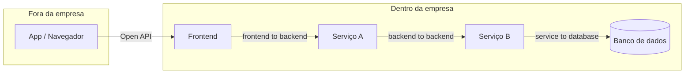

# Classificação de APIs por Público

As notas anteriores desta seção olham para API pela lente de **como** ela se comunica: REST, GraphQL, gRPC, e por aí vai (veja [Estilos de Comunicação de API](/labs/web-dev/apis/03-estilos-de-comunicacao/)). Existe outra lente, ortogonal a essa, que importa tanto quanto: **quem** pode acessar a API. Uma mesma API REST pode estar completamente aberta ao público ou trancada só para dois sistemas internos conversarem entre si, e essa decisão muda completamente como você pensa autenticação, contrato e superfície de risco.

Antes de seguir, um aviso sobre nome: "Open API" aqui é uma **categoria de acesso** (API de acesso público), não confundir com **OpenAPI**, a especificação usada para documentar APIs REST (Swagger), já vista em [Segurança e Evolução de APIs](/labs/web-dev/apis/02-seguranca-e-evolucao-de-apis/). São dois usos completamente diferentes do mesmo termo.

## Open API: acesso público

Uma Open API é feita para ser consumida por qualquer pessoa ou sistema, sem relação prévia com quem publica. Normalmente exige só um cadastro simples (às vezes nem isso) para gerar uma chave de API, e a documentação é pensada para um desenvolvedor externo, que nunca conversou com o time que construiu a API, conseguir integrar sozinho.

Exemplos do dia a dia: uma API de previsão do tempo, um sistema de login social ("Entrar com Google"), um catálogo de produtos que qualquer parceiro pode consultar. APIs de pagamento como a da Stripe e de mapas como o Google Maps também entram nessa categoria, mesmo cobrando pelo uso, porque o acesso em si é aberto a qualquer empresa que queira se cadastrar.

Esse tipo de API costuma aparecer em três estilos de protocolo diferentes, cada um com seu próprio trade-off de formalidade:

- **REST**, o mais comum hoje para Open APIs novas, já coberto em detalhe em [HTTP, APIs e REST](/labs/web-dev/apis/01-http-rest/).
- **GraphQL**, quando o consumidor externo se beneficia de escolher exatamente quais campos buscar, como uma API de estatísticas do GitHub ou de um feed social, aprofundado na nota de estilos de comunicação.
- **SOAP**, detalhado a seguir, ainda comum em setores que priorizam formalidade e padronização acima de simplicidade.

### SOAP

SOAP (Simple Object Access Protocol) é um protocolo de comunicação baseado em **XML**, criado num momento anterior ao REST, quando a preocupação central era ter um contrato extremamente rígido e formal entre quem chama e quem é chamado. Toda mensagem SOAP segue uma estrutura de envelope fixa:

```xml
<soap:Envelope>
  <soap:Header>
    <!-- metadados, autenticação, etc. -->
  </soap:Header>
  <soap:Body>
    <TransferenciaRequest>
      <ContaOrigem>12345</ContaOrigem>
      <ContaDestino>67890</ContaDestino>
      <Valor>500.00</Valor>
    </TransferenciaRequest>
  </soap:Body>
</soap:Envelope>
```

O contrato de uma API SOAP é descrito por um arquivo **WSDL** (Web Services Description Language), que lista de forma exaustiva quais operações existem, quais parâmetros cada uma espera e qual o formato exato da resposta. Diferente do JSON solto e flexível do REST, o XML do SOAP é validado contra esse contrato, o que deixa pouquíssima margem para ambiguidade, ao custo de mensagens bem mais verbosas e de um processo de integração mais burocrático.

Essa rigidez é exatamente o motivo de SOAP ainda sobreviver em setores como bancos, seguradoras e governo: transferência bancária, processamento de sinistro de seguro, registros públicos. São domínios onde o contrato **não pode** ser ambíguo, onde auditoria e conformidade regulatória pesam mais do que a velocidade de desenvolvimento, e onde trocar de protocolo tem um custo de migração alto demais para justificar a troca só por REST ser mais moderno.

## Internal API: uso interno da organização

Uma Internal API não é exposta para fora da empresa. Ela existe para partes do próprio sistema conversarem entre si, e por isso pode assumir garantias que uma Open API nunca teria, como confiar que quem chama já está dentro de uma rede controlada, ou usar um protocolo mais difícil de consumir de fora (gRPC, por exemplo) porque não existe consumidor externo para se preocupar em atender.

Internal API aparece em três formatos, dependendo de quem fala com quem:

- **Backend to backend**: um serviço interno chamando outro, o cenário central da nota de [Comunicação entre Serviços](/labs/web-dev/microsservicos/03-comunicacao-entre-servicos/). Exemplos: o serviço de pedidos confirmando um pagamento com o serviço de pagamentos, ou sincronizando um token entre dois sistemas internos.
- **Frontend to backend**: a interface do usuário (app mobile, SPA web) chamando o servidor para buscar ou alterar dado. É a chamada mais familiar do dia a dia: login, busca em tempo real, atualização de perfil.
- **Service to database**: tecnicamente não é bem uma "API" no sentido de contrato HTTP, mas segue a mesma lógica de camada interna, o serviço acessando seu próprio banco de dados para inserir, atualizar ou consultar registros. Entra nessa classificação porque representa a mesma ideia central: comunicação que nunca cruza a fronteira da organização.



## Partner API: acesso controlado a terceiros

Entre "qualquer um pode acessar" (Open API) e "só nós mesmos acessamos" (Internal API) existe uma zona intermediária: parceiros de negócio específicos, que passaram por algum tipo de aprovação ou contrato, e por isso recebem acesso a endpoints que não são públicos.

- **Partner API** propriamente dita: acesso dado a parceiros comerciais para operações combinadas em contrato, como um sistema de reserva de hotel se integrando com uma companhia aérea para uma oferta combinada, ou um programa de afiliados (o exemplo clássico é o rastreamento de comissão da Amazon Afiliados: o parceiro recebe uma API para gerar links rastreáveis e consultar cliques e comissões, mas não tem acesso nenhum aos sistemas internos da Amazon).
- **Data Sharing API**: uma variação da Partner API focada especificamente em troca seria de dados sensíveis entre organizações, com controles extras de segurança e conformidade regulatória. Exemplos: um hospital compartilhando registros de um paciente com outro sistema de saúde (sob normas como HIPAA ou, no Brasil, a LGPD), ou instituições financeiras trocando dados sob um modelo de open banking.

A diferença prática entre Partner API e Open API não está no protocolo usado (as duas podem ser REST, por exemplo), está no **controle de acesso**: uma Open API aceita qualquer cadastro novo, uma Partner API exige aprovação, contrato ou algum tipo de relação de confiança estabelecida antes da chave de acesso ser emitida.

## Comparativo

| | Open API | Internal API | Partner API |
| --- | --- | --- | --- |
| Quem acessa | Qualquer pessoa ou empresa | Só sistemas da própria organização | Parceiros aprovados/contratados |
| Controle de acesso | Cadastro aberto, geralmente self-service | Rede interna, sem exposição externa | Aprovação manual, contrato, credenciais específicas |
| Exemplo | API de clima, login social, catálogo público | Serviço de pedidos chamando serviço de pagamento | Rastreamento de afiliados, troca de dados de saúde |
| Prioridade de design | Documentação clara, onboarding fácil | Performance, simplicidade (menos preocupação com quem consome) | Segurança e conformidade regulatória acima de tudo |

Essas três categorias não são mutuamente excludentes dentro de um mesmo sistema: é comum uma empresa ter uma API pública para desenvolvedores externos, dezenas de Internal APIs entre seus próprios microsserviços, e um punhado de Partner APIs para integrações comerciais específicas, cada uma com seu próprio nível de exposição e controle de acesso.
