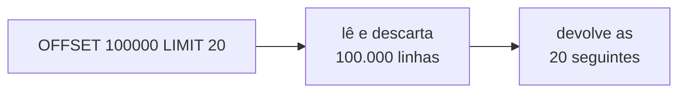

# Paginação

Uma listagem de API quase nunca deve devolver tudo. `GET /pedidos` numa base com 2 milhões de pedidos, sem limite, é uma resposta gigante que pesa em memória do servidor, em banda e no tempo de renderização do cliente, e piora sozinha conforme a tabela cresce. Paginar é quebrar essa listagem em pedaços e entregar um de cada vez.

Existem duas formas principais de fazer isso, e a diferença entre elas aparece exatamente quando a base fica grande.

## Paginação por offset (número de página)

É a forma mais direta e a primeira que quase todo mundo escreve. A API recebe um número de página e um tamanho, e traduz isso para `LIMIT` e `OFFSET` no banco:

```
GET /produtos?page=3&size=20
```

```sql
SELECT * FROM produtos
ORDER BY nome
LIMIT 20 OFFSET 40;   -- página 3: pula as 40 primeiras (páginas 1 e 2)
```

A resposta costuma vir com os metadados de navegação:

```json
{
  "conteudo": [ ... 20 produtos ... ],
  "pagina": 3,
  "tamanho": 20,
  "total": 347,
  "totalPaginas": 18
}
```

A vantagem é o acesso aleatório: dá para pular direto para a página 10, mostrar "página 3 de 18", deixar o usuário clicar num número de página.

O problema aparece nas páginas profundas. O `OFFSET` não é um atalho: o banco precisa ler e descartar todas as linhas puladas para chegar onde a página começa. `OFFSET 40` é barato. `OFFSET 100000` faz o banco varrer cem mil linhas só para jogá-las fora e devolver as 20 seguintes. O tempo da query cresce de forma linear com o número da página, e uma listagem que respondia em 20 ms na página 1 pode levar segundos na página 5000.



## Paginação por cursor / keyset

A ideia aqui é não contar posições, e sim continuar de onde parou. Em vez de "pule 100 mil linhas", a query diz "me dê as linhas depois deste valor":

```sql
SELECT * FROM produtos
WHERE (nome, id) > ('Cadeira Gamer', 4821)
ORDER BY nome, id
LIMIT 20;
```

Como a coluna de ordenação está indexada, o banco faz uma busca direta na árvore do índice até a âncora e lê as 20 linhas seguintes. O custo de achar a linha 20 e a linha 5 milhões é o mesmo. Essa técnica é chamada de **keyset pagination** (paginação por chave), e ela só é rápida se a coluna do `ORDER BY` estiver indexada, ver [Índices e Planos de Execução](/labs/web-dev/banco-de-dados/14-indices-e-planos-de-execucao/).

O que a API expõe é um **cursor**: um token opaco (normalmente o último valor visto, codificado em base64) que o cliente devolve na próxima chamada para continuar:

```
GET /produtos?size=20
GET /produtos?size=20&cursor=eyJub21lIjoiQ2FkZWlyYSBHYW1lciIsImlkIjo0ODIxfQ
```

O token é opaco de propósito: o cliente não precisa saber que dentro dele tem um nome e um id, e o servidor pode mudar a estratégia sem quebrar quem já está paginando.

A limitação do keyset é o outro lado da moeda do offset: não dá para pular para a "página 500". O cliente só consegue avançar página a página (e, com um pouco mais de trabalho, voltar). Para um feed ou um scroll infinito isso é exatamente o comportamento desejado; para uma tabela onde o usuário quer ir direto para o fim, não serve.

## Ordenação estável

Os dois métodos dependem de um `ORDER BY` **determinístico**: dado o mesmo conjunto de dados, a ordem tem que ser sempre a mesma. Ordenar só por `nome` não basta se dois produtos podem ter o mesmo nome, porque o banco fica livre para desempatar como quiser, e a mesma linha pode aparecer em duas páginas ou sumir entre elas. A solução é adicionar um critério de desempate único, quase sempre o `id`: `ORDER BY nome, id`.

Fora isso, o offset tem uma fragilidade que o keyset não tem. O offset endereça por posição, e a posição muda quando linhas entram ou saem. Se um produto novo é inserido enquanto o usuário navega, todas as linhas "descem" uma posição, e ao virar a página ele vê de novo o último item da página anterior. Se um produto é removido, uma linha é pulada. O keyset endereça por conteúdo (o último valor visto), então uma inserção ou remoção no meio da lista não desloca a âncora.

## O custo de contar o total

Aquele campo `"totalPaginas": 18` tem um preço. Para saber o total, o banco roda um `COUNT(*)` com o mesmo `WHERE` da listagem, e num universo grande isso é uma varredura cara que acontece a cada página.

As saídas comuns:

- Não mostrar o total. Scroll infinito e feed não precisam de "página X de Y", só de um "carregar mais".
- Contar de forma aproximada, usando a estimativa de linhas que o próprio banco mantém nas estatísticas (no PostgreSQL, `reltuples`).
- Cachear o total por alguns minutos, se um número um pouco defasado for aceitável.

## Escolhendo a estratégia

| Situação                                                                                    | Estratégia |
| ------------------------------------------------------------------------------------------- | ---------- |
| Tabela de admin, CMS, resultado de busca com número de página                               | Offset     |
| Conjunto pequeno e estável, onde acesso aleatório importa                                   | Offset     |
| Feed, timeline, scroll infinito                                                             | Keyset     |
| API pública de alto volume, exportação, sincronização de dados                              | Keyset     |
| Qualquer travessia de tabela grande onde a latência não pode degradar nas páginas profundas | Keyset     |

Na prática, muita API começa com offset porque é simples, e migra para keyset (ou oferece os dois) quando as páginas profundas começam a aparecer nos logs de query lenta.

## Referências

- [Diretrizes de design de API: filtrar, classificar e paginar dados - Microsoft Learn](https://learn.microsoft.com/pt-br/azure/architecture/best-practices/api-design) - Microsoft Learn, pt-BR
- [No Offset - Markus Winand](https://use-the-index-luke.com/no-offset) - Markus Winand ("Use The Index, Luke!"), en
- [Pagination guidelines - GitLab Development Documentation](https://docs.gitlab.com/development/database/pagination_guidelines/) - GitLab, en
