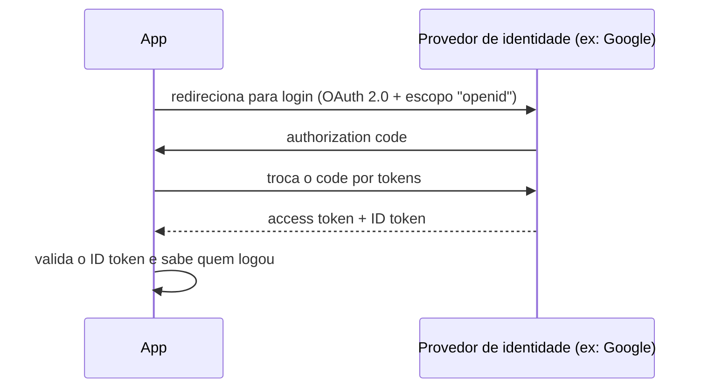

# SSO, OAuth 2.0, OIDC e SAML

É comum ver esses quatro termos jogados juntos como se fossem a mesma coisa, mas cada um responde a uma pergunta diferente. Confundir eles é uma das formas mais fáceis de errar o design de autenticação de um sistema, ou de travar numa entrevista de backend quando alguém pede pra explicar a diferença.

## Visão geral

| Termo | O que é | O que resolve |
| ----- | ------- | -------------- |
| SSO (Single Sign-On) | Uma experiência de usuário | Logar uma vez e acessar vários sistemas sem reautenticar |
| OAuth 2.0 | Um protocolo de autorização | O que um app pode acessar em nome do usuário |
| OIDC (OpenID Connect) | Uma camada de identidade sobre o OAuth 2.0 | Quem é o usuário |
| SAML | Um protocolo de autenticação baseado em XML | SSO corporativo/enterprise, principalmente em sistemas legados |

Se precisar guardar só uma frase: **OAuth resolve acesso, OIDC resolve identidade, SAML resolve SSO corporativo, e SSO é o nome que damos à experiência que os três (OIDC ou SAML) entregam por baixo.**

## SSO: a experiência de login único

SSO não é um protocolo, é o resultado que o usuário sente na tela: fazer login uma vez numa empresa (no Google Workspace, por exemplo) e a partir daí entrar direto no Slack, no Jira, no Notion, sem digitar senha de novo em cada um.

Só que "logar uma vez e acessar tudo" não acontece por mágica, alguém precisa provar para cada aplicação que aquele usuário já foi autenticado em outro lugar de confiança. Esse "alguém" é sempre um protocolo real rodando por baixo, e os dois mais comuns são justamente SAML e OIDC, cobertos mais adiante nesta nota.

## OAuth 2.0: autorização, não identidade

OAuth 2.0 responde a uma pergunta bem específica: "esse app tem permissão para acessar tal recurso em nome do usuário?". Ele não diz nada sobre quem é esse usuário, só o que uma aplicação pode fazer depois de receber autorização.

O fluxo completo (Authorization Code, o papel do `access token` e do `refresh token`) já está detalhado em [Segurança baseada em token: JWT e OAuth2](/labs/web-dev/apis/02-seguranca-e-evolucao-de-apis/), então não vamos repetir aqui. O que importa reter para o resto desta nota é só isso: OAuth sozinho não autentica ninguém, ele delega acesso.

## OIDC: identidade em cima do OAuth 2.0

Se o OAuth 2.0 não fala sobre identidade, como é que "Entrar com Google" consegue dizer ao seu app quem é o usuário? É aí que entra o **OIDC (OpenID Connect)**.

OIDC pega o fluxo do OAuth 2.0 e adiciona uma camada de autenticação por cima. Na prática, além do `access token` de sempre, o servidor de autorização passa a emitir um segundo token: o **ID token**, normalmente um JWT, contendo informações sobre quem acabou de se autenticar (o `sub`, que identifica o usuário, o `iss`, que identifica quem emitiu o token, o horário da autenticação, entre outros campos).

É por causa dessa camada extra que o OIDC virou o padrão de fato para login social e login moderno em geral: ele reaproveita toda a infraestrutura de OAuth 2.0 que o mercado já tinha, só que agora com uma resposta clara para "quem é esse usuário".

## ID token vs access token: o erro mais comum

Ter dois tokens parecidos (`access token` e `ID token`) na mesma resposta é onde a maioria dos bugs de autenticação nasce. Os dois têm público e propósito diferentes:

- O **ID token** é para o seu próprio app ler. Ele prova que o login aconteceu e diz quem é o usuário, e serve só para você estabelecer a sessão local ou exibir "Bem-vindo, Fulano" na tela.
- O **access token** é para uma API ler. Ele diz o que o chamador pode fazer, e é isso que você manda no header `Authorization` de uma requisição a um serviço de backend.

O erro clássico é inverter os dois: mandar o ID token para uma API como se fosse credencial de acesso, ou usar o access token para decidir "quem é o usuário logado" (o access token pode nem ser um JWT legível, dependendo do provedor). Nenhum dos dois foi desenhado para o papel do outro.

Antes de confiar em qualquer ID token recebido, o app precisa validar pelo menos:

- **Assinatura**: o token realmente veio do provedor esperado e não foi alterado.
- **Issuer (`iss`)**: bate com o provedor que você configurou, e não com um emissor qualquer.
- **Audience (`aud`)**: o token foi emitido para a sua aplicação, não para outra.
- **Expiração (`exp`)**: o token ainda é válido.
- **Nonce**: bate com o valor aleatório que a sua aplicação enviou no início do fluxo, o que impede um ID token roubado de ser reaproveitado numa sessão diferente.

## SAML: o protocolo mais antigo do SSO corporativo

Antes do OIDC existir, o SSO corporativo já era resolvido, só que com um protocolo mais antigo e mais burocrático: o **SAML (Security Assertion Markup Language)**. Em vez de tokens JWT compactos, o SAML troca documentos XML assinados digitalmente entre duas partes:

- O **Identity Provider (IdP)**: quem autentica o usuário (Okta, Azure AD/Microsoft Entra, um servidor interno da empresa).
- O **Service Provider (SP)**: a aplicação que confia nessa autenticação e deixa o usuário entrar.

O fluxo típico é o usuário tentar acessar o SP, ser redirecionado para o IdP para logar, e voltar ao SP carregando uma "asserção" SAML (um XML assinado) confirmando quem ele é. Funciona muito bem, mas o XML é mais verboso e mais complexo de debugar do que um JWT do OIDC, e implementar SAML do zero corretamente exige mais cuidado.

Mesmo assim, SAML continua vivo e relevante: boa parte dos sistemas legados e das grandes empresas ainda depende dele para SSO corporativo, e é comum uma aplicação nova precisar suportar SAML só porque um cliente enterprise exige integração com o IdP que ele já usa internamente.

## SCIM: sincronizar o ciclo de vida das contas

Aqui está um detalhe que costuma pegar times de surpresa: SSO, SAML e OIDC resolvem só o **login**. Nenhum dos três cria, atualiza ou remove uma conta de usuário nas aplicações conectadas.

Isso vira um problema real no dia a dia. Imagine que um funcionário sai da empresa e o time de TI desativa a conta dele no IdP. Sem mais nada além de SSO configurado, isso não encerra as sessões que já estavam ativas em cada aplicação, e muito menos remove contas locais ou tokens de longa duração que essa pessoa ainda tenha em ferramentas de terceiros. O acesso "morre" só no próximo login, não instantaneamente.

É esse buraco que o **SCIM (System for Cross-domain Identity Management)** resolve: um protocolo padronizado para o IdP avisar cada aplicação conectada sempre que um usuário é criado, atualizado ou desativado, mantendo as contas sincronizadas em todos os sistemas automaticamente, em vez de depender de alguém lembrar de remover o acesso manualmente em cada ferramenta.

## Cuidado ao vincular contas por e-mail

Um último ponto que só aparece depois que o sistema já está em produção: qual campo usar como identificador estável de um usuário vindo de um login OIDC?

A resposta intuitiva, "o e-mail", é a errada. A identidade estável de verdade é o par **`iss` (quem emitiu o token) + `sub` (o identificador do usuário para aquele emissor)**. O e-mail tem dois problemas na prática:

- Ele pode mudar. Uma pessoa troca de e-mail corporativo e, se seu sistema usa e-mail como chave, ela "vira" um usuário novo, perdendo o histórico da conta antiga.
- Ele pode nem ser real. Providers como o Sign in with Apple podem entregar um endereço de relay privado em vez do e-mail verdadeiro do usuário, e alguns provedores permitem que a pessoa edite o próprio e-mail livremente, sem verificação.

O risco fica mais sério quando o sistema tenta vincular automaticamente contas de provedores diferentes que compartilham o mesmo e-mail. Se um dos provedores não verifica o endereço, qualquer pessoa pode se cadastrar lá usando o e-mail de outra pessoa e, de quebra, herdar acesso à conta dela no seu sistema. A prática seguindo é só vincular contas automaticamente quando o provedor confirma `email_verified: true`, ou pedir para o usuário fazer login pelo método já existente antes de completar a vinculação.

## Referências

- [O que é OpenID Connect (OIDC)?](https://www.microsoft.com/pt-br/security/business/security-101/what-is-openid-connect-oidc) - Microsoft Security, pt-BR
- [Protocolo SAML de logon único (Security Assertion Markup Language)](https://learn.microsoft.com/pt-br/azure/active-directory/develop/single-sign-on-saml-protocol) - Microsoft Learn, pt-BR
- [O que é provisionamento por SCIM e como ele funciona?](https://www.keepersecurity.com/blog/pt-br/2024/10/17/what-is-scim-provisioning-and-how-does-it-work/) - Keeper Security, pt-BR
- [ID Token and Access Token: What Is the Difference?](https://auth0.com/blog/id-token-access-token-what-is-the-difference/) - Auth0, en
