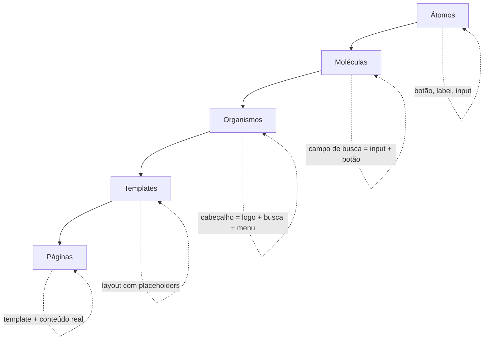

# Atomic Design: uma arquitetura para organização de componentes e interfaces

Atomic Design é um método para organizar componentes de interface criado por Brad Frost, designer e consultor que trabalhou como desenvolvedor mobile na R/GA na época da explosão dos smartphones, e publicou o método em 2013. A ideia surgiu de um problema comum: conforme uma interface cresce, os componentes viram uma bagunça sem hierarquia clara, e fica difícil saber onde um componente novo deveria morar ou o que ele deveria reutilizar.

A solução de Frost foi tomar emprestada a lógica da química. Átomos se combinam em moléculas, moléculas se agrupam em organismos, e a partir daí você monta a interface completa em templates e páginas. Não é uma metáfora decorativa: ela dá um critério objetivo de "qual o tamanho e a responsabilidade desse componente", que é justamente o que falta quando um projeto vira uma pasta `components/` com quarenta arquivos soltos.



Referências para quem quiser ir na fonte:

- [Atomic Design, pelo criador Brad Frost](https://atomicdesign.bradfrost.com/)
- [Atomic Design: o que é, como surgiu e sua importância, por Jéssica Araújo](https://medium.com/pretux/atomic-design-o-que-%C3%A9-como-surgiu-e-sua-import%C3%A2ncia-para-a-cria%C3%A7%C3%A3o-do-design-system-e3ac7b5aca2c)

## A analogia com a química

| -         | Química                                                                          | Frontend                                                                                       |
| --------- | -------------------------------------------------------------------------------- | ---------------------------------------------------------------------------------------------- |
| Átomo     | Possui propriedades distintas e não pode ser quebrado sem perder seu significado | Componentes simples como botões, labels, inputs                                                |
| Molécula  | Dois ou mais átomos mantidos juntos por ligações químicas                        | Combinação de átomos com função básica, como um campo de texto com label e validação           |
| Organismo | Conjunto de moléculas que funcionam como uma unidade                             | Agrupamento de moléculas e/ou átomos formando seções complexas, como o cabeçalho de uma página |

Essa tabela já dá o essencial dos três primeiros níveis. Os dois seguintes (templates e páginas) não têm um paralelo químico direto no método original, mas completam a arquitetura.

## Átomos

São os componentes mais básicos possíveis: um botão, um label, um input, um ícone. Um átomo não pode ser quebrado em pedaços menores sem deixar de fazer sentido como componente de interface isolado.

Na prática, boa parte dos átomos de um projeto acaba sendo apenas o encapsulamento de um componente vindo de uma biblioteca (Radix, MUI, um design system interno). Isso é normal e não é "atomic design malfeito" - o valor está em ter um lugar único e previsível para essas peças.

```jsx
// componentes/atomos/Button.jsx
export function Button({ children, variant = "primary", ...props }) {
  return (
    <button className={`btn btn-${variant}`} {...props}>
      {children}
    </button>
  );
}
```

Átomos tendem a nascer simples e ganhar propriedades novas conforme o projeto evolui - um `Button` que hoje só tem `variant` pode ganhar `size`, `loading`, `icon` depois. O cuidado aqui é manter o comportamento atual como padrão de qualquer prop nova, para que os lugares que já usam o átomo não quebrem quando ele ganhar uma funcionalidade.

Se você está decidindo que tag HTML usar por trás de um átomo, a [tabela periódica dos elementos HTML do allthetags.com](https://allthetags.com/) é uma referência rápida para lembrar o que existe além de `div` e `span`.

## Moléculas

Uma molécula é a junção de dois ou mais átomos formando algo com uma função básica própria. Um campo de busca, por exemplo, não é só um `input`: é um `input` mais um `Button` de lupa, funcionando juntos.

```jsx
// componentes/moleculas/InputComFeedback.jsx
import { Input } from "../atomos/Input";
import { TextoDeErro } from "../atomos/TextoDeErro";

export function InputComFeedback({ label, erro, ...props }) {
  return (
    <div>
      <label>{label}</label>
      <Input aria-invalid={!!erro} {...props} />
      {erro && <TextoDeErro>{erro}</TextoDeErro>}
    </div>
  );
}
```

Repare que a molécula não inventa comportamento novo do zero - ela orquestra átomos que já existem. Se você perceber que está escrevendo lógica de negócio dentro de uma molécula (chamar uma API, validar uma regra específica do domínio), é sinal de que aquele componente já cresceu além do papel de molécula.

## Organismos

Um organismo agrupa moléculas (e às vezes átomos soltos) para formar uma seção complexa e reconhecível da interface, como um cabeçalho, um formulário completo ou um card de produto com todas as suas partes.

```jsx
// componentes/organismos/FormularioDeLogin.jsx
import { InputComFeedback } from "../moleculas/InputComFeedback";
import { Button } from "../atomos/Button";

export function FormularioDeLogin({ onSubmit, erros }) {
  return (
    <form onSubmit={onSubmit}>
      <InputComFeedback label="E-mail" name="email" erro={erros?.email} />
      <InputComFeedback
        label="Senha"
        name="senha"
        type="password"
        erro={erros?.senha}
      />
      <Button type="submit">Entrar</Button>
    </form>
  );
}
```

A linha entre molécula e organismo é onde a maioria das dúvidas aparece na prática. Não existe uma regra matemática, mas um critério que ajuda bastante: olhe para a complexidade. Organismos tendem a agrupar uma quantidade maior de moléculas e reúnem funcionalidades distintas que pertencem a um mesmo contexto (por exemplo, um cabeçalho que junta logo, busca e menu de navegação). Se o componente só está combinando duas ou três peças com uma função única e simples, provavelmente ainda é uma molécula.

## Templates e páginas

Esses dois níveis não vêm da analogia química, mas completam a arquitetura:

**Template** é o layout que organiza os organismos, focado na estrutura da tela e não no conteúdo real. Ele tem placeholders que podem ser preenchidos - um exemplo seria a estrutura de uma página de blog sem nenhum texto real dentro.

**Página** é a instância real de um template, com o conteúdo de verdade carregado (dados vindos de uma API, textos, imagens) e as regras de negócio necessárias para funcionar - por exemplo, a página inicial do produto com tudo já preenchido.

Pense assim: o template é a planta baixa da casa, a página é a casa mobiliada e com gente morando dentro.

## Estrutura de pastas

Uma forma comum de refletir os cinco níveis no código é espelhar a hierarquia direto na árvore de pastas:

```
src/
├── componentes/
│   ├── atomos/
│   ├── moleculas/
│   ├── organismos/
│   ├── templates/
│   ├── paginas/
```

Cada pasta guarda só componentes daquele nível, o que facilita achar onde um componente novo deveria entrar: se ele só combina dois ou três átomos com uma função simples, vai em `moleculas/`; se agrupa várias moléculas com funcionalidades distintas, vai em `organismos/`.

## Vantagens e desvantagens

Vantagens:

- **Reutilização**: átomos e moléculas viram peças de lego que qualquer organismo pode reaproveitar, em vez de cada tela reinventar seu próprio botão ou campo de formulário
- **Escalabilidade**: adicionar uma tela nova geralmente significa compor peças que já existem, não escrever tudo do zero
- **Manutenção**: corrigir um bug visual ou de comportamento em um átomo propaga o conserto para todo lugar que o usa

Desvantagens:

- **Prop drilling**: como organismos compõem moléculas que compõem átomos, é comum precisar passar uma prop através de várias camadas até ela chegar no componente que realmente precisa dela. Context API, composição de componentes ou uma lib de estado ajudam a evitar isso quando o encadeamento fica grande demais
- **Confusão semântica entre moléculas e organismos**: como não existe um critério matemático exato, times diferentes classificam o mesmo componente de jeitos diferentes. Isso não quebra nada tecnicamente, mas vale alinhar um critério comum no time (como o de complexidade descrito acima) para a nomenclatura não virar debate infinito em code review

Nenhuma dessas desvantagens é motivo para abandonar o método - só coisas que valem um ajuste conforme a necessidade do projeto, como qualquer decisão de arquitetura.
