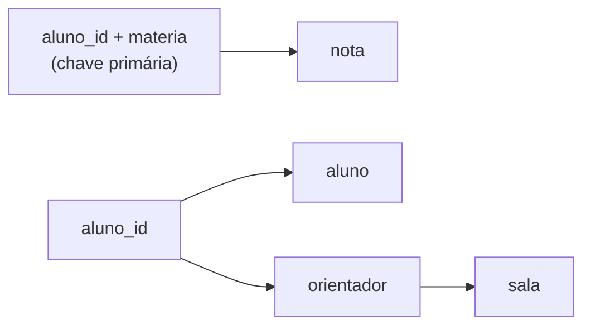
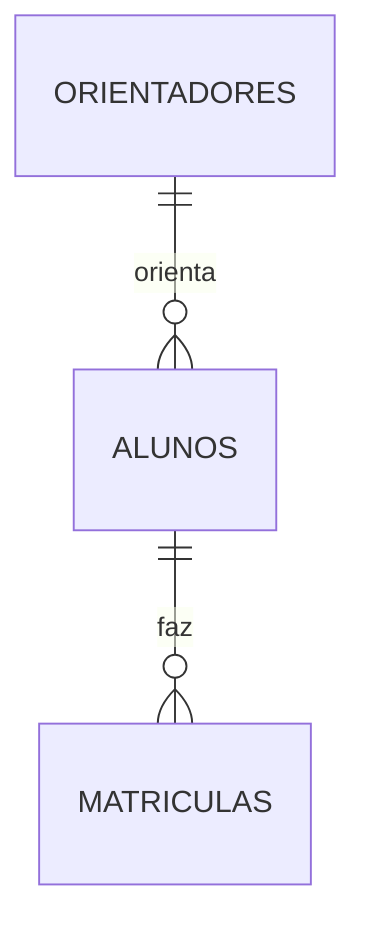
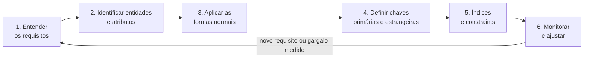

# Normalização de Banco de Dados

A nota de [SQL](/labs/web-dev/banco-de-dados/01-sql/) mostrou como declarar tabelas, chaves e constraints. Esta aqui trata da pergunta que vem antes: **quais tabelas criar e o que colocar em cada uma**. Quem começa a modelar costuma acabar com uma tabelona que guarda tudo junto, como uma planilha, e só descobre o problema meses depois, quando um dado aparece com duas versões diferentes.

## O que é normalização e por que normalizar

**Normalização** é o processo de organizar os dados em tabelas relacionadas entre si, ligadas por chave primária e chave estrangeira, seguindo regras que reduzem a redundância e protegem a integridade. Quem propôs a ideia foi Edgar Codd, o criador do modelo relacional, no artigo de 1970 que deu origem aos bancos SQL. As regras vieram em etapas, as **formas normais**, e cada uma resolve um tipo de problema.

O que se ganha:

- Cada informação mora num lugar só. O endereço de um cliente fica na tabela de clientes, não copiado em cada pedido
- O dado fica consistente, porque não existem duas cópias para divergir
- A manutenção fica mais simples: mudar uma informação é mudar uma linha
- Os relacionamentos ficam explícitos, via chave estrangeira

O preço é ler dados espalhados por mais tabelas, com mais `JOIN`s. Por isso normalização é sempre um equilíbrio, não uma meta a ser maximizada.

## Anomalias de inserção, atualização e exclusão

Vamos usar um exemplo só, a secretaria de uma escola, do começo ao fim da nota. Alguém montou uma tabela única com tudo o que precisa saber sobre matrículas:

`matriculas_tudo` (chave primária: `aluno_id` + `materia`)

| aluno_id | aluno | orientador | sala | materia    | nota |
| -------- | ----- | ---------- | ---- | ---------- | ---- |
| 1        | Ana   | Souza      | 412  | Matemática | 9,0  |
| 1        | Ana   | Souza      | 412  | Física     | 8,5  |
| 2        | Bruno | Lima       | 216  | Matemática | 7,0  |

Parece razoável, mas essa estrutura provoca três problemas clássicos, as **anomalias**:

- **Atualização**: o professor Souza muda para a sala 520. Como a sala aparece em cada linha de cada aluno dele, é preciso atualizar todas. Se a aplicação atualizar só uma, o banco passa a afirmar que Souza está em duas salas ao mesmo tempo
- **Inserção**: chegou um aluno novo que ainda não escolheu matérias. Como `materia` faz parte da chave, ela não pode ficar vazia, então o aluno não consegue ser cadastrado. O mesmo vale para um orientador novo que ainda não tem aluno
- **Exclusão**: Bruno cancelou Matemática, a única matéria dele. Ao apagar essa linha, o banco esquece que o Bruno existe e também que o professor Lima fica na sala 216

Todas têm a mesma causa: fatos diferentes (quem é o aluno, onde fica o orientador, que nota foi tirada) estão misturados na mesma linha. As formas normais são um roteiro para separá-los.

## Dependência funcional, parcial e transitiva

Para aplicar as regras é preciso entender um conceito: a **dependência funcional**. Dizemos que `B` depende funcionalmente de `A` (escreve-se `A → B`) quando, sabendo o valor de `A`, existe exatamente um valor possível de `B`. Saber o `aluno_id` já diz qual é o nome do aluno. Saber o orientador já diz qual é a sala dele.

Na tabela da secretaria:

- `aluno_id → aluno`, `orientador`
- `orientador → sala`
- (`aluno_id`, `materia`) → `nota`, porque a nota só existe para a combinação de um aluno com uma matéria



Esse desenho já mostra os dois defeitos que as formas normais atacam:

- **Dependência parcial**: um atributo depende só de **parte** da chave composta. `aluno` depende só de `aluno_id`, e não da matéria
- **Dependência transitiva**: um atributo não-chave depende de **outro atributo não-chave**, e só chega à chave por esse caminho. A `sala` depende do `orientador`, que depende do `aluno_id`

## Formas normais

Uma frase de William Kent, de um artigo clássico de 1982, resume as três primeiras: cada atributo que não é chave deve ser um fato sobre **a chave, a chave inteira e nada além da chave**. Cada parte da frase corresponde a uma forma normal. As formas são cumulativas: para estar na 3FN, a tabela precisa estar antes na 2FN e na 1FN.

### 1FN: valores atômicos

Cada célula guarda um único valor, e a tabela não tem grupos que se repetem. É a parte "a **chave**" da frase: a tabela precisa de uma chave que identifique cada linha, e cada campo guarda um valor só.

Antes de a secretaria montar a tabela da seção anterior, o primeiro rascunho dela era este:

| aluno_id | aluno | orientador | sala | materias           |
| -------- | ----- | ---------- | ---- | ------------------ |
| 1        | Ana   | Souza      | 412  | Matemática, Física |
| 2        | Bruno | Lima       | 216  | Matemática         |

A coluna `materias` guarda uma lista. Isso quebra a 1FN e cria dor imediata: como buscar todos os alunos de Física? Com `LIKE '%Física%'`, que pega também "Física Quântica" e não usa índice. Como saber quantas matérias cada um faz? Contando vírgulas.

Existe uma "correção" tentadora que também não vale: criar colunas `materia1`, `materia2`, `materia3`. É um grupo repetido disfarçado. No dia em que um aluno se matricular em uma quarta matéria, alguém vai ter que mudar a tabela e o código inteiro.

A solução é uma linha por matrícula, que é exatamente a tabela `matriculas_tudo` que vimos na seção de anomalias, agora com um lugar natural para a nota de cada matéria. A chave passa a ser a combinação `aluno_id` + `materia`.

Uma ressalva sobre "atômico": o que conta como valor indivisível depende do modelo. Bancos como o PostgreSQL aceitam arrays e `JSONB` numa coluna, e há casos em que isso é uma escolha consciente. A regra prática é: se você precisa filtrar, juntar ou contar pelos itens, eles querem ser linhas.

### 2FN: sem dependência parcial

Regra da **chave inteira**: todo atributo não-chave depende da chave completa, não de um pedaço dela. Só faz sentido quando a chave é composta. Uma tabela em 1FN com chave de uma coluna só já está na 2FN.

Na `matriculas_tudo`, `aluno`, `orientador` e `sala` dependem só de `aluno_id`, e não da matéria. Só `nota` depende da chave inteira. A correção é dividir a tabela em duas:

`alunos`

| id  | aluno | orientador | sala |
| --- | ----- | ---------- | ---- |
| 1   | Ana   | Souza      | 412  |
| 2   | Bruno | Lima       | 216  |

`matriculas`

| aluno_id | materia    | nota |
| -------- | ---------- | ---- |
| 1        | Matemática | 9,0  |
| 1        | Física     | 8,5  |
| 2        | Matemática | 7,0  |

Os dados de cada aluno agora aparecem uma vez só, mesmo que ele faça dez matérias. A anomalia de inserção do aluno sem matéria já sumiu: ele entra em `alunos` e ninguém exige uma matrícula.

### 3FN: sem dependência transitiva

Regra do **nada além da chave**: nenhum atributo não-chave pode depender de outro atributo não-chave. Na tabela `alunos`, a `sala` é um fato sobre o **orientador**, não sobre o aluno. Se o Souza orientar 30 alunos, a sala 412 se repete 30 vezes, e a anomalia de atualização continua ali.

A correção é tirar o orientador para uma tabela própria:

`orientadores`

| id  | nome  | sala |
| --- | ----- | ---- |
| 1   | Souza | 412  |
| 2   | Lima  | 216  |

`alunos`

| id  | nome  | orientador_id |
| --- | ----- | ------------- |
| 1   | Ana   | 1             |
| 2   | Bruno | 2             |

E `matriculas` continua como estava. O modelo final:



Em SQL, com as constraints da nota de [SQL](/labs/web-dev/banco-de-dados/01-sql/) garantindo os relacionamentos:

```sql
CREATE TABLE orientadores (
    id    SERIAL PRIMARY KEY,
    nome  VARCHAR(100) NOT NULL,
    sala  VARCHAR(10)  NOT NULL
);

CREATE TABLE alunos (
    id             SERIAL PRIMARY KEY,
    nome           VARCHAR(100) NOT NULL,
    orientador_id  INT NOT NULL REFERENCES orientadores(id)
);

CREATE TABLE matriculas (
    aluno_id  INT REFERENCES alunos(id),
    materia   VARCHAR(50),
    nota      DECIMAL(3, 1),
    PRIMARY KEY (aluno_id, materia)
);
```

Num sistema real, `materia` também viraria uma tabela com código próprio. Deixei como texto para não inflar o exemplo.

Agora as três anomalias do começo não têm mais como acontecer. Souza mudou de sala? É uma linha:

```sql
UPDATE orientadores SET sala = '520' WHERE id = 1;
```

Aluno novo sem matéria e orientador novo sem aluno entram nas suas tabelas sem depender de mais nada. Cancelar a matrícula do Bruno apaga só a linha de `matriculas`, e ele e o professor Lima continuam cadastrados.

### Além da 3FN: BCNF, 4FN e 5FN

As formas seguintes tratam de situações mais raras. Nenhuma é "a 3FN melhorada" no mesmo sentido, cada uma cobre um caso específico.

**BCNF** (também escrita FNBC, de Boyce-Codd) é uma versão mais rígida da 3FN. Exige que, para toda dependência funcional, o lado esquerdo seja uma chave da tabela. A 3FN deixa passar um caso: quando o atributo dependente faz parte de uma chave candidata. Exemplo: numa tabela `aulas (aluno, materia, professor)`, cada professor dá uma única matéria, então `professor → materia`. Mas `professor` sozinho não é chave da tabela, e a dupla (`professor`, `materia`) se repete para cada aluno. A saída é separar em `professor_materia` e `aluno_professor`. Vale saber que essa divisão tem um custo: a regra "um aluno tem um professor por matéria" deixa de ser garantida por uma chave única e passa a exigir um `JOIN` para ser verificada. Por isso às vezes se aceita ficar na 3FN.

**4FN** trata de **dependências multivaloradas**: uma tabela não deve guardar dois fatos multivalorados **independentes** ao mesmo tempo. Se a Ana tem duas habilidades e fala dois idiomas, uma tabela `(funcionario, habilidade, idioma)` precisa de 2 × 2 = 4 linhas, combinando tudo com tudo. Adicionar um terceiro idioma obriga a criar uma linha para cada habilidade. A correção é uma tabela para habilidades e outra para idiomas.

| funcionario | habilidade | idioma   |
| ----------- | ---------- | -------- |
| Ana         | SQL        | Inglês   |
| Ana         | SQL        | Espanhol |
| Ana         | Java       | Inglês   |
| Ana         | Java       | Espanhol |

**5FN** trata de **dependências de junção**: acontece quando uma tabela com três ou mais colunas pode ser reconstruída, sem perder nem inventar linhas, juntando tabelas menores. Kent usa como exemplo agentes, empresas e produtos. É a mais difícil de identificar e a menos comum na prática.

O que importa para o dia a dia: a maioria dos sistemas OLTP para na **3FN** (ou na BCNF). As formas superiores existem, mas, quando aparece um caso de 4FN, normalmente foi a dor (linhas se multiplicando a cada dado novo) que chamou a atenção, não a teoria.

## Normalização e desempenho

Aqui mora uma confusão comum: **normalizar não deixa toda query mais rápida**. Kent já avisava em 1982 que essas regras favorecem a escrita e tendem a penalizar a leitura, e que ninguém é obrigado a normalizar tudo quando o desempenho exige outra coisa.

Comparando a leitura dos dados de uma matrícula antes e depois:

```sql
-- Tabela única: uma leitura direta
SELECT aluno, orientador, sala
FROM matriculas_tudo
WHERE aluno_id = 1;

-- Normalizado: um JOIN
SELECT a.nome AS aluno, o.nome AS orientador, o.sala
FROM alunos a
JOIN orientadores o ON o.id = a.orientador_id
WHERE a.id = 1;
```

Um `JOIN` com índice é barato e o banco é excelente nisso. O custo pesa quando o modelo tem muitas tabelas encadeadas, o volume é grande e a mesma junção roda milhares de vezes por minuto. Em compensação, a escrita fica mais leve (uma linha muda em vez de dezenas). Normalizar também economiza espaço, mas menos do que parece, porque as chaves estrangeiras e os índices ocupam espaço próprio.

O que ajuda a manter o modelo normalizado rápido:

- **Índice nas colunas de chave estrangeira.** No PostgreSQL, `PRIMARY KEY` e `UNIQUE` criam índice automaticamente, mas a chave estrangeira **não**. A documentação recomenda indexar as colunas referenciadoras, porque um `DELETE` ou `UPDATE` na tabela referenciada obriga o banco a procurar as linhas que apontam para ela. Sem índice, essa procura lê a tabela inteira. Já o MySQL com InnoDB cria esse índice sozinho.
  ```sql
  CREATE INDEX idx_alunos_orientador_id ON alunos (orientador_id);
  ```
- **Índices compostos** pensados nos padrões de consulta reais. A ordem das colunas importa, como explica a nota de [Índices e Planos de Execução](/labs/web-dev/banco-de-dados/14-indices-e-planos-de-execucao/). A chave primária composta de `matriculas` já atende bem buscas por `aluno_id`, porque ele é a primeira coluna.
- **Evitar `SELECT *`.** Você lê colunas que não usa e perde a chance de o banco responder só pelo índice (Index Only Scan).
- **Escrever filtros que o índice consiga usar.** Existe um conselho popular, "filtre cedo", que engana: no PostgreSQL, o planner é livre para juntar as tabelas de um `INNER JOIN` em qualquer ordem, então a posição do filtro no texto não muda o plano. O que muda é o filtro permitir o uso do índice, sem função em cima da coluna, por exemplo.
- **Conferir o plano com `EXPLAIN` e manter as estatísticas atualizadas**, como detalha [Diagnóstico de Queries Lentas](/labs/web-dev/banco-de-dados/18-diagnostico-de-queries-lentas/).

Quando isso não basta e o gargalo é leitura pesada, existem outras alavancas antes de mexer no modelo: cache, réplicas de leitura ([Replicação de Banco de Dados](/labs/web-dev/escalabilidade/03-replicacao-de-banco-de-dados/)) e materialized views ([Views e Triggers](/labs/web-dev/banco-de-dados/03-views-e-triggers/)).

## Normalizar vs desnormalizar

A decisão depende do que o sistema mais faz.

Normalize quando:

- A integridade do dado importa (dinheiro, estoque, cadastro)
- As atualizações são frequentes
- Vários módulos ou equipes usam os mesmos dados e precisam de um modelo claro
- Você precisa de relatórios que batam, sem duas versões do mesmo número

Considere desnormalizar, de forma seletiva, quando uma leitura específica ficou lenta **e você mediu isso**, e o ganho de duplicar o dado justifica o trabalho de mantê-lo sincronizado. Relatórios e analytics são o caso clássico. A seção de Denormalization em [Técnicas para Melhorar a Performance do Banco de Dados](/labs/web-dev/banco-de-dados/17-tecnicas-de-melhoria-de-performance/) tem um exemplo e os critérios completos. Bancos de documento, como o MongoDB, já guardam dados relacionados juntos por padrão (ver [NoSQL](/labs/web-dev/banco-de-dados/11-nosql/)).

A meta não é a "normalização máxima". É o equilíbrio entre consistência, facilidade de manutenção, desempenho de consulta e escalabilidade. Uma boa ordem de trabalho é normalizar até a 3FN por padrão e desnormalizar só quando uma medição apontar o motivo.

## Processo de modelagem de dados

Na prática, a normalização é um passo dentro de um processo maior:



1. **Entender os requisitos**: o que o negócio guarda, consulta e não pode perder. A escola do exemplo precisa cadastrar aluno sem matrícula? Um professor pode trocar de sala? As respostas moldam as tabelas.
2. **Identificar entidades e atributos**: aluno, orientador, matrícula e as colunas de cada um
3. **Aplicar as formas normais**: o que esta nota mostrou
4. **Definir as chaves**: quem identifica cada linha e quem referencia quem
5. **Adicionar índices e constraints**: `NOT NULL`, `UNIQUE`, `CHECK` e chaves estrangeiras fazem o banco garantir as regras em toda escrita, como visto em [SQL](/labs/web-dev/banco-de-dados/01-sql/). Normalizar reduz a chance de inconsistência, mas quem barra o dado inválido são as constraints
6. **Monitorar e ajustar**: medir a carga real e só então otimizar. O lema serve para o banco inteiro: desenhe o schema, meça a carga de trabalho e otimize com base em evidência

## Referências

- [Artigo SQL Magazine 6 - Normalização: Técnicas e Conceitos](https://www.devmedia.com.br/artigo-sql-magazine-6-normalizacao-tecnicas-e-conceitos/7087) - Brúlio Ferreira de Carvalho (SQL Magazine/DevMedia), pt-BR
- [A Simple Guide to Five Normal Forms in Relational Database Theory](https://www.bkent.net/Doc/simple5.htm) - William Kent, en
- [A Relational Model of Data for Large Shared Data Banks](https://cacm.acm.org/magazines/1970/6/12368-a-relational-model-of-data-for-large-shared-data-banks/abstract/) - E. F. Codd (Communications of the ACM), en
- [Constraints - Documentação do PostgreSQL](https://www.postgresql.org/docs/current/ddl-constraints.html) - PostgreSQL, en
- [Controlling the Planner with Explicit JOIN Clauses](https://www.postgresql.org/docs/current/explicit-joins.html) - PostgreSQL, en
