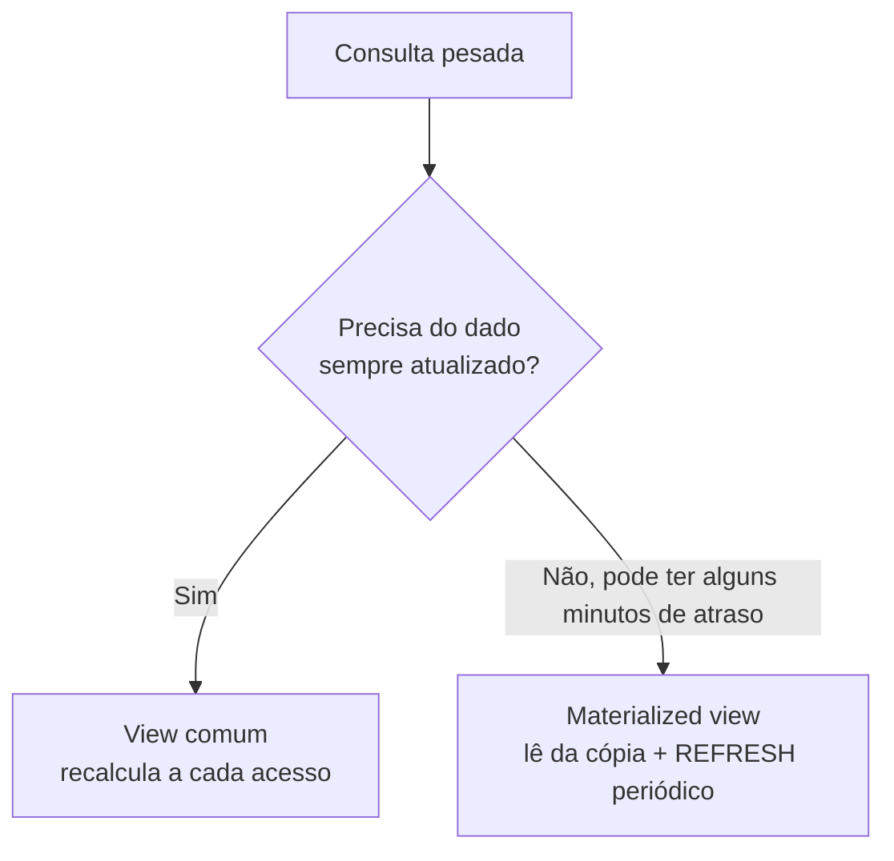
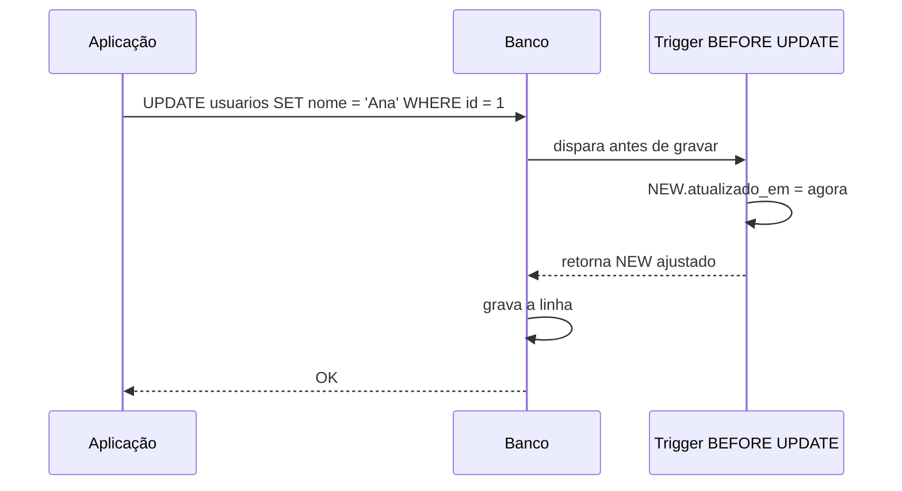

# Views e Triggers

A [nota de SQL](/labs/web-dev/banco-de-dados/01-sql/) cobre como criar tabelas e consultar dados. Views e triggers são dois recursos que o banco oferece em cima disso: a view guarda uma consulta pronta para reusar, e o trigger faz o banco executar um código sozinho quando alguém mexe numa tabela.

## Views

Uma view é uma consulta com nome salvo. Depois de criada, você usa o nome dela como se fosse uma tabela: dá para fazer `SELECT`, filtrar com `WHERE`, juntar com `JOIN`. A diferença é que a view não guarda dados próprios, ela só reexecuta a consulta original toda vez que é acessada.

```sql
CREATE VIEW pedidos_com_cliente AS
SELECT p.id,
       p.valor,
       p.status,
       u.nome  AS cliente,
       u.email AS email_cliente
FROM pedidos p
JOIN usuarios u ON u.id = p.usuario_id;
```

Agora essa consulta virou um objeto do banco:

```sql
SELECT cliente, valor
FROM pedidos_com_cliente
WHERE status = 'pago'
ORDER BY valor DESC;
```

Para trocar a definição sem precisar apagar antes, use `CREATE OR REPLACE VIEW`. Para remover, `DROP VIEW`:

```sql
CREATE OR REPLACE VIEW pedidos_com_cliente AS
SELECT p.id, p.valor, p.status, p.criado_em, u.nome AS cliente
FROM pedidos p
JOIN usuarios u ON u.id = p.usuario_id;

DROP VIEW pedidos_com_cliente;
DROP VIEW IF EXISTS pedidos_com_cliente;
```

### Para que serve uma view

- **Esconder consulta complexa.** Se todo mundo precisa daquele `JOIN` de cinco tabelas com regras de filtro específicas, escreve uma vez na view e o resto do time só faz `SELECT * FROM a_view`.
- **Criar uma camada estável sobre o schema.** Se a estrutura das tabelas mudar (uma coluna trocou de nome, um dado foi para outra tabela), você ajusta a view e as consultas que dependem dela continuam funcionando.
- **Controlar acesso.** Dá para dar permissão de leitura só na view, não na tabela. Assim um usuário do banco enxerga apenas as colunas e linhas que a view expõe, sem ver o resto (por exemplo, uma view de funcionários sem a coluna de salário).

### Escrever através de uma view

Em regra a view serve para leitura. O banco até aceita `INSERT`, `UPDATE` e `DELETE` em views simples (as que leem de uma única tabela, sem agregação, sem `DISTINCT`, sem `GROUP BY`), repassando a operação para a tabela de origem. Quando a view tem `JOIN` ou funções de agregação, o banco não sabe para qual tabela mandar a escrita e rejeita a operação. Para casos assim existe recurso avançado (`INSTEAD OF` triggers no PostgreSQL), mas o uso comum é tratar view como somente leitura.

## View comum vs materialized view

A view comum não ocupa espaço com dados: ela é só a consulta guardada, e o resultado é recalculado a cada acesso. Isso é ótimo porque o dado está sempre atualizado, mas ruim quando a consulta é pesada e roda o tempo todo.

A **materialized view** resolve esse caso: ela executa a consulta uma vez, grava o resultado em disco e passa a responder a partir dessa cópia. Fica rápida para ler, mas o dado congela no momento em que foi calculado. Para atualizar, você roda um `REFRESH` (manual, agendado, ou disparado por um trigger):

```sql
CREATE MATERIALIZED VIEW resumo_vendas_mes AS
SELECT date_trunc('month', criado_em) AS mes,
       COUNT(*)                       AS total_pedidos,
       SUM(valor)                     AS receita
FROM pedidos
WHERE status = 'pago'
GROUP BY 1;

-- Recalcula os dados da materialized view
REFRESH MATERIALIZED VIEW resumo_vendas_mes;
```



Resumindo o trade-off: view comum custa CPU a cada leitura e nunca está desatualizada; materialized view custa espaço em disco e um `REFRESH` de tempos em tempos, e entre um refresh e outro o dado pode estar velho. Use materialized view só para consulta cara que não precisa ser exata ao segundo, como um dashboard de métricas do dia anterior.

## Triggers

Um trigger é um pedaço de código que fica "grudado" numa tabela e que o banco executa automaticamente quando acontece um evento nela. Ninguém chama o trigger de propósito: ele dispara sozinho no `INSERT`, `UPDATE` ou `DELETE`.

Todo trigger é definido por três escolhas:

- **Momento:** `BEFORE` (roda antes da linha ser gravada, dá para alterar o valor ou cancelar) ou `AFTER` (roda depois, quando a linha já está gravada, bom para registrar em outra tabela)
- **Evento:** `INSERT`, `UPDATE` ou `DELETE` (pode ser mais de um no mesmo trigger)
- **Nível:** `FOR EACH ROW` (executa uma vez por linha afetada) ou por comando (executa uma vez só, mesmo que o `UPDATE` tenha mexido em mil linhas)

Dentro do trigger você acessa a linha através de duas variáveis: `NEW` (os valores que vão ser gravados, existe no `INSERT` e no `UPDATE`) e `OLD` (os valores antes da mudança, existe no `UPDATE` e no `DELETE`).

Exemplo em PostgreSQL, que separa a lógica numa função e depois liga o trigger a ela:

```sql
-- 1. A função que vai rodar
CREATE FUNCTION atualiza_timestamp() RETURNS trigger AS $$
BEGIN
    NEW.atualizado_em = CURRENT_TIMESTAMP;
    RETURN NEW;
END;
$$ LANGUAGE plpgsql;

-- 2. O trigger que dispara a função antes de cada UPDATE
CREATE TRIGGER usuarios_atualiza_timestamp
BEFORE UPDATE ON usuarios
FOR EACH ROW
EXECUTE FUNCTION atualiza_timestamp();
```

Toda vez que um `UPDATE` tocar a tabela `usuarios`, o banco preenche `atualizado_em` com a hora atual antes de gravar, sem a aplicação precisar mandar esse campo.



## Casos de uso e cuidados

Onde trigger costuma aparecer:

- **Auditoria e histórico.** Um trigger `AFTER UPDATE`/`AFTER DELETE` copia a linha antiga para uma tabela `usuarios_historico`, guardando quem era o dado antes da mudança.
- **Campos derivados.** Manter um campo `total` na tabela `pedidos` somando os itens sempre que um item é inserido ou removido.
- **Validações que o `CHECK` não alcança.** Uma restrição `CHECK` só enxerga a própria linha. Se a regra depende de outras tabelas (por exemplo, "não deixar criar pedido para usuário inativo"), um trigger `BEFORE INSERT` consegue consultar a outra tabela e barrar a operação.
- **Manter uma materialized view fresca.** Um trigger nas tabelas de origem chama `REFRESH MATERIALIZED VIEW` depois de cada mudança relevante.

Os cuidados são reais e valem a pena levar a sério:

- **Lógica escondida.** Quem lê o código da aplicação não vê o trigger. Uma linha muda de valor "sozinha" e a pessoa perde tempo procurando no lugar errado. Documente todo trigger que altera dados.
- **Custo em operação em massa.** Um trigger `FOR EACH ROW` num `UPDATE` que afeta 100 mil linhas roda 100 mil vezes. O que parecia barato vira um problema de performance.
- **Cadeia de triggers.** Um trigger que escreve numa tabela que tem outro trigger, que escreve em outra com mais um trigger. Isso é o famoso "spaghetti trigger": difícil de prever e de depurar.

Uma boa regra: use trigger quando a lógica **precisa** acontecer no banco, junto com a transação, valendo para qualquer aplicação que acesse aquela tabela. Se a regra é de negócio e só uma aplicação escreve ali, geralmente é mais claro resolver no código. Se o trabalho pode esperar (recalcular um agregado, gerar um relatório), um job agendado costuma ser mais simples de manter do que um trigger.
