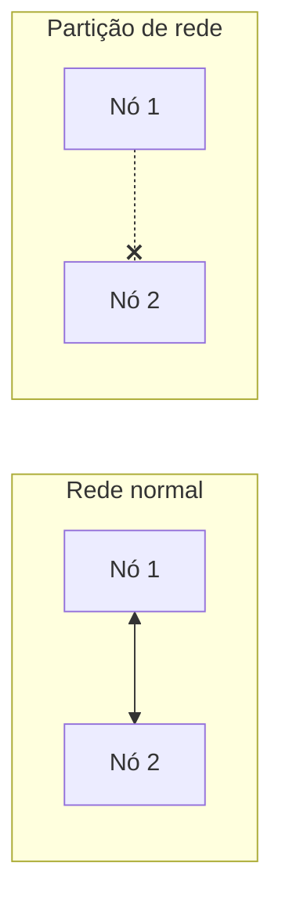
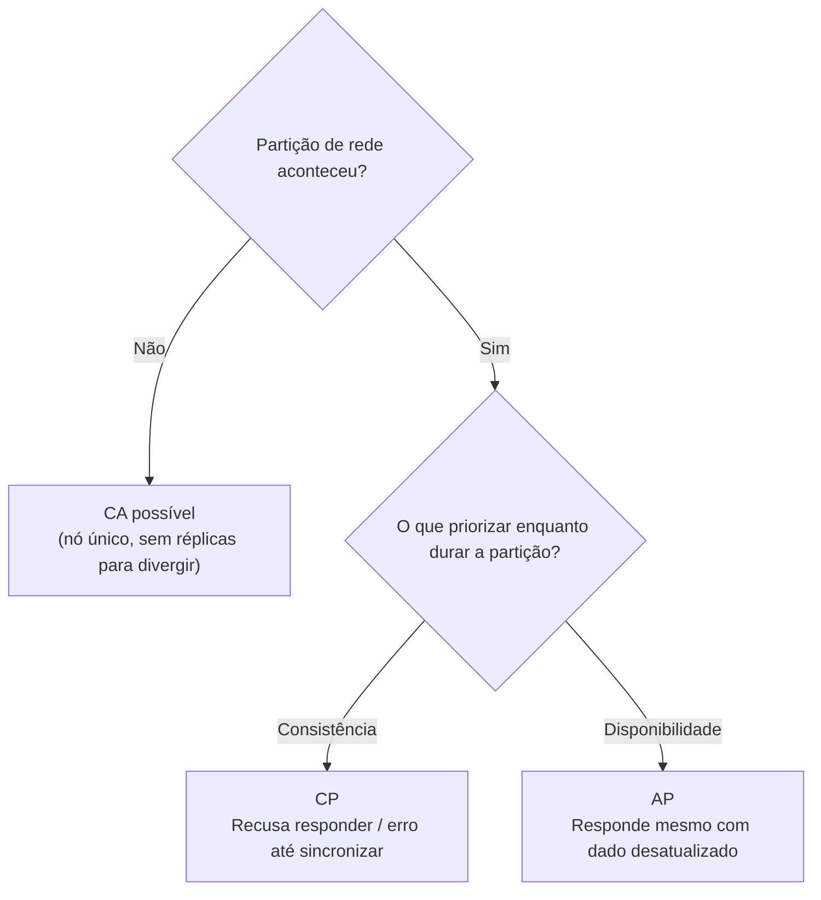

# Teorema de CAP

Enquanto um banco de dados roda numa única máquina, a vida é simples: só existe uma cópia dos dados, então não há como ela discordar de si mesma. O problema aparece quando esse banco passa a ser distribuído, ou seja, os dados são replicados em várias máquinas diferentes (os **nós**) para suportar mais carga (veja [Escalabilidade](/labs/web-dev/escalabilidade/escalabilidade/)) ou para sobreviver à queda de uma máquina.

Nesse cenário surge uma pergunta que um banco único nunca precisa responder: e se dois nós não conseguirem se comunicar por um instante? O Teorema de CAP, formulado pelo cientista da computação Eric Brewer em 2000, descreve o limite fundamental que todo sistema distribuído enfrenta nessa situação.

## O que o teorema diz

Um sistema distribuído pode oferecer, no máximo, duas das três garantias abaixo ao mesmo tempo:

- **C**onsistência (Consistency)
- **A**vailability, disponibilidade (Availability)
- **P**artição, tolerância a partição (Partition Tolerance)

### Consistência (C)

Toda leitura retorna o dado mais recente que foi escrito, ou um erro. Nenhum nó responde com um valor desatualizado.

```
Escreve X = 10 no nó 1
Lê X no nó 2 -> precisa retornar 10 (nunca o valor antigo)
```

Vale reforçar: essa consistência não é a mesma coisa que o **C** de [ACID](/labs/web-dev/banco-de-dados/acid/). A consistência do ACID garante que uma transação respeite as regras de negócio (chaves estrangeiras, `CHECK`, `NOT NULL`). Já a consistência do CAP é sobre todos os nós concordarem sobre qual é o valor atual de um dado, quase como se existisse uma única cópia dos dados mesmo estando replicados.

### Disponibilidade (A)

Toda requisição recebe uma resposta, com sucesso ou falha, dentro de um tempo razoável, mesmo que parte dos nós esteja fora do ar. A resposta não precisa ser o dado mais recente, só precisa existir: o sistema nunca trava sem responder nada.

### Tolerância a partição (P)

O sistema continua funcionando mesmo quando a comunicação entre nós falha, o que é chamado de **partição de rede**. Um cabo rompido, um data center isolado, um nó que perde conectividade por alguns segundos: tudo isso é uma partição.



## Por que a escolha é, na prática, entre C e A

A ideia de "escolher duas entre três" é didática, mas um pouco enganosa. Em qualquer sistema que roda em mais de uma máquina, falhas de rede **vão acontecer** mais cedo ou mais tarde: cabos rompem, roteadores travam, pacotes se perdem. Tolerância a partição não é uma opção que se escolhe, é uma realidade que se aceita.

Isso significa que a escolha real do CAP só existe **no momento em que uma partição acontece**, e nesse momento o sistema tem só duas saídas:

- **Manter a consistência (CP):** o nó que não consegue confirmar que tem o dado mais atualizado se recusa a responder, ou responde com erro, até a partição ser resolvida. Prioriza estar certo a estar disponível.
- **Manter a disponibilidade (AP):** o nó responde mesmo sem ter certeza de que o dado é o mais recente, aceitando o risco de entregar um valor desatualizado. Prioriza continuar respondendo a parar tudo.



A combinação "CA" (consistência e disponibilidade juntas) só é possível quando **não existe partição** para lidar, o que basicamente descreve um banco de dados numa única máquina, sem replicação. Assim que os dados são distribuídos em mais de um nó, "CA" deixa de ser uma opção real.

## CP vs AP na prática

| Prioridade           | O que acontece durante uma partição                                     | Exemplos                                              |
| -------------------- | ----------------------------------------------------------------------- | ----------------------------------------------------- |
| CP (Consistência)    | Nós fora de sincronia recusam a leitura/escrita até se atualizarem      | MongoDB (configuração padrão), HBase, ZooKeeper, etcd |
| AP (Disponibilidade) | Todos os nós continuam respondendo, aceitando inconsistência temporária | Cassandra, DynamoDB, Riak, CouchDB                    |

Nenhuma escolha é "certa" no absoluto, depende do problema. Um sistema bancário tende a preferir CP: é melhor recusar uma transferência do que confirmar um saldo errado. Já uma rede social tende a preferir AP: é melhor mostrar um número de curtidas levemente desatualizado do que a página não carregar.

## CAP não é a palavra final

O CAP só descreve o que acontece **durante** uma partição, mas a maior parte do tempo um sistema distribuído está operando normalmente, sem nenhuma partição ativa. Nesses momentos, a troca real não é entre consistência e disponibilidade, é entre consistência e **latência** (o tempo que leva para sincronizar os nós antes de responder). Essa extensão do CAP é o Teorema de PACELC.

## Recapitulando

- O Teorema de CAP descreve o limite de um sistema distribuído: durante uma partição de rede, só é possível garantir consistência ou disponibilidade, não as duas.
- Consistência (C): toda leitura retorna o dado mais recente ou um erro (diferente da consistência do ACID, que é sobre regras de negócio).
- Disponibilidade (A): toda requisição recebe alguma resposta, mesmo que o dado esteja desatualizado.
- Tolerância a partição (P): não é uma escolha, é uma realidade de qualquer sistema com mais de um nó.
- A escolha prática do CAP é entre CP (recusa responder para não errar) e AP (responde mesmo com risco de dado velho).
- Fora de uma partição, a troca deixa de ser C vs A e passa a ser consistência vs latência, o que o PACELC explica.

## Referencias

- [Como Escolher o Banco de Dados Correto pra sua Aplicação | System Design & Arquitetura de Software](https://www.youtube.com/watch?v=bhw4-Kq_RPs)
