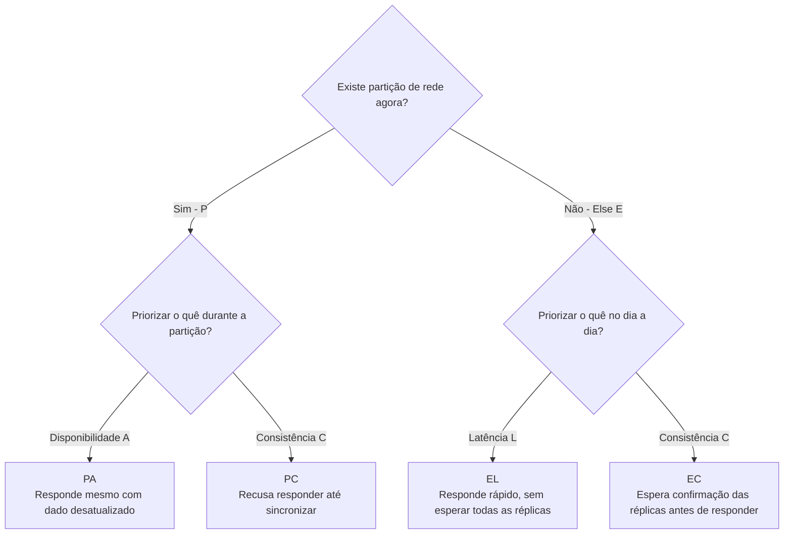
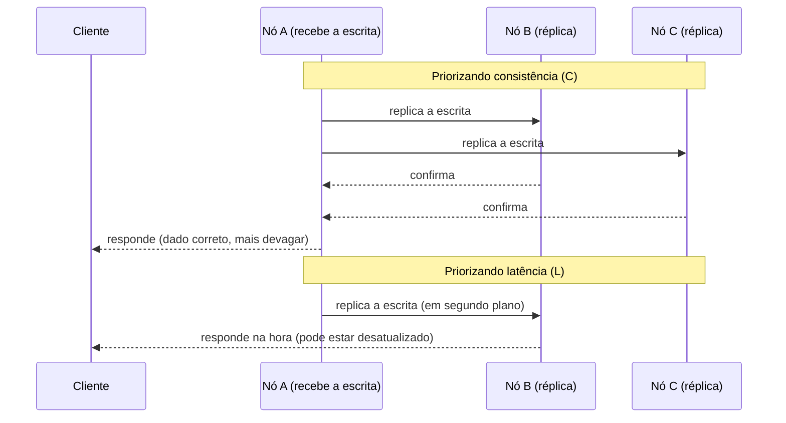

# Teorema de PACELC

O [Teorema de CAP](/labs/web-dev/banco-de-dados/teorema-de-cap/) descreve o que acontece com um sistema distribuído durante uma partição de rede: ou ele prioriza consistência, ou prioriza disponibilidade. Mas partições de rede são raras, a maior parte do tempo um sistema distribuído está operando normalmente, sem nenhum nó isolado. O que o CAP diz sobre esses momentos "normais"? Nada, e é exatamente essa lacuna que o Teorema de PACELC preenche.

Proposto pelo engenheiro Daniel Abadi em 2010, o PACELC parte do princípio de que a troca (trade-off) mais interessante de um banco distribuído não acontece só durante falhas, ela também acontece o tempo todo, mesmo quando tudo está funcionando bem.

## O que a sigla significa

PACELC é uma junção de duas perguntas, cada uma com sua própria troca:

```
PACELC = PAC + ELC

  se Partição (P):
    escolha entre Availability (A) ou Consistency (C)
  Else (E), ou seja, sem partição:
    escolha entre Latency (L) ou Consistency (C)
```

Em português, e escrito como o teorema costuma ser resumido:

> **Se** houver partição, escolha entre **disponibilidade** ou **consistência**. **Senão**, escolha entre **latência** ou **consistência**.



A primeira metade (PAC) é literalmente o Teorema de CAP: com a rede particionada, o sistema decide entre continuar respondendo (mesmo com dado velho) ou recusar a resposta até garantir que o dado está correto. Esse trade-off já está detalhado na nota de [CAP](/labs/web-dev/banco-de-dados/teorema-de-cap/) e não precisa ser repetido aqui.

A parte nova é o **Else**: o que o sistema faz quando a rede está saudável e todos os nós conseguem se comunicar.

## A troca sem partição: latência vs consistência

Mesmo sem nenhuma falha de rede, um banco distribuído ainda precisa manter os dados sincronizados entre os nós (réplicas). Essa sincronização não é instantânea, ela custa tempo, e é aí que mora a segunda escolha do PACELC.

Imagine que um dado é escrito no nó A e existem réplicas nos nós B e C. Quando alguém lê esse dado logo em seguida, existem dois caminhos possíveis:



- **Priorizar consistência (C):** o sistema espera a confirmação de todas (ou da maioria) das réplicas antes de responder. Garante que a leitura reflete a escrita mais recente, ao custo de mais tempo de espera.
- **Priorizar latência (L):** o sistema responde a partir da réplica mais próxima ou disponível, sem esperar a sincronização completa. É mais rápido, mas existe o risco de retornar um dado levemente desatualizado.

## As quatro combinações possíveis

Juntando as duas metades do teorema, um banco distribuído se encaixa em uma de quatro categorias:

| Categoria | Durante partição | Sem partição | Significado                                                                                                                    |
| --------- | ---------------- | ------------ | ------------------------------------------------------------------------------------------------------------------------------ |
| **PA/EL** | Disponibilidade  | Latência     | Prioriza velocidade e continuar no ar o tempo todo, aceitando dados eventualmente consistentes                                 |
| **PC/EC** | Consistência     | Consistência | Prioriza sempre o dado correto, mesmo que isso signifique esperar mais ou recusar respostas                                    |
| **PA/EC** | Disponibilidade  | Consistência | Combinação incomum: aceita responder com dado velho durante uma falha, mas exige sincronização total quando tudo está saudável |
| **PC/EL** | Consistência     | Latência     | Recusa responder durante uma falha, mas prioriza velocidade quando a rede está normal                                          |

Na prática, os dois casos mais comuns são o primeiro e o segundo, já que a escolha de disponibilidade ou consistência tende a ser mais consistente no design do banco, tanto na falha quanto fora dela.

## Exemplos reais

| Banco          | Classificação        | Comportamento                                                                                                                        |
| -------------- | -------------------- | ------------------------------------------------------------------------------------------------------------------------------------ |
| Cassandra      | PA/EL                | Prioriza estar sempre disponível e responder rápido, aceitando inconsistência temporária entre réplicas                              |
| DynamoDB       | PA/EL                | Mesmo raciocínio da Cassandra, focado em baixíssima latência e alta disponibilidade                                                  |
| MongoDB        | PC/EC (configurável) | Por padrão prioriza consistência, mas expõe parâmetros de leitura/escrita para o time decidir o quanto abrir mão disso               |
| HBase          | PC/EC                | Prioriza consistência forte tanto na falha quanto fora dela, aceitando mais latência                                                 |
| Google Spanner | PC/EC                | Também prioriza consistência forte, mas usa um sistema de relógios sincronizados (TrueTime) para manter a latência baixa mesmo assim |

## Por que isso importa na escolha de um banco

O Teorema de CAP já ajuda a entender o comportamento de um banco numa situação rara (a partição). O PACELC completa esse raciocínio explicando o comportamento no dia a dia, que é o que a aplicação sente o tempo inteiro. Duas perguntas úteis na hora de escolher uma tecnologia:

- "Se a rede cair, esse banco prefere parar de responder ou responder com dado velho?" (a pergunta do CAP)
- "No dia a dia, sem nenhuma falha, esse banco prefere ser mais rápido ou mais rigoroso com a consistência?" (a pergunta que o PACELC adiciona)

## Recapitulando

- O CAP só descreve o comportamento de um sistema distribuído durante uma partição de rede.
- O PACELC estende essa ideia: mesmo sem partição, existe uma troca entre latência e consistência, porque sincronizar réplicas custa tempo.
- A sigla resume as duas trocas: **se** houver Partição, escolha entre Availability ou Consistency; **Else** (sem partição), escolha entre Latency ou Consistency.
- Bancos como Cassandra e DynamoDB são PA/EL (disponibilidade e velocidade acima de tudo).
- Bancos como HBase e MongoDB (por padrão) são PC/EC (consistência acima de tudo).
- Entender o PACELC ajuda a escolher banco de dados olhando não só para falhas raras, mas para o comportamento do dia a dia.

## Referências

- [Como Escolher o Banco de Dados Correto pra sua Aplicação | System Design & Arquitetura de Software](https://www.youtube.com/watch?v=bhw4-Kq_RPs)
