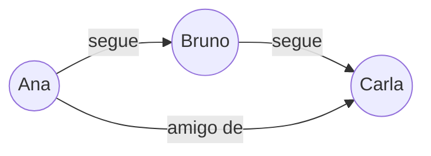

# NoSQL

Até aqui, as notas de banco de dados giram em torno do modelo relacional: tabelas, linhas, colunas fixas, chaves estrangeiras (veja [SQL](/labs/web-dev/banco-de-dados/sql/)). NoSQL é o nome guarda-chuva para bancos que abrem mão desse modelo rígido em troca de outra coisa, geralmente mais flexibilidade no formato dos dados ou mais facilidade para escalar horizontalmente.

O nome é enganoso: "NoSQL" não significa "sem SQL" ao pé da letra (vários bancos NoSQL têm sua própria linguagem de consulta parecida com SQL), o sentido mais aceito hoje é "not only SQL", um jeito diferente de modelar dados, não necessariamente a negação do relacional.

## Categorias de banco NoSQL

NoSQL não é um modelo único, é uma família de quatro modelos de dados diferentes, cada um resolvendo um problema específico.

### Key-value

O modelo mais simples: cada dado é guardado como um par chave/valor, parecido com um dicionário gigante. A aplicação só sabe fazer duas operações de verdade, buscar pela chave e gravar na chave, sem consultar o conteúdo do valor.

```
chave: "sessao:usuario:42"
valor: { "logado": true, "carrinho": [12, 87] }
```

- **Quando usar:** cache, sessão de usuário, contadores, filas simples, qualquer dado que é sempre acessado por um identificador único e não precisa de busca por conteúdo.
- **Exemplos:** Redis, DynamoDB (também opera como key-value).

### Document

Guarda cada registro como um documento (geralmente JSON ou BSON), que pode ter estrutura aninhada e campos que variam de um documento para outro dentro da mesma coleção. Diferente do key-value, o banco consegue consultar e indexar campos dentro do documento, não só a chave.

```json
{
  "_id": "u42",
  "nome": "Ana",
  "enderecos": [
    { "tipo": "casa", "cidade": "São Paulo" },
    { "tipo": "trabalho", "cidade": "Campinas" }
  ]
}
```

- **Quando usar:** dados que naturalmente têm estrutura de objeto, com campos opcionais ou aninhados, como perfis de usuário, catálogos de produto ou conteúdo de CMS.
- **Exemplos:** MongoDB, Couchbase.

### Wide-column

Parece uma tabela à primeira vista (linhas e colunas), mas cada linha pode ter um conjunto diferente de colunas, e o banco é otimizado para escrever e ler colunas específicas de bilhões de linhas rapidamente, em vez de linhas inteiras. É desenhado para escala massiva de escrita, distribuída entre muitos nós.

```
Linha: usuario_42
  coluna "nome"        -> "Ana"
  coluna "ultimo_login" -> "2026-08-20"
  (outra linha pode nem ter a coluna "ultimo_login")
```

- **Quando usar:** séries temporais, dados de sensores/IoT, catálogos gigantes, qualquer cenário com volume altíssimo de escrita distribuída globalmente.
- **Exemplos:** Cassandra, HBase.

### Graph

Modela os dados como nós (entidades) e arestas (relacionamentos entre elas), otimizado justamente para consultas que atravessam relacionamentos, algo que um banco relacional só consegue fazer com vários `JOIN`s encadeados, cada vez mais lentos conforme a profundidade da busca cresce.



- **Quando usar:** redes sociais (quem segue quem), sistemas de recomendação, detecção de fraude (encontrar padrões de conexão suspeitos), grafos de conhecimento.
- **Exemplos:** Neo4j, Amazon Neptune.

Os bancos já detalhados na nota de [Escolha de Banco de Dados na Prática](/labs/web-dev/banco-de-dados/escolha-de-banco-de-dados/) se encaixam nessas categorias: Redis e DynamoDB são key-value, MongoDB é document, Cassandra é wide-column.

## SQL vs NoSQL

A pergunta "SQL ou NoSQL" não tem uma resposta certa isolada, ela depende do que o sistema precisa em cada uma dessas frentes:

| Critério                 | SQL (relacional)                                                                                   | NoSQL                                                                                                                                      |
| ------------------------ | -------------------------------------------------------------------------------------------------- | ------------------------------------------------------------------------------------------------------------------------------------------ |
| Consistência             | Forte por padrão, com garantias [ACID](/labs/web-dev/banco-de-dados/acid/) completas em transações | Varia por banco e por configuração; muitos priorizam disponibilidade (veja [CAP](/labs/web-dev/banco-de-dados/teorema-de-cap/))            |
| Escalabilidade           | Verticalmente fácil, horizontalmente exige esforço extra (sharding manual, ferramentas externas)   | Pensado para escalar horizontalmente desde o design                                                                                        |
| Flexibilidade do esquema | Esquema fixo, definido antes de gravar dados (`CREATE TABLE`), alterar depois custa uma migração   | Esquema flexível ou inexistente, cada registro pode ter formato próprio                                                                    |
| Modelo de dados          | Tabelas normalizadas, relacionamentos via chave estrangeira e `JOIN`                               | Depende da categoria: chave-valor, documento, colunar ou grafo                                                                             |
| Casos de uso típicos     | Dados com relacionamentos claros e regras de negócio rígidas: financeiro, estoque, pedidos         | Dados de alto volume, formato variável ou fortemente ligados a um padrão de acesso específico: sessões, catálogos, feeds, séries temporais |

Na prática, a escolha segue o mesmo raciocínio já visto na nota de [Escolha de Banco de Dados](/labs/web-dev/banco-de-dados/escolha-de-banco-de-dados/): comece pela pergunta "que tipo de garantia esse dado específico precisa, e que formato ele naturalmente tem", não pela preferência por uma tecnologia. Um sistema real frequentemente usa os dois ao mesmo tempo, um banco relacional para pedidos e pagamentos, e um banco key-value ao lado só para sessão e cache.
