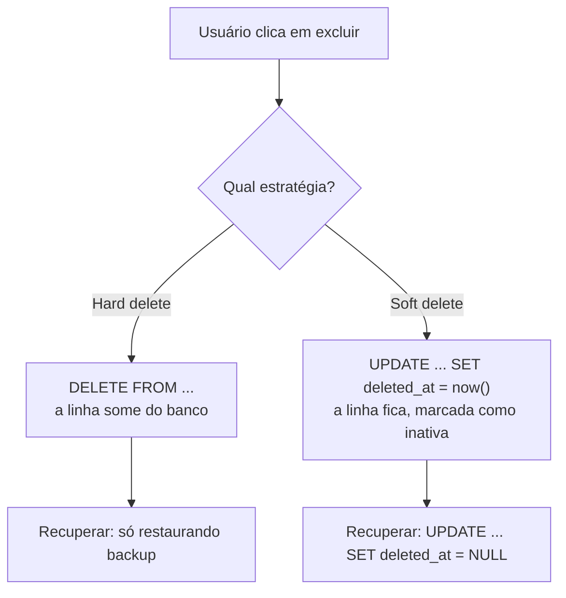

# Soft Delete vs Hard Delete

Quando alguém clica em "excluir" numa tela, o que acontece com a linha lá no banco? Existem duas respostas possíveis, e a escolha entre elas mexe com backup, auditoria, integridade dos dados e desempenho. Vale entender as duas antes de sair dando `DELETE`.

## O que significa excluir um registro

A [nota de SQL](/labs/web-dev/banco-de-dados/01-sql/) mostra o comando `DELETE`, que tira a linha da tabela de vez. Só que "remover a linha" não é a única forma de tratar uma exclusão. Dá para deixar a linha onde está e apenas marcá-la como inativa, escondendo-a de todo mundo que não deveria mais vê-la.



O que está em jogo na decisão: conseguir desfazer um engano, manter o histórico de quem já passou pela tabela, não quebrar outros registros que apontam para aquele dado e o preço que você paga em espaço e performance.

## Hard delete

É a exclusão física: a linha deixa de existir.

```sql
DELETE FROM clientes WHERE id = 42;
```

O espaço volta para o banco (no PostgreSQL isso passa pelo `VACUUM`, mas a ideia é essa), os índices não carregam peso morto e nenhuma consulta precisa lembrar de ignorar linhas apagadas. É o comportamento mais simples e previsível.

O problema é a recuperação. Se a exclusão foi um erro, a única saída é restaurar um backup ou usar point-in-time recovery, o que costuma ser caro e traz junto um monte de outras alterações que aconteceram no meio do caminho. Na prática, dado apagado com hard delete é dado perdido.

Sobre registros que referenciam a linha apagada, a foreign key decide o que acontece: `ON DELETE RESTRICT` barra o `DELETE` enquanto existir alguém apontando para ela, `ON DELETE CASCADE` apaga os dependentes junto.

## Soft delete

Também chamado de exclusão lógica. Em vez de remover, você marca a linha:

```sql
ALTER TABLE clientes ADD COLUMN deleted_at TIMESTAMP;

-- "excluir" o cliente 42
UPDATE clientes SET deleted_at = now() WHERE id = 42;

-- listar só os clientes ativos
SELECT * FROM clientes WHERE deleted_at IS NULL;
```

Existem variações da coluna de controle: uma flag booleana `is_deleted`, uma coluna `status` com valores como `ativo` e `inativo`, uma coluna `active`. O `deleted_at` como timestamp tem a vantagem de, além de dizer que a linha saiu, registrar quando isso aconteceu.

A linha continua fisicamente na tabela. O que muda é que a aplicação passa a tratar `deleted_at IS NOT NULL` como "esse registro não existe mais para efeitos práticos".

## Por que escolher soft delete

Desfazer um engano fica trivial. Restaurar um cliente excluído por acidente é um `UPDATE ... SET deleted_at = NULL`, não um chamado para o time de infraestrutura mexer em backup.

As referências não quebram. Se a tabela `pedidos` aponta para `clientes.id`, apagar o cliente de verdade deixaria pedidos órfãos ou faria o banco barrar a exclusão. Com a linha ainda lá, o join de um pedido antigo com o cliente dele continua funcionando normalmente.

Você mantém histórico e auditoria. Um relatório do ano passado ainda encontra o cliente que "saiu" em março. Dá para responder o que existia na tabela numa data específica.

E sobra material para métricas: quantas contas foram desativadas por mês, qual a taxa de cancelamento, quanto tempo em média um cliente fica ativo.

## O preço que você paga

**Filtro em todo lugar.** Toda consulta de leitura precisa de `WHERE deleted_at IS NULL`. Esquecer numa tela significa mostrar dado "excluído" para o usuário. Esquecer num relatório significa número errado. E é fácil esquecer, porque nada no banco te lembra.

**Unicidade quebra.** Imagine um índice de e-mail único:

```sql
CREATE UNIQUE INDEX ON clientes (email);
```

O cliente cancela a conta (soft delete) e, meses depois, tenta se cadastrar de novo com o mesmo e-mail. O índice barra, porque a linha antiga com aquele e-mail ainda está na tabela. A saída é um índice único parcial, que só aplica a regra às linhas ativas:

```sql
CREATE UNIQUE INDEX clientes_email_ativos
  ON clientes (email)
  WHERE deleted_at IS NULL;
```

**A foreign key perde força.** O banco continua garantindo que `pedidos.cliente_id` aponta para uma linha que existe, mas não que essa linha está ativa. Checar "o cliente ainda está ativo?" vira responsabilidade do código da aplicação, não mais do banco.

**A tabela e os índices só crescem.** Nada nunca sai. Numa tabela com muito volume e muita exclusão lógica, isso vai pesando em varredura, tamanho de índice e tempo de backup.

## Como não se enrolar

Centralize o filtro. Crie uma view `clientes_ativos`, configure um escopo padrão no ORM ou use uma camada de repositório que já aplica o `deleted_at IS NULL`. Contar com a memória de cada pessoa para escrever o `WHERE` certo em toda query não escala.

Crie um índice único parcial para cada constraint de unicidade que a tabela tiver.

Defina a cascata lógica. Ao desativar um cliente, o que acontece com os endereços, os cartões salvos, os contatos dele? Marca todos como inativos junto? Deixa como estão? Não existe resposta certa, mas precisa existir uma regra escrita.

Considere um job de expurgo. Soft delete não precisa ser para sempre. Um processo que roda periodicamente e faz hard delete do que está inativo há mais de um certo tempo (90 dias, um ano, o que o negócio permitir) mantém a tabela sob controle sem abrir mão da janela de recuperação.

Sobre ORMs: vários frameworks já trazem isso pronto, como o trait `SoftDeletes` do Laravel, o `@SQLDelete` com `@Where` do Hibernate, managers customizados no Django, middleware no Prisma. Só fique atento a que query crua e certos joins costumam escapar do filtro automático, então conheça o comportamento exato da sua ferramenta.

## Soft delete e LGPD

Um ponto que passa batido: preencher `deleted_at` não é apagar dado pessoal. Quando a pessoa exerce o direito de eliminação dos dados dela (art. 18 da LGPD), manter nome, e-mail e CPF na tabela com uma flag de "inativo" não cumpre a exigência. Nesses casos as opções são:

- Anonimizar: sobrescrever os campos pessoais com valores neutros, mantendo a linha só pela integridade dos registros que dependem dela.
- Fazer hard delete de verdade, com a cascata resolvida.

Resumindo o papel de cada um: soft delete resolve o "excluí sem querer", não o "quero que meus dados sumam".

## Alternativas

**Tabela de histórico separada.** A tabela principal guarda só registros ativos e usa hard delete. Antes de remover, um trigger ou a própria aplicação copia a linha para uma tabela tipo `clientes_historico`. A principal fica enxuta, o histórico fica preservado em outro lugar.

**Append-only / event sourcing.** Nunca se altera nem se apaga nada, apenas se registra o evento "cliente desativado". É a mesma ideia do [Ledger Pattern](/labs/web-dev/banco-de-dados/08-ledger-pattern/), generalizada para qualquer entidade em vez de só saldo.

**Snapshot antes de apagar.** Grava uma cópia da linha (um JSON numa tabela de auditoria, por exemplo) e então faz o hard delete. Você tem o registro do que existia sem carregar peso morto na tabela de trabalho.

## Quando usar cada um

Vá de hard delete quando:

- O dado é transitório e não tem valor histórico: sessão expirada, item de carrinho abandonado, entrada de cache.
- Existe exigência legal ou de política de retenção para apagar de verdade.
- A tabela tem volume alto e o acúmulo de linhas mortas sairia caro.

Vá de soft delete quando:

- É uma entidade de negócio que outros registros referenciam: cliente, produto, usuário, nota fiscal.
- Você precisa de undo ou de trilha de auditoria.
- Desativar e reativar faz parte do fluxo normal, como suspender e reabrir uma conta.

Na dúvida, dá para começar com soft delete e adicionar um job de expurgo depois. O caminho contrário, perceber que precisava do histórico depois de já ter rodado o `DELETE`, não tem volta sem backup.
