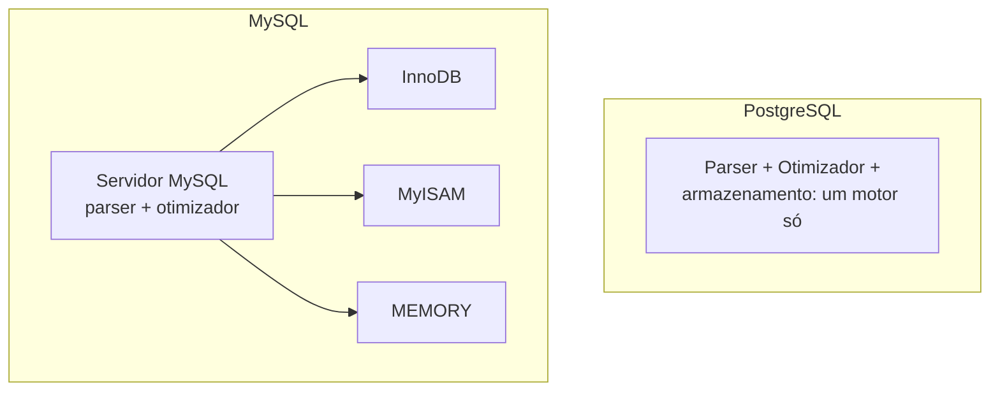
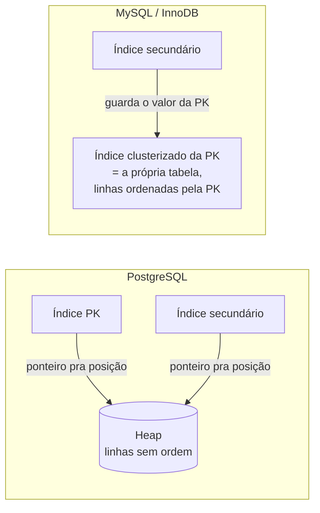

# Postgres vs MySQL: arquitetura interna

PostgreSQL e MySQL são os dois bancos relacionais de código aberto mais usados no mundo. Os dois falam [SQL](/labs/web-dev/banco-de-dados/01-sql/), os dois oferecem [ACID](/labs/web-dev/banco-de-dados/03-acid/), os dois são [CP/EC](/labs/web-dev/banco-de-dados/06-escolha-de-banco-de-dados/) na classificação de PACELC. Para a maioria dos sistemas web, qualquer um dos dois resolve. Mas por baixo do capô eles tomam decisões de arquitetura bem diferentes, e essas decisões explicam por que cada um se sai melhor em cenários específicos.

Essa comparação cai bastante em entrevista de backend, geralmente na forma "qual você usaria e por quê". A resposta boa não é decorar que "Postgres é mais robusto" ou "MySQL é mais rápido" (as duas frases estão erradas hoje). É entender o que muda na estrutura interna e quando isso pesa. Esta nota compara a arquitetura dos dois, não faz ranking.

## Modelo de execução

A primeira diferença aparece antes mesmo de olhar como os dados são guardados: é como o banco processa uma query.

O **PostgreSQL** tem um motor único e integrado. O parser, o otimizador e a parte que lê e escreve os dados no disco são um sistema só, pensado para funcionar em conjunto. Você não escolhe "como" o Postgres guarda a tabela, existe um jeito só, e todo o banco é otimizado em torno dele.

O **MySQL** separa em duas camadas. Em cima fica o servidor MySQL propriamente dito: recebe a conexão, faz o parsing do SQL, planeja a query. Embaixo ficam os **storage engines**, componentes plugáveis que cuidam de guardar e recuperar os dados de fato. O MySQL suporta vários:

- **InnoDB**: a engine padrão desde o MySQL 5.5. Transacional, com suporte a ACID, chave estrangeira e recuperação de falha. É a que praticamente todo mundo usa hoje.
- **MyISAM**: a engine antiga padrão. Rápida para leitura pura, mas sem transações e sem recuperação confiável de crash. Basicamente legado.
- **MEMORY**: guarda a tabela inteira na RAM, some quando o servidor reinicia. Usada para dados temporários.

A consequência prática: no MySQL, o comportamento transacional depende da engine da tabela. Uma tabela InnoDB tem transação, uma tabela MyISAM não, no mesmo banco. No Postgres esse tipo de pegadinha não existe, o comportamento é uniforme para qualquer tabela.

Na prática moderna quase ninguém troca de engine, InnoDB virou o padrão de fato. Mas a arquitetura de camada separada é o motivo de várias outras diferenças que aparecem abaixo.

## Modelo de processos e threads

Quando um cliente abre uma conexão, o banco precisa de algum recurso do sistema operacional para atender aquela conexão. Aqui os dois divergem de novo.

O **PostgreSQL** cria **um processo do sistema operacional para cada conexão**. Abriu 200 conexões, tem 200 processos `postgres` rodando na máquina. Cada processo é isolado: se um quebra feio, não derruba os outros.

O **MySQL** usa **uma thread para cada conexão**, todas dentro de um único processo `mysqld`. Threads são mais baratas de criar que processos e compartilham memória entre si com mais facilidade.

Isso tem um efeito direto no dia a dia: no Postgres, cada conexão custa mais memória e é mais cara de abrir. Por isso, aplicações que abrem e fecham conexão o tempo todo (ou que rodam em muitas instâncias, cada uma com seu pool) costumam colocar um **pooler de conexões** na frente do Postgres, tipo o PgBouncer, que mantém um número fixo de conexões reais com o banco e multiplexa as conexões da aplicação em cima delas. No MySQL a pressão por um pooler externo é menor, embora pools no lado da aplicação continuem sendo boa prática nos dois.

## Onde os dados moram no disco

Essa é a diferença mais estrutural entre os dois, e a que mais explica o resto.

### PostgreSQL: heap + índices separados

O Postgres guarda as linhas de uma tabela numa estrutura chamada **heap** ("monte", "pilha"). É um arquivo onde as linhas são escritas na ordem em que chegam, sem ordenação nenhuma. Inseriu uma linha, ela vai para o primeiro espaço livre que aparecer.

Os índices, incluindo o da chave primária, são estruturas **totalmente à parte**. Um índice no Postgres guarda o valor indexado mais um ponteiro para a posição física da linha na heap (chamado de TID, tipo "página 5, item 3").

Ler uma linha pela chave primária no Postgres são sempre dois passos: procura no índice, acha o ponteiro, vai na heap buscar a linha.

O Postgres oferece vários tipos de índice para casos diferentes:

- **B-tree**: o padrão, para igualdade e ordenação (`=`, `<`, `>`, `BETWEEN`, `ORDER BY`)
- **Hash**: só igualdade, mais compacto
- **GIN**: para dados que têm vários valores dentro de um campo (arrays, JSONB, busca full-text)
- **GiST** e **BRIN**: para dados geométricos, geográficos e faixas de valores em tabelas gigantes

### MySQL/InnoDB: a tabela é o índice

No InnoDB, a tabela **é** a árvore B da chave primária. As linhas ficam guardadas dentro das folhas dessa árvore, fisicamente ordenadas pela chave primária. Isso se chama **índice clusterizado** (clustered index).

Não existe "a tabela de um lado e o índice primário do outro", eles são a mesma coisa. Ler uma linha pela chave primária é um passo só: desce a árvore, a linha está lá na folha.

Os **índices secundários** (qualquer índice que não seja a PK) funcionam diferente: em vez de apontar para uma posição no disco, eles guardam o **valor da chave primária** da linha. Então buscar por um índice secundário são dois passos: acha a PK no índice secundário, depois desce a árvore da PK para pegar a linha inteira.

### O que isso muda

- **Leitura por faixa na chave primária** (ex: "pedidos com id entre 1000 e 2000"): o InnoDB voa, porque as linhas estão fisicamente juntas e em ordem, é leitura sequencial. No Postgres, cada linha pode estar em qualquer lugar da heap, então pode virar um monte de leitura aleatória de disco (o Postgres tem otimizações para isso, tipo o bitmap heap scan, mas o ponto de partida é pior).
- **Escolha da chave primária no InnoDB importa muito**. Como toda linha e todo índice secundário carregam a PK, uma PK grande (tipo um UUID textual) infla a tabela inteira e todos os índices. Por isso a recomendação clássica no MySQL de usar um inteiro auto-incremento como PK. No Postgres a PK é só mais um índice, o impacto de uma PK grande é bem menor.
- **Índice secundário no InnoDB tem um pulo a mais** (índice secundário → PK → linha), enquanto no Postgres é índice → heap direto.

## MVCC e versões de linha

A nota de [Controle de Concorrência](/labs/web-dev/banco-de-dados/07-controle-de-concorrencia/) explica MVCC: em vez de travar a linha, o banco mantém **várias versões** de cada linha, e cada transação enxerga a versão que existia quando ela começou. Leitura não bloqueia escrita e vice-versa. Os dois bancos usam MVCC, mas guardam essas versões antigas em lugares diferentes.

O **PostgreSQL** guarda as versões antigas **na própria tabela**, ao lado da versão atual. Um `UPDATE` no Postgres não altera a linha no lugar: ele escreve uma linha nova e marca a antiga como obsoleta. As linhas obsoletas (chamadas de "dead tuples", tuplas mortas) continuam ocupando espaço no arquivo até alguém limpar.

Quem limpa é o **VACUUM**, rodado automaticamente pelo processo **autovacuum**. Ele varre as tabelas e libera o espaço das tuplas mortas para reuso. Isso traz dois problemas conhecidos do Postgres:

- **Table bloat**: se o autovacuum não dá conta do ritmo de `UPDATE`/`DELETE`, a tabela incha com tuplas mortas, ocupando disco e deixando as leituras mais lentas.
- **Transação longa segura o VACUUM**: se existe uma transação aberta há horas, o Postgres não pode limpar nenhuma tupla que essa transação talvez ainda precise ver. Uma única query esquecida aberta pode fazer tuplas mortas se acumularem no banco inteiro.

O **MySQL/InnoDB** guarda a versão atual na tabela (no índice clusterizado) e manda o **histórico** para um lugar separado, o **undo log**. Quando uma transação precisa enxergar uma versão antiga, o InnoDB pega a versão atual e "desfaz" as mudanças aplicando o undo log de trás para frente até chegar na versão certa.

Uma **purge thread** limpa as entradas de undo que nenhuma transação mais precisa. O InnoDB também sofre com transação longa (o undo log cresce e não pode ser limpo), mas o efeito de bloat na tabela principal é menor, porque o lixo fica concentrado no undo, não espalhado pelas tabelas.

## Logs de escrita

Todo banco ACID escreve num log antes de confirmar uma mudança, para conseguir recuperar depois de uma queda de energia (é o **D** de Durabilidade em [ACID](/labs/web-dev/banco-de-dados/03-acid/)). O número e o papel desses logs difere bastante.

O **PostgreSQL** tem **um log só**: o **WAL** (Write-Ahead Log). Toda mudança é escrita nele antes de ir para os arquivos de dados. O mesmo WAL serve para dois propósitos:

- **Recuperação de crash**: depois de uma queda, o Postgres relê o WAL e reaplica o que faltou (isso é "redo").
- **Replicação**: as réplicas recebem o WAL do primário e o reproduzem para ficar em sincronia (a "replicação baseada em WAL" citada na nota de [Escolha de Banco de Dados](/labs/web-dev/banco-de-dados/06-escolha-de-banco-de-dados/)).

O **MySQL/InnoDB** tem **três logs** com papéis distintos:

| Log      | Para que serve                                                                                                                                              |
| -------- | ----------------------------------------------------------------------------------------------------------------------------------------------------------- |
| Undo log | Desfazer transações abortadas e servir as leituras MVCC (visto na seção anterior)                                                                           |
| Redo log | Recuperação de crash: reaplica o que estava confirmado mas ainda não tinha ido para o disco                                                                 |
| Binlog   | Fica na camada do servidor MySQL (não da engine). Registra as mudanças em ordem, e é o que alimenta a replicação e ferramentas de CDC (Change Data Capture) |

Um efeito colateral do modelo do MySQL é mais **write amplification**: uma única transação pode escrever no redo log, no undo log e no binlog. O modelo de log único do Postgres é mais simples nesse aspecto, embora o WAL também acabe sendo escrito e reescrito bastante por causa de um detalhe chamado full-page writes.

## Processos de background

Os dois bancos rodam tarefas de manutenção em segundo plano, mas de forma coerente com o modelo de processos vs threads de lá de cima.

O **PostgreSQL** usa **processos dedicados do sistema operacional**, cada um com seu nome, visíveis num `ps` ou `htop`:

- **autovacuum**: limpa as tuplas mortas (visto no MVCC)
- **checkpointer**: de tempos em tempos, garante que tudo que estava só no WAL foi de fato gravado nos arquivos de dados
- **WAL writer**: escreve o WAL da memória para o disco
- **background writer**: vai empurrando páginas modificadas da memória para o disco aos poucos, para o checkpoint não ter um pico gigante

O **MySQL/InnoDB** faz o equivalente com **threads dentro do processo `mysqld`**:

- **master thread**: coordena as tarefas periódicas da engine
- **page cleaner**: equivalente ao background writer, empurra páginas sujas para o disco
- **log writer**: escreve o redo log no disco
- **purge thread**: limpa o undo log (visto no MVCC)

Os papéis são quase os mesmos, o que muda é a embalagem: processos isolados no Postgres, threads compartilhando memória no MySQL.

## O que isso muda na escolha

Voltando ao ponto do começo: os dois são relacionais, ACID e CP/EC. A arquitetura interna raramente é o fator decisivo, mas quando o sistema tem um perfil específico, ela ajuda a inclinar a balança:

- **Muita escrita e `UPDATE` em cima das mesmas linhas**: o modelo de undo log do InnoDB tende a sofrer menos com bloat que a heap do Postgres, que depende do autovacuum acompanhar o ritmo.
- **Transações longas ou relatórios pesados junto com carga transacional**: os dois sofrem, mas vale saber que no Postgres uma transação esquecida trava o VACUUM do banco inteiro.
- **Muitos índices secundários e leitura por faixa de PK**: o índice clusterizado do InnoDB favorece leitura sequencial por PK; a escolha da PK vira uma decisão importante.
- **Milhares de conexões**: o modelo de processo por conexão do Postgres pesa mais, e quase sempre pede um PgBouncer na frente.
- **Precisa de tipos de índice especializados** (JSONB com GIN, [busca full-text](/labs/web-dev/banco-de-dados/12-busca-full-text-search/), dados geográficos com PostGIS): o Postgres tem um leque bem maior aqui.

Para o resto, que é a maioria dos sistemas CRUD, os dois entregam bem, e a escolha costuma cair no que o time já conhece, no que o provedor de nuvem oferece melhor, e no ecossistema de ferramentas em volta.

## Referências

- [PostgreSQL Index vs InnoDB Index (Severalnines)](https://severalnines.com/blog/postgresql-index-vs-innodb-index-understanding-differences)
- [Clustered indexes are index-organized tables (Use The Index, Luke!)](https://use-the-index-luke.com/sql/clustering/index-organized-clustered-index)
