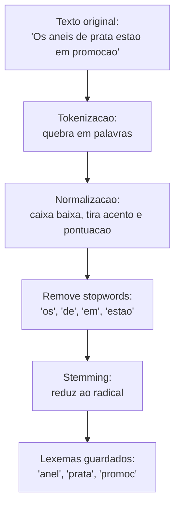
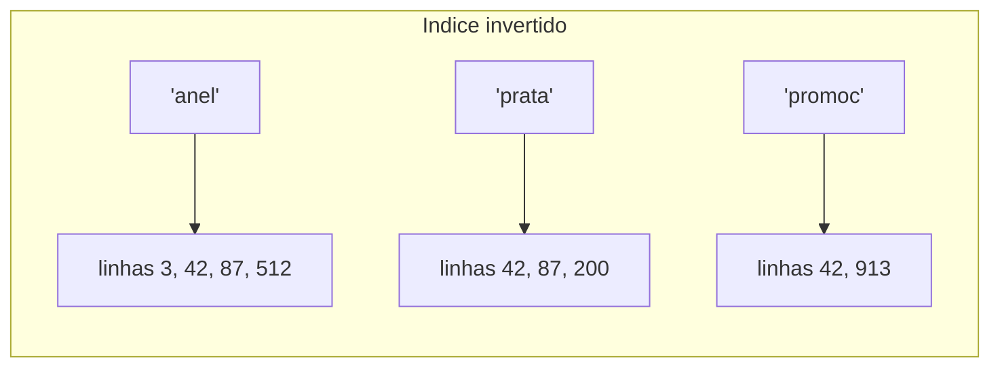

# Busca Full-Text

Quase todo sistema tem uma caixa de busca: procurar um produto pelo nome, um artigo pelo assunto, um chamado pela descrição. A primeira solução que quase todo mundo escreve é um `LIKE`:

```sql
SELECT * FROM produtos WHERE nome LIKE '%anel%';
```

Funciona com 100 linhas. Com 1 milhão, a busca começa a travar, e o usuário que digitou "aneis" ou "Anél" não acha nada. Full-Text Search (busca textual, ou FTS) é o recurso que os bancos relacionais oferecem justamente para esse problema: buscar texto em linguagem natural, rápido e com noção de relevância.

Esta nota usa PostgreSQL e MySQL nos exemplos, que são os dois bancos cobertos na nota de [Postgres vs MySQL](/labs/web-dev/banco-de-dados/11-postgres-vs-mysql/).

## Por que LIKE não escala para busca textual

O `LIKE` resolve alguns casos bem, mas some no momento em que você precisa procurar uma palavra no meio de um texto grande.

**O curinga à esquerda mata o índice.** Um índice B-tree (o padrão, explicado na seção de índices da nota de [SQL](/labs/web-dev/banco-de-dados/01-sql/)) organiza os valores em ordem alfabética, igual a lista telefônica. Ele serve para achar coisas que _começam_ com um trecho:

```sql
-- usa índice: procura tudo que começa com "anel"
SELECT * FROM produtos WHERE nome LIKE 'anel%';

-- NÃO usa índice: "anel" pode estar em qualquer posição
SELECT * FROM produtos WHERE nome LIKE '%anel%';
```

No segundo caso o banco não tem por onde começar a busca no índice, então ele lê a tabela inteira linha por linha (o famoso _full scan_ ou _sequential scan_) e testa o padrão em cada uma. Quanto maior a tabela, mais lento, de forma linear.

**Não existe relevância.** O `LIKE` responde sim ou não. Se você busca "anel de prata" e 800 produtos batem, os 800 voltam sem nenhuma ordem de importância. O produto cujo nome é exatamente "Anel de prata" aparece misturado com "Kit de limpeza para anel e outras joias de prata".

**Não entende a língua.** Para o `LIKE`, "corrida", "correndo" e "correr" são três strings sem relação nenhuma. "Café" e "cafe" também. Quem busca quer o significado, não a grafia exata.

Dá para contornar em parte (guardar tudo em caixa baixa, sem acento, numa coluna auxiliar, e usar `LIKE`), mas você acaba reimplementando na mão, pela metade, o que o Full-Text Search já faz pronto.

## O que é Full-Text Search

Full-Text Search é um conjunto de recursos do banco para indexar e consultar texto do jeito que um mecanismo de busca faz: ele processa o texto antes de guardar, monta uma estrutura de índice própria para palavras, e na hora da consulta compara palavra com palavra, não string com string.

O ganho tem três partes:

- **Velocidade**: a busca passa a usar um índice feito para texto, então não varre a tabela
- **Relevância**: o resultado vem ordenado por quanto cada linha combina com a busca
- **Linguagem**: plural, conjugação, acento e palavras irrelevantes são tratados automaticamente, de acordo com o idioma

Onde isso costuma ser usado: busca de produtos num e-commerce, busca de artigos num blog ou base de conhecimento, busca em comentários, busca em documentação. Para a maioria desses casos, o Full-Text Search nativo do banco resolve sem precisar subir um Elasticsearch do lado.

## Como o texto vira índice de busca

Antes de guardar o texto no índice, o banco passa ele por uma esteira de processamento. O objetivo é transformar uma frase escrita por gente numa lista enxuta de "unidades de significado".



### Tokenização e normalização

**Tokenização** é quebrar o texto em pedaços, normalmente palavras. "Anel de prata" vira `["Anel", "de", "prata"]`.

**Normalização** é padronizar cada pedaço: passar para caixa baixa, remover acentos, tirar pontuação. Assim "Café", "café" e "cafe" viram todos o mesmo token `cafe`, e a busca por qualquer uma das três formas encontra as outras.

Esse passo depende do **idioma**. As regras de plural, acento e o que conta como palavra mudam entre português e inglês, então você diz ao banco qual dicionário usar (no PostgreSQL, `'portuguese'`, `'english'`, etc.).

### Stopwords

Stopwords são as palavras que aparecem em quase toda frase e por isso não ajudam a distinguir um texto do outro: "a", "o", "de", "para", "que", "em". O Full-Text Search descarta essas palavras do índice e também da busca. Isso deixa o índice menor e evita que uma busca por "anel de prata" gaste esforço casando o "de".

### Stemming e lexemas

**Stemming** é reduzir a palavra ao seu radical. "Correndo", "correu", "corrida" e "correr" todas viram algo como `corr`. O resultado desse processo é chamado de **lexema**: a forma canônica que representa todas as variações daquela palavra.

Na prática, quem cadastra um produto como "Anéis de prata" e quem busca por "anel prata" acabam falando a mesma língua depois do stemming, porque os dois lados são reduzidos aos mesmos lexemas (`anel`, `prata`).

### Índice invertido

O coração do Full-Text Search é o **índice invertido**. Em vez de guardar "linha 42 tem o texto tal", ele guarda o contrário: para cada lexema, a lista de linhas onde ele aparece.



É a mesma ideia do índice remissivo no fim de um livro: você não lê o livro inteiro procurando a palavra "recursão", você vai no índice, acha "recursão: p. 45, 90" e pula direto.

Quando alguém busca "anel prata", o banco pega a lista de `anel` (3, 42, 87, 512) e a lista de `prata` (42, 87, 200) e cruza: as linhas 42 e 87 têm as duas palavras. Isso é uma operação de interseção de listas, muito mais barata que ler cada linha da tabela e checar o texto. É por isso que uma busca full-text num acervo de milhões de documentos responde em milissegundos.

## Ranking de relevância

Achar as linhas que batem é metade do trabalho. A outra metade é ordenar por relevância, para o resultado mais útil vir primeiro.

O banco calcula uma nota para cada resultado levando em conta coisas como:

- **Frequência**: quantas vezes o termo buscado aparece naquela linha
- **Proximidade**: se os termos buscados aparecem juntos ou espalhados
- **Peso por campo**: um match no título pode valer mais que um match no corpo do texto

No **PostgreSQL** isso é feito com as funções `ts_rank` e `ts_rank_cd` (a versão _cover density_, que dá mais peso quando os termos aparecem próximos). Dá para marcar partes do texto com pesos `A`, `B`, `C`, `D` usando `setweight` (por exemplo, título com peso `A`, descrição com peso `B`).

No **MySQL**, o próprio `MATCH ... AGAINST` já devolve um número de relevância quando você o usa na lista do `SELECT`:

```sql
SELECT nome, MATCH(nome, descricao) AGAINST('anel prata') AS relevancia
FROM produtos
WHERE MATCH(nome, descricao) AGAINST('anel prata')
ORDER BY relevancia DESC;
```

## Full-Text Search no PostgreSQL

### tsvector e tsquery

O PostgreSQL tem dois tipos de dado próprios para isso:

- **`tsvector`**: o texto já processado (tokenizado, normalizado, sem stopwords, com stemming). É o documento pronto para indexar.
- **`tsquery`**: a busca já processada, com os operadores de combinação (`&` para "e", `|` para "ou", `!` para "não").

```sql
-- transforma texto em tsvector usando o dicionario de portugues
SELECT to_tsvector('portuguese', 'Os aneis de prata estao em promocao');
-- resultado: 'anel':2 'prat':4 'promoca':7

-- transforma a busca em tsquery
SELECT to_tsquery('portuguese', 'anel & prata');
```

O operador de match é o `@@`. Ele responde se um `tsvector` satisfaz um `tsquery`:

```sql
SELECT *
FROM produtos
WHERE to_tsvector('portuguese', nome || ' ' || descricao)
      @@ to_tsquery('portuguese', 'anel & prata');
```

Para não obrigar o usuário a montar o `tsquery` na mão, existem funções que recebem texto solto:

| Função                 | Serve para                                                      |
| ---------------------- | --------------------------------------------------------------- |
| `plainto_tsquery`      | Texto simples, junta todas as palavras com "e"                  |
| `phraseto_tsquery`     | Trata a entrada como frase, respeitando a ordem das palavras    |
| `websearch_to_tsquery` | Sintaxe estilo Google: aspas para frase, `-` para excluir, `or` |

### Coluna gerada e índice GIN

Recalcular o `to_tsvector(...)` a cada consulta é desperdício. O padrão hoje é guardar o `tsvector` numa **coluna gerada**, que o banco preenche sozinho a cada `INSERT` e `UPDATE`:

```sql
ALTER TABLE produtos
ADD COLUMN busca tsvector
GENERATED ALWAYS AS (
    to_tsvector('portuguese', coalesce(nome, '') || ' ' || coalesce(descricao, ''))
) STORED;
```

O `coalesce` troca `NULL` por string vazia, senão um campo nulo zeraria o `tsvector` inteiro.

Em cima dessa coluna você cria um índice **GIN** (Generalized Inverted Index), que é a implementação do índice invertido no PostgreSQL:

```sql
CREATE INDEX idx_produtos_busca ON produtos USING GIN (busca);
```

A partir daí a consulta fica limpa e rápida:

```sql
SELECT nome
FROM produtos
WHERE busca @@ websearch_to_tsquery('portuguese', 'anel prata')
ORDER BY ts_rank(busca, websearch_to_tsquery('portuguese', 'anel prata')) DESC
LIMIT 20;
```

Existe também o índice **GiST** para `tsvector`. Ele é menor e mais rápido para escrever, mas mais lento e menos preciso na busca. Para busca de texto o GIN é a escolha padrão; o GiST só compensa em tabelas com escrita muito pesada e poucos dados.

### Ordenando por relevância

O `ORDER BY ts_rank(...)` resolve a ordenação, mas tem um detalhe importante: o `ts_rank` precisa calcular a nota de cada linha que bateu, e isso fica caro quando o `WHERE` retorna muitos milhares de resultados. Sempre use `LIMIT`, e adicione um critério de desempate (por exemplo `, id DESC`) para a ordem ser estável entre execuções.

## Full-Text Search no MySQL

### Índice FULLTEXT e MATCH ... AGAINST

No MySQL você declara um índice do tipo `FULLTEXT` sobre uma ou mais colunas de texto:

```sql
CREATE TABLE produtos (
    id        INT AUTO_INCREMENT PRIMARY KEY,
    nome      VARCHAR(200),
    descricao TEXT,
    FULLTEXT idx_busca (nome, descricao)
);

-- em tabela que ja existe
ALTER TABLE produtos ADD FULLTEXT idx_busca (nome, descricao);
```

A busca é feita com `MATCH ... AGAINST`, onde as colunas do `MATCH` precisam ser exatamente as do índice:

```sql
SELECT nome
FROM produtos
WHERE MATCH(nome, descricao) AGAINST('anel prata');
```

O `FULLTEXT` funciona nas engines InnoDB (padrão hoje) e MyISAM. A diferença de engine no MySQL está explicada na nota de [Postgres vs MySQL](/labs/web-dev/banco-de-dados/11-postgres-vs-mysql/).

### Modos de busca

O `AGAINST` aceita um modificador que muda como a busca é interpretada:

- **Natural language mode** (padrão): trata a entrada como uma frase em linguagem natural e ordena por relevância. Um detalhe que pega muita gente: se a palavra buscada aparece em mais da metade das linhas, o MySQL considera ela irrelevante e não retorna nada (o "50% threshold", só no InnoDB é diferente).
- **Boolean mode** (`IN BOOLEAN MODE`): habilita operadores dentro da string de busca. `+anel` obriga a palavra, `-prata` exclui, `anel*` casa por prefixo, `"anel de prata"` busca a frase exata.

```sql
SELECT nome
FROM produtos
WHERE MATCH(nome, descricao)
      AGAINST('+anel -banhado' IN BOOLEAN MODE);
```

- **Query expansion** (`WITH QUERY EXPANSION`): faz a busca duas vezes. Na primeira pega os resultados, na segunda usa as palavras mais comuns desses resultados para ampliar a busca. Útil quando o usuário busca um termo genérico, arriscado porque traz bastante ruído.

Para idiomas sem espaço entre palavras (japonês, chinês), o MySQL tem o parser **ngram**, que quebra o texto em blocos de N caracteres em vez de por palavra.

## Comparando na prática com EXPLAIN ANALYZE

A melhor forma de enxergar a diferença é pedir ao banco o plano de execução com `EXPLAIN ANALYZE`, que roda a query de verdade e mostra o tempo e a estratégia usada.

Com `LIKE '%anel%'` num PostgreSQL, o plano mostra um `Seq Scan`:

```text
Seq Scan on produtos  (cost=0.00..324.00 rows=202 ...) (actual time=0.031..4.446 rows=184 loops=1)
  Filter: ((nome)::text ~~ '%anel%'::text)
  Rows Removed by Filter: 9816
Execution Time: 4.492 ms
```

Três sinais de que a busca é ineficiente:

- **`Seq Scan`**: o banco leu a tabela inteira
- **`Rows Removed by Filter: 9816`**: testou 10 mil linhas para aproveitar 184
- **`Execution Time`**: 4,5 ms com 10 mil linhas. Multiplique por 100 quando a tabela crescer

Com a coluna `tsvector` indexada e a mesma busca, o plano passa a usar um `Bitmap Index Scan` sobre o índice GIN, o `Rows Removed by Filter` some ou fica minúsculo, e o `Execution Time` para de crescer junto com a tabela, porque o trabalho agora é proporcional ao número de resultados, não ao tamanho total.

## LIKE vs Full-Text Search: quando usar cada um

Full-Text Search não aposenta o `LIKE`, os dois resolvem coisas diferentes.

| Situação                                           | Use                      |
| -------------------------------------------------- | ------------------------ |
| Buscar por prefixo (`nome LIKE 'anel%'`)           | `LIKE` com índice B-tree |
| Match exato ou quase exato numa coluna curta       | `LIKE` ou `=`            |
| Filtro por padrão simples (e-mails `%@gmail.com`)  | `LIKE`                   |
| Busca em texto livre, com relevância               | Full-Text Search         |
| Busca que precisa entender plural, acento, radical | Full-Text Search         |
| Caixa de busca de produto/artigo/comentário        | Full-Text Search         |

## Limitações e quando partir para um motor de busca dedicado

O Full-Text Search do banco tem fronteiras claras:

- **Não corrige erro de digitação.** Quem busca "anle" não acha "anel". Isso é busca _fuzzy_, resolvida por outro recurso: no PostgreSQL, a extensão `pg_trgm`, que compara trechos de 3 letras (trigramas) e mede semelhança. Dá para combinar `pg_trgm` com Full-Text Search na mesma tabela.
- **Não faz busca semântica.** "Calçado para corrida" não encontra um produto descrito como "tênis de performance" se as palavras não batem. Busca por significado depende de _embeddings_ (vetores), que é outro assunto, geralmente com a extensão `pgvector` ou um banco vetorial.
- **Não substitui um motor de busca em escala.** Quando o volume de documentos, a carga de escrita ou os requisitos de busca (facetas, agregações, autocomplete sofisticado, realce de trechos em várias línguas) crescem muito, ferramentas como Elasticsearch e OpenSearch fazem isso melhor, ao custo de manter mais um sistema e sincronizar os dados.

A regra prática: comece pelo Full-Text Search nativo. Ele cobre a maioria dos casos com zero infraestrutura nova. Só migre para um motor dedicado quando bater num limite concreto, não por precaução.

## Referências

- [O QUE NINGUÉM TE ENSINOU SOBRE BUSCAS INTELIGENTES NO BANCO DE DADOS! (Renato Augusto)](https://youtu.be/UYOr-rpQs1I)
- [PostgreSQL: Full Text Search (documentação oficial)](https://www.postgresql.org/docs/current/textsearch.html)
- [MySQL: Full-Text Search Functions (documentação oficial)](https://dev.mysql.com/doc/refman/8.0/en/fulltext-search.html)
