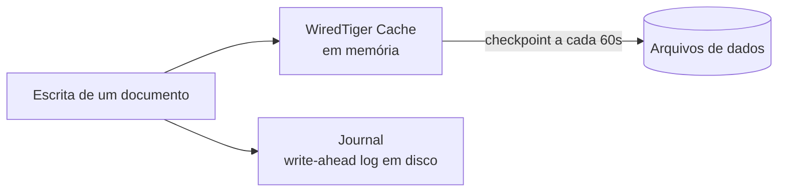
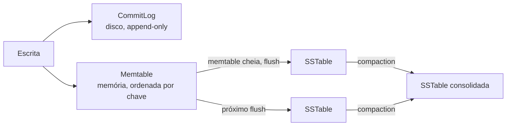

# Postgres vs MongoDB vs Cassandra: arquitetura interna

## Escolher banco é sobre a carga de trabalho, não sobre a ferramenta

A pergunta "qual desses três bancos é o melhor" não tem resposta boa, porque ela está errada desde o início. A pergunta certa é "que tipo de carga de trabalho (workload) esse dado específico tem", o mesmo raciocínio já usado em [Escolha de Banco de Dados na Prática](/labs/web-dev/banco-de-dados/06-escolha-de-banco-de-dados/).

Um exemplo real ajuda a fixar a ideia: o Next Gen Stats, o sistema que transforma o rastreamento de jogadores e bola da NFL em estatísticas ao vivo, usa os três bancos desta nota ao mesmo tempo, cada um num papel diferente:

- **MongoDB** para modelos de dado flexíveis e estatísticas derivadas, onde o formato dos dados muda com frequência
- **Cassandra** para consultas com latência previsível em escala altíssima, onde o volume de escrita é o problema
- **PostgreSQL** para cargas analíticas, onde relacionamento e consistência importam mais que velocidade de ingestão

Esse desenho tem nome: **polyglot persistence**, usar bancos diferentes para partes diferentes do mesmo sistema em vez de forçar um banco só a fazer tudo bem. Não é a escolha padrão (a maioria dos sistemas se vira bem com um banco só), mas quando aparece, geralmente é porque partes diferentes do domínio têm padrões de acesso realmente diferentes entre si.

Para entender quando cada banco se encaixa melhor, o caminho é abrir cada um por dentro e ver como ele guarda dado no disco. É isso que o resto da nota faz.

## PostgreSQL: heap e Write-Ahead Log

A arquitetura interna do PostgreSQL já tem uma nota inteira dedicada a ela, [Postgres vs MySQL: arquitetura interna](/labs/web-dev/banco-de-dados/11-postgres-vs-mysql/), então aqui vai só o recap necessário para comparar com MongoDB e Cassandra mais adiante.

O Postgres guarda as linhas de uma tabela numa estrutura chamada **heap**, sem ordenação física nenhuma. Os índices ficam totalmente separados, cada um apontando para a posição física da linha na heap. Quando uma linha é atualizada, o Postgres não sobrescreve o espaço, ele escreve uma versão nova e marca a antiga como obsoleta (é o MVCC, com as versões vivendo na própria tabela até o `autovacuum` limpar). Toda mudança passa antes por um log único, o **Write-Ahead Log (WAL)**, usado tanto para recuperação de queda quanto para replicação.

Antes de decidir como executar uma query SQL, o Postgres consulta o **query planner**: ele olha as estatísticas da tabela (quantas linhas, distribuição dos valores) e escolhe entre varrer a tabela inteira ou usar um índice, entre os vários tipos de junção disponíveis, e assim por diante. Como esse planejamento funciona e como ler o plano gerado por um `EXPLAIN` está detalhado em [Índices e Planos de Execução](/labs/web-dev/banco-de-dados/13-indices-e-planos-de-execucao/).

O resultado prático: cada escrita no Postgres é uma atualização "in place" na mesma estrutura de tabela, com o WAL garantindo que nada se perca no caminho. É um design pensado para consistência forte e transações complexas, não para ingestão bruta de volume.

## MongoDB: documentos, WiredTiger e Journal

O MongoDB guarda dados como **documentos** no formato BSON (um JSON binário, com suporte a mais tipos que o JSON puro, como datas e inteiros de 64 bits), agrupados em **coleções**. Diferente de uma tabela SQL, documentos da mesma coleção podem ter campos diferentes entre si, é o **schema flexível** que a nota de [NoSQL](/labs/web-dev/banco-de-dados/10-nosql/) já descreve na categoria "document".

Por baixo, desde a versão 3.2 o MongoDB usa o **WiredTiger** como storage engine padrão. Duas peças do WiredTiger fazem o trabalho pesado:

- **WiredTiger Cache**: uma área de memória (por padrão, metade da RAM disponível menos 1 GB, ou 256 MB, o que for maior) que guarda os documentos e índices mais acessados. Ler algo que já está no cache evita ir ao disco, então quanto mais o working set do sistema cabe no cache, mais rápido o banco responde.
- **Journal**: um write-ahead log próprio do WiredTiger. Toda escrita confirmada com a opção `j: true` é gravada no journal antes de responder ao cliente, então mesmo que o processo caia entre uma escrita e o próximo checkpoint (por padrão a cada 60 segundos), o journal tem o suficiente para reconstruir o estado. É o mesmo papel que o WAL cumpre no Postgres, só que numa engine orientada a documentos em vez de tabelas.

Réplicas do MongoDB (o **replica set**) elegem um nó primário via um algoritmo baseado em Raft, o mesmo mecanismo já citado na tabela de [Escolha de Banco de Dados na Prática](/labs/web-dev/banco-de-dados/06-escolha-de-banco-de-dados/). Só o primário aceita escritas, e os secundários replicam a partir dele.

## Cassandra: LSM tree, Memtable, SSTable e compaction

O Cassandra é um banco **wide-column** distribuído, desenhado desde a raiz para aguentar volume de escrita altíssimo espalhado por muitos nós (a categoria já apresentada em [NoSQL](/labs/web-dev/banco-de-dados/10-nosql/)). A engine por trás disso segue um modelo bem diferente do B-tree que Postgres e MongoDB usam: o **LSM tree** (Log-Structured Merge Tree).

A ideia central do LSM tree é nunca gastar tempo procurando onde uma linha já existe para atualizá-la no lugar. Toda escrita, seja um insert, um update ou um delete, vira uma escrita nova, sempre em sequência, sempre no fim de uma estrutura. O caminho de uma escrita passa por três peças:

1. **CommitLog**: antes de qualquer outra coisa, a escrita é gravada num log append-only em disco. É a garantia de durabilidade, se o nó cair um instante depois, o CommitLog tem o que precisa para recuperar o dado que ainda não tinha ido para lugar nenhum.
2. **Memtable**: em paralelo, a escrita entra numa estrutura em memória ordenada por chave, otimizada para receber volume alto rapidamente. É daqui que as leituras mais recentes são servidas.
3. **SSTable** (Sorted String Table): quando a memtable enche, ela é persistida em disco como um arquivo **imutável**, ordenado por chave. Uma vez escrita, uma SSTable nunca é alterada, só lida ou descartada.

O problema desse modelo é que, com o tempo, o mesmo dado pode acabar espalhado em várias SSTables diferentes (um update vira uma escrita nova, não uma alteração da antiga). Uma leitura, nesse cenário, pode precisar checar a memtable e várias SSTables até montar o valor mais recente. Quem resolve isso é a **compaction**: um processo em background que mescla SSTables antigas numa nova, descartando versões obsoletas e dados marcados para remoção (tombstones) pelo caminho.

Esse é o trade-off do LSM tree resumido: escrita barulhenta e sequencial, sempre rápida, mesmo sob volume gigantesco, em troca de uma leitura que pode custar mais até a compaction rodar e arrumar a casa. É basicamente o oposto do que Postgres e MongoDB fazem, os dois otimizados para atualizar um registro no lugar e ler ele de um jeito só, previsível.

Réplicas entre nós do Cassandra usam **quorum** para decidir quando uma escrita está confirmada, o mesmo mecanismo detalhado na tabela de [Escolha de Banco de Dados na Prática](/labs/web-dev/banco-de-dados/06-escolha-de-banco-de-dados/).

## Comparando os três motores de armazenamento

|                      | PostgreSQL                                 | MongoDB                             | Cassandra                                     |
| -------------------- | ------------------------------------------ | ----------------------------------- | --------------------------------------------- |
| Estrutura de dados   | Heap + índices B-tree separados            | Documentos BSON + índices B-tree    | LSM tree: Memtable + SSTables imutáveis       |
| Log de durabilidade  | WAL                                        | Journal                             | CommitLog                                     |
| Cache em memória     | `shared_buffers` do Postgres + cache do SO | WiredTiger Cache                    | A própria Memtable                            |
| Escrita favorecida   | Update in place, com versionamento MVCC    | Update in place no documento        | Append-only, nunca sobrescreve                |
| Leitura favorecida   | Direta: índice aponta pra posição na heap  | Direta: índice aponta pro documento | Pode exigir checar memtable + várias SSTables |
| Classificação PACELC | CP/EC                                      | CP/EC (ajustável)                   | AP/EL (ajustável)                             |

A linha "escrita favorecida" é a que mais explica por que cada banco existe. B-tree (Postgres, MongoDB) assume que atualizar um registro no lugar certo compensa o custo de encontrar esse lugar. LSM tree (Cassandra) assume o contrário: em volume alto, é mais barato nunca procurar nada na hora de escrever e empurrar esse custo para depois, para a compaction, rodando em background sem bloquear quem está escrevendo agora.

## Polyglot persistence na prática

Vale a pena usar mais de um banco no mesmo sistema quando partes diferentes do domínio realmente têm padrões de acesso diferentes, não porque um banco "parece mais moderno" que outro. O exemplo do Next Gen Stats no início da nota é assim: estatística derivada tem formato que muda (MongoDB), leitura em tempo real de jogadas tem que ser previsível em escala (Cassandra), relatório analítico precisa de relacionamento e agregação (Postgres). Três workloads, três motores diferentes, cada um no papel que resolve melhor.

O preço dessa escolha é operacional: mais um banco para manter no ar, mais um conjunto de métricas e alertas para observar, mais um ponto onde algo pode falhar, e a necessidade de sincronizar dado entre sistemas quando a mesma informação precisa existir em mais de um lugar (geralmente via eventos ou CDC). Para a maioria dos sistemas CRUD comuns, esse custo não se paga, um banco relacional só resolve com folga. Polyglot persistence compensa quando a diferença de workload entre as partes do sistema é grande o bastante para que forçar tudo num banco só custasse mais do que operar vários.

## Referências

- [WiredTiger Storage Engine](https://www.mongodb.com/docs/manual/core/wiredtiger/) - documentação oficial do MongoDB, inglês
- [Journaling](https://www.mongodb.com/docs/manual/core/journaling/) - documentação oficial do MongoDB, inglês
- [Storage Engine](https://cassandra.apache.org/doc/latest/cassandra/architecture/storage-engine.html) - documentação oficial do Apache Cassandra, inglês
- [Guide to the Storage Engine in Apache Cassandra](https://www.baeldung.com/cassandra-storage-engine) - Baeldung, inglês
