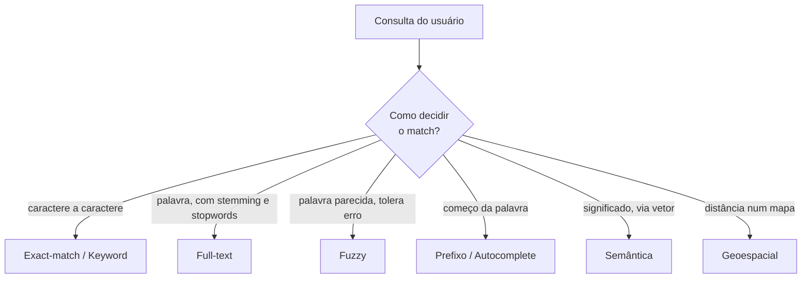
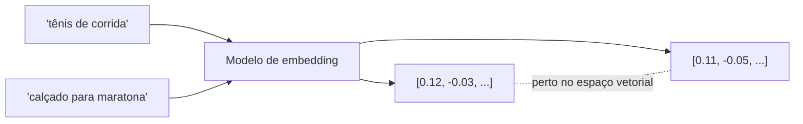

# Tipos de Busca

Para quem usa, busca é sempre a mesma coisa: uma caixinha de texto, você digita, aparecem resultados. Por baixo, "busca" é um guarda-chuva para várias técnicas bem diferentes, e a diferença entre elas está numa pergunta só: **como esse mecanismo decide o que conta como resultado?**

Um `LIKE` decide por caractere. Uma busca full-text decide por palavra, depois de normalizar plural e acento. Uma busca semântica decide por significado, comparando vetores. Uma busca geoespacial decide por distância num mapa. Saber qual técnica resolve qual problema evita dois erros comuns: usar `LIKE` onde precisava de relevância, ou montar um pipeline de IA onde um índice simples bastava.

## O que muda de um tipo de busca para outro

Dá para organizar os tipos em dois eixos.

**Eixo 1: o que é comparado.** De um lado, busca **léxica**, que compara os caracteres e as palavras como estão escritos (keyword, full-text, fuzzy, prefixo). Do outro, busca **semântica**, que compara o *significado*, representado como vetor.

**Eixo 2: quão tolerante é o match.** Match exato (exact-match, keyword), match com processamento de linguagem (full-text), match aproximado (fuzzy, prefixo), match por proximidade no espaço (geoespacial) ou no significado (semântica).

Sistemas de busca de verdade quase nunca usam um tipo só. Uma busca de e-commerce combina keyword (filtro por categoria), full-text (nome e descrição do produto), fuzzy (tolerar "camies" para "camisa"), prefixo (sugestão enquanto digita) e às vezes semântica (entender "roupa de frio"). O trabalho é juntar tudo isso e ainda entregar na ordem certa.

## Busca por palavra-chave (keyword)

Casa termos exatos da consulta contra os termos guardados no índice. Se você busca `notebook`, ele acha os documentos que têm a palavra `notebook` indexada, e pronto: sem plural, sem sinônimo, sem "quis dizer".

Por baixo costuma haver um **índice invertido**: para cada palavra, a lista de documentos onde ela aparece. Isso é o mesmo mecanismo detalhado em [Busca Full-Text](/labs/web-dev/banco-de-dados/13-busca-full-text-search/), só que a busca por palavra-chave pura não faz o pré-processamento de linguagem (stemming, remoção de stopwords) antes de indexar.

Funciona bem para campos controlados: tags, categorias, status, rótulos que vêm de uma lista fechada. Ali você não quer que o mecanismo "interprete" nada, quer o valor batido.

## Busca full-text

É a busca por texto livre com noção de relevância. Antes de indexar, o texto passa por uma esteira: quebra em palavras (tokenização), padroniza (caixa baixa, sem acento), joga fora palavras vazias como "de" e "a" (stopwords) e reduz cada palavra ao radical (stemming), de modo que "corrida", "correndo" e "correr" viram a mesma coisa. Na consulta, o resultado sai ordenado por quanto cada documento combina com o que foi buscado.

Esse tipo tem nota própria, com exemplos em PostgreSQL e MySQL: [Busca Full-Text](/labs/web-dev/banco-de-dados/13-busca-full-text-search/). Vale a regra de lá: para a maioria das caixas de busca (produto, artigo, comentário, documentação), o full-text nativo do banco resolve sem subir infraestrutura nova.

## Busca semântica

Aqui a comparação deixa de ser sobre palavras e passa a ser sobre significado. Um modelo transforma cada texto num **embedding**: um vetor de centenas ou milhares de números que posiciona aquele texto num espaço onde coisas parecidas ficam perto umas das outras. "Calçado para corrida" e "tênis de performance" geram vetores próximos mesmo sem uma palavra em comum.

A busca então vira um problema de geometria: dado o vetor da consulta, ache os vetores mais próximos (a distância mais usada é a de cosseno). Comparar a consulta com todos os vetores um a um fica caro rápido, então na prática se usa **busca aproximada de vizinhos** (ANN, *approximate nearest neighbor*), com índices como HNSW ou IVF que trocam um pouco de precisão por muita velocidade.

Onde isso roda: a extensão `pgvector` no Postgres, bancos vetoriais dedicados, os Vector Sets do Redis (veja [Casos de Uso do Redis](/labs/web-dev/escalabilidade/09-casos-de-uso-do-redis/)). O custo é ter um modelo de embedding no caminho (para indexar e para consultar) e mais um índice para manter.

## Busca híbrida

Keyword é preciso com termo exato (um código de erro, um SKU, uma sigla) e péssimo com sinônimo. Semântica é o contrário: entende a intenção, mas erra em identificador literal. Busca híbrida roda os dois em paralelo e junta os resultados.

O problema é o "junta". A pontuação da busca textual (algoritmo BM25) não tem teto e a da busca vetorial (similaridade de cosseno) fica entre 0 e 1. São escalas diferentes, então somar os dois números não faz sentido.

A solução usual é o **Reciprocal Rank Fusion (RRF)**: em vez de somar as *pontuações*, ele soma as *posições*. Cada documento ganha, em cada lista, uma nota de `1 / (posição + k)` (com `k` sendo uma constante pequena, tipo 60), e a nota final é a soma dessas frações. Quem aparece bem colocado nas duas listas sobe; quem aparece só numa, mas no topo, ainda tem chance. RRF é o que Elasticsearch, OpenSearch, Weaviate e o Azure AI Search usam para isso.

Um passo que costuma vir depois: **reranking**. Você recupera uns 50 ou 100 candidatos rápido (keyword + semântica + RRF) e passa esse punhado por um modelo mais caro e mais preciso, que reordena só essa lista curta. Segundo quem trabalha com isso, acertar o reranking rende mais do que adicionar mais um método de recuperação.

O custo da busca híbrida é honesto: mais peças, mais latência, e um espaço de testes bem maior, porque agora "a busca está ruim" pode ser o BM25, o embedding, a fusão ou o reranker.

## Busca por prefixo e autocomplete

É a busca que responde enquanto a pessoa ainda está digitando: você tecla "note" e já aparecem "notebook", "notebook gamer", "notebook usado". O match é pelo começo da palavra ou da frase.

Implementações comuns: um índice de prefixo, **edge n-grams** (indexar "n", "no", "not", "note", "noteb"... para cada termo) ou estruturas de árvore tipo *trie*. Bancos e motores de busca costumam ter um recurso pronto para isso (o Postgres faz prefixo com `LIKE 'note%'` usando índice B-tree; motores de busca têm "completion suggesters").

O cuidado principal é de performance: cada tecla dispara uma consulta nova, então isso precisa ser barato e rápido, e normalmente tem *debounce* no front-end para não consultar a cada caractere.

## Busca fuzzy

Fuzzy é a busca que perdoa erro de digitação. Quem procura "aneu" ainda acha "anel"; quem digita "recife" com o dedo trocado ainda chega a "Recife".

As duas abordagens mais comuns:

- **Distância de edição (Levenshtein)**: conta quantas inserções, remoções ou trocas de letra separam duas palavras. "anel" e "aneu" têm distância 1. Você define um limite (aceitar distância até 2, por exemplo).
- **Trigramas / n-gramas**: quebra cada palavra em trechos de 3 letras (`anel` vira `ane`, `nel`) e mede quantos trechos as duas palavras têm em comum. É como o Postgres faz com a extensão `pg_trgm`.

Fuzzy resolve entrada suja de gente, mas tem um limite: distância de edição alta demais começa a casar palavras que não têm nada a ver, então costuma ser combinada com full-text, não usada sozinha.

## Busca exact-match

Achar um valor exato armazenado: um username, um e-mail, um SKU, um ID de pedido, um código de status. Não é bem "busca" no sentido de relevância, é uma consulta de igualdade (`WHERE email = 'ana@exemplo.com'`) apoiada num índice.

O que diferencia do keyword é que aqui o valor **não passa por análise nenhuma**: nada de caixa baixa, nada de stemming, nada de tokenização. `SKU-001` e `sku 001` são valores diferentes e devem continuar diferentes.

O erro clássico é jogar esse caso no mesmo pipeline da busca textual. Se o campo `email` for tratado como texto livre, uma busca por `ana@exemplo.com` pode ser tokenizada em `ana` e `exemplo`, e aí você recebe todo mundo que tem "ana" em algum lugar. E-mail, documento, código: campo de igualdade, índice normal, fora do motor de busca.

## Busca geoespacial

Responde perguntas sobre posição: "restaurantes num raio de 2 km", "todos os imóveis dentro deste bairro", "qual a loja mais próxima". O match é por distância ou por relação espacial (dentro de, cruza com, contém).

Como isso é representado e indexado:

- **Coordenadas** (latitude, longitude) por ponto.
- **Geohash**: codifica uma coordenada numa string curta, onde locais próximos compartilham o prefixo, o que permite buscar "por perto" com uma consulta de prefixo.
- **Bounding box**: um retângulo (mín/máx de lat e long) usado como filtro grosseiro antes do cálculo fino de distância.
- **Índices espaciais**: R-tree, o índice GiST do PostGIS no Postgres, os comandos `GEOADD` / `GEOSEARCH` do Redis.

Um banco relacional com PostGIS já cobre a maioria dos casos de "perto de mim". Volumes muito grandes ou consultas geográficas complexas (rotas, sobreposição de polígonos) é que puxam para ferramentas especializadas.

## Busca em linguagem natural

O usuário escreve o pedido em linguagem comum ("tênis de corrida masculino abaixo de 300 reais, entrega rápida") e um LLM traduz isso na consulta estruturada correspondente: os termos para o full-text, os filtros (`preco < 300`, `categoria = 'corrida'`, `genero = 'masculino'`), a ordenação.

É uma camada por cima, não um tipo novo de match: embaixo continuam rodando keyword, full-text, filtros e às vezes semântica. É uma capacidade recente, que vários produtos de busca passaram a oferecer em 2025 e 2026, e ainda tem os problemas esperados de LLM no caminho: interpretar a intenção errado, custo por consulta e latência maior. Serve bem quando os filtros são muitos e o usuário não quer mexer em dez dropdowns.

## Combinando tipos na arquitetura

Na prática, você raramente escolhe *um* tipo. Escolhe uma combinação e decide onde cada parte mora:

| Precisa de | Costuma morar em |
| --- | --- |
| Filtro exato, igualdade, range | O próprio banco relacional, com índice |
| Full-text em português, relevância | Postgres (`tsvector` + GIN) ou MySQL (`FULLTEXT`) |
| Busca semântica / vetorial | `pgvector` no Postgres, banco vetorial, Vector Sets no Redis |
| Autocomplete sofisticado, facetas, realce, fuzzy em escala | Motor dedicado: Elasticsearch, OpenSearch, Typesense, Meilisearch, Algolia |
| Geoespacial | PostGIS no Postgres, comandos GEO do Redis |

Quando a busca vive num sistema separado do banco (um Elasticsearch ao lado do Postgres), aparece o problema de **sincronização**: manter o índice de busca atualizado em relação à fonte de verdade, normalmente via um fluxo de eventos ou captura de mudanças (veja [Outbox Pattern](/labs/web-dev/transacoes-distribuidas/05-outbox-pattern/)).

E fica a parte difícil, que nenhuma dessas ferramentas resolve sozinha: entender o que o usuário quis dizer e devolver os resultados na ordem que faz sentido para ele. Empilhar mais métodos de recuperação sem cuidar de intenção e ranqueamento costuma deixar a busca mais complexa sem deixá-la melhor. Sobre quando o banco basta e quando vale a pena um motor dedicado, vale reler a seção final de [Busca Full-Text](/labs/web-dev/banco-de-dados/13-busca-full-text-search/).

## Referências

- [Tipos de consulta no Azure AI Search](https://learn.microsoft.com/pt-br/azure/search/search-query-overview) - Microsoft Learn, pt-BR
- [Pontuação de pesquisa híbrida (RRF)](https://learn.microsoft.com/pt-br/azure/search/hybrid-search-ranking) - Microsoft Learn, pt-BR
- [Hybrid Search Explained](https://weaviate.io/blog/hybrid-search-explained) - Weaviate, en
- [What is semantic search?](https://www.elastic.co/what-is/semantic-search) - Elastic, en
