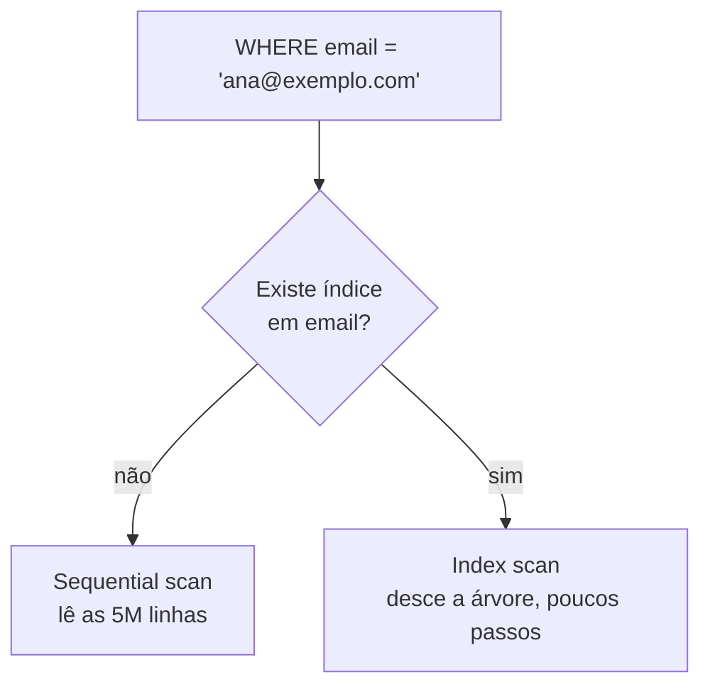

# Índices e Planos de Execução

A nota de [SQL](/labs/web-dev/banco-de-dados/01-sql/) mostrou como criar um índice: `CREATE INDEX idx_usuarios_email ON usuarios(email)`. Esta aqui explica o que acontece por baixo quando você faz isso, por que às vezes o banco cria o índice e mesmo assim não usa, e como pedir ao banco que mostre a estratégia que ele escolheu para rodar uma query.

## Por que um índice acelera a leitura

Imagine uma tabela `usuarios` com 5 milhões de linhas e a query `SELECT * FROM usuarios WHERE email = 'ana@exemplo.com'`.

Sem índice, o banco não tem escolha: lê as 5 milhões de linhas uma por uma e compara o email de cada uma. Isso é o **sequential scan** (ou full scan). O tempo cresce junto com a tabela, de forma linear, o que os livros chamam de O(N).

Com um índice na coluna `email`, o banco consulta uma estrutura separada, já organizada por email, que o leva direto às linhas certas em poucos passos. O tempo cresce muito devagar em relação ao tamanho da tabela, algo próximo de O(log N): dobrar o número de linhas adiciona só mais um ou dois passos na busca.



A analogia clássica é o índice remissivo no fim de um livro. Para achar onde o livro fala de "recursão", você não lê as 400 páginas, vai no índice, encontra "recursão: 45, 90" e pula direto.

## Como funciona o índice B-tree

O tipo de índice padrão em praticamente todo banco relacional é o **B-tree** (árvore B), uma árvore balanceada que mantém os valores sempre ordenados.

- Os **nós internos** funcionam como placas de sinalização: "valores até M, vá para a esquerda; acima de M, vá para a direita".
- As **folhas** guardam os valores indexados em ordem, cada um com um ponteiro para a linha na tabela.
- A árvore é **balanceada**: todas as folhas ficam à mesma distância da raiz, então toda busca custa o mesmo, não importa o valor procurado.

Como as folhas estão em ordem, o B-tree serve para mais coisa do que igualdade (`=`):

- comparação e faixa: `>`, `<`, `>=`, `<=`, `BETWEEN`
- prefixo de texto: `nome LIKE 'anel%'` (mas não `LIKE '%anel'`, ver [Busca Full-Text](/labs/web-dev/banco-de-dados/15-busca-full-text-search/))
- `ORDER BY` na mesma coluna, sem precisar de um passo extra de ordenação

Colunas com `PRIMARY KEY` e `UNIQUE` já ganham um índice B-tree automático. A forma como esse índice se relaciona com o armazenamento físico da linha muda de um banco para outro (heap no PostgreSQL, índice clusterizado no MySQL/InnoDB), e isso está detalhado em [PostgreSQL vs MySQL](/labs/web-dev/banco-de-dados/11-postgres-vs-mysql/).

## O custo de manter um índice

Índice não é de graça. Cada um que você cria cobra dois preços:

- **Espaço em disco**: o índice é uma cópia parcial e ordenada dos dados, guardada à parte. Uma tabela com oito índices pode ter mais bytes em índice do que em dados.
- **Escrita mais lenta**: todo `INSERT`, `UPDATE` que toca a coluna indexada e `DELETE` precisa atualizar cada índice da tabela para mantê-lo em dia. Cinco índices significam cinco estruturas extras para reorganizar a cada escrita.

Por isso a resposta para "quantos índices devo ter?" nunca é "quantos couberem". Indexe as colunas que aparecem de fato em `WHERE`, `JOIN` e `ORDER BY` de queries frequentes, e olhe com desconfiança para índices que nenhuma query usa: eles só custam.

## Tipos de índice por uso

Além do B-tree simples de uma coluna, os que mais aparecem no dia a dia:

**Índice composto** cobre mais de uma coluna, na ordem em que você declara. `CREATE INDEX idx ON pedidos (usuario_id, status)` serve para filtrar por `usuario_id` sozinho ou por `usuario_id` e `status` juntos, mas não ajuda uma query que filtra só por `status`. A regra é pensar no índice composto como uma lista telefônica ordenada por sobrenome e depois nome: dá para achar todos os "Silva" e o "Silva, Ana", mas não dá para achar todas as "Ana" sem varrer tudo.

**Índice parcial** cobre só um subconjunto das linhas: `CREATE INDEX idx ON pedidos (criado_em) WHERE status = 'pendente'`. Fica menor e mais barato de manter quando as queries só se interessam por aquela fatia.

**Índice coberto** (covering) inclui todas as colunas que a query precisa, então o banco responde direto do índice sem nem tocar na tabela. No plano isso aparece como **index-only scan**.

**Índice único** (`UNIQUE`) tem função dupla: acelera a busca e garante que não existam dois valores repetidos.

Bancos também têm tipos especializados para casos que o B-tree não atende bem: **GIN** para texto e campos com vários valores (arrays, JSONB), **GiST** e **BRIN** para dados geográficos e faixas. O GIN é o motor da [Busca Full-Text](/labs/web-dev/banco-de-dados/15-busca-full-text-search/).

## Quando o banco usa ou ignora o índice

Criar o índice não obriga o banco a usá-lo. Quem decide, query a query, é o **otimizador** (query planner): ele estima o custo de cada estratégia possível e escolhe a mais barata. Isso depende de:

- **Seletividade**: quão específico é o filtro. `WHERE email = ?` costuma trazer 1 linha entre milhões, ótimo para índice. `WHERE ativo = true` numa tabela onde 90% está ativo traz quase tudo, e aí ler a tabela inteira de uma vez é mais rápido do que pular do índice para a tabela milhões de vezes. Índice em coluna de baixa cardinalidade (booleano, status com 3 valores) raramente compensa.
- **Tamanho da tabela**: numa tabela de 200 linhas, o sequential scan é tão rápido que o planner nem considera o índice.
- **Estatísticas**: o banco guarda um resumo da distribuição dos dados de cada coluna e se baseia nele para estimar. Estatística desatualizada leva a plano ruim, por isso existe o `ANALYZE` (no PostgreSQL) para recalcular.

Alguns padrões no código **impedem** o uso do índice mesmo quando ele existe e seria útil:

- função ou cálculo na coluna: `WHERE lower(email) = ?` não usa o índice de `email` (a saída seria um índice sobre `lower(email)`)
- curinga à esquerda: `WHERE nome LIKE '%anel'`
- comparar tipos diferentes, forçando conversão implícita na coluna

## Lendo o plano de execução

Todo banco tem um comando que mostra a estratégia escolhida. No PostgreSQL e no MySQL é o `EXPLAIN`:

```sql
EXPLAIN
SELECT * FROM usuarios WHERE email = 'ana@exemplo.com';
```

Isso devolve o **plano estimado**, sem rodar a query. Trocando por `EXPLAIN ANALYZE`, o banco executa a query de verdade e mostra os números reais: tempo de cada etapa, quantas linhas passaram, quantas foram descartadas por filtro.

O que procurar no resultado:

- **Seq Scan**: leu a tabela inteira. Esperado em tabela pequena ou query pouco seletiva, suspeito numa tabela grande com filtro específico.
- **Index Scan**: usou um índice para achar as linhas e foi buscá-las na tabela.
- **Index Only Scan**: respondeu só com o índice, sem tocar na tabela. O mais rápido.
- **linhas estimadas vs linhas reais**: se o planner achava que viriam 10 linhas e vieram 400 mil, as estatísticas estão desatualizadas e o plano provavelmente é ruim.

A nota de [Busca Full-Text](/labs/web-dev/banco-de-dados/15-busca-full-text-search/) tem um exemplo lado a lado de `EXPLAIN ANALYZE` antes e depois de criar o índice, vale ver o efeito na prática.

## Referências

- [O que são Índices em Bancos de Dados - Indexação em Tabelas](https://www.bosontreinamentos.com.br/bancos-de-dados/o-que-sao-indices-em-bancos-de-dados-indexacao-em-tabelas/) - Fábio dos Reis (Bóson Treinamentos), pt-BR
- [Índices - Documentação do PostgreSQL, capítulo 11](https://www.postgresql.org/docs/current/indexes.html) - PostgreSQL, en
- [Use The Index, Luke! - Markus Winand](https://use-the-index-luke.com/) - Markus Winand, en
- [How to Read Postgres EXPLAIN: A Guide to Scan Types](https://www.crunchydata.com/blog/postgres-scan-types-in-explain-plans) - Crunchy Data, en
