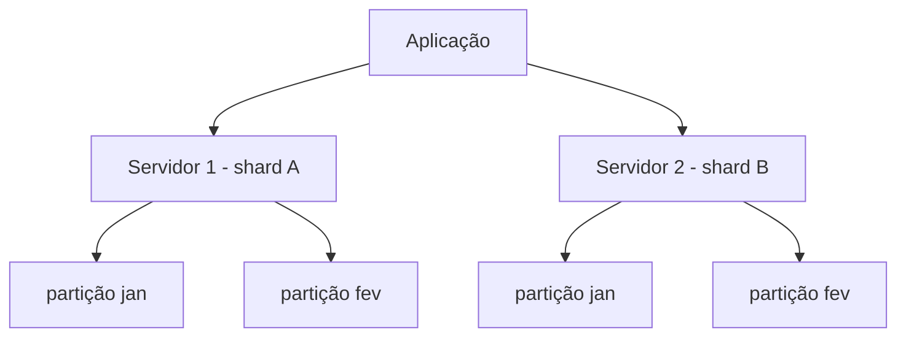

# Técnicas para Melhorar a Performance do Banco de Dados

Até aqui cada nota deste lab tratou uma técnica de banco de dados isoladamente: índices numa nota, views e materialized views em outra, replicação e sharding em escalabilidade. Essa nota junta o quadro geral: quando o banco começa a travar, qual dessas técnicas usar, e por quê elas não competem entre si, cada uma ataca um gargalo diferente (leitura lenta, escrita lenta, servidor sobrecarregado, consulta cara de calcular).

## O que cada técnica resolve

| Técnica            | Ataca principalmente                          | Nota de referência                                                                                    |
| ------------------ | --------------------------------------------- | ----------------------------------------------------------------------------------------------------- |
| Indexing           | leitura lenta por busca sem estrutura         | [Índices e Planos de Execução](/labs/web-dev/banco-de-dados/13-indices-e-planos-de-execucao/)         |
| Materialized Views | consulta cara recalculada toda hora           | [Views e Triggers](/labs/web-dev/banco-de-dados/02-views-e-triggers/)                                 |
| Vertical Scaling   | servidor sem capacidade (CPU/RAM/disco)       | [Escalabilidade](/labs/web-dev/escalabilidade/01-escalabilidade/)                                     |
| Denormalization    | leitura lenta por excesso de `JOIN`           | ver seção abaixo                                                                                      |
| Database Caching   | mesma consulta repetida com frequência        | [Cache e Redis](/labs/web-dev/escalabilidade/08-cache-e-redis/)                                       |
| Replication        | leitura concentrada num único servidor        | [Replicação de Banco de Dados](/labs/web-dev/escalabilidade/03-replicacao-de-banco-de-dados/)         |
| Sharding           | volume/tráfego que não cabe numa máquina      | [Stateless, Particionamento e Sharding](/labs/web-dev/escalabilidade/02-stateless-e-particionamento/) |
| Partitioning       | tabela grande demais para manter numa peça só | ver seção abaixo                                                                                      |
| Query Optimization | consulta mal escrita, mesmo com índice        | [Índices e Planos de Execução](/labs/web-dev/banco-de-dados/13-indices-e-planos-de-execucao/)         |

Cinco dessas técnicas (Indexing, Materialized Views, Vertical Scaling, Database Caching, Replication) já têm nota própria neste lab, então o resto desta página não repete o conteúdo, só resume em uma frase e linka para quem quiser o detalhe. As duas seções abaixo cobrem o que ainda faltava: Denormalization, que não tinha nota nenhuma, e a diferença entre Sharding e Partitioning, que a nota de escalabilidade trata como quase sinônimos e merece um esclarecimento.

## Denormalization

Um banco bem modelado normalmente segue as formas normais: cada dado mora num lugar só, e para juntar informação relacionada você usa `JOIN`. Isso evita duplicação e inconsistência, mas tem um custo: quanto mais tabelas um `JOIN` precisa atravessar, mais caro fica ler o resultado.

Denormalization é o processo inverso e deliberado: aceitar redundância controlada para não precisar fazer esse `JOIN` toda vez. Em vez de guardar só a chave estrangeira `pedidos.usuario_id` e buscar o nome do cliente na tabela `usuarios` a cada consulta, você duplica o nome direto na tabela `pedidos`:

```sql
-- Normalizado: precisa de JOIN para saber o nome do cliente
SELECT p.id, p.valor, u.nome
FROM pedidos p
JOIN usuarios u ON u.id = p.usuario_id;

-- Desnormalizado: o nome já está na própria linha do pedido
SELECT id, valor, nome_cliente
FROM pedidos;
```

O trade-off é direto: leitura mais rápida e mais simples, em troca de escrita mais complicada (agora, se o usuário mudar de nome, alguém precisa atualizar `nome_cliente` em todos os pedidos dele, não só uma linha em `usuarios`) e do risco de duas cópias do mesmo dado ficarem dessincronizadas se essa atualização for esquecida em algum lugar.

Isso compensa quando leitura domina muito sobre escrita, e as outras técnicas (índice, cache, otimização de query) já não bastam. É o caso clássico de data warehouses e sistemas analíticos, onde ninguém está escrevendo no dado histórico, só lendo e agregando ele repetidamente, os schemas estrela e floco de neve usados em BI são desnormalização deliberada por design. Em bancos NoSQL orientados a documento (MongoDB, por exemplo), embutir dados relacionados no mesmo documento em vez de referenciar outro é a prática padrão, não exceção.

O lado oposto também vale: em sistemas OLTP (transacionais, tipo um e-commerce processando pedidos o tempo todo), onde escrita é frequente e a integridade do dado importa mais do que alguns milissegundos de leitura, desnormalizar sem necessidade cria mais problema do que resolve. A pergunta a fazer antes de desnormalizar qualquer coisa é: será que um índice, uma materialized view ou um cache já não resolvem o mesmo gargalo sem duplicar dado?

## Sharding vs Partitioning: qual a diferença real

A nota de [Stateless, Particionamento e Sharding](/labs/web-dev/escalabilidade/02-stateless-e-particionamento/) já explica sharding em detalhe (distribuir linhas de uma tabela entre várias máquinas, cada uma guardando uma fatia). O que fica menos claro ali é que "particionamento" tem um sentido mais amplo, e existe uma forma dele que não tem nada a ver com múltiplos servidores.

**Partitioning** (particionamento de tabela) pode acontecer **dentro de uma única instância** de banco. É um recurso nativo do próprio SGBD: você divide uma tabela grande em pedaços menores (partições) por faixa de valor, lista ou hash, mas todas as partições continuam vivendo no mesmo servidor, no mesmo banco.

```sql
-- PostgreSQL: particiona a tabela de pedidos por mês, na mesma instância
CREATE TABLE pedidos (
  id BIGINT,
  criado_em DATE,
  valor NUMERIC
) PARTITION BY RANGE (criado_em);

CREATE TABLE pedidos_2026_01 PARTITION OF pedidos
  FOR VALUES FROM ('2026-01-01') TO ('2026-02-01');
CREATE TABLE pedidos_2026_02 PARTITION OF pedidos
  FOR VALUES FROM ('2026-02-01') TO ('2026-03-01');
```

O ganho aqui não é escalar para além de uma máquina, é tornar uma tabela gigante mais fácil de manter: uma consulta que já filtra por `criado_em` só precisa varrer a partição certa (o otimizador descarta as outras automaticamente, uma técnica chamada _partition pruning_), reindexar ou até apagar um mês inteiro de dados antigos vira só remover uma partição, e operações de manutenção (como o `VACUUM` do PostgreSQL) rodam em pedaços menores em vez da tabela inteira de uma vez.

**Sharding** é especificamente o particionamento horizontal feito **entre servidores diferentes**: cada shard é uma instância de banco separada, rodando em máquina própria. É tecnicamente um tipo de particionamento distribuído, só que a Microsoft, em sua documentação de arquitetura, trata sharding e particionamento de tabela como técnicas complementares, não concorrentes: "_um único fragmento pode conter entidades particionadas verticalmente_", ou seja, dá para (e é comum) usar as duas juntas: particionar a tabela dentro de cada shard, e distribuir os shards entre servidores.



A régua para escolher entre os dois:

- **Só partitioning**: a tabela ficou grande demais para gerenciar bem (índices lentos, `VACUUM` demorado, consultas variando muito conforme o filtro de data ou categoria), mas o volume e o tráfego totais ainda cabem confortavelmente numa única máquina.
- **Sharding**: o volume de dados ou o tráfego de leitura/escrita já não cabe (ou não responde rápido o suficiente) numa única instância, mesmo depois de esgotar escalabilidade vertical. Sharding resolve um problema de capacidade de máquina, partitioning resolve um problema de organização dentro da máquina que você já tem.

Vale reforçar o custo do sharding descrito na nota de escalabilidade: ele quebra `JOIN` entre shards diferentes e complica transação atômica entre eles. Partitioning dentro de uma instância só não tem esse problema, porque o `JOIN` continua rodando dentro do mesmo banco, só que sobre as partições certas.

## Query Optimization

Antes de qualquer técnica acima, vale sempre checar se a consulta em si está bem escrita: evitar `SELECT *` quando só algumas colunas importam, evitar função em cima da coluna filtrada (`WHERE lower(email) = ?` ignora índice em `email`), e usar `EXPLAIN`/`EXPLAIN ANALYZE` para confirmar que o banco está de fato usando o índice esperado, tudo isso já foi coberto com exemplo prático em [Índices e Planos de Execução](/labs/web-dev/banco-de-dados/13-indices-e-planos-de-execucao/). É, na prática, o primeiro lugar a olhar, porque é de graça: não exige mudar schema, não exige infraestrutura nova, só reescrever a query.

## Por onde começar

A ordem de investimento que costuma fazer mais sentido, do mais barato para o mais caro:

1. **Query Optimization**: reescrever a consulta e conferir o plano de execução. Não custa infraestrutura nenhuma.
2. **Indexing**: se o plano mostra sequential scan numa tabela grande com filtro seletivo, provavelmente falta índice.
3. **Database Caching** ou **Materialized Views**: se a mesma consulta cara roda repetidamente e o dado não precisa estar sempre 100% atual.
4. **Vertical Scaling** ou **Replication**: se o gargalo é capacidade do servidor ou volume de leitura concorrente, não a query em si.
5. **Denormalization**, **Partitioning** ou **Sharding**: mudam o modelo de dados ou a arquitetura de armazenamento, então só compensam quando as opções mais baratas já foram esgotadas e o gargalo continua.

Pular direto para sharding ou desnormalização sem antes checar índice e query é o erro mais comum: na maioria dos casos, uma consulta mal escrita ou um índice faltando explica o problema inteiro, e nenhuma das técnicas mais caras seria necessária.

## Referências

- [Desnormalização: uma faca de dois gumes](https://www.devmedia.com.br/artigo-sql-magazine-12-desnormalizacao-uma-faca-de-dois-gumes/5622) - Eduardo Bezerra (SQL Magazine/DevMedia), pt-BR
- [Padrão de Sharding - Azure Architecture Center](https://learn.microsoft.com/pt-br/azure/architecture/patterns/sharding) - Microsoft Learn, pt-BR
