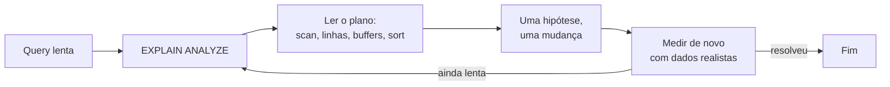
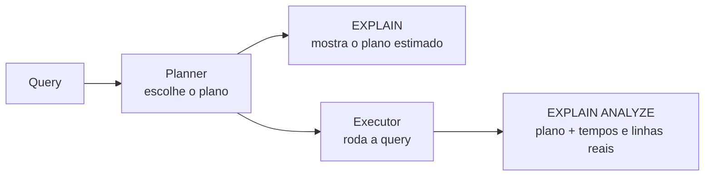
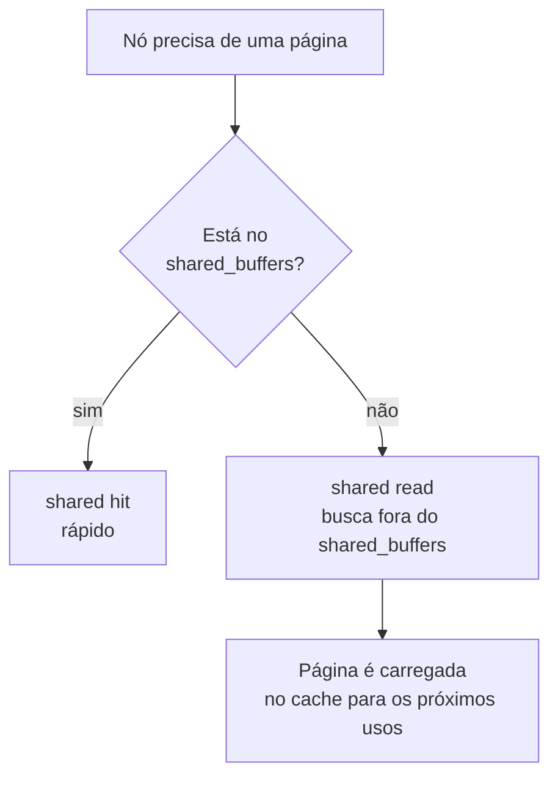

# Diagnóstico de Queries Lentas no PostgreSQL

A query ficou lenta e o reflexo de muita gente é rodar um `CREATE INDEX`. Às vezes funciona. Outras vezes o gargalo estava em outro lugar (uma transação aberta segurando um lock, uma ordenação que estourou a memória, uma estatística velha enganando o planner) e o índice só sobra ali, ocupando disco e deixando toda escrita mais lenta. Esta nota é sobre o passo anterior: descobrir **o que** está lento antes de decidir a correção.

A nota de [Índices e Planos de Execução](/labs/web-dev/banco-de-dados/13-indices-e-planos-de-execucao/) já mostrou como um índice funciona e o básico do `EXPLAIN`. Aqui o foco é o método de investigação e as partes do plano que aquela nota não detalhou: buffers, esperas de lock, ordenação em disco e monitoramento em produção. Os exemplos usam PostgreSQL, e os números de saída são inventados só para ilustrar.

## Medir antes de otimizar

Desempenho de banco é trabalho guiado por evidência. A ordem que costuma funcionar:

1. Olhar o plano de execução da query
2. Comparar as linhas que o planner **estimou** com as que **realmente** apareceram
3. Ver se ele escolheu índice ou leitura sequencial da tabela
4. Medir quantas páginas vieram do cache e quantas precisaram ser lidas
5. Procurar espera de lock, ordenação em disco e filtro pouco seletivo
6. Aplicar **uma** mudança e medir de novo, com dados parecidos com os de produção



O passo 6 tem uma pegadinha. Uma query que voa num banco de desenvolvimento com mil linhas pode se comportar de outro jeito em produção, onde a tabela tem milhões de linhas, a distribuição dos valores é irregular e dezenas de conexões disputam os mesmos dados. Plano, cache e locks dependem do volume e da concorrência. Por isso o teste que vale é o que usa dados com o tamanho e o formato dos reais.

Cada sintoma aponta para um lugar diferente do plano:

| Sintoma                                | Onde olhar                       | Seção                                                                               |
| -------------------------------------- | -------------------------------- | ----------------------------------------------------------------------------------- |
| Tabela grande lida inteira             | Tipo de scan no plano            | [Como o planner escolhe o plano](#como-o-planner-escolhe-o-plano)                   |
| Plano estranho para o filtro usado     | `rows` estimado vs `actual rows` | [Estimativa vs linhas reais](#estimativa-vs-linhas-reais)                           |
| Query lenta só na primeira vez         | Linha `Buffers`                  | [Buffers: cache e leitura de disco](#buffers-cache-e-leitura-de-disco)              |
| Tempo alto com plano aparentemente bom | Espera de lock                   | [Esperas de lock](#esperas-de-lock)                                                 |
| `ORDER BY` ou `JOIN` lento             | `Sort Method`                    | [Sort spills e memória](#sort-spills-e-memória)                                     |
| Não sei nem qual query é o problema    | Estatísticas agregadas           | [Monitoramento contínuo em ambiente real](#monitoramento-contínuo-em-ambiente-real) |

## Como o planner escolhe o plano

Antes de rodar qualquer query, o PostgreSQL gera vários caminhos possíveis para executá-la, estima o custo de cada um e fica com o mais barato. Esse componente é o **query planner**. A estimativa se apoia em estatísticas que o banco guarda sobre cada coluna (quantos valores distintos existem, como estão distribuídos, quantos são nulos). Essas estatísticas são amostras aleatórias coletadas pelo comando `ANALYZE`, e o autovacuum costuma rodá-lo por você em segundo plano.

Duas coisas entram na conta o tempo todo:

- **Seletividade**: quantas linhas o filtro devolve em relação ao total. `WHERE id = 42` devolve uma linha entre milhões (muito seletivo). `WHERE ativo = true` numa tabela onde 90% está ativo devolve quase tudo (pouco seletivo).
- **Tamanho da tabela**: numa tabela que cabe em poucas páginas, ler tudo é tão barato que nem vale consultar o índice.

Os quatro tipos de leitura que mais aparecem num plano:

| Nó no plano          | O que faz                                                                                        | Quando o planner tende a escolher                                 |
| -------------------- | ------------------------------------------------------------------------------------------------ | ----------------------------------------------------------------- |
| **Seq Scan**         | Lê a tabela inteira, página por página, e filtra                                                 | Tabela pequena, ou filtro que devolve grande parte das linhas     |
| **Index Scan**       | Anda pelo índice e vai buscar cada linha na tabela                                               | Filtro muito seletivo (poucas linhas)                             |
| **Bitmap Heap Scan** | Usa o índice para montar uma lista das páginas que interessam e lê essas páginas em ordem física | Seletividade intermediária, por exemplo em torno de 1% das linhas |
| **Index Only Scan**  | Responde só com o índice, sem tocar na tabela                                                    | O índice tem todas as colunas que a query pede                    |

A documentação do PostgreSQL usa uma tabela de 10 mil linhas para mostrar esse efeito: um filtro que pega cerca de 1% das linhas vira Bitmap Heap Scan, e um filtro que pega cerca de 70% vira Seq Scan. Índice não é o vilão nem o herói. Buscar linhas uma a uma pelo índice sai caro, então quando o resultado é grande, ler a tabela em sequência ganha. Ver `Seq Scan` no plano só é problema quando a tabela é grande **e** o filtro é seletivo.

## `EXPLAIN` vs `EXPLAIN ANALYZE`

O `EXPLAIN` mostra o plano que o planner escolheu, com custos e linhas **estimados**, e não executa a query. O `EXPLAIN ANALYZE` executa a query de verdade e acrescenta os números **reais**.



O planner sempre roda, com ou sem `ANALYZE`. O que a opção `ANALYZE` faz é levar a execução até o fim e anotar o que aconteceu. Um exemplo com saída ilustrativa:

```sql
EXPLAIN (ANALYZE, BUFFERS)
SELECT * FROM pedidos
WHERE cliente_id = 42
ORDER BY criado_em
LIMIT 10;
```

```text
Limit  (cost=0.43..8.45 rows=10 width=64) (actual time=0.031..0.052 rows=10 loops=1)
  Buffers: shared hit=5 read=1
  ->  Index Scan using idx_pedidos_cliente_criado on pedidos  (cost=0.43..812.10 rows=1013 width=64) (actual time=0.029..0.048 rows=10 loops=1)
        Index Cond: (cliente_id = 42)
        Buffers: shared hit=5 read=1
Planning Time: 0.210 ms
Execution Time: 0.081 ms
```

Cada nó traz dois parênteses. O primeiro é a estimativa (`cost`, `rows`, `width`). O segundo, só com `ANALYZE`, é o que aconteceu (`actual time`, `rows`, `loops`). No fim, `Planning Time` é o tempo que o planner levou para escolher e `Execution Time` é o da execução em si.

### Cuidado com efeitos colaterais

Como o `EXPLAIN ANALYZE` executa a query, um `UPDATE` ou `DELETE` analisado **altera os dados de verdade**. A documentação recomenda embrulhar numa transação e desfazer:

```sql
BEGIN;
EXPLAIN ANALYZE UPDATE pedidos SET status = 'cancelado' WHERE cliente_id = 42;
ROLLBACK;
```

O `ROLLBACK` desfaz as alterações, mas a query rodou, então ela consumiu recursos e pode ter disparado triggers. Em produção, prefira fazer isso numa réplica ou num ambiente de teste.

### Opções que mudam o que aparece

| Opção      | O que acrescenta                                                                                                                    |
| ---------- | ----------------------------------------------------------------------------------------------------------------------------------- |
| `ANALYZE`  | Executa a query e mostra tempos e linhas reais                                                                                      |
| `BUFFERS`  | Uso de buffers (cache e leitura), detalhado na seção abaixo                                                                         |
| `VERBOSE`  | Detalhes extras do plano, como as colunas que cada nó devolve                                                                       |
| `SETTINGS` | Parâmetros de configuração que afetam o plano e estão fora do valor padrão                                                          |
| `WAL`      | Volume de WAL gerado (útil em escritas), só com `ANALYZE`                                                                           |
| `FORMAT`   | Formato de saída: `TEXT` (padrão), `JSON`, `XML` ou `YAML`. O `JSON` é o que ferramentas de visualização de plano costumam consumir |

Sobre o `BUFFERS`: a partir do **PostgreSQL 18**, a informação de buffers passa a vir automaticamente quando você usa `ANALYZE`. Em versões anteriores é preciso pedir `EXPLAIN (ANALYZE, BUFFERS)`. Escrever a opção explicitamente continua funcionando em qualquer versão, então vale o hábito. A versão 18 também passou a mostrar contagem de linhas com casas decimais (`rows=10.00`), então a saída pode parecer um pouco diferente da dos exemplos.

## Estimativa vs linhas reais

O sinal mais valioso do plano é a diferença entre o que o planner **achou** que ia acontecer e o que aconteceu. Em cada nó:

```text
Index Scan ... (cost=0.43..812.10 rows=1013 width=64) (actual time=0.029..0.048 rows=10 loops=1)
                               ^^^^^^^^                                          ^^^^^^^
                               estimado                                          real
```

Se o planner previu 10 linhas e vieram 400 mil, ele montou o plano com base numa premissa errada. É assim que aparece um `Nested Loop` para milhões de linhas ou um `Seq Scan` onde um índice caberia. O problema não está na query, está na estimativa.

Alguns detalhes para ler certo:

- Em nós que rodam várias vezes (`loops` maior que 1, comum em `Nested Loop`), o `actual time` e o `actual rows` mostrados são a **média por execução**. Para o total, multiplique por `loops`.
- Com `LIMIT`, o nó pode parar cedo. `rows=1013` estimado contra `rows=10` real no exemplo acima não é erro de estatística, é o `LIMIT 10` cortando a leitura.
- `Rows Removed by Filter` mostra quantas linhas o nó leu e jogou fora. Um número alto perto de poucas linhas úteis indica um filtro que poderia ser resolvido por índice (a nota de [Busca Full-Text](/labs/web-dev/banco-de-dados/15-busca-full-text-search/) tem um exemplo com esse campo).

Quando a estimativa está muito fora, o primeiro remédio costuma ser barato: atualizar as estatísticas.

```sql
ANALYZE pedidos;
```

Depois rode o `EXPLAIN ANALYZE` de novo. Se o plano mudou e melhorou, o problema era estatística velha (depois de uma carga grande de dados, por exemplo), e nenhum índice novo foi necessário.

## Buffers: cache e leitura de disco

O PostgreSQL guarda em memória, na área chamada `shared_buffers`, cópias das páginas de 8 KB que ele já leu das tabelas e índices. Ao precisar de uma página, ele olha primeiro nesse cache.



A linha `Buffers` de cada nó conta essas páginas:

```text
Buffers: shared hit=36 read=6
```

- **`shared hit`**: páginas encontradas no `shared_buffers`
- **`read`**: páginas que não estavam lá e precisaram ser buscadas. Nem sempre isso é disco físico, porque o sistema operacional também tem seu próprio cache e pode entregar a página sem tocar no disco. Na prática, `read` alto significa "não estava no cache do PostgreSQL", e o custo real depende de onde a página estava
- **`dirtied` e `written`**: aparecem em nós que alteram dados, e contam páginas modificadas e páginas gravadas

Os números de um nó pai incluem os dos filhos, então o topo do plano mostra o total da query.

Por que olhar isso se já existe o tempo? Porque a contagem de buffers é **estável**: a mesma query sobre os mesmos dados toca aproximadamente o mesmo número de páginas em toda execução, enquanto o tempo oscila com cache, carga da máquina e o que mais estiver rodando. Ao comparar "antes" e "depois" de uma mudança, menos buffers é uma evidência mais firme de melhoria do que menos milissegundos.

O que a linha `Buffers` ajuda a enxergar:

- **Query lenta só na primeira execução**: cache frio. Na segunda, os `read` viram `hit`. Rode duas vezes antes de tirar conclusão.
- **Muitos `read` numa query que roda o tempo todo**: o conjunto de dados quente é maior que o `shared_buffers`, ou há pressão de cache por outras queries.
- **Milhares de buffers para devolver poucas linhas**: a query lê muito para aproveitar pouco. Um índice mais específico, ou tabela e índice inchados (bloat), podem ser a causa.

## Esperas de lock

Nem toda query lenta está trabalhando devagar. Algumas estão **paradas**, esperando uma transação que segura um lock sobre a mesma linha ou tabela (a nota de [Controle de Concorrência](/labs/web-dev/banco-de-dados/07-controle-de-concorrencia/) explica de onde vêm esses bloqueios). Um `UPDATE` que trava porque alguém esqueceu uma transação aberta é o clássico.

Aqui vale corrigir uma ideia que circula em infográficos: o `EXPLAIN ANALYZE` **não** reporta o tempo de espera de lock. A saída traz tempo de planejamento, de execução e de triggers, mas não tem um campo dedicado à espera. Você pode ver um tempo alto e um plano bonito, sem nenhuma pista do motivo.

Quem mostra a espera é a view `pg_stat_activity`, com as colunas `wait_event_type` e `wait_event`:

```sql
SELECT pid, state, wait_event_type, wait_event, query
FROM pg_stat_activity
WHERE wait_event_type = 'Lock';
```

```text
  pid  | state  | wait_event_type | wait_event
-------+--------+-----------------+---------------
  2540 | active | Lock            | transactionid
```

Um `wait_event_type` igual a `Lock` indica que a sessão está esperando um lock pesado, e o `wait_event` diz de que tipo (`relation` para tabela, `tuple` para linha, `transactionid` para esperar outra transação terminar). Para saber **quem** está bloqueando, a função `pg_blocking_pids(pid)` devolve as sessões que seguram o lock:

```sql
SELECT pid, pg_blocking_pids(pid) AS bloqueada_por, query
FROM pg_stat_activity
WHERE cardinality(pg_blocking_pids(pid)) > 0;
```

Esses comandos mostram o que está acontecendo **agora**. Para pegar esperas que já passaram, existe o parâmetro `log_lock_waits`. Quando ligado, o PostgreSQL escreve no log toda vez que uma sessão espera mais que o `deadlock_timeout` para conseguir um lock. A própria documentação sugere, ao investigar atrasos por lock, usar um `deadlock_timeout` menor que o normal. Confira o valor padrão de `log_lock_waits` na sua versão, já que ele pode variar.

```conf
log_lock_waits = on
deadlock_timeout = 500ms
```

## Sort spills e memória

Um `ORDER BY`, um `DISTINCT` ou um `JOIN` por merge precisam ordenar dados. Se o volume cabe na memória, o PostgreSQL ordena lá. Se não cabe, ele grava arquivos temporários em disco e continua por lá, o que é bem mais lento. Esse transbordamento é o **sort spill**, e aparece na linha `Sort Method` do nó:

```text
Sort  (cost=713.05..713.30 rows=100 width=488) (actual time=2.995..3.002 rows=100 loops=1)
  Sort Key: t1.fivethous
  Sort Method: quicksort  Memory: 74kB
```

```text
Sort  (cost=... rows=2000000 ...) (actual time=1840.2..2310.7 rows=2000000 loops=1)
  Sort Key: criado_em
  Sort Method: external merge  Disk: 51200kB
```

`quicksort  Memory` é o caso saudável. `external merge  Disk` é o spill. Nós de `Hash` (usados em hash joins e agregações) também transbordam para disco quando a memória acaba.

O limite por operação é o parâmetro **`work_mem`**, com padrão de 4 MB. Subir esse valor faz o spill sumir, mas com um custo que a documentação faz questão de avisar: o limite vale **por operação**, e uma query complexa pode ter várias operações de ordenação e hash ao mesmo tempo, além de várias sessões rodando juntas. Com `work_mem = 100MB`, 10 sessões fazendo 3 operações cada podem chegar a 3 GB de memória.

Por isso o caminho mais seguro costuma ser:

1. Ver se um índice na coluna do `ORDER BY` entrega os dados já ordenados e elimina o `Sort` (a nota de [Índices e Planos de Execução](/labs/web-dev/banco-de-dados/13-indices-e-planos-de-execucao/) mostra o B-tree ordenado servindo a essa função)
2. Reduzir o volume ordenado: filtrar antes, buscar só as colunas necessárias, usar `LIMIT` quando faz sentido
3. Se ainda precisa de mais memória, aumentar o `work_mem` só para a query ou transação em questão, e não no servidor inteiro:

```sql
BEGIN;
SET LOCAL work_mem = '64MB';
-- query pesada aqui
COMMIT;
```

## Monitoramento contínuo em ambiente real

Tudo até aqui parte de uma query que você já sabe qual é. Em produção, o primeiro problema costuma ser justamente descobrir qual. Duas extensões oficiais do PostgreSQL resolvem partes diferentes disso.

**`pg_stat_statements`** mantém estatísticas agregadas de todas as queries executadas: quantas vezes rodou, tempo total, tempo médio, linhas devolvidas, blocos lidos do cache e do disco. Ela responde "quais queries mais consomem tempo do servidor". Para ativar, adicione a biblioteca no `postgresql.conf`, reinicie o servidor e crie a extensão no banco:

```conf
shared_preload_libraries = 'pg_stat_statements'
```

```sql
CREATE EXTENSION pg_stat_statements;

SELECT query, calls, total_exec_time, mean_exec_time, shared_blks_hit, shared_blks_read
FROM pg_stat_statements
ORDER BY total_exec_time DESC
LIMIT 10;
```

Ordenar por `total_exec_time` (e não só pela média) é o que costuma revelar a query mais importante: uma que leva 5 ms mas roda 2 milhões de vezes por hora pesa mais que uma de 2 s que roda uma vez por dia.

**`auto_explain`** registra no log o plano de execução de queries que passam de um tempo limite, sem você precisar rodar `EXPLAIN` na mão. Serve para as queries que só se comportam mal em produção, com os dados e a concorrência reais, e que você não consegue reproduzir na sua máquina. Os parâmetros principais:

| Parâmetro                       | Função                                                                                                   |
| ------------------------------- | -------------------------------------------------------------------------------------------------------- |
| `auto_explain.log_min_duration` | Tempo mínimo, em ms, para uma query ter o plano registrado. `-1` desativa e `0` registra tudo            |
| `auto_explain.log_analyze`      | Registra o plano com números reais, como `EXPLAIN ANALYZE`. Dá mais informação e pesa mais no desempenho |
| `auto_explain.log_buffers`      | Inclui as estatísticas de buffers (exige `log_analyze`)                                                  |

Juntas, as duas formam um fluxo: o `pg_stat_statements` aponta **qual** query é o problema, o `auto_explain` guarda o plano dela quando ficou lenta, e o `EXPLAIN ANALYZE` manual ajuda a testar a correção. Essas métricas do banco também alimentam o painel de observabilidade do sistema como um todo (ver [Logs, Metrics e Traces](/labs/web-dev/observabilidade/01-logs-metrics-e-traces/)).

## Validar a mudança

Corrigir sem medir de novo é só palpite. Depois de criar um índice, atualizar estatísticas, reescrever a query ou mudar o schema:

- Rode o mesmo `EXPLAIN (ANALYZE, BUFFERS)` de antes e compare plano, linhas reais, buffers e tempo, lado a lado
- Mude **uma** coisa por vez, senão não dá para saber qual delas ajudou
- Rode mais de uma vez, para separar o efeito do cache do efeito da mudança
- Teste com volume e distribuição de dados parecidos com os de produção, de preferência num ambiente de teste com uma cópia anonimizada dos dados
- Ao analisar `INSERT`, `UPDATE` ou `DELETE`, use `BEGIN` ... `ROLLBACK`
- Observe também o custo do outro lado: um índice novo deixa as escritas da tabela mais lentas (ver [Índices e Planos de Execução](/labs/web-dev/banco-de-dados/13-indices-e-planos-de-execucao/))

Se a query já está bem escrita, o plano é bom e mesmo assim o banco não dá conta, o problema deixou de ser a query. É a hora de olhar as técnicas de outra camada, como cache, replicação e particionamento, na ordem descrita em [Técnicas para Melhorar a Performance do Banco de Dados](/labs/web-dev/banco-de-dados/16-tecnicas-de-melhoria-de-performance/).

## Referências

- [Usando EXPLAIN (documentação do PostgreSQL 14.5, tradução pt-BR)](https://halleyoliv.gitlab.io/pgdocptbr/using-explain.html) - Projeto PGDocPTBR, pt-BR (versão 14.5, então o comportamento de `BUFFERS` descrito aqui sobre o PostgreSQL 18 não aparece)
- [EXPLAIN - PostgreSQL Documentation](https://www.postgresql.org/docs/current/sql-explain.html) - PostgreSQL, en
- [PostgreSQL 18 Release Notes](https://www.postgresql.org/docs/release/18.0/) - PostgreSQL, en
- [Explaining the unexplainable - part 6: buffers](https://www.depesz.com/2021/06/20/explaining-the-unexplainable-part-6-buffers/) - depesz (Hubert Lubaczewski), en
- [Cumulative Statistics System (pg_stat_activity e wait events)](https://www.postgresql.org/docs/current/monitoring-stats.html) - PostgreSQL, en
- [pg_stat_statements](https://www.postgresql.org/docs/current/pgstatstatements.html) - PostgreSQL, en
- [auto_explain](https://www.postgresql.org/docs/current/auto-explain.html) - PostgreSQL, en
