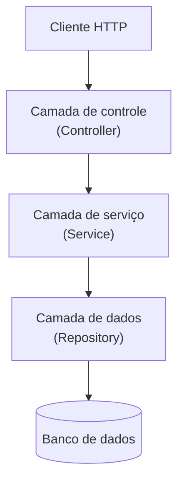
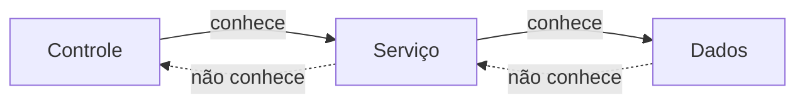
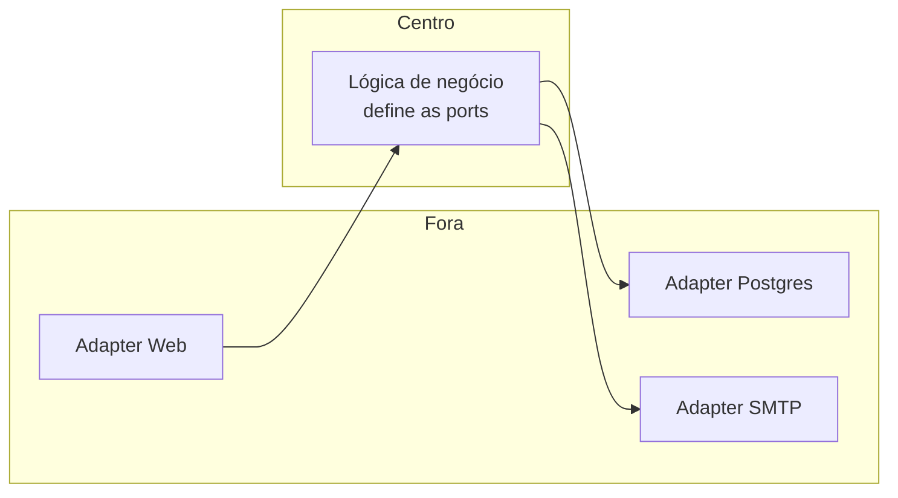

# Arquitetura em Camadas

Quando você abre o código de um serviço backend bem organizado, dificilmente encontra tudo misturado num arquivo só. O normal é ver o código dividido em camadas: uma parte cuida de receber a requisição HTTP, outra cuida das regras de negócio, outra cuida de falar com o banco. Essa divisão tem nome (arquitetura em camadas, ou layered architecture) e é o jeito mais comum de estruturar uma aplicação.

Esta nota mostra quais são as camadas, o que cada uma faz, qual regra mantém tudo no lugar e onde esse modelo começa a apertar.

## O que é arquitetura em camadas

A ideia é separar o código por responsabilidade. Cada camada tem um trabalho só e conversa apenas com a camada vizinha, seguindo o princípio de separação de responsabilidades.

Pensa num restaurante:

- o **garçom** anota o pedido, leva até a cozinha e traz o prato. Ele não cozinha.
- a **cozinha** transforma ingredientes em prato pronto. Ela não vai até a mesa nem vai até o mercado.
- a **despensa** guarda e entrega os ingredientes. Ela não decide o cardápio.

Se o restaurante troca de fornecedor, a cozinha nem fica sabendo: continua pedindo "2 kg de tomate" para a despensa. Se muda o layout do salão, a cozinha também não muda. Cada parte pode evoluir sozinha porque as fronteiras são claras.

No código de um serviço, essas três partes viram três camadas:



Esse é o modelo que a documentação mais antiga chama de **N-tier** ou **N-Layer**, e é uma evolução direta do **MVC**: o Controller do MVC continua ali, mas a lógica que costumava inchar dentro dele foi empurrada para uma camada de serviço dedicada.

## As camadas na prática

### Camada de controle (Controller)

É a porta de entrada do serviço. O controller:

- recebe a requisição HTTP e extrai o que veio no corpo, na URL e nos cabeçalhos;
- valida o **formato** da entrada (o campo `email` é uma string? o `id` é um número? o campo obrigatório veio preenchido?);
- chama a camada de serviço passando dados já limpos;
- transforma o resultado numa resposta HTTP, com o código de status certo (200, 201, 404, 422).

O que o controller **não** faz: decidir regra de negócio. "Esse usuário pode transferir esse valor?" não é pergunta de controller.

```js
// Controller: fino, sem regra de negócio
async function transferir(req, res) {
  const { contaOrigem, contaDestino, valor } = req.body;

  if (!contaOrigem || !contaDestino || valor <= 0) {
    return res.status(422).json({ erro: "dados inválidos" });
  }

  const resultado = await transferenciaService.transferir(
    contaOrigem,
    contaDestino,
    valor,
  );
  return res.status(200).json(resultado);
}
```

### Camada de serviço (Service)

É onde mora a lógica de negócio. O service:

- aplica as regras da aplicação ("a conta de origem tem saldo?", "o limite diário foi atingido?");
- coordena o trabalho, chamando um ou mais repositórios e, se precisar, serviços externos;
- controla a transação (ou tudo é gravado, ou nada é).

Uma regra prática: se um repositório precisa chamar outro repositório, é sinal de que essa coordenação deveria estar no service, não escondida na camada de dados.

```js
async function transferir(origemId, destinoId, valor) {
  const origem = await contaRepository.buscarPorId(origemId);
  const destino = await contaRepository.buscarPorId(destinoId);

  if (origem.saldo < valor) {
    throw new SaldoInsuficienteError();
  }

  origem.saldo -= valor;
  destino.saldo += valor;

  await contaRepository.salvar(origem);
  await contaRepository.salvar(destino);

  return { origem: origem.saldo, destino: destino.saldo };
}
```

### Camada de dados (Repository)

Faz a ponte entre os objetos do domínio e o armazenamento (banco relacional, cache, API externa). O repository:

- traduz "buscar a conta 42" numa query SQL, ou numa chamada ao Redis, ou num `GET` numa API;
- devolve objetos do domínio, não linhas de tabela cruas;
- não sabe **por que** está sendo chamado. Ele não conhece a regra de transferência, só sabe buscar e salvar conta.

Trocar o Postgres por outro banco, ou colocar um cache na frente, mexe só nessa camada. O service continua chamando `contaRepository.buscarPorId(42)` sem perceber diferença.

| Camada   | Pergunta que ela responde                                 | Não é problema dela                 |
| -------- | --------------------------------------------------------- | ----------------------------------- |
| Controle | "A requisição está bem formada? Que status devolvo?"      | Regra de negócio                    |
| Serviço  | "Essa operação é permitida? Em que ordem faço as coisas?" | Formato de HTTP, dialeto de SQL     |
| Dados    | "Como leio e gravo isso no armazenamento?"                | Por que a operação está acontecendo |

## Direção das dependências

A regra que segura o modelo em pé: a dependência aponta sempre para dentro, na mesma direção do fluxo.



O controller conhece o service e o chama. O service conhece o repository e o chama. Mas o repository não faz ideia de que existe um service, e o service não faz ideia de que existe um controller. Nada aponta "para trás".

Por que isso importa na prática:

- **Trocar peças sem efeito cascata.** Mudar o framework web (de Express para Fastify, de MVC para Minimal API) mexe só na camada de controle. Trocar o banco mexe só na camada de dados. A lógica de negócio, que costuma ser a parte mais valiosa e mais difícil de reescrever, fica intocada.
- **Testar a lógica sozinha.** Como o service depende de uma interface de repositório e não do banco de verdade, dá para testar a regra de transferência passando um repositório falso que devolve saldos conhecidos, sem subir Postgres nenhum. Isso é o que deixa os testes unitários rápidos, assunto de [Testes em Microsserviços](/labs/web-dev/engenharia-de-software/03-testes-em-microsservicos/).

Um detalhe de fronteira: o que trafega entre o mundo externo e o controller costuma ser um **DTO** (Data Transfer Object), um objeto simples com os campos daquela requisição ou resposta. Dentro do service e abaixo dele, trabalha-se com a **entidade de domínio**, que carrega comportamento e regras. Separar os dois evita que um campo interno vaze na API sem querer, e que uma mudança no contrato HTTP force uma mudança no domínio.

## Anti-padrões comuns

O modelo é simples, mas é fácil corromper na pressa:

- **Controller gordo.** A regra de negócio vai parar dentro do controller "só pra adiantar". Com o tempo, o controller tem 200 linhas, não dá pra testar sem simular uma requisição HTTP inteira, e a mesma regra acaba copiada em outro controller.
- **Vazamento de camada.** O repository devolve o objeto cru do ORM (ou o JSON exato do banco) direto para o controller, que passa pro cliente. Agora a estrutura da tabela virou contrato público da API, e renomear uma coluna quebra os clientes.
- **Pular camada.** O controller chama o repository direto, "porque nesse caso não tem regra nenhuma". Funciona hoje. Quando amanhã aparece uma regra, ela vai pro controller (vira o anti-padrão de cima) ou fica sem lugar definido.
- **Service anêmico ou onipotente.** Ou o service só repassa a chamada pro repository sem fazer nada (e aí ele não precisava existir), ou ele vira uma classe de 2 mil linhas com todo método da aplicação. O caminho do meio é um service por área de negócio, com métodos que representam operações de verdade.

## Além das camadas: arquitetura hexagonal

O modelo em camadas tem um ponto fraco conhecido: mesmo com a dependência apontando pra dentro, a camada de serviço ainda depende da **existência** da camada de dados, e muitas vezes de detalhes dela. A lógica de negócio, que deveria ser a parte mais independente, acaba amarrada a "tem um banco ali embaixo".

A **arquitetura hexagonal** (também chamada de **ports and adapters**, nome dado por Alistair Cockburn) resolve isso invertendo a relação:

- a lógica de negócio fica no centro e **não depende de nada externo**;
- ela define **interfaces** (as _ports_) para tudo que precisa do mundo de fora: "eu preciso de algo que salve uma conta", "eu preciso de algo que envie um e-mail";
- a infraestrutura implementa essas interfaces (os _adapters_): `ContaRepositoryPostgres`, `EmailSenderSmtp`. Cada adapter traduz entre a tecnologia concreta e o que a lógica espera.



É o **princípio da inversão de dependência** (o "D" do [SOLID](/labs/web-dev/engenharia-de-software/01-solid/)) aplicado à arquitetura inteira: em vez de a lógica depender do banco, o banco depende da interface que a lógica definiu.

Quando cada um vale a pena:

- **Camadas simples bastam** para a maioria dos CRUDs e serviços com regra de negócio direta. Adicionar ports e adapters aí é cerimônia sem retorno.
- **Hexagonal compensa** quando a lógica de negócio é rica e estável, mas as integrações mudam bastante (trocar de gateway de pagamento, sair de um banco pra outro, expor a mesma lógica via HTTP e via fila). O isolamento do domínio paga o custo extra de estrutura.

## Referências

- [Arquiteturas comuns de aplicativos da Web](https://learn.microsoft.com/pt-br/dotnet/architecture/modern-web-apps-azure/common-web-application-architectures) - Microsoft Learn, pt-BR
- [PresentationDomainDataLayering](https://martinfowler.com/bliki/PresentationDomainDataLayering.html) - Martin Fowler, en
- [Hexagonal architecture (Ports and Adapters)](https://alistair.cockburn.us/hexagonal-architecture/) - Alistair Cockburn, en
- [The Clean Architecture](https://blog.cleancoder.com/uncle-bob/2012/08/13/the-clean-architecture.html) - Robert C. Martin, en
