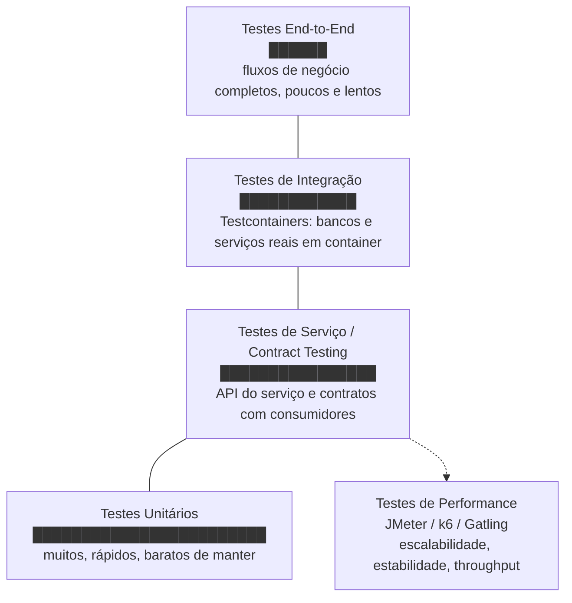

# Testes em Microsserviços

Testar um monólito já não é trivial, mas pelo menos todo o código roda no mesmo processo: um teste de integração sobe uma aplicação só, com um banco só, e cobre praticamente tudo. Numa arquitetura de microsserviços isso não existe mais. Cada serviço é implantado, versionado e escalado de forma independente, então garantir que o sistema como um todo continua funcionando exige uma estratégia de testes em várias camadas, cada uma cobrindo um tipo diferente de risco.

## Desafios de testar sistemas distribuídos

A [comunicação entre serviços](/labs/web-dev/microsservicos/comunicacao-entre-servicos/) é feita pela rede, e isso muda a natureza dos testes:

- **Natureza distribuída e dependências externas**: um teste que exercita um fluxo de ponta a ponta pode depender de vários serviços diferentes, cada um com seu próprio ciclo de deploy e sua própria versão rodando em cada ambiente. Um teste que passa hoje pode falhar amanhã não porque o código do serviço testado mudou, mas porque uma dependência dele mudou.
- **Consistência de dados entre serviços**: cada serviço normalmente tem o próprio banco de dados, então não existe uma transação única cobrindo tudo. Um teste que verifica um fluxo de negócio (por exemplo, "pedido criado gera cobrança") precisa lidar com o fato de que os dados desse fluxo estão espalhados em bancos diferentes, e a consistência entre eles pode ser eventual, não imediata (veja [Consistência e Replicação](/labs/web-dev/sistemas-distribuidos/consistencia-e-replicacao/) para o porquê disso).
- **Indisponibilidade de dependências**: se o teste depende de outro serviço estar de pé (ou de uma API externa de terceiros), ele fica sujeito à disponibilidade de coisas que a equipe não controla. Um serviço fora do ar no ambiente de teste não deveria travar o desenvolvimento de quem está mexendo em outro serviço completamente diferente.
- **Complexidade de ambiente**: reproduzir um ambiente parecido com produção para rodar testes significa subir múltiplos serviços, bancos, filas e brokers ao mesmo tempo, cada um com sua configuração. Isso é caro em tempo de execução, caro em recursos de máquina, e frágil, quanto mais peças móveis, mais chance de o ambiente de teste falhar por um motivo que não tem nada a ver com o código sendo testado.

A resposta para esses desafios não é testar tudo do mesmo jeito, e sim usar camadas de teste diferentes para riscos diferentes, cada uma pagando um preço diferente de velocidade, custo e confiança.

## A pirâmide de testes

A pirâmide de testes é o modelo mental clássico para decidir quanto investir em cada tipo de teste: muitos testes rápidos e baratos na base, poucos testes lentos e caros no topo. Em microsserviços o princípio continua valendo, só ganha camadas extras para cobrir a comunicação entre serviços.

O eixo vertical representa dois recursos que andam em direções opostas: quantidade de testes (muita na base, pouca no topo) e custo por teste (baixo na base, alto no topo, tanto em tempo de execução quanto em esforço de manutenção). Testes de performance ficam de fora da pilha principal porque não substituem nenhuma camada, eles atacam uma pergunta diferente ("o sistema aguenta a carga?") e costumam rodar à parte do pipeline normal, geralmente contra um serviço já testado funcionalmente.

### Testes unitários

Testam uma unidade de código isolada, uma classe, uma função, um método, sem tocar rede, banco de dados ou qualquer outro serviço. Dependências externas são substituídas por mocks ou stubs. É a camada mais barata: rodam em milissegundos, então dá para rodar centenas ou milhares deles a cada `commit` sem pensar duas vezes. Por isso formam a base da pirâmide, o feedback rápido deles é o que permite detectar a maioria dos bugs de lógica antes que o código chegue perto de qualquer ambiente compartilhado.

### Testes de serviço

Testam o serviço pela borda dele, chamando a própria API (HTTP, gRPC, o que for) sem depender de outros serviços reais estarem no ar. Dependências externas ainda são substituídas por dublês (mocks, stubs ou um serviço fake), mas agora o teste valida o serviço como um todo, incluindo roteamento, serialização, validação de entrada e o comportamento observável da API. Contract testing (detalhado adiante) normalmente entra nessa camada, validando que a API respeita o contrato esperado pelos consumidores, sem precisar subir os consumidores de verdade.

### Testes de integração

Testam a interação real do serviço com suas dependências diretas, banco de dados, cache, fila, ou até outro serviço, em vez de simular essas dependências com mocks. O problema histórico dessa camada era justo esse: para testar contra um banco Postgres de verdade, alguém precisava manter um banco Postgres de teste sempre disponível e num estado conhecido, o que trazia de volta o problema de complexidade de ambiente.

**Testcontainers** resolve isso subindo a dependência real (Postgres, Kafka, Redis, outro serviço, o que for) num container Docker efêmero, só para a duração do teste, e derrubando o container no final. Cada execução do teste começa com uma instância limpa da dependência, isolada de qualquer outro teste rodando em paralelo, sem exigir infraestrutura compartilhada nem mocks que fingem ser um banco de dados de verdade. O custo é que esses testes rodam mais devagar que os unitários (subir um container leva segundos, não milissegundos), então a quantidade deles é menor.

### Testes end-to-end

Testam um fluxo de negócio completo atravessando múltiplos serviços de verdade, do jeito que o usuário final experimenta o sistema. É a camada que dá mais confiança de que o sistema como um todo funciona, mas também a mais cara: mais lenta para rodar, mais difícil de manter (qualquer mudança em qualquer serviço do fluxo pode quebrar o teste), e mais instável (mais peças móveis, mais chance de falha por motivo alheio ao que está sendo testado, o chamado teste "flaky"). Por isso ficam concentrados nos poucos fluxos mais críticos do negócio, não em cada variação possível de cada funcionalidade, essa cobertura de detalhe já foi feita nas camadas de baixo.

### Testes de performance

Validam como o sistema se comporta sob carga: quantas requisições por segundo ele aguenta (throughput), como a latência se comporta conforme a carga aumenta, e se ele permanece estável rodando por um período longo em vez de degradar ou vazar recursos. Ferramentas como **JMeter**, **k6** e **Gatling** simulam múltiplos usuários ou requisições simultâneas contra o sistema e coletam métricas de latência, taxa de erro e throughput sob diferentes níveis de carga. Diferente das outras camadas, o objetivo aqui não é "a resposta está correta", é "o sistema aguenta receber isso", o que faz sentido rodar já com o sistema implantado num ambiente parecido com produção, não junto com os testes funcionais do dia a dia.

## Contract testing

Contract testing resolve um problema específico da comunicação entre serviços: como saber, antes de fazer deploy, que uma mudança no provedor de uma API não vai quebrar algum consumidor dela?

Numa arquitetura de microsserviços, um serviço provedor (por exemplo, o serviço de pagamentos) pode ter vários consumidores (o serviço de pedidos, o app mobile, um serviço de relatórios), cada um esperando um formato específico de request e response. O time que mantém o provedor não necessariamente sabe, só de olhar o próprio código, todos os campos que cada consumidor de fato usa. Sem contract testing, a forma de descobrir que uma mudança quebrou alguém é rodar um teste end-to-end pesado envolvendo todos os serviços, ou pior, descobrir em produção.

**Como funciona na prática**: cada consumidor define um contrato, um conjunto de expectativas sobre a API do provedor ("ao chamar `GET /pedidos/{id}`, espero um campo `status` do tipo string e um campo `total` do tipo number"). Esse contrato é então usado de duas formas:

1. **Do lado do consumidor**: o contrato vira um teste que roda contra um provedor fake, gerado a partir do próprio contrato. Isso garante que o código do consumidor sabe lidar com a resposta esperada, sem precisar do provedor real no ar.
2. **Do lado do provedor**: o mesmo contrato é reproduzido contra o provedor real (ou uma versão dele em teste), verificando se ele de fato entrega o que os consumidores esperam. Se o provedor mudar algo que quebra um contrato existente, esse teste falha antes do deploy, não depois.

Ferramentas como Pact seguem esse modelo de **consumer-driven contracts**: o consumidor publica o contrato, e um broker central mantém esses contratos disponíveis para os provedores verificarem contra eles em cada `build`. O ganho é rodar testes rápidos e isolados (nenhum dos dois lados precisa do outro rodando de verdade) com boa parte da confiança que um teste de integração completo daria, sem o custo de subir todos os serviços envolvidos.

## Boas práticas

- **Seguir a abordagem da pirâmide de testes**: investir a maior parte do esforço em testes unitários rápidos, usar as camadas de cima com moderação. Um sistema com poucos testes unitários e uma pilha grande de testes end-to-end lentos (a chamada "pirâmide invertida" ou "sorvete de casquinha") acaba com um pipeline de CI demorado e um time com medo de fazer deploy porque a suíte de testes é lenta demais para rodar com frequência.
- **Contract-first development**: definir o contrato da API (o formato de request e response) antes de implementar o serviço, e usar esse contrato tanto para gerar testes quanto para orientar consumidor e provedor a trabalharem em paralelo sem esperar um pelo outro. Isso reduz o retrabalho de descobrir, só na integração, que os dois lados entenderam a API de formas diferentes.
- **Usar mocks e stubs com critério**: mocks são ótimos para isolar uma unidade de código e deixar o teste rápido, mas um mock que não reflete o comportamento real da dependência dá falsa confiança, o teste passa, mas o sistema real quebra. A regra prática é: usar mocks nas camadas de baixo (unitários, testes de serviço), e trocar por dependências reais (via Testcontainers, por exemplo) assim que o teste precisa validar a interação de verdade com aquela dependência.
- **Automatizar testes**: testes que dependem de alguém rodar manualmente acabam não rodando. Integrar todas as camadas ao pipeline de [CI/CD](/labs/web-dev/entrega-continua/ci-cd-para-microsservicos/), com as camadas mais rápidas rodando a cada `commit` e as mais lentas (integração, end-to-end, performance) rodando em estágios posteriores do pipeline, é o que torna a pirâmide sustentável no dia a dia.
- **Shift-left testing**: mover a detecção de problemas para o mais cedo possível no ciclo de desenvolvimento, em vez de deixar para descobrir em produção. Isso inclui rodar testes localmente antes do `commit`, ter contract tests rodando no pipeline do consumidor e do provedor, e tratar falha de teste como algo que bloqueia o merge, não como um aviso que pode ser ignorado.
