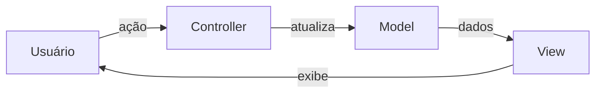
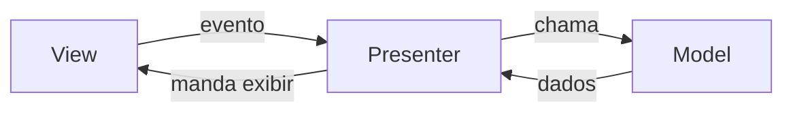
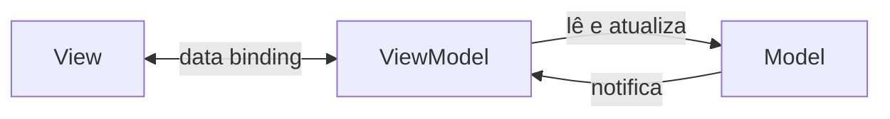

# Padrões de Apresentação: MVC, MVP e MVVM

A nota de [Arquitetura em Camadas](/labs/web-dev/engenharia-de-software/02-arquitetura-em-camadas/) organizou o backend em Controller, Service e Repository. Esta trata de um outro eixo: como o código que desenha a tela conversa com a regra de negócio e com os dados. MVC, MVP e MVVM são três respostas para essa mesma pergunta, e as diferenças entre elas estão em quem conhece quem e onde mora a lógica de apresentação.

## O problema que todos resolvem

Quando a lógica fica toda dentro do componente de tela (o famoso "código no `onClick`"), três coisas acontecem: fica difícil testar (para testar a regra você precisa de uma tela de verdade), fica difícil mudar (trocar o visual mexe na regra junto) e a mesma lógica acaba copiada em várias telas.

A saída é sempre separar em três papéis:

- **Model**: os dados e as regras de negócio. Não sabe que existe tela.
- **View**: o que o usuário vê e toca. Idealmente, "burra": só exibe e avisa quando algo acontece.
- **Uma peça no meio**: recebe os eventos da View, conversa com o Model, e decide o que a View mostra. Essa peça é o que muda de nome (Controller, Presenter, ViewModel) e de responsabilidade de um padrão para o outro.

Nenhum dos três é "o certo". A escolha depende do framework que você usa, de quanta interação a tela tem e de quanto você precisa testar a lógica isolada.

## MVC (Model-View-Controller)

O mais antigo dos três, de 1979, criado para as interfaces do Smalltalk.

- **Model**: dados e regras.
- **View**: a interface.
- **Controller**: recebe a ação do usuário (um clique, um envio de formulário), decide o que fazer e atualiza o Model. A View reflete o novo estado do Model.

O detalhe que confunde: **"MVC" quer dizer coisas diferentes em contextos diferentes.** No MVC clássico do Smalltalk, a View observa o Model diretamente e se redesenha quando ele muda. Já o "MVC" dos frameworks web (Ruby on Rails, Django, Spring MVC, Laravel, ASP.NET MVC) é outro desenho, às vezes chamado de Model 2: o Controller é a porta de entrada da requisição HTTP, busca o que precisa no Model e entrega para a View renderizar uma resposta. A View não observa nada, ela é gerada uma vez por requisição. Quando alguém fala "MVC", vale confirmar de qual dos dois está falando.

O ponto fraco clássico do MVC é o **fat controller**: como o Controller é o único lugar "esperto", a lógica vai se acumulando nele até virar um monstro de mil linhas. A [arquitetura em camadas](/labs/web-dev/engenharia-de-software/02-arquitetura-em-camadas/) resolve isso empurrando essa lógica para uma camada de serviço.

## MVP (Model-View-Presenter)

O MVP nasce para deixar a View o mais passiva possível e, com isso, testável.

- A **View** não tem lógica nenhuma. Ela expõe uma interface do tipo "mostre esta lista", "exiba este erro", "desabilite o botão", e avisa o Presenter quando o usuário faz algo.
- O **Presenter** guarda uma referência para essa interface da View. Ele recebe o evento, chama o Model, pega o resultado, formata, e manda a View exibir chamando os métodos da interface.
- O **Model** segue igual: dados e regra.

O ganho está no teste. Como o Presenter só conhece a View por uma interface, no teste você passa uma implementação falsa dessa interface e verifica: "quando o usuário clica em salvar e o Model dá erro, o Presenter chamou `view.mostrarErro()`?". Nada de renderizar tela. Essa testabilidade é o mesmo princípio que aparece em [Testes em Microsserviços](/labs/web-dev/engenharia-de-software/04-testes-em-microsservicos/): depender de interface, não de implementação.

O custo é o tédio: para cada coisa que a tela mostra, você escreve um método na interface da View e uma chamada no Presenter. Em telas simples, é burocracia.

## MVVM (Model-View-ViewModel)

O MVVM troca as chamadas manuais do MVP por **data binding**.

- O **ViewModel** expõe o estado da tela como propriedades observáveis (`carregando = true`, `itens = [...]`, `mensagemErro = ""`) e ações como comandos (`salvar()`).
- A **View** se **liga** a essas propriedades. Quando `itens` muda no ViewModel, a lista na tela atualiza sozinha. Quando o usuário digita num campo, a propriedade correspondente no ViewModel muda sozinha.
- Diferente do MVP, o **ViewModel não conhece a View**. Ele só publica estado; quem observa esse estado é problema do binding.

O MVVM é a variação do padrão **Presentation Model**, descrito por Martin Fowler. Ele é o modelo natural nos frameworks que já trazem data binding embutido: Angular, Vue, Svelte, WPF, SwiftUI, Jetpack Compose. Nesses, você quase escreve MVVM sem perceber, o ViewModel é o objeto de estado do componente.

O preço do data binding é que, quando algo dá errado, a mágica atrapalha: uma mudança na tela pode ter vindo de qualquer binding, e rastrear a origem de um valor errado é mais chato do que num fluxo explícito de MVP.

## Comparando os três

|      | Peça do meio | Conhece a View?                                                        | Como a View atualiza                             | Onde brilha                                                  |
| ---- | ------------ | ---------------------------------------------------------------------- | ------------------------------------------------ | ------------------------------------------------------------ |
| MVC  | Controller   | a View observa o Model (clássico) ou o Controller escolhe a View (web) | View lê do Model ou é renderizada por requisição | apps web server-side, fluxo requisição-resposta              |
| MVP  | Presenter    | sim, por uma interface                                                 | o Presenter chama métodos da View                | quando não há data binding e você quer testar a apresentação |
| MVVM | ViewModel    | não                                                                    | data binding automático                          | frameworks com binding embutido, telas com muito estado      |

Um jeito de lembrar: no MVP a peça do meio **empurra** para a View; no MVVM a View **puxa** da peça do meio.

## E os padrões do mundo mobile: MVVM-C e VIPER

Os dois últimos do post original vêm do ecossistema iOS, onde a tela (`UIViewController`) historicamente acumulava até a navegação entre telas.

- **MVVM-C** é MVVM mais um **Coordinator**: um objeto que centraliza "de qual tela vai para qual". Sem ele, cada ViewModel precisaria saber para onde navegar, o que amarra as telas umas nas outras. Com o Coordinator, o ViewModel só avisa "terminei aqui" e o Coordinator decide o próximo passo.
- **VIPER** quebra a tela em cinco: **V**iew, **I**nteractor (a regra do caso de uso, tipo "efetuar login"), **P**resenter (formata os dados do Interactor para a View), **E**ntity (os objetos de dado) e **R**outer (a navegação). É Clean Architecture aplicada a cada tela.

Essa granularidade toda ajuda em apps grandes, com muitas telas parecidas e times separados. Em app pequeno, vira cerimônia: cinco arquivos e um monte de protocolos para uma tela que mostra uma lista. Não são padrões nascidos no desenvolvimento web, e raramente fazem sentido fora de mobile.

## Como escolher

- **O framework já tem data binding?** Angular, Vue, Svelte, SwiftUI: MVVM é o caminho natural, não lute contra. Sem binding: MVP ou o MVC do framework.
- **Quanto de estado a tela tem?** Formulário com validação em tempo real, campos que aparecem e somem, listas que filtram: MVVM economiza muito código de sincronização. Tela que só exibe: qualquer um serve, use o mais simples.
- **Você precisa testar a apresentação isolada?** MVP e MVVM separam bem a lógica da tela; MVC clássico costuma deixar lógica presa na View.
- **Quanto de navegação existe?** Fluxos longos com muitas telas encadeadas justificam um Coordinator, independente do padrão de base.

Na prática, a maioria dos projetos web usa o MVC do framework no backend e algo próximo de MVVM no front, sem ninguém decidir isso formalmente, é o que o framework induz.

## Referências

- [GUI Architectures - Martin Fowler](https://martinfowler.com/eaaDev/uiArchs.html) - Martin Fowler, en
- [Presentation Model - Martin Fowler](https://martinfowler.com/eaaDev/PresentationModel.html) - Martin Fowler, en
- [MVP vs MVVM: principais diferenças, vantagens e desvantagens](https://zup.com.br/blog/mvp-vs-mvvm/) - Zup Innovation, pt-BR
- [Exploring the MVC, MVP, and MVVM design patterns](https://www.infoworld.com/article/2241819/exploring-the-mvc-mvp-and-mvvm-design-patterns.html) - InfoWorld, en
