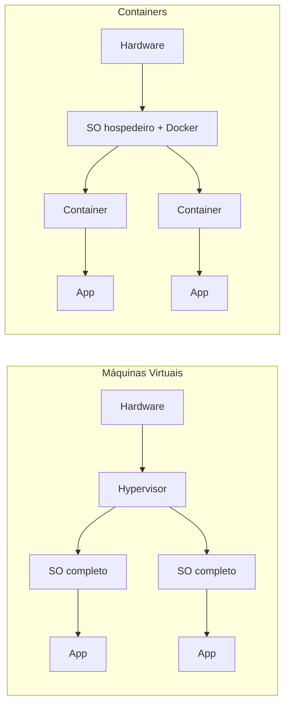

# Docker

## Por que containers existem

Antes de containers, rodar uma aplicação em produção geralmente significava instalar tudo direto na máquina: o runtime da linguagem, as bibliotecas do sistema operacional, as variáveis de ambiente certas. O problema clássico surge quando o ambiente onde o código foi escrito e testado não é exatamente igual ao ambiente onde ele roda de verdade: "na minha máquina funciona" costuma significar que existe uma diferença de versão de biblioteca, de configuração ou de sistema operacional entre os dois lugares, e essa diferença só aparece quando já é tarde demais.

Máquinas virtuais (VMs) resolveram parte disso simulando um computador inteiro, com seu próprio sistema operacional, dentro de outro computador. Cada VM carrega um kernel completo, o que garante isolamento forte entre aplicações, mas custa caro: cada VM consome gigabytes de disco e minutos para inicializar, mesmo para rodar uma aplicação pequena.

Containers isolam a aplicação e suas dependências sem duplicar o sistema operacional inteiro. Todos os containers de uma máquina compartilham o kernel do sistema operacional hospedeiro, e cada um enxerga apenas o próprio sistema de arquivos, processos e rede, isolados dos demais. O resultado é um pacote que:

- **Roda igual em qualquer lugar**: a mesma imagem que roda no notebook do desenvolvedor roda no servidor de produção, porque leva consigo tudo que precisa para funcionar.
- **É leve e rápido**: sem precisar inicializar um sistema operacional inteiro, um container sobe em segundos e ocupa uma fração do espaço de uma VM equivalente.
- **Isola dependências**: duas aplicações na mesma máquina podem usar versões diferentes da mesma biblioteca sem conflito, cada uma dentro do próprio container.
- **É portável**: a imagem construída uma vez pode rodar em qualquer máquina que tenha o Docker instalado, independente do sistema operacional por baixo.



## Conceitos básicos

Três termos aparecem o tempo todo ao trabalhar com Docker, e cada um cobre uma etapa diferente do ciclo:

- **Imagem**: um pacote somente leitura com a aplicação, suas dependências e as instruções de como rodar. Uma imagem é construída uma vez e pode ser reutilizada para criar quantos containers forem necessários.
- **Container**: uma instância em execução de uma imagem. Se a imagem é a receita, o container é o prato pronto, rodando de verdade, com processos ativos e um estado que pode mudar enquanto ele existe.
- **Dockerfile**: um arquivo de texto com as instruções, passo a passo, de como construir uma imagem: qual imagem base usar, quais arquivos copiar, quais comandos rodar, qual comando executar quando o container subir.

Um Dockerfile simples para uma aplicação Node.js:

```dockerfile
FROM node:20-alpine

WORKDIR /app

COPY package*.json ./
RUN npm ci --omit=dev

COPY . .

EXPOSE 3000
CMD ["node", "server.js"]
```

Cada linha vira uma camada da imagem final: `FROM` define a imagem base (aqui, uma versão enxuta do Node.js), `WORKDIR` define o diretório de trabalho dentro do container, `COPY` copia arquivos do host para dentro da imagem, `RUN` executa um comando durante a construção (nesse caso, instalar as dependências), `EXPOSE` documenta em qual porta a aplicação escuta, e `CMD` define o comando executado quando um container é iniciado a partir dessa imagem.


## Comandos essenciais

Com o Dockerfile pronto, o fluxo de trabalho básico usa quatro comandos:

- **`docker build`**: constrói uma imagem a partir de um Dockerfile.

  ```bash
  docker build -t minha-app:1.0 .
  ```

  O `-t` dá um nome (tag) à imagem, e o `.` indica que o Dockerfile está no diretório atual.

- **`docker run`**: cria e inicia um container a partir de uma imagem.

  ```bash
  docker run -d -p 3000:3000 --name minha-app minha-app:1.0
  ```

  O `-d` roda o container em segundo plano (detached), o `-p 3000:3000` mapeia a porta 3000 do host para a porta 3000 do container, e o `--name` dá um nome ao container para facilitar referências futuras.

- **`docker ps`**: lista os containers em execução no momento.

  ```bash
  docker ps
  ```

  Adicionar `-a` (`docker ps -a`) também mostra containers parados.

- **`docker images`**: lista as imagens disponíveis localmente, com nome, tag e tamanho.

  ```bash
  docker images
  ```

## Docker Compose

Uma aplicação real raramente é só um processo isolado: normalmente ela precisa de um banco de dados, talvez um cache, talvez outros serviços auxiliares rodando junto. Subir cada um manualmente com `docker run`, acertando portas e redes na mão, funciona, mas é repetitivo e fácil de errar. O **Docker Compose** resolve isso descrevendo toda a aplicação multi-container num único arquivo declarativo, e sobe (ou derruba) tudo com um comando só.

Um `docker-compose.yml` para uma aplicação com API e banco de dados:

```yaml
services:
  api:
    build: .
    ports:
      - "3000:3000"
    environment:
      DATABASE_URL: postgres://user:senha@db:5432/app
    depends_on:
      - db

  db:
    image: postgres:16
    environment:
      POSTGRES_USER: user
      POSTGRES_PASSWORD: senha
      POSTGRES_DB: app
    volumes:
      - db-data:/var/lib/postgresql/data

volumes:
  db-data:
```

Com esse arquivo, `docker compose up` constrói a imagem da API (a partir do Dockerfile local), sobe o container do Postgres, e conecta os dois numa rede interna criada automaticamente, onde a API consegue chamar o banco pelo nome do serviço (`db`) em vez de um IP fixo. O `volumes` garante que os dados do banco sobrevivem mesmo se o container for recriado, e `depends_on` controla a ordem de inicialização.

Docker Compose é especialmente útil para desenvolvimento local: qualquer pessoa que clone o repositório roda `docker compose up` e tem o ambiente completo funcionando, sem instalar Postgres, Redis ou qualquer outra dependência direto na própria máquina.

## Casos de uso

- **Desenvolvimento local**: ambiente consistente entre todos os membros do time, sem depender de instalar dependências direto no sistema operacional de cada um.
- **Pipelines de CI/CD**: builds reproduzíveis, já que o container de build carrega as mesmas ferramentas e versões em qualquer máquina que rode o pipeline.
- **Empacotamento de serviços**: cada microsserviço vira uma imagem independente, com suas próprias dependências, pronta para ser distribuída e executada em qualquer lugar.
- **Infraestrutura consistente entre ambientes**: a mesma imagem testada em staging é a que vai para produção, eliminando divergências entre os dois ambientes.
