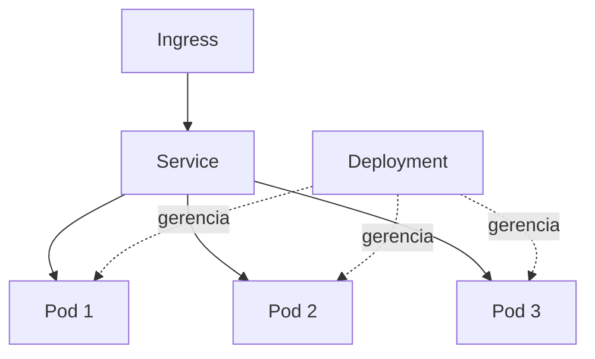

# Kubernetes

## O que é e por que existe

Docker (veja [Docker](/labs/web-dev/entrega-continua/docker/)) resolve o problema de empacotar uma aplicação e suas dependências num container que roda igual em qualquer lugar. Mas rodar um container isolado na própria máquina é uma coisa; manter centenas deles, espalhados por dezenas de servidores, em produção, é outra completamente diferente. Quem garante que um container reinicie sozinho se travar? Quem decide em qual servidor cada container deve rodar, considerando CPU e memória disponíveis? Quem distribui tráfego entre as réplicas de um serviço, e atualiza todas elas para uma nova versão sem deixar o sistema fora do ar no meio do caminho?

Fazer isso manualmente, com scripts e disciplina de equipe, funciona até um certo tamanho e para de funcionar rápido. O **Kubernetes** (também chamado de k8s) é um orquestrador de containers: um sistema que automatiza o deploy, a escala e o gerenciamento de aplicações em containers, tomando decisões como "esse container morreu, sobe outro no lugar" ou "esse serviço está sobrecarregado, cria mais réplicas" sem intervenção manual.

## Conceitos centrais

Kubernetes organiza tudo em torno de um punhado de recursos, cada um com uma responsabilidade específica:

- **Pod**: a menor unidade deployável no Kubernetes. Um Pod embrulha um ou mais containers que precisam rodar juntos, compartilhando rede e armazenamento. Na prática, a grande maioria dos Pods roda um único container; múltiplos containers no mesmo Pod são reservados para casos onde um container auxiliar precisa viver colado ao principal (um proxy de rede, por exemplo).
- **Deployment**: descreve declarativamente quantas réplicas de um Pod devem existir e qual versão da imagem elas devem rodar. É o Deployment que sabe como fazer atualizações (trocar a versão da imagem gradualmente) e rollbacks (voltar para a versão anterior se algo der errado).
- **Service**: um endpoint de rede estável na frente de um conjunto de Pods. Como Pods nascem, morrem e trocam de IP o tempo todo, o Service dá um nome e um endereço fixos para quem precisa chamar aquele conjunto de Pods, sem se preocupar com qual instância específica está viva no momento.
- **ConfigMap e Secret**: externalizam configuração para fora da imagem do container. ConfigMap guarda valores não sensíveis (URLs, flags de feature), Secret guarda dados sensíveis (senhas, tokens, chaves de API), ambos podem ser injetados como variáveis de ambiente ou arquivos dentro do Pod, sem precisar reconstruir a imagem para mudar um valor de configuração.
- **Ingress**: gerencia o acesso externo (HTTP/HTTPS) para os Services dentro do cluster, funcionando como um roteador de borda que decide, com base na URL ou no domínio, para qual Service encaminhar cada requisição vinda de fora.
- **Namespace**: um jeito de dividir o cluster em espaços isolados, geralmente usado para separar ambientes (dev, staging, produção) ou times dentro da mesma organização, sem que um consiga interferir nos recursos do outro por acidente.



O Deployment garante que o número certo de Pods está de pé e atualiza suas versões; o Service dá um ponto de entrada estável para chegar até eles; o Ingress expõe esse Service para fora do cluster.

## Benefícios

Automatizar a orquestração desses recursos traz um conjunto de ganhos que seriam caros de implementar manualmente:

- **Auto-scaling**: o número de Pods de um Deployment pode crescer ou diminuir automaticamente com base em métricas como uso de CPU, adaptando a capacidade disponível à carga real de tráfego.
- **Self-healing**: se um container trava, para de responder ou o Pod inteiro morre, o Kubernetes detecta e sobe uma substituição automaticamente, sem esperar alguém perceber o problema.
- **Rolling updates e rollbacks**: uma nova versão da aplicação é implantada gradualmente, trocando Pods antigos por novos aos poucos, sem derrubar o serviço; se a nova versão apresentar problema, um rollback volta para a versão anterior com o mesmo mecanismo.
- **Service discovery e load balancing nativos**: o Kubernetes resolve, por baixo dos panos, o problema de saber onde cada Pod está rodando e distribuir tráfego entre eles (aprofundado em [Service Discovery](/labs/web-dev/escalabilidade/service-discovery/)), sem exigir nenhuma configuração extra da aplicação.
- **Otimização de recursos**: o agendador do Kubernetes decide em qual nó (servidor) cada Pod deve rodar considerando CPU e memória disponíveis, encaixando as cargas de trabalho de forma mais eficiente do que uma distribuição manual.
- **Alta disponibilidade**: réplicas de um mesmo serviço podem ser espalhadas por diferentes nós ou zonas, então a falha de uma máquina isolada não derruba o serviço inteiro.

## Comandos essenciais

O `kubectl` é a ferramenta de linha de comando usada para interagir com um cluster Kubernetes:

- **`kubectl get pods`**: lista os Pods em execução no namespace atual.

  ```bash
  kubectl get pods
  ```

- **`kubectl get svc`**: lista os Services do namespace atual, com seus endereços internos.

  ```bash
  kubectl get svc
  ```

- **`kubectl apply -f deployment.yaml`**: aplica (cria ou atualiza) os recursos descritos num arquivo YAML. É o comando central do fluxo declarativo do Kubernetes: em vez de dar comandos imperativos, você descreve o estado desejado e deixa o cluster convergir para ele.

  ```bash
  kubectl apply -f deployment.yaml
  ```

- **`kubectl logs <pod-name>`**: mostra os logs de um Pod específico, essencial para depurar um container que não está se comportando como esperado.

  ```bash
  kubectl logs minha-app-7d9f8c-x2k9p
  ```

- **`kubectl describe <resource>`**: mostra detalhes completos de um recurso (Pod, Deployment, Service), incluindo eventos recentes, o que ajuda a entender por que um Pod não sobe ou fica travado em estado de pendente.

  ```bash
  kubectl describe pod minha-app-7d9f8c-x2k9p
  ```
