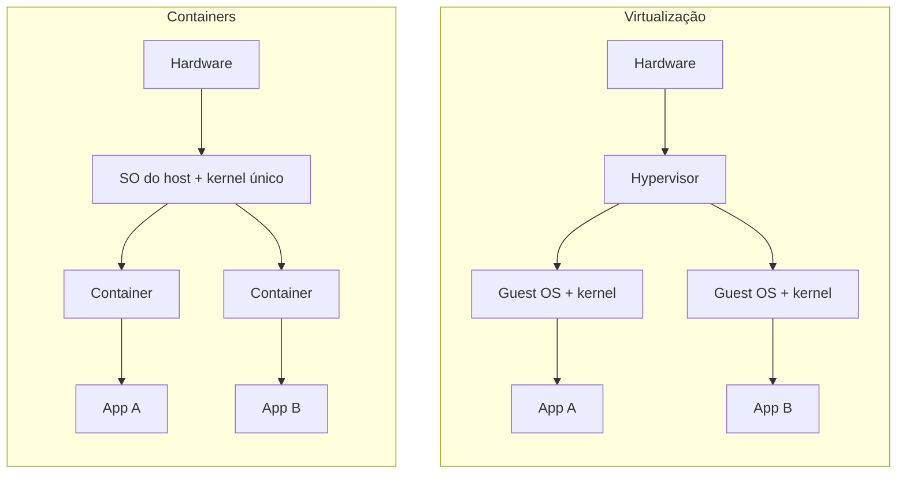
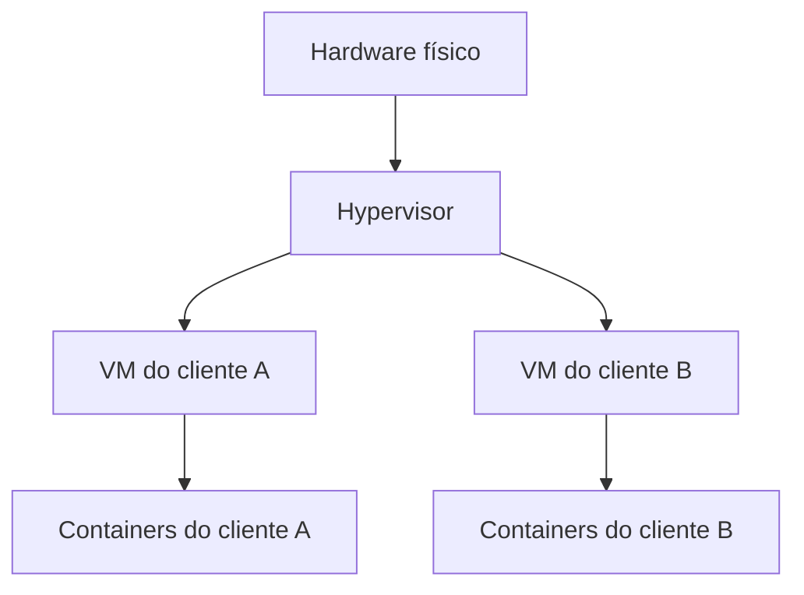

# Virtualização vs Containers

A nota de [Docker](/labs/web-dev/entrega-continua/01-docker/) apresenta os containers como uma alternativa mais leve às máquinas virtuais. Aqui a comparação fica mais precisa: o que cada abordagem isola de verdade, onde cada uma falha e por que, na prática, muita gente usa as duas ao mesmo tempo.

A diferença de fundo cabe numa frase: **VMs dão a cada workload o seu próprio kernel; containers dividem o kernel do host.** O resto (velocidade, tamanho, segurança) deriva disso.



## Virtualização (VMs)

Uma máquina virtual é um computador simulado por software. Cada workload recebe uma máquina completa: CPU, memória, disco e rede virtuais, com um **guest OS** (o sistema operacional convidado) e um kernel só dele. A aplicação dentro da VM não sabe que está numa VM, ela enxerga o que parece ser hardware comum.

Quem cria e gerencia essas máquinas é o **hypervisor**, uma camada de software que divide o hardware físico entre as VMs e impede que uma mexa na memória da outra. Existem dois tipos:

- **Tipo 1 (bare-metal)**: roda direto sobre o hardware, sem sistema operacional no meio. É o que servidores e nuvens usam (KVM, VMware ESXi, Hyper-V, Xen).
- **Tipo 2 (hospedado)**: roda como um programa comum dentro de um sistema operacional já instalado. É o que você usa no notebook (VirtualBox, VMware Workstation).

O que isso entrega:

- **Isolamento forte**: uma VM comprometida precisa escapar do hypervisor para chegar às vizinhas, e essa superfície de ataque é pequena se comparada à de um kernel inteiro.
- **Flexibilidade de sistema operacional**: dá para rodar Windows, Linux e BSD lado a lado no mesmo servidor, cada um com o kernel e a versão que quiser.

E o que custa: cada VM carrega um sistema operacional inteiro, então gasta memória e disco mesmo quando a aplicação é minúscula, e leva de dezenas de segundos a minutos para ficar pronta. Se você tem 50 microsserviços pequenos, são 50 sistemas operacionais para atualizar, aplicar patch e monitorar.

## Containers

Um container é um **processo comum do Linux com uma visão restrita do sistema**. Não existe "máquina" nenhuma ali: o kernel do host executa o processo normalmente, só que o enganando sobre o que ele pode ver e usar. Dois recursos do kernel fazem isso:

- **Namespaces** definem o que o processo enxerga: a árvore de processos (ele acha que é o PID 1), a rede, os pontos de montagem do sistema de arquivos, o hostname, os usuários.
- **cgroups** (control groups) definem quanto ele pode consumir: limites de CPU, memória e I/O.

Você pode ver isso sem Docker nenhum:

```bash
# cria um processo com PID e mount namespaces próprios
sudo unshare --fork --pid --mount-proc bash
ps aux   # só mostra o próprio bash e o ps
```

O Docker empacota esses recursos numa interface amigável e soma o sistema de imagens em camadas por cima, mas por baixo é isso.

O que isso entrega:

- **Velocidade**: iniciar um container é iniciar um processo, então leva milissegundos a poucos segundos.
- **Uso eficiente de recursos**: sem um sistema operacional por workload, cabem muito mais containers do que VMs na mesma máquina. Essa densidade é o motivo de os containers terem dominado o deploy de microsserviços.

E o que custa:

- **Isolamento mais fraco**: todos os containers usam o mesmo kernel. Namespaces e cgroups não criam um kernel separado, então uma vulnerabilidade no kernel (ou uma chamada de sistema mal tratada) pode permitir que um container escape para o host e enxergue os outros. Por isso existem camadas de reforço como seccomp, AppArmor e SELinux, e a recomendação de não rodar containers como root.
- **Compatibilidade de sistema operacional limitada**: o container usa o kernel do host, então um container Linux só roda em kernel Linux. Um container que depende de uma versão específica de kernel ou de um módulo que o host não tem simplesmente não funciona.

## Comparando os dois

| Critério | VMs | Containers |
| --- | --- | --- |
| Kernel | Um por VM | Compartilhado com o host |
| Isolamento | Forte, na fronteira do hypervisor | Mais fraco, na fronteira do kernel |
| Tempo de inicialização | Dezenas de segundos a minutos | Milissegundos a segundos |
| Tamanho típico | Gigabytes | Megabytes a poucas centenas de MB |
| Densidade por servidor | Dezenas | Centenas |
| Sistema operacional | Qualquer um | Mesmo tipo de kernel do host |
| Portabilidade | Imagens grandes, mais pesadas de mover | Imagens pequenas, fáceis de distribuir |

Uma regra prática para escolher:

- Prefira **VMs** quando a fronteira de segurança importa mais que a velocidade (código de terceiros, clientes diferentes no mesmo hardware, requisitos de compliance), quando precisa de outro sistema operacional ou quando roda software legado que espera uma máquina inteira.
- Prefira **containers** quando o objetivo é entregar rápido e em escala: serviços próprios, pipelines de CI/CD, ambientes de desenvolvimento idênticos aos de produção, escala horizontal com [Kubernetes](/labs/web-dev/entrega-continua/03-kubernetes/).

Os números da tabela são ordens de grandeza, não garantias: uma VM enxuta e um container inchado podem inverter a comparação.

## Usando os dois juntos

Na prática, a pergunta raramente é "VM ou container". Os dois costumam estar empilhados:

- **Docker Desktop no Windows e no macOS**: como containers Linux precisam de um kernel Linux, o Docker Desktop sobe uma VM Linux leve por baixo e roda os containers dentro dela.
- **Nuvem pública**: os nós de um cluster Kubernetes (EKS, GKE, AKS) normalmente são VMs. Os containers rodam dentro dessas VMs, e a nuvem entrega e cobra a VM.



A ideia é cada camada fazer o que faz melhor: a VM traça a fronteira forte entre quem não deve se enxergar, e os containers dão velocidade e densidade dentro dessa fronteira.

Isso leva ao conceito de **domínio de confiança** (trust domain): um grupo de workloads que confiam entre si o suficiente para dividir um kernel. Containers da mesma equipe, do mesmo produto, com código revisado, podem dividir uma VM sem drama. Já em um ambiente **multi-tenant**, onde clientes diferentes (ou código que você não escreveu) rodam na mesma infraestrutura, cada tenant deveria ficar num domínio próprio, ou seja, numa VM separada ou num sandbox mais forte, como os da próxima seção.

## Meio-termo: microVMs e sandboxes

Existe uma faixa entre "container rápido mas com kernel compartilhado" e "VM segura mas pesada". Algumas tecnologias tentam ocupar esse espaço:

- **Firecracker**: um monitor de microVMs criado pela AWS (usado em Lambda e Fargate). Cada workload roda numa microVM com kernel próprio, isolada por virtualização de hardware (KVM), mas com um dispositivo virtual mínimo, o que faz a VM subir em cerca de 125 ms e gastar poucos MB de memória. É isolamento de VM com cara de container.
- **gVisor**: criado pelo Google, é um kernel escrito em espaço de usuário. Ele intercepta as chamadas de sistema do container e as trata por conta própria, expondo ao kernel real do host uma superfície bem menor. Não usa hardware de virtualização, então o isolamento é mais forte que o de um container comum, mas o overhead em chamadas de sistema pesadas é maior.
- **Kata Containers**: roda cada container (ou cada pod do Kubernetes) dentro de uma VM leve, mantendo a interface de container. Você continua usando imagens e orquestradores normais, e ganha um kernel por workload.

A escolha depende do que você precisa proteger. Se o risco é rodar código não confiável (plataformas de funções, código gerado por IA, clientes distintos), a microVM é a opção mais segura. Se o objetivo é endurecer containers sem mudar muito a operação, o gVisor costuma ser mais simples de encaixar. Nenhuma das três é necessária para um serviço interno comum: um container bem configurado, sem root e com privilégios mínimos, resolve.

## Referências

- [Contêineres versus máquinas virtuais](https://learn.microsoft.com/pt-br/virtualization/windowscontainers/about/containers-vs-vm) - Microsoft Learn, pt-BR
- [Containers vs. Máquinas virtuais (VMs): Qual é a diferença?](https://www.netapp.com/pt/blog/containers-vs-vms/) - NetApp, pt-BR
- [Docker security](https://docs.docker.com/engine/security/) - Documentação oficial do Docker, en
- [Firecracker](https://firecracker-microvm.github.io/) - AWS, en
- [gVisor documentation](https://gvisor.dev/docs/) - Google, en
