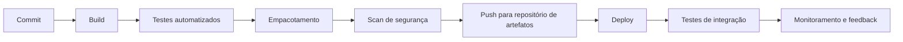

# CI/CD para Microsserviços

## Por que automatizar

Num sistema com um monólito só, um humano consegue rodar os testes, empacotar e fazer o deploy manualmente sem sofrer demais, mesmo que o processo seja lento. Num sistema com dezenas de microsserviços, cada um evoluindo no próprio ritmo e sendo implantado de forma independente, o mesmo processo manual simplesmente não escala: são dezenas de builds, dezenas de suítes de teste, dezenas de deploys, todos precisando acontecer de forma consistente e frequente.

CI/CD (integração contínua e entrega/deploy contínuos) automatiza essa cadeia inteira, do commit até o código rodando em produção, e resolve três problemas de uma vez:

- **Qualidade**: testes e verificações automáticas rodam em toda mudança, então um bug óbvio é pego antes de chegar em produção, não depois.
- **Consistência**: o mesmo pipeline roda do mesmo jeito para todo mundo, eliminando a variação de "eu testei na minha máquina" que existia nos deploys manuais.
- **Velocidade**: sem esperar um humano clicar em botões e copiar arquivos manualmente, o tempo entre escrever uma mudança e ela estar disponível para os usuários cai de dias para minutos.

## Etapas do pipeline

Um pipeline de CI/CD para microsserviços normalmente segue uma sequência parecida com esta, cada etapa só avança se a anterior passar:

- **Commit**: o gatilho de tudo. Toda mudança enviada ao Git (um push, um pull request) dispara o pipeline automaticamente.
- **Build**: o código é compilado (ou, em linguagens interpretadas, suas dependências são instaladas e validadas), pegando erros de sintaxe e de tipo cedo.
- **Testes automatizados**: a suíte de testes do serviço roda, cobrindo desde testes unitários rápidos até testes de contrato entre serviços (aprofundado em [Testes em Microsserviços](/labs/web-dev/engenharia-de-software/testes-em-microsservicos/)).
- **Empacotamento**: o código que passou nos testes é empacotado num artefato, tipicamente uma imagem Docker (veja [Docker](/labs/web-dev/entrega-continua/docker/)), pronta para ser executada em qualquer ambiente.
- **Scan de segurança**: ferramentas automatizadas analisam o código (SAST) e as dependências usadas, procurando vulnerabilidades conhecidas antes que o artefato siga adiante.
- **Push para repositório de artefatos**: a imagem aprovada é publicada num registro (um registry de imagens Docker, por exemplo), com uma tag que identifica exatamente essa versão.
- **Deploy**: o artefato publicado é implantado no ambiente alvo (dev, QA, produção), normalmente aplicando a nova versão num cluster Kubernetes (veja [Kubernetes](/labs/web-dev/entrega-continua/kubernetes/)).
- **Testes de integração**: já no ambiente implantado, testes verificam se o serviço realmente funciona junto com suas dependências reais, não só isolado.
- **Monitoramento e feedback**: depois do deploy, métricas, logs e alertas indicam se a nova versão está saudável, fechando o ciclo com informação real de produção.

## Boas práticas de CI/CD

- **Commits pequenos e frequentes**: mudanças menores são mais fáceis de revisar, testar e, se algo der errado, reverter. Integrar código com frequência também evita o acúmulo de conflitos difíceis de resolver.
- **Build e testes automatizados**: nenhuma etapa de verificação deve depender de alguém lembrar de rodar algo manualmente. Se não está automatizado, mais cedo ou mais tarde alguém vai pular a etapa.
- **Artefatos imutáveis**: uma vez construído e taggeado, o artefato não muda. O mesmo artefato testado em staging é, byte a byte, o que vai para produção, eliminando a dúvida de "será que era exatamente esse código que foi testado?".
- **Deploys automatizados**: o processo de colocar uma nova versão no ar segue o mesmo script, todas as vezes, sem passos manuais que variam de pessoa para pessoa.
- **Estratégia de rollback**: quando algo dá errado em produção, o caminho de volta para a versão anterior precisa ser tão automatizado e rápido quanto o caminho de ida.
- **Monitoramento pós-deploy**: o trabalho não termina quando o deploy termina. Acompanhar métricas de erro e latência logo depois de uma implantação é o que permite detectar (e reverter) um problema antes que afete todo mundo.

## Como as peças se conectam

Juntando tudo: um desenvolvedor faz um commit e dá push para o Git. Esse push dispara o servidor de CI, que builda o código, roda a suíte de testes e, se tudo passar, empacota o serviço numa imagem Docker seguindo o processo descrito em [Docker](/labs/web-dev/entrega-continua/docker/). A imagem passa por um scan de segurança e é publicada num repositório de artefatos com uma tag de versão.

A partir daí, a etapa de deploy aplica essa nova imagem no cluster Kubernetes, seguindo o modelo declarativo descrito em [Kubernetes](/labs/web-dev/entrega-continua/kubernetes/): o Deployment sobe novos Pods com a versão atualizada, o rolling update troca as instâncias antigas pelas novas gradualmente, e o Service continua roteando tráfego sem interrupção durante a troca. Depois do deploy, testes de integração validam o comportamento real do serviço no ambiente, e o monitoramento acompanha logs, métricas e alertas para confirmar que a nova versão está saudável, ou para disparar um rollback rápido se não estiver.

O resultado é uma linha contínua entre o código escrito por um desenvolvedor e esse mesmo código rodando, de forma confiável, em produção, repetida automaticamente a cada mudança e para cada um dos microsserviços do sistema, de forma independente.
