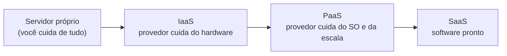
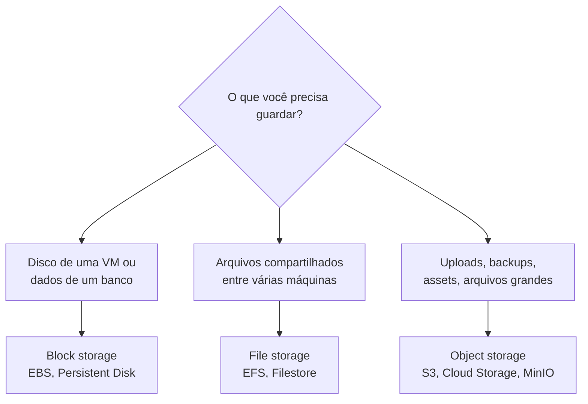

# Categorias de Serviço em Nuvem

Rodar um sistema em produção envolve máquina, disco, rede, banco, fila, monitoramento. Você pode cuidar de tudo isso na mão, num servidor próprio, ou alugar cada pedaço pronto de um provedor de nuvem. A questão nunca é "tudo ou nada": é decidir, peça por peça, quanto trabalho operacional você quer terceirizar.

## IaaS, PaaS e SaaS

Essas três siglas descrevem o quanto o provedor entrega pronto.

- **IaaS** (infraestrutura como serviço): você aluga a máquina, virtual ou física, e cuida de todo o resto, sistema operacional, runtime, sua aplicação. Exemplos: AWS EC2, Google Compute Engine.
- **PaaS** (plataforma como serviço): você entrega o código e a plataforma cuida de provisionar servidor, escalar, aplicar patch de segurança, configurar o balanceador. Exemplos: Heroku, Google App Engine, Render.
- **SaaS** (software como serviço): o software já está pronto e rodando, você só acessa e usa. Gmail, Notion, Slack.

A analogia clássica é a da pizza. Fazer em casa do zero é como ter servidor próprio. Comprar a massa pronta e assar é IaaS. Pedir delivery é PaaS. Ir ao restaurante é SaaS: você não lava nem o prato.

O que muda entre os níveis é a **responsabilidade compartilhada**: quanto mais o provedor entrega pronto, menos coisa é sua para configurar e manter, mas também menos controle você tem sobre os detalhes. Segurança segue a mesma linha, o provedor cuida da segurança "da nuvem" (data center, hipervisor), e você cuida da segurança "na nuvem" (suas permissões, suas senhas, seu código).

## Categorias de serviço

Dentro de um provedor de IaaS/PaaS, os serviços se organizam em algumas famílias. Não precisa decorar nomes de produto, só reconhecer para que serve cada família:

| Categoria | Para que serve | Exemplos (AWS / GCP) |
| --- | --- | --- |
| Compute | Rodar código: VMs, containers, funções | EC2, ECS / Compute Engine, Cloud Run |
| Storage | Guardar arquivos e blocos de dados | S3, EBS / Cloud Storage, Persistent Disk |
| Rede | Conectar e expor: rede privada, balanceador, DNS, CDN | VPC, ELB, Route 53, CloudFront / VPC, Cloud Load Balancing |
| Bancos gerenciados | Banco sem você administrar o servidor | RDS, DynamoDB, ElastiCache / Cloud SQL, Firestore |
| Mensageria gerenciada | Filas e streaming prontos | SQS, MSK / Pub/Sub |
| Observabilidade | Métricas, logs e alertas | CloudWatch / Cloud Monitoring |
| Identidade (IAM) | Quem pode fazer o quê | IAM / IAM |

Quase toda peça deste lab tem uma versão "as a service": em vez de instalar e operar Redis, você usa um [cache gerenciado](/labs/web-dev/escalabilidade/08-cache-e-redis/); em vez de administrar um Postgres, usa um [banco gerenciado](/labs/web-dev/banco-de-dados/06-escolha-de-banco-de-dados/); em vez de manter um cluster Kafka, usa mensageria gerenciada. O custo é sempre o mesmo trade-off: menos trabalho operacional, mais dependência do provedor e, em geral, conta mais cara por unidade.

## Storage: block, file e object

"Storage" na nuvem não é uma coisa só. Existem três tipos, e usar o errado custa caro ou trava a escala.

**Block storage** é um disco cru anexado a uma máquina, como um HD externo. Rápido, ótimo para o disco de sistema de uma VM ou para o arquivo de dados de um banco. A limitação: normalmente só uma máquina monta o volume por vez.

**File storage** é um sistema de arquivos em rede (protocolo NFS), compartilhado entre várias máquinas ao mesmo tempo, com pastas e permissões como você já conhece. Útil quando várias instâncias precisam ler e escrever nos mesmos arquivos.

**Object storage** é diferente: você guarda cada arquivo como um objeto com uma chave, e acessa por HTTP. Não tem hierarquia real de pastas (o "caminho" é só parte do nome), não dá para editar um pedaço do arquivo, mas escala praticamente sem limite e é barato. É onde vão uploads de usuário, backups, assets estáticos de site, arquivos de log arquivados, data lake.

Os nomes que você vai ouvir: **Amazon S3** é o object storage mais conhecido e virou praticamente um padrão de API; **Google Cloud Storage** e **Azure Blob Storage** são os equivalentes; **MinIO** é uma implementação open source que você mesmo hospeda e que fala a mesma API do S3, útil para desenvolvimento local ou nuvem privada. Sistemas de arquivos distribuídos mais antigos como **HDFS** (do ecossistema Hadoop) e **Ceph** resolvem o mesmo problema de guardar volumes enormes de forma confiável, e hoje boa parte desse uso migrou para object storage.

Uma regra que aparece em [Stateless, Particionamento e Sharding](/labs/web-dev/escalabilidade/02-stateless-e-particionamento/): arquivo enviado por usuário nunca vai para o disco local da instância, vai para object storage. O disco local some quando a instância é substituída, e some junto com a capacidade de escalar horizontalmente.

## Serverless e edge

**Serverless** (ou FaaS, função como serviço) leva o PaaS ao extremo: você sobe uma função, e o provedor a executa só quando ela é chamada, criando e destruindo a capacidade sozinho. Se ninguém chama, você não paga nada (escala a zero). Exemplos: AWS Lambda, Cloud Functions, Cloudflare Workers.

Os trade-offs são reais:

- **Cold start**: a primeira chamada depois de um tempo parado é mais lenta, porque o ambiente precisa ser criado
- **Limite de tempo e recursos**: função não serve para processo longo; costuma ter teto de alguns minutos
- **Lock-in**: o código acaba amarrado ao formato de evento e às integrações daquele provedor

**Edge computing** é rodar código não num data center central, mas nos pontos de presença espalhados pelo mundo (a mesma malha que a [CDN](/labs/web-dev/escalabilidade/04-cdn/) usa para servir conteúdo). Como o código roda fisicamente perto do usuário, a latência cai bastante. Serve bem para tarefas curtas no caminho da requisição: checar autenticação, redirecionar, escolher a variante de um teste A/B, personalizar um cabeçalho. Não serve para lógica pesada ou acesso a banco central, que continua longe.

## Escolher provedor

Os três grandes são AWS, Azure e GCP, com catálogos parecidos e cobertura global. Fora deles, opções menores como DigitalOcean, Fly.io e Render entregam menos serviços, porém com preço e experiência de uso mais simples, o que costuma bastar para projetos pequenos e médios.

Na hora de decidir, o que pesa:

- Quais serviços gerenciados você realmente vai usar (se depende muito de um banco específico, veja quem oferece)
- Preço, incluindo o custo de tráfego de saída, que quase sempre é a surpresa da fatura
- Região: onde ficam seus usuários e se há exigência legal de manter dados no país
- Familiaridade do time, porque operar nuvem mal configurada é pior que não usar

Sobre **multi-cloud** e **lock-in**: dá para reduzir a amarra usando serviços mais genéricos (uma VM é uma VM em qualquer lugar) em vez dos mais exclusivos, mas isso tem um custo. Você abre mão justamente dos serviços gerenciados que tornam a nuvem vantajosa. Para a maioria dos times, escolher um provedor e ir fundo nele compensa mais do que manter tudo portável "por precaução".
