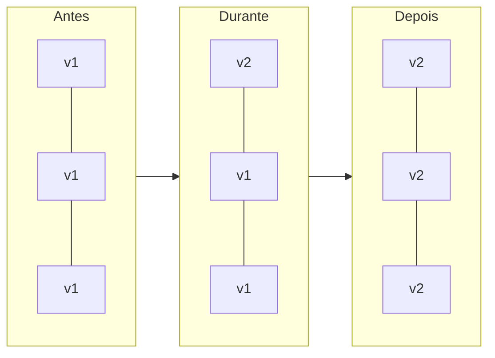
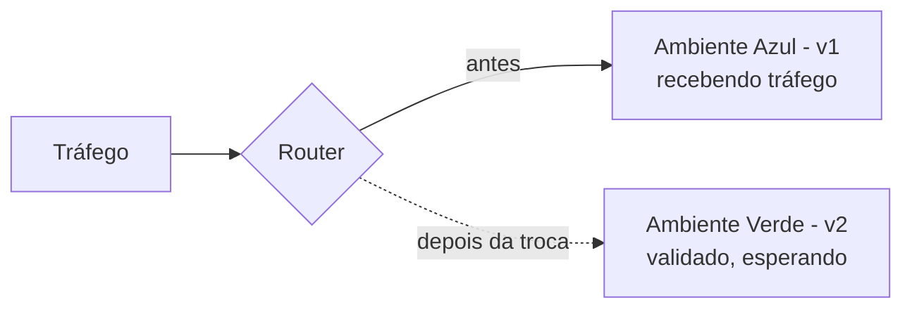
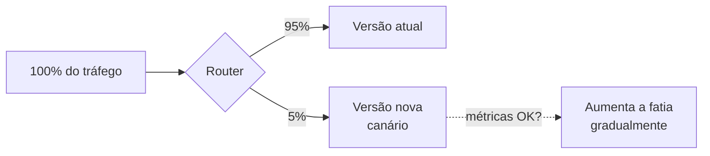
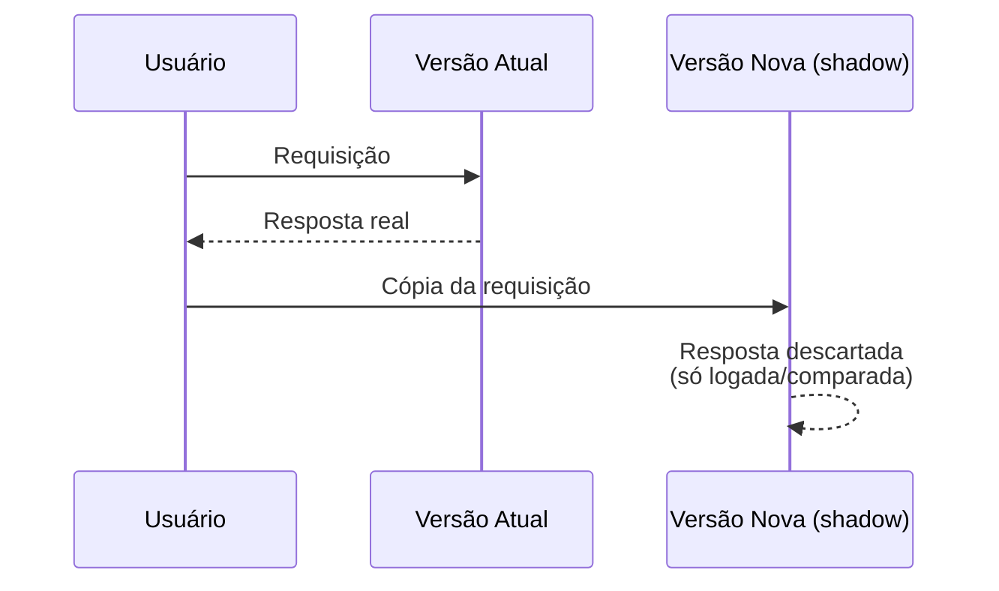

# Padrões de Deployment

A nota de [CI/CD para Microsserviços](/labs/web-dev/entrega-continua/03-ci-cd-para-microsservicos/) termina com o pipeline aplicando uma imagem nova no cluster Kubernetes, e menciona de passagem que "o rolling update troca as instâncias antigas pelas novas gradualmente". Rolling é só um jeito de fazer essa troca. Existem vários outros, e a diferença entre eles não é estética: cada um lida com um tipo de risco diferente.

Todo padrão de deployment resolve o mesmo problema básico (colocar código novo no ar sem quebrar o que já está funcionando), mas cada um decide de um jeito diferente onde fica o risco durante a transição: quanto tempo as duas versões coexistem, quantos usuários são afetados se a versão nova tiver um bug, quão rápido dá para voltar atrás, e quanta infraestrutura extra isso custa. Não existe padrão "melhor", existe o padrão certo para o que você está tentando proteger num deploy específico.

## Rolling

O rolling update substitui as instâncias antigas pelas novas aos poucos, uma leva de cada vez, em vez de derrubar tudo e subir tudo de novo.



É a estratégia nativa do Kubernetes: o `Deployment` controla quantas instâncias novas sobem por vez (`maxSurge`) e quantas instâncias antigas podem ficar indisponíveis ao mesmo tempo (`maxUnavailable`), garantindo que o serviço nunca fique totalmente fora do ar durante a troca (veja [Kubernetes](/labs/web-dev/entrega-continua/02-kubernetes/)).

O ponto fraco é justamente o que faz o rolling funcionar sem gastar o dobro de infraestrutura: por um tempo, a versão antiga e a nova atendem tráfego ao mesmo tempo. Se a versão nova mudou o formato de um dado que a versão antiga não entende (ou vice-versa), duas versões incompatíveis rodando juntas quebram alguma coisa no meio do caminho. Rolling pede que as duas versões sejam compatíveis entre si durante a transição.

## Blue-Green

Blue-Green mantém dois ambientes completos e idênticos: um recebendo todo o tráfego de produção (a versão "live", digamos, azul) e outro parado, de prontidão, já com a versão nova (a candidata, verde). Depois de validar a versão verde, o tráfego troca de uma vez só, da azul para a verde.



A vantagem é a velocidade do rollback: se algo der errado depois da troca, é só apontar o tráfego de volta para o ambiente azul, que continua de pé, sem precisar reimplantar nada. O preço é manter duas cópias inteiras da infraestrutura rodando ao mesmo tempo, mesmo que uma delas fique ociosa a maior parte do tempo, o que encarece bastante um ambiente grande.

## Canary

Canary libera a versão nova para uma fatia pequena dos usuários primeiro (5%, digamos), e só aumenta a exposição se as métricas continuarem saudáveis.



O nome vem do "canário na mina de carvão": mineiros levavam um canário para detectar gás tóxico antes que afetasse pessoas, o pássaro sentia o efeito primeiro, numa escala pequena. Aqui é a mesma lógica: se a versão nova tiver um problema, ele aparece numa fração pequena do tráfego, não em todo mundo de uma vez. A troca de canary por rollback completo depende de observar métricas de erro e latência em tempo real (veja [Logs, Métricas e Traces](/labs/web-dev/observabilidade/01-logs-metrics-e-traces/)), então essa estratégia exige que a stack de observabilidade já esteja funcionando antes de valer a pena.

## Feature Flag

Feature flag separa duas coisas que normalmente andam juntas: colocar o código em produção, e deixar o usuário ver o comportamento novo. O código sobe já ativo no ambiente, mas escondido atrás de uma flag desligada.

```ts
if (featureFlags.isEnabled("novo-checkout", usuario)) {
  return renderizarNovoCheckout();
}
return renderizarCheckoutAtual();
```

Enquanto a flag está desligada, o deploy já aconteceu, mas o comportamento observável do sistema não mudou para ninguém. Ativar a flag (para todo mundo, para uma porcentagem, ou para um grupo específico de usuários) é uma operação separada do deploy, geralmente instantânea e sem precisar reimplantar nada. Isso também abre espaço para testar em produção com tráfego real antes de liberar (um teste A/B é, na prática, uma feature flag ligada só para um grupo de comparação).

## Progressive Delivery

Progressive delivery não é uma técnica isolada, é o nome que se dá para combinar as técnicas anteriores: rollout gradual (como no canary), feature flags, métricas em tempo real, e decisões automatizadas sobre quando expandir a exposição ou reverter, sem precisar de alguém acompanhando o deploy manualmente e decidindo na mão.

Na prática, ferramentas como Argo Rollouts ou Flagger automatizam esse ciclo: sobem uma versão canário, observam métricas de erro/latência por um tempo definido, e promovem automaticamente para 100% (ou revertem sozinhas) sem intervenção humana. É o canary manual levado ao limite da automação.

## Shadow

Shadow deployment (também chamado de mirror traffic) manda cada requisição real de produção para a versão atual normalmente, e ao mesmo tempo envia uma cópia dessa mesma requisição para a versão nova, só para observação. A resposta da versão nova nunca chega ao usuário, ela existe só para comparar.



Isso dá um jeito de validar a versão nova contra tráfego de produção de verdade, na carga real, sem nenhum risco para o usuário: mesmo se a versão nova quebrar completamente, ninguém recebe a resposta dela. O custo é a complexidade de infraestrutura (precisa duplicar o tráfego sem duplicar efeitos colaterais, o que é complicado se a requisição original faz uma escrita, cobra um cartão, ou envia um email) e o dobro de capacidade computacional rodando ao mesmo tempo.

## A/B

A/B envia grupos de usuários diferentes para versões diferentes, mas o objetivo é distinto do canary: canary pergunta "essa versão está tecnicamente saudável (sem erros, com latência aceitável)?", A/B pergunta "qual versão performa melhor num critério de produto (mais conversão, mais cliques, mais retenção)?". As duas versões continuam no ar por bastante tempo (o suficiente para juntar dado estatístico), não é uma transição temporária até promover uma delas.

## Immutable

Deploy imutável não modifica instâncias que já existem: a versão nova sobe inteira numa infraestrutura nova (novos servidores, ou novos containers), e as instâncias antigas são descartadas por completo, nunca atualizadas em lugar (nada de SSH na máquina para trocar um binário).

Esse padrão elimina uma classe inteira de bug conhecida como "configuration drift": duas instâncias que deveriam ser idênticas, mas divergem com o tempo porque alguém aplicou um patch manual numa e esqueceu da outra. Se toda instância nasce do mesmo artefato e nunca é modificada depois, esse tipo de divergência silenciosa não tem como acontecer. O trecho "artefatos imutáveis" já mencionado em [CI/CD para Microsserviços](/labs/web-dev/entrega-continua/03-ci-cd-para-microsservicos/) é o ingrediente que viabiliza esse padrão: se a imagem Docker não muda depois de construída, subir infraestrutura nova a partir dela garante, por construção, que é uma cópia exata da que foi testada.

## Como escolher

| Padrão       | Risco fica em                                 | Rollback                                  | Custo de infra extra          |
| ------------ | --------------------------------------------- | ----------------------------------------- | ----------------------------- |
| Rolling      | versões coexistindo durante a troca           | reverte a troca, leva um tempo            | baixo                         |
| Blue-Green   | nenhum, se a validação for boa                | instantâneo (troca o roteamento de volta) | alto (duas cópias completas)  |
| Canary       | fatia pequena de usuários                     | reduz a fatia a zero                      | médio                         |
| Feature Flag | usuários que veem a flag ligada               | desligar a flag                           | baixo                         |
| Shadow       | nenhum (resposta nunca chega ao usuário)      | não se aplica (nunca foi exposto)         | alto (tráfego duplicado)      |
| A/B          | grupo de comparação                           | encerrar o experimento                    | médio                         |
| Immutable    | nenhum específico (ataca configuration drift) | descarta a infra nova, mantém a antiga    | médio a alto (infra paralela) |

Na prática, esses padrões se combinam: um deploy real costuma ser rolling update por baixo (mecanismo do Kubernetes) com uma fase de canary por cima (decide quando expandir) e feature flags para as funcionalidades mais arriscadas dentro dessa versão, isso é exatamente o que progressive delivery descreve.

## Referências

- [System Design - Estratégias de Deployment](https://fidelissauro.dev/deployment-strategies/) - Matheus Fidelis, pt-BR
- [Estratégias de Deploy no Kubernetes: Rolling Update, Canary Deployment e Blue-Green](https://dev.to/ikauedev/estrategias-de-deploy-no-kubernetes-rolling-update-canary-deployment-e-blue-green-2h46) - DEV Community, pt-BR
