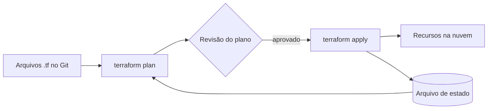

# Infraestrutura como Código

Criar um servidor, uma rede ou um banco de dados clicando no console da nuvem funciona na primeira vez. O problema aparece na segunda: alguém precisa lembrar exatamente o que foi clicado para montar o mesmo ambiente de novo. **Infrastructure as Code (IaC)** resolve isso tratando a infraestrutura como se fosse código de aplicação: escrita em arquivos, versionada no Git, revisada em pull request e executada por uma ferramenta.

## O problema da infraestrutura manual

Quando a infraestrutura é montada à mão, alguns problemas aparecem cedo:

- **Drift**: o ambiente de staging vai ganhando ajustes manuais que nunca chegam à produção (ou o contrário), e um dia "funciona em staging" deixa de significar alguma coisa.
- **Sem histórico**: ninguém sabe quem abriu aquela porta no firewall, quando e por quê.
- **Sem revisão**: uma mudança perigosa (apagar um banco, abrir um bucket ao público) não passa por nenhum olhar extra.
- **Recriar é sofrido**: se a região inteira cai ([Disaster Recovery](/labs/web-dev/resiliencia/03-disponibilidade/)), reconstruir do zero depende da memória de alguém.

## O que é Infrastructure as Code

IaC é a prática de descrever a infraestrutura (servidores, redes, bancos, filas, permissões) em arquivos de configuração e deixar uma ferramenta criar e atualizar os recursos a partir deles. Como são arquivos, ganham tudo o que o código já tem: Git, revisão, histórico, rollback e testes.

### Declarativo vs imperativo

Existem dois jeitos de escrever essa descrição:

| Abordagem   | Você escreve                                              | A ferramenta faz                                 | Exemplos                                       |
| ----------- | --------------------------------------------------------- | ------------------------------------------------ | ---------------------------------------------- |
| Declarativa | O estado final desejado ("quero 3 servidores desse tipo") | Descobre sozinha o que criar, alterar ou remover | Terraform, CloudFormation                      |
| Imperativa  | Os passos ("crie um servidor, depois outro...")           | Executa os passos na ordem                       | Scripts de shell, parte do Pulumi e do Ansible |

A maioria das ferramentas de provisionamento usa o modelo declarativo, porque você não precisa se preocupar com o estado atual: só descreve onde quer chegar.

### Idempotência

Uma execução IaC é **idempotente** quando rodá-la uma vez ou dez vezes leva ao mesmo resultado. Se o arquivo diz "3 servidores" e já existem 3, nada acontece. Se existirem 2, cria 1. Isso é o que torna seguro reaplicar a configuração inteira a qualquer momento (o mesmo conceito de [Idempotência](/labs/web-dev/resiliencia/02-idempotencia/) aplicado a infraestrutura).

## Como funciona na prática

O fluxo típico de uma ferramenta declarativa como o Terraform tem três ideias:

- **Estado desejado**: o que está nos seus arquivos.
- **Estado atual**: o que existe de fato na nuvem, guardado num arquivo de estado (state) que a ferramenta mantém.
- **Plano**: a ferramenta compara os dois e mostra exatamente o que vai criar, alterar ou destruir _antes_ de fazer qualquer coisa.



Um exemplo mínimo em HCL (a linguagem do Terraform), criando um bucket de armazenamento:

```hcl
provider "aws" {
  region = "us-east-1"
}

resource "aws_s3_bucket" "assets" {
  bucket = "meu-app-assets-prod"

  tags = {
    ambiente = "producao"
  }
}
```

E os comandos do dia a dia:

```bash
terraform init      # baixa os providers
terraform plan      # mostra o que vai mudar, sem mudar nada
terraform apply     # aplica as mudanças
terraform destroy   # remove tudo que o código criou
```

Ler o `plan` com atenção é o hábito mais importante: é ali que você percebe que uma mudança inocente vai recriar (ou seja, apagar e criar de novo) um banco de dados.

## Ferramentas

- **Terraform e OpenTofu**: as mais usadas para provisionar recursos em qualquer nuvem. O OpenTofu é um fork de código aberto do Terraform, com a mesma sintaxe.
- **Pulumi**: também declarativo, mas você escreve em linguagens de programação comuns (TypeScript, Python, Go).
- **CloudFormation** (AWS), **Bicep** (Azure): ferramentas nativas de cada provedor, mais presas a uma nuvem só.
- **Ansible**: focado em _configurar_ servidores que já existem (instalar pacotes, copiar arquivos), mais que em criá-los. Costuma conviver com o Terraform: um cria a máquina, o outro a prepara.

## IaC no pipeline de CI/CD

O ganho maior aparece quando a infraestrutura entra no mesmo fluxo do código:

- A mudança de infraestrutura vira **pull request**; o `plan` roda automaticamente e aparece como comentário para quem revisa.
- O `apply` roda no pipeline depois da aprovação, não da máquina de alguém.
- Dev, staging e produção saem do mesmo código com variáveis diferentes (tamanho da máquina, número de réplicas), então os ambientes deixam de divergir.
- Docker e Kubernetes cuidam de _como a aplicação roda_; IaC cuida de _onde ela roda_ (o cluster, a rede, o banco). Veja [Docker](/labs/web-dev/entrega-continua/01-docker/), [Kubernetes](/labs/web-dev/entrega-continua/02-kubernetes/) e [CI/CD para Microsserviços](/labs/web-dev/entrega-continua/03-ci-cd-para-microsservicos/).

## Boas práticas

- **Nada de mexer no console**: se alguém altera um recurso na mão, o código deixa de ser a verdade e o drift volta. Mudou? Muda no código.
- **Módulos reutilizáveis**: empacote padrões que se repetem (uma VPC, um serviço com banco) e reaproveite em vez de copiar e colar.
- **Segredos fora do código**: senhas e chaves não vão para o repositório; use um gerenciador de segredos e referencie-o (veja Gestão de segredos em [Segurança e Evolução de APIs](/labs/web-dev/apis/02-seguranca-e-evolucao-de-apis/)).
- **Estado remoto e com lock**: o arquivo de estado precisa ficar num lugar compartilhado (um bucket, por exemplo) com bloqueio, para duas pessoas não aplicarem mudanças ao mesmo tempo. Ele também pode conter dados sensíveis, então trate como segredo.
- **Mudanças pequenas e frequentes**: um `plan` com 3 alterações é fácil de revisar; um com 300 não é.

## Referências

- [Infraestrutura como Código: Guia Técnico para SREs](https://www.opservices.com.br/infraestrutura-como-codigo/) - OpServices, pt-BR
- [Terraform: Infraestrutura como Código](https://azure.microsoft.com/pt-pt/solutions/devops/terraform) - Microsoft Azure, pt
- [Documentação do Terraform](https://developer.hashicorp.com/terraform/docs) - HashiCorp, en
