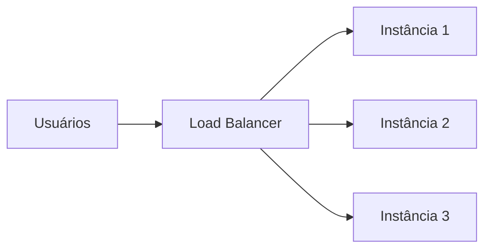

# Escalabilidade

Escalabilidade é a capacidade de um sistema continuar funcionando bem (ou de crescer para funcionar bem) quando a carga aumenta: mais usuários, mais requisições, mais dados. Um sistema escalável absorve esse crescimento sem que o tempo de resposta piore ou o sistema caia.

Existem três formas de pensar em escala: escalar a máquina (vertical), escalar o número de máquinas (horizontal) e escalar as pessoas que constroem e mantêm o sistema (organizacional). As duas primeiras resolvem o problema de carga técnica; a terceira resolve o problema de carga humana, que aparece conforme o time e o produto crescem.

## Escalabilidade vertical (scale-up)

Escalar verticalmente é adicionar mais recursos a uma máquina que já existe: mais CPU, mais memória RAM, disco mais rápido. É literalmente trocar o servidor por um mais potente.

```
Antes                Depois
+----------+         +----------------+
| 2 vCPU   |   -->   | 8 vCPU         |
| 4GB RAM  |         | 32GB RAM       |
+----------+         +----------------+
   1 máquina             1 máquina (mais forte)
```

**Vantagens**

- Simples de implementar: não exige mudar a arquitetura da aplicação
- Não precisa lidar com dados distribuídos entre máquinas diferentes
- Bom primeiro passo quando o sistema ainda é pequeno

**Desvantagens**

- Existe um limite físico: em algum momento não há hardware mais potente para comprar
- Custo cresce de forma desproporcional (uma máquina 2x mais forte pode custar muito mais que 2x)
- Continua sendo um único ponto de falha: se essa máquina cair, o sistema inteiro cai
- Normalmente exige downtime durante o upgrade

## Escalabilidade horizontal (scale-out)

Escalar horizontalmente é adicionar mais instâncias rodando em máquinas diferentes, em vez de fortalecer uma única máquina. A carga é distribuída entre várias cópias da aplicação.



Para isso funcionar, é necessário um **load balancer** (balanceador de carga) na frente das instâncias, distribuindo as requisições entre elas.

**Vantagens**

- Não tem teto de hardware: para crescer, basta adicionar mais instâncias
- Maior resiliência: se uma instância cair, as outras continuam atendendo
- Pode usar máquinas mais baratas (commodity hardware) em vez de uma máquina única muito cara

**Desvantagens**

- Mais complexidade: a aplicação precisa ser projetada para rodar em várias instâncias ao mesmo tempo
- Aplicações precisam ser **stateless** (sem guardar estado local, como sessão de usuário em memória), ou o estado precisa ser compartilhado (ex: sessão em Redis)
- Sincronizar dados entre instâncias traz problemas de consistência
- Overhead de rede entre as instâncias e o load balancer

## Vertical vs horizontal

| Aspecto                  | Vertical (scale-up)        | Horizontal (scale-out)                |
| ------------------------- | --------------------------- | --------------------------------------- |
| O que muda                | Poder de uma máquina        | Número de máquinas                     |
| Limite                    | Limite físico do hardware   | Praticamente ilimitado                 |
| Complexidade              | Baixa                       | Alta                                    |
| Ponto único de falha      | Sim                          | Não (com redundância)                  |
| Custo                     | Cresce de forma não linear   | Cresce de forma mais previsível        |
| Exige mudança no código   | Geralmente não               | Sim (stateless, dados compartilhados)  |

Na prática, os dois caminhos não são excludentes: é comum começar escalando verticalmente enquanto o sistema é pequeno e migrar para escalabilidade horizontal quando os limites de uma única máquina começam a aparecer.

## Escalabilidade organizacional

Escalabilidade não é só sobre servidores, também é sobre pessoas. Conforme um time cresce, a forma como as pessoas se organizam passa a impactar diretamente a velocidade e a qualidade do que é entregue.

Um time pequeno consegue conversar sobre tudo e manter um monolito coeso sem muito atrito. Quando o time cresce para dezenas ou centenas de pessoas, esse mesmo modelo trava: muita gente mexendo no mesmo código gera conflitos constantes, revisões lentas e dependências cruzadas entre equipes.

Escalar organizacionalmente significa estruturar pessoas e times de forma que eles consigam trabalhar em paralelo, com o mínimo de bloqueio entre si, mantendo (ou aumentando) a produtividade geral.

Isso normalmente aparece na prática como:

- **Times menores e autônomos**, cada um responsável por uma parte específica do sistema (ex: time de pagamentos, time de catálogo)
- **Fronteiras claras de responsabilidade**, reduzindo a necessidade de um time esperar outro para entregar algo
- **Arquitetura que reflete a organização**: é comum times autônomos levarem naturalmente a arquiteturas de microsserviços, onde cada serviço é dono de um time

Existe inclusive uma observação clássica sobre isso, conhecida como **Lei de Conway**: a estrutura de um sistema tende a espelhar a estrutura de comunicação da organização que o constrói. Ou seja, se os times são muito acoplados e dependentes entre si, o sistema também tende a nascer acoplado, e o inverso também é verdade.

### Ownership de serviços

Ter times pequenos e autônomos resolve o problema no momento em que um serviço nasce, mas não garante nada sobre o que acontece com ele um ano depois. Ownership é sobre isso: um serviço precisa de um time claramente responsável por ele o tempo todo que ele estiver em produção, não só na semana em que foi criado.

O problema aparece na prática como **serviços órfãos**: o time que criou aquele serviço foi reorganizado, as pessoas que entendiam o código saíram da empresa, e o que sobra é um sistema em produção, recebendo tráfego real, que ninguém mais consegue explicar direito. Quando esse serviço quebra, não existe um time óbvio para chamar, e corrigir qualquer coisa nele vira uma investigação arqueológica antes de virar uma correção.

Uma forma de evitar esse cenário é o princípio conhecido como **"you build it, you run it"**: o mesmo time que constrói um serviço também é quem responde por ele em produção, incluindo plantão e atuação em incidentes. Isso muda o incentivo de quem escreve o código. Uma decisão técnica ruim (sem monitoramento, sem tratamento de erro, com uma dependência frágil) deixa de ser "problema de outro time" e passa a ser algo que a própria equipe vai sentir às três da manhã se o serviço cair. Empresas como a Amazon adotam esse princípio como parte da cultura de times autônomos, exatamente para manter ownership vivo enquanto o sistema cresce e as pessoas mudam de equipe.

## Referências

- [You build it, You run it](https://ontologia.eximia.co/principios/you-build-it-you-run-it/) - EximiaCo, pt-BR

