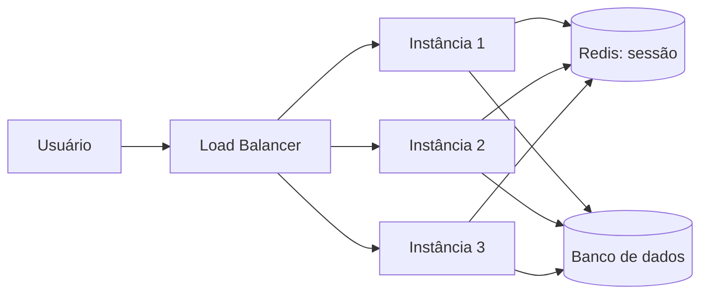
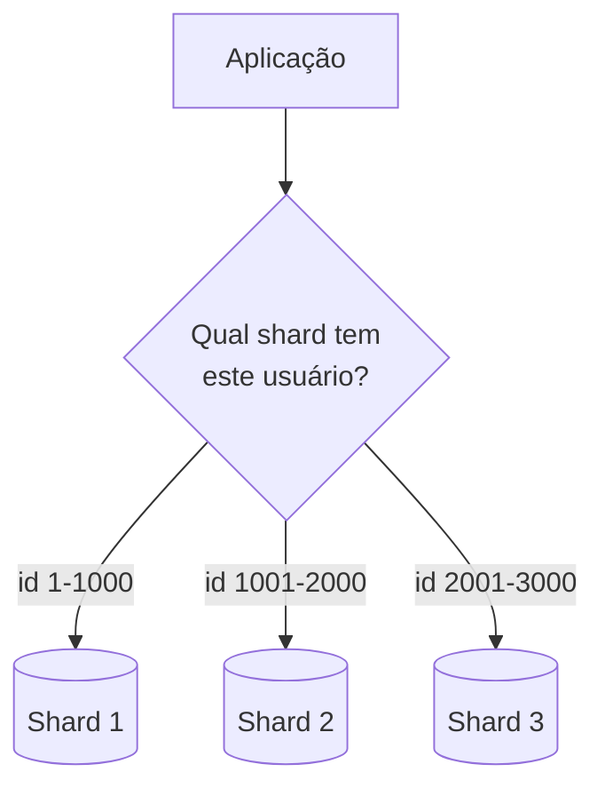

# Stateless, Particionamento e Sharding

A nota de [Escalabilidade](/labs/web-dev/escalabilidade/01-escalabilidade/) mostrou que escalar horizontalmente exige que os serviços sejam **stateless** e que os dados consigam ser distribuídos entre várias máquinas. Esta nota entra no detalhe prático dessas duas ideias: como tirar o estado da aplicação de fato, e como dividir dados grandes demais para uma única máquina em pedaços menores (particionamento e sharding).

## Tornando serviços stateless

Um serviço **stateless** (sem estado) não guarda, na própria instância, nenhuma informação que precise sobreviver entre requisições diferentes. Cada requisição chega com tudo o que a instância precisa para respondê-la, e qualquer uma das réplicas consegue atendê-la, não só a que atendeu a requisição anterior.

O oposto é um serviço **stateful**: ele guarda algo na memória do processo, e depender disso quebra assim que o load balancer manda a próxima requisição do mesmo usuário para outra instância.

O exemplo clássico é sessão de login guardada em memória:

```text
Requisição 1 (login) -> cai na Instância A -> A guarda "usuário 42 está logado" na própria memória
Requisição 2 (ver pedidos) -> cai na Instância B -> B não sabe quem é o usuário 42, pede login de novo
```

**Onde armazenar o que antes ficava na memória:**

- **Sessão do usuário**: mover para um cache compartilhado, como Redis (veja [Cache e Redis](/labs/web-dev/escalabilidade/08-cache-e-redis/)), ou usar um token que carrega o próprio estado, como um JWT assinado, guardado no cliente.
- **Dados de negócio**: ficam no banco de dados, nunca em variável de instância.
- **Arquivos enviados pelo usuário**: vão para um storage compartilhado (S3, GCS), nunca no disco local da instância, porque o disco local some ou some se a instância for substituída.
- **Cache de leitura**: pode até existir localmente por performance, mas precisa ser tratado como descartável, se ele sumir a aplicação continua funcionando, só busca a informação de novo na fonte.

Na prática, tornar um serviço stateless costuma significar: tirar tudo que é "memória entre requisições" da instância e mover para uma camada compartilhada (banco, cache distribuído, storage) que todas as réplicas conseguem acessar igualmente.



Qualquer instância consegue atender qualquer requisição porque o estado real mora fora delas.

## Particionamento e Sharding

Tirar o estado da aplicação resolve metade do problema. A outra metade é: o que fazer quando os **dados** crescem demais para caber (ou responder rápido o suficiente) numa única máquina de banco?

**Particionamento** é a ideia geral de dividir um conjunto grande de dados em pedaços menores. Existem duas formas comuns:

- **Particionamento vertical**: divide por colunas ou funcionalidades. Por exemplo, separar a tabela de `usuarios` (dados de perfil) da tabela de `pedidos` (histórico de compras) em bancos diferentes.
- **Particionamento horizontal (sharding)**: divide as **linhas** de uma mesma tabela entre várias máquinas, cada uma guardando só uma fatia dos dados.

**Sharding** é o nome mais comum para o particionamento horizontal em bancos de dados. Cada máquina (cada **shard**) guarda um subconjunto dos registros, e juntas elas formam o conjunto completo.



A pergunta central do sharding é: **qual critério decide em qual shard cada registro vive?** As estratégias mais comuns são:

- **Sharding por intervalo (range)**: divide por faixas de valores, como IDs de 1 a 1000 no shard 1, de 1001 a 2000 no shard 2. Simples de entender, mas pode concentrar carga desigual (um intervalo mais "quente" que os outros).
- **Sharding por hash**: aplica uma função de hash na chave (ex: `id do usuário`) e usa o resultado para decidir o shard. Distribui melhor a carga, mas dificulta buscas por intervalo (ex: "todos os pedidos de janeiro").
- **Sharding geográfico**: separa por região do usuário (ex: usuários do Brasil num shard, da Europa em outro). Reduz latência, porque os dados ficam fisicamente mais perto de quem os usa.

O grande custo do sharding é que ele quebra algumas operações que eram triviais num banco único: um `JOIN` entre dados que estão em shards diferentes não é mais uma simples consulta SQL, e uma transação que precisa alterar registros em mais de um shard deixa de ser atômica por padrão (o mesmo problema descrito em [Consistência Transacional](/labs/web-dev/transacoes-distribuidas/01-consistencia-transacional/)). Por isso, sharding costuma ser adotado só quando o volume de dados ou de tráfego realmente já não cabe numa máquina só, não como primeira opção.

## Escalabilidade de leitura vs. escrita

Nem todo sistema sofre gargalo do mesmo jeito. Vale separar dois problemas diferentes:

- **Escalar leitura**: a maioria dos sistemas lê muito mais do que escreve (pense num feed de rede social: milhares de pessoas leem o mesmo post, poucas o criam). Esse padrão escala relativamente fácil com [réplicas de leitura](/labs/web-dev/escalabilidade/03-replicacao-de-banco-de-dados/) e [cache](/labs/web-dev/escalabilidade/08-cache-e-redis/), porque o mesmo dado pode ser copiado e servido de vários lugares ao mesmo tempo.
- **Escalar escrita**: escritas não podem simplesmente ser copiadas para vários lugares, cada escrita precisa acontecer em algum lugar que seja a fonte de verdade daquele dado. Por isso escalar escrita costuma exigir sharding: em vez de todas as escritas caírem num único banco, elas são distribuídas entre vários shards, cada um responsável por uma fatia dos dados.

Um erro comum é tentar resolver todo gargalo de escala com mais réplicas de leitura, quando o problema real é volume de escrita. Réplicas de leitura não ajudam em nada quando o sistema está sofrendo porque não consegue processar escritas rápido o suficiente.

## Gargalos de escalabilidade

Escalar não é adicionar máquinas até o problema sumir, é primeiro descobrir **onde** está o gargalo, porque adicionar capacidade no lugar errado não resolve nada. Os gargalos mais comuns em sistemas que crescem:

- **Banco de dados como ponto único de escrita**: mesmo com várias instâncias da aplicação, se todas escrevem no mesmo banco único, o banco vira o teto de escala do sistema inteiro.
- **Hot keys / hot partitions**: quando um shard, uma chave de cache ou um registro específico recebe desproporcionalmente mais tráfego que os outros (ex: o perfil de uma celebridade numa rede social). Distribuir dados uniformemente não ajuda se o acesso a eles não for uniforme.
- **Conexões e connection pool**: cada instância nova da aplicação abre suas próprias conexões com o banco; sem controle, o número de conexões cresce junto com o número de instâncias até estourar o limite do banco.
- **Dependências síncronas em cadeia**: um serviço que espera outro, que espera outro, faz a latência (e a chance de falha) se acumular a cada camada.
- **Locks e contenção**: estratégias de concorrência mal escolhidas (veja [Controle de Concorrência](/labs/web-dev/banco-de-dados/06-controle-de-concorrencia/)) podem travar o sistema mesmo com hardware sobrando.
- **Estado escondido em memória**: um serviço que parece stateless mas guarda algo (um cache local, um contador em variável) que só existe numa instância específica, quebrando a promessa de que qualquer réplica pode atender qualquer requisição.

Identificar o gargalo certo normalmente exige observar o sistema em produção (veja [Observabilidade](/labs/web-dev/observabilidade/01-logs-metrics-e-traces/)) antes de decidir qual técnica de escala aplicar.
