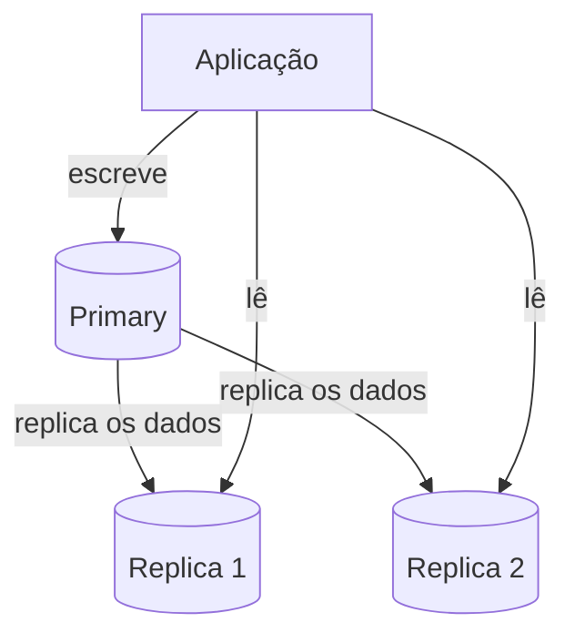

# Replicação e Escalabilidade do Banco de Dados

A nota anterior mostrou como dividir dados entre várias máquinas com [particionamento e sharding](/labs/web-dev/escalabilidade/02-stateless-e-particionamento/). Esta nota cobre a outra ferramenta de escala de banco de dados, que resolve um problema diferente: **replicação**, ou seja, manter cópias do mesmo dado em várias máquinas, principalmente para escalar leitura e sobreviver a falhas.

## Replicação

Replicar um banco significa manter uma ou mais cópias completas dos dados em máquinas diferentes, que ficam se sincronizando entre si.

O modelo mais comum é **Primary/Replica** (também chamado de master/slave em material mais antigo): existe um nó **primary**, que recebe todas as escritas, e um ou mais nós **replica**, que recebem cópias dos dados do primary e, tipicamente, atendem só leituras.

Read replicas (réplicas de leitura) são exatamente essas cópias: como a maioria dos sistemas lê muito mais do que escreve, distribuir as leituras entre várias réplicas tira carga do primary e permite escalar a leitura quase linearmente, só adicionando mais réplicas.

A forma como o primary manda os dados para as réplicas pode ser síncrona ou assíncrona, e essa escolha é um trade-off direto entre consistência e desempenho:

- **Replicação síncrona**: o primary só confirma a escrita para a aplicação depois que pelo menos uma réplica também confirmou que recebeu o dado. Garante que a réplica nunca fica muito atrasada, mas a escrita fica mais lenta, porque precisa esperar a rede até a réplica antes de responder.
- **Replicação assíncrona**: o primary confirma a escrita para a aplicação assim que ele mesmo salvou, e manda o dado para as réplicas em paralelo, sem esperar a confirmação delas. Mais rápido para quem escreve, mas cria uma janela de tempo em que a réplica está desatualizada em relação ao primary, chamada de **replication lag**.

Essa segunda opção é a raiz do problema de leitura desatualizada explicado em [Consistência e Replicação](/labs/web-dev/sistemas-distribuidos/01-consistencia-e-replicacao/): se um usuário escreve um dado e imediatamente lê de uma réplica que ainda não recebeu essa escrita, ele enxerga uma versão antiga do próprio dado que acabou de salvar.

## Escalabilidade do banco

Read replicas resolvem o gargalo de leitura, mas não resolvem o gargalo de escrita, porque todo write continua passando pelo mesmo primary. Quando o volume de escrita ultrapassa o que uma única máquina aguenta, entram as técnicas de particionamento vistas na nota anterior, agora aplicadas especificamente ao banco:

- **Sharding**: dividir as linhas de uma tabela entre vários bancos primary independentes, cada um responsável pelas escritas da sua fatia de dados (detalhado em [Stateless, Particionamento e Sharding](/labs/web-dev/escalabilidade/02-stateless-e-particionamento/)).
- **Partitioning**: em muitos bancos relacionais (Postgres, MySQL), é possível particionar uma tabela grande em pedaços menores **dentro da mesma instância**, por exemplo, por data (`pedidos_2024_01`, `pedidos_2024_02`). Isso melhora a performance de consultas e manutenção, mas ainda não distribui a carga entre máquinas diferentes.
- **Federation**: dividir um banco único em vários bancos menores por **domínio de negócio**, em vez de por linha. Por exemplo, separar o banco de `usuarios` do banco de `pagamentos` do banco de `catálogo`, cada um numa instância própria. Cada domínio escala de forma independente, e a falha em um banco não afeta os outros diretamente.

| Técnica       | O que divide                                 | Resolve gargalo de                  |
| ------------- | -------------------------------------------- | ----------------------------------- |
| Read replicas | Cópias completas dos dados                   | Leitura                             |
| Sharding      | Linhas de uma tabela                         | Escrita                             |
| Partitioning  | Linhas de uma tabela, mas na mesma instância | Performance de consulta/manutenção  |
| Federation    | Tabelas/domínios inteiros                    | Escrita e isolamento entre domínios |

Na prática, sistemas grandes combinam essas técnicas: federation para separar domínios de negócio, sharding dentro de um domínio que cresceu demais, e read replicas em cada shard para absorver leitura.

## Database bottlenecks

Mesmo com replicação e sharding bem configurados, um banco de dados pode continuar sendo o gargalo do sistema por motivos que não têm nada a ver com "faltam mais máquinas":

- **Queries lentas**: uma consulta mal escrita (um `SELECT *` sem filtro, um `JOIN` sem índice) pode travar o banco inteiro sozinha, mesmo com pouco tráfego. Nenhuma quantidade de réplicas compensa uma query ruim, elas só multiplicam o problema.
- **Índices**: a ausência de um índice na coluna certa faz o banco escanear a tabela inteira a cada consulta (um _full table scan_), o que fica proibitivamente lento conforme os dados crescem. Índices em excesso também têm custo, cada escrita precisa atualizar todos os índices da tabela.
- **Connection pool**: cada instância da aplicação abre conexões com o banco, e bancos têm um limite máximo de conexões simultâneas. Sem um pool de conexões bem dimensionado (compartilhado e reutilizado, em vez de abrir uma conexão nova a cada requisição), é fácil esgotar esse limite conforme o número de instâncias da aplicação cresce.
- **Lock contention**: quando muitas transações competem pelo mesmo lock (veja [Controle de Concorrência](/labs/web-dev/banco-de-dados/07-controle-de-concorrencia/)), elas ficam na fila esperando, e o tempo de resposta do banco sobe mesmo que a CPU esteja ociosa.
- **Hot partitions**: um shard específico recebendo desproporcionalmente mais tráfego que os outros, geralmente porque a chave de particionamento escolhida não distribui a carga de forma uniforme (ex: particionar por região quando 80% dos usuários estão numa única região).

O ponto em comum entre todos esses gargalos é que eles não aparecem no papel, só aparecem sob carga real, e é por isso que [Observabilidade](/labs/web-dev/observabilidade/01-logs-metrics-e-traces/) e testes de capacidade (veja [Capacity Planning](/labs/web-dev/system-design/03-capacity-planning/)) importam tanto quanto a escolha da arquitetura em si.
