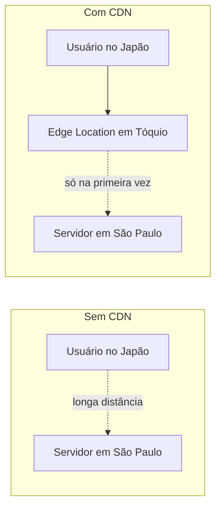
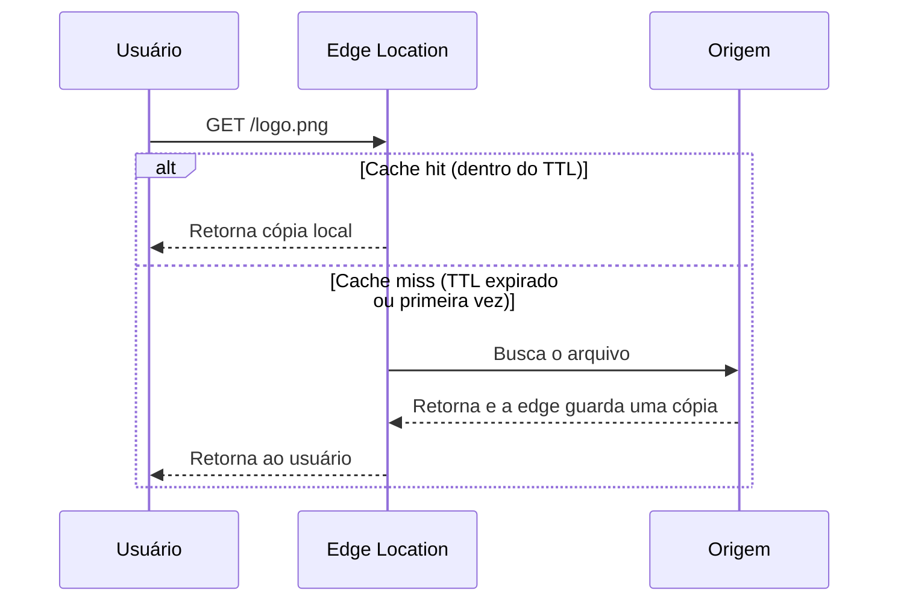

# CDN (Content Delivery Network)

## Conceitos

Uma **CDN** (Content Delivery Network, rede de distribuição de conteúdo) é uma rede de servidores espalhados geograficamente que guarda cópias de arquivos e entrega essas cópias a partir do servidor mais próximo de quem está pedindo.

Sem CDN, todo pedido de um arquivo estático (uma imagem, um script) viaja até o servidor de origem, não importa onde ele esteja no mundo. Se o servidor fica em São Paulo e o usuário está no Japão, cada byte percorre esse caminho inteiro, e a velocidade da luz numa fibra óptica já impõe um limite físico de quanto isso pode ser rápido.



As **edge locations** são esses pontos de presença da CDN espalhados pelo mundo (dezenas ou centenas deles, dependendo do provedor). Quando um usuário pede um arquivo, a requisição vai para a edge location mais próxima geograficamente dele, não direto para o servidor de origem.

Na primeira vez que uma edge location recebe um pedido de um arquivo que ainda não tem guardado, ela busca esse arquivo no servidor de origem, guarda uma cópia localmente (isso é o **cache de conteúdo**) e entrega ao usuário. Nas próximas vezes, ela entrega direto da cópia local, sem nem precisar consultar a origem de novo.

## O que colocar em uma CDN

CDN funciona bem para conteúdo que não muda por usuário, ou seja, **conteúdo cacheável**: o mesmo arquivo pode ser servido para milhares de pessoas diferentes sem alteração nenhuma.

Os candidatos mais comuns:

- **Imagens** (fotos de produto, avatares, banners)
- **JavaScript** (bundles da aplicação front-end)
- **CSS** (folhas de estilo)
- **Vídeos** (incluindo streaming, com técnicas específicas de segmentação)
- **Arquivos estáticos em geral**: fontes, PDFs, ícones, arquivos de download

O que normalmente **não** vai para uma CDN é conteúdo dinâmico e personalizado por usuário, como o resultado de um `GET /pedidos/meus-pedidos`, porque cada usuário vê algo diferente, e cachear isso incorretamente pode vazar dado de um usuário para outro. Existem exceções (CDNs modernas oferecem cache de API com regras bem específicas por parâmetro), mas a regra geral é: estático e igual para todo mundo vai pra CDN, dinâmico e pessoal não vai.

## Benefícios

- **Redução de latência**: o usuário busca o arquivo na edge location mais próxima, não do outro lado do mundo.
- **Redução de carga no backend**: cada requisição atendida pela CDN é uma requisição que nunca chega ao servidor de origem. Para um site com muito tráfego de conteúdo estático, isso pode ser a maior parte do tráfego total.
- **Escalabilidade**: a CDN absorve picos de tráfego (por exemplo, um vídeo viralizando) sem que o backend precise crescer para aguentar esse pico, porque a maior parte das requisições nem chega até ele.
- **Disponibilidade**: como a CDN guarda cópias, ela pode continuar servindo conteúdo já cacheado mesmo que o servidor de origem fique temporariamente fora do ar.

## Cache na CDN

O comportamento de cache de uma CDN é controlado principalmente pelo header HTTP `Cache-Control`, enviado pelo servidor de origem junto com a resposta:

```http
Cache-Control: public, max-age=86400
```

- `public`: a resposta pode ser cacheada por qualquer intermediário (CDN, proxy), não só pelo navegador do usuário.
- `max-age=86400`: por quanto tempo, em segundos, o conteúdo pode ficar cacheado antes de ser considerado desatualizado. Esse tempo de vida é o **TTL** (Time To Live).

Enquanto o TTL não expira, a edge location entrega a cópia local sem consultar a origem (**cache hit**). Quando o TTL expira, ou quando o arquivo nunca foi pedido antes naquela edge location, ela precisa buscar (ou revalidar) o conteúdo na origem (**cache miss**).



Um TTL alto reduz a carga na origem, mas atrasa a propagação de mudanças (se você trocar a imagem, usuários podem continuar vendo a antiga até o TTL expirar). É por isso que **invalidation** (invalidação de cache) existe: um comando explícito para forçar a CDN a descartar uma cópia específica antes do TTL natural expirar, geralmente usado logo depois de publicar uma nova versão de um arquivo importante (ex: depois de um deploy que trocou o `main.js`).

Uma prática comum para evitar até precisar invalidar: incluir um hash do conteúdo no nome do arquivo (`main.a1b2c3.js`). Como o nome muda sempre que o conteúdo muda, o arquivo antigo simplesmente para de ser referenciado, sem precisar limpar cache nenhum.
