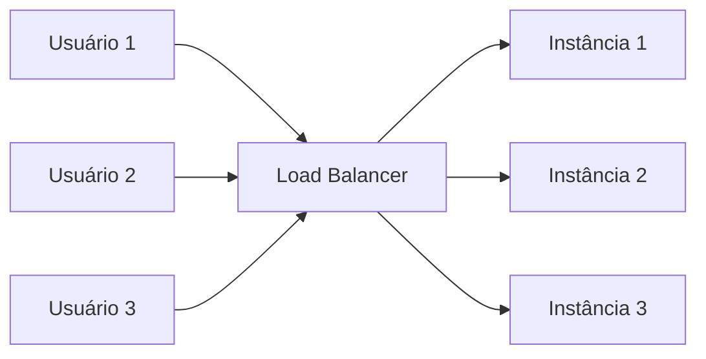
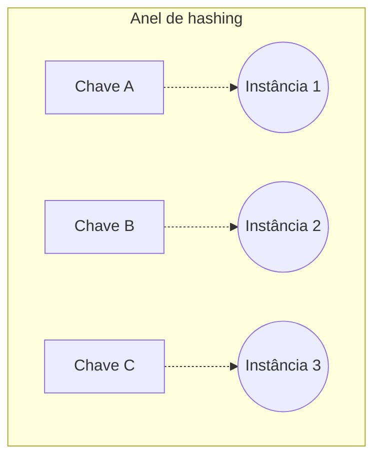

# Load Balancer

## Conceitos

Um **Load Balancer** (balanceador de carga) é o componente que fica na frente de várias instâncias de um serviço e decide, a cada requisição, para qual instância mandá-la. É a peça que torna a [escalabilidade horizontal](/labs/web-dev/escalabilidade/01-escalabilidade/) possível de verdade: sem ele, o cliente precisaria saber, sozinho, quantas instâncias existem e escolher uma.

Load balancers operam em duas camadas diferentes da rede, e isso muda o que eles conseguem enxergar da requisição:

- **L4 (camada de transporte)**: decide para onde mandar o tráfego olhando só informações de rede, como endereço IP e porta, sem abrir o conteúdo da requisição. É mais rápido, porque tem menos trabalho a fazer, mas não entende nada sobre HTTP, rotas ou cabeçalhos.
- **L7 (camada de aplicação)**: entende o protocolo da aplicação (tipicamente HTTP), então consegue tomar decisões com base na URL, em headers, em cookies, no método HTTP. Permite coisas como mandar `/api/pagamentos` para um grupo de instâncias e `/api/usuarios` para outro. É mais lento que L4, mas muito mais flexível, e é o tipo mais comum para tráfego web.

## Algoritmos

O algoritmo é a regra que o load balancer usa para escolher qual instância recebe a próxima requisição:

- **Round Robin**: distribui as requisições em sequência, uma para cada instância, voltando ao início depois da última. Simples, mas ignora se uma instância está mais ocupada que outra.
- **Weighted Round Robin**: igual ao Round Robin, mas cada instância recebe um peso, e instâncias com peso maior recebem proporcionalmente mais requisições. Útil quando as máquinas têm capacidades diferentes (uma mais potente que a outra).
- **Least Connections**: manda a requisição para a instância que tem menos conexões ativas no momento. Se adapta melhor a requisições que demoram tempos diferentes para processar, porque não assume que todo request custa o mesmo.
- **IP Hash**: calcula um hash do IP de quem está fazendo a requisição e usa esse hash para sempre mandar o mesmo cliente para a mesma instância. Garante uma forma simples de "sticky session" (sessão fixa numa instância), útil quando um serviço ainda não é totalmente stateless (veja [Stateless, Particionamento e Sharding](/labs/web-dev/escalabilidade/02-stateless-e-particionamento/)).
- **Consistent Hashing**: uma técnica mais sofisticada de distribuir chaves (uma sessão, um cliente, um shard) entre instâncias, projetada para que, quando uma instância entra ou sai do grupo, só uma pequena fração das chaves precise ser redistribuída, em vez de todas. Num hashing simples (`hash(chave) % número de instâncias`), adicionar ou remover uma única instância muda o resultado de quase todo mundo, porque o número usado no módulo mudou. No consistent hashing, as instâncias e as chaves são posicionadas num mesmo círculo imaginário de valores de hash, e cada chave é atribuída à próxima instância encontrada andando no sentido horário desse círculo:

Quando a Instância 2 sai do anel, só as chaves que estavam atribuídas a ela precisam ser redistribuídas (para a próxima instância no sentido horário), as chaves das instâncias 1 e 3 continuam exatamente onde estavam. Isso é essencial em sistemas de cache distribuído e sharding, onde redistribuir tudo a cada mudança de topologia seria caro demais.

### Outros algoritmos

Os cinco de cima cobrem a maioria dos casos, mas load balancers de mercado (NGINX, HAProxy, AWS, NetScaler) documentam outras variações. Vale conhecer:

- **Weighted Least Connections**: junta os dois algoritmos anteriores. Em vez de olhar só o número de conexões ativas, divide esse número pelo peso da instância, e manda a requisição para quem tiver a menor razão. Uma instância com peso 2 e 10 conexões ativas (razão 5) perde para uma com peso 1 e 4 conexões (razão 4), mesmo tendo menos conexão no total.
- **Least Response Time**: olha ao mesmo tempo o número de conexões ativas e o tempo de resposta de cada instância, e manda para quem estiver respondendo mais rápido com menos carga. O detalhe é _como_ esse tempo é medido: pode vir do próprio tráfego real (o tempo até o primeiro byte de resposta, TTFB, de cada requisição que passou), ou de um monitor dedicado de health check que mede isso separadamente, em intervalos fixos. A primeira reage mais rápido a uma instância que piorou; a segunda não depende de ter tráfego passando para saber o estado de cada uma.
- **Random**: escolhe uma instância aleatória entre as disponíveis, sem olhar carga nem conexões. Parece ingênuo, mas funciona bem quando as requisições são parecidas em custo e o número de instâncias é grande, porque a distribuição tende a ficar equilibrada mesmo sem controle nenhum. Existe uma variante ponderada, que usa o peso de cada instância no sorteio (a AWS chama a dela de "weighted random"), e pode vir acoplada a uma "mitigação de anomalia": se uma instância está respondendo mal, o sorteio para de escolher ela até que volte ao normal.
- **Least Bandwidth**: manda para a instância que está consumindo menos banda de rede num intervalo recente (o NetScaler, por exemplo, mede isso numa janela de alguns segundos). Faz sentido quando as respostas variam muito de tamanho, como servir arquivo grande ou vídeo, onde "menos conexões" ou "resposta mais rápida" não captam o que está pesando de fato: o volume de dados trafegando.

## Health Checks

Um load balancer só é útil se ele souber quais instâncias estão realmente saudáveis. Para isso, ele faz verificações periódicas, os **health checks**, geralmente batendo numa rota específica (`/health`) e esperando uma resposta de sucesso.

Existem dois tipos de verificação com propósitos diferentes:

- **Liveness**: responde à pergunta "esse processo está vivo?". Uma falha aqui geralmente significa que a instância travou e precisa ser reiniciada.
- **Readiness**: responde à pergunta "esse processo está pronto para receber tráfego agora?". Uma instância pode estar viva, mas ainda inicializando (carregando configuração, conectando ao banco) e não pronta para atender requisições. Uma falha aqui não significa reiniciar, significa só não mandar tráfego ainda.

Quando uma instância falha o health check, o load balancer para de mandar requisições para ela (**remoção de instâncias não saudáveis**), sem precisar de intervenção manual. Assim que ela volta a responder corretamente, o load balancer volta a incluí-la na rotação.

## Alta disponibilidade

Um load balancer distribuindo tráfego entre **múltiplas instâncias** já é, por si só, uma estratégia de alta disponibilidade: se uma instância cair, as outras continuam atendendo, e o health check garante que a instância com problema seja tirada de circulação automaticamente. Esse comportamento automático de desviar tráfego de algo que falhou é chamado de **failover**.

Também é comum distribuir as instâncias entre zonas de disponibilidade diferentes (**distribuição entre zonas**), que são data centers fisicamente separados dentro da mesma região de nuvem. Se uma zona inteira tiver um problema (falta de energia, incêndio, falha de rede local), as instâncias nas outras zonas continuam de pé.

Por fim, vale lembrar que o próprio load balancer não pode virar um ponto único de falha: em produção, ele normalmente também é replicado (mais de um load balancer, com algum mecanismo de failover entre eles), para que a caída dele não derrube o sistema inteiro que ele deveria estar protegendo.

## Referências

- [Target groups for your Application Load Balancers](https://docs.aws.amazon.com/elasticloadbalancing/latest/application/load-balancer-target-groups.html) - AWS, en
- [4.2. Balance - HAProxy Configuration Manual](https://www.haproxy.com/documentation/haproxy-configuration-manual/latest/#4.2-balance) - HAProxy, en
- [Least response time method](https://docs.netscaler.com/en-us/citrix-adc/current-release/load-balancing/load-balancing-customizing-algorithms/leastresponsetime-method.html) - NetScaler (Citrix ADC), en
