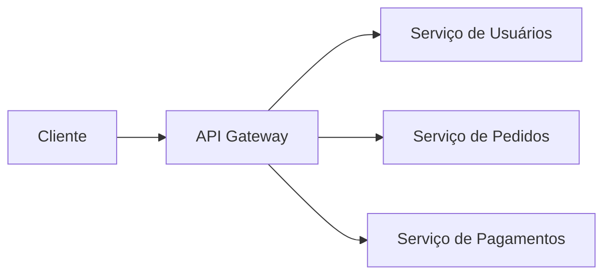
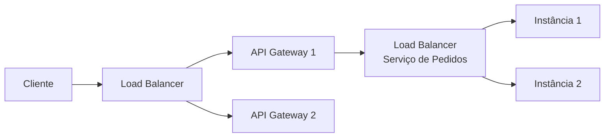

# API Gateway

Um **API Gateway** é a porta de entrada única para os clientes de um sistema baseado em microsserviços. Em vez do cliente conhecer e chamar diretamente cada serviço individual, ele fala só com o gateway, que decide para onde encaminhar cada requisição.

## Responsabilidades

Concentrar as requisições num único ponto de entrada permite centralizar preocupações que, de outra forma, cada microsserviço precisaria implementar por conta própria:

- **Roteamento**: decide, com base na URL ou em outros dados da requisição, qual serviço deve tratá-la (ex: `/usuarios/*` vai para o serviço de usuários).
- **Autenticação**: verifica se quem está fazendo a requisição é quem diz ser (ex: validar um token JWT), antes de deixar a requisição seguir adiante.
- **Autorização**: verifica se, além de autenticado, o usuário tem permissão para aquela ação específica.
- **Rate limiting**: limita quantas requisições um cliente pode fazer num intervalo de tempo, protegendo os serviços de trás contra abuso ou picos excessivos (aprofundado em [Rate Limiting](/labs/web-dev/escalabilidade/rate-limiting/)).
- **TLS termination**: o gateway é quem lida com a criptografia HTTPS na borda do sistema; a comunicação entre o gateway e os serviços internos pode acontecer sem esse custo extra, dentro de uma rede já considerada confiável.
- **Logging**: registra as requisições que entram no sistema num único lugar, o que facilita auditoria e depuração.
- **Observabilidade**: como todo tráfego passa por ele, o gateway é um ponto natural para coletar métricas (quantas requisições, quanto tempo cada uma leva, quantos erros) do sistema como um todo, alimentando o que é aprofundado em [Observabilidade](/labs/web-dev/observabilidade/logs-metrics-e-traces/).

Sem um API Gateway, cada microsserviço teria que reimplementar autenticação, rate limiting e logging por conta própria, o que gera duplicação de código e inconsistência (um serviço valida o token diferente do outro).

## API Gateway vs Load Balancer

É comum confundir os dois, porque ambos ficam "na frente" dos serviços e distribuem tráfego, mas eles resolvem problemas em camadas diferentes:

|                      | Load Balancer                                                                  | API Gateway                                                                                       |
| -------------------- | ------------------------------------------------------------------------------ | ------------------------------------------------------------------------------------------------- |
| Onde atua            | Tipicamente L4 ou L7, distribuindo tráfego entre réplicas **do mesmo serviço** | L7, roteando entre serviços **diferentes** com base em regras de negócio                          |
| Decisão principal    | "Qual instância está livre para atender?"                                      | "Qual serviço trata esse tipo de requisição, e essa requisição tem permissão para chegar até lá?" |
| Preocupações típicas | Distribuição de carga, health check, failover                                  | Autenticação, autorização, rate limiting, roteamento por rota/versão de API                       |

Na prática, os dois normalmente coexistem no mesmo sistema: o load balancer distribui tráfego entre as réplicas do próprio API Gateway (que também escala horizontalmente), e depois o gateway roteia cada requisição para o load balancer (ou diretamente para as instâncias) do microsserviço correto.

**Quando utilizar um API Gateway**: sistemas com múltiplos microsserviços, especialmente quando existem preocupações transversais (auth, rate limiting) que se repetiriam em cada serviço, ou quando clientes diferentes (app mobile, web, parceiros externos) precisam de formas diferentes de acessar o mesmo conjunto de serviços.

**Quando não utilizar**: em um monólito ou sistema pequeno com poucos serviços, um API Gateway completo pode ser complexidade desnecessária, um load balancer sozinho já resolve o problema de distribuir tráfego, e autenticação pode viver direto na aplicação sem custo real de duplicação.
