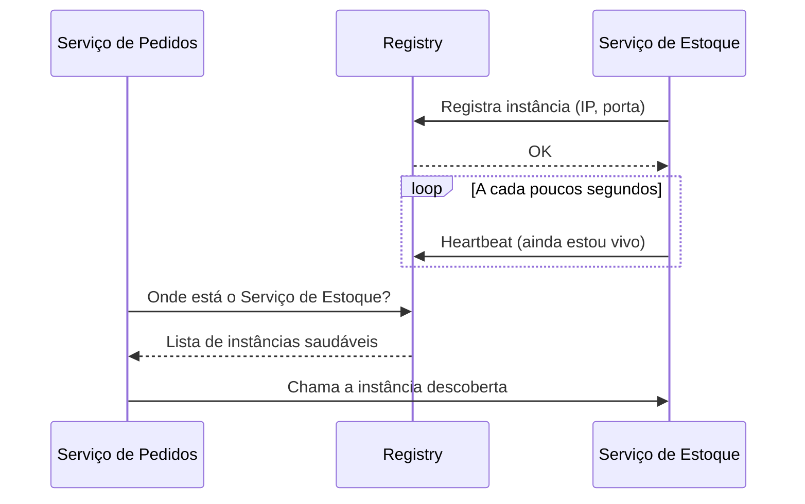
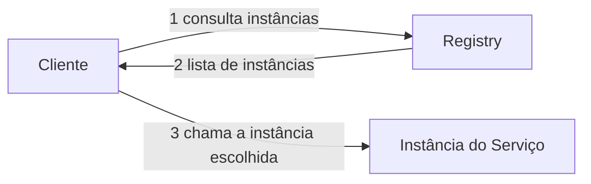
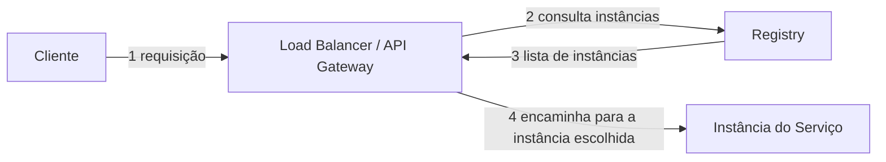

# Service Discovery

## O problema

Num sistema com um único serviço rodando numa única máquina, saber "onde" chamar esse serviço é trivial: é sempre o mesmo endereço. O problema aparece quando o sistema cresce para múltiplas instâncias de múltiplos serviços, cada uma podendo subir, cair ou ser substituída a qualquer momento por causa de deploys, [escala horizontal](/labs/web-dev/escalabilidade/01-escalabilidade/) automática ou falhas.

Nesse cenário, os endereços deixam de ser fixos. Uma instância do serviço de pedidos pode nascer num IP diferente a cada deploy, o número de instâncias do serviço de pagamentos pode variar de 2 para 10 durante um pico de tráfego, e uma instância que caiu não deveria mais receber requisições. **Service discovery** é o mecanismo que resolve a pergunta "quem sabe onde cada instância está rodando agora?", sem exigir que cada serviço mantenha, manualmente, uma lista atualizada de endereços dos outros serviços.

Sem service discovery, a alternativa seria hardcodar endereços (IPs ou hostnames fixos) em cada serviço, o que quebra a cada novo deploy, cada instância adicionada ou removida, e cada falha. Em um sistema com dezenas de microsserviços escalando de forma independente, isso simplesmente não se sustenta.

## Registro e descoberta

O componente central é o **registry** (registro de serviços): um banco de dados especializado que guarda, em tempo real, quais instâncias de quais serviços estão disponíveis e em quais endereços.

O fluxo básico funciona em duas pontas:

- **Registro**: quando uma instância de um serviço sobe, ela se anuncia no registry, informando o nome do serviço, seu endereço (IP e porta) e, geralmente, metadados extras (versão, zona de disponibilidade). Isso pode ser feito pela própria instância (**self-registration**) ou por um agente auxiliar que observa o ambiente de execução e registra a instância por ela.
- **Descoberta**: quando um serviço precisa chamar outro, ele consulta o registry perguntando "quais instâncias saudáveis existem para o serviço X agora?" e recebe uma lista de endereços para escolher.

O registro sozinho não é suficiente, porque uma instância pode cair sem avisar (crash, falta de energia, rede caindo). Para lidar com isso, as instâncias enviam **heartbeats** periódicos ao registry, uma mensagem curta que basicamente diz "ainda estou viva". Se o registry para de receber heartbeats de uma instância por tempo demais, ele assume que ela morreu e a remove da lista, para que ninguém mais tente chamá-la. Esse mecanismo cumpre, no contexto de service discovery, um papel parecido com o dos health checks de um load balancer (veja [Load Balancer](/labs/web-dev/escalabilidade/05-load-balancer/)): manter a lista de instâncias sempre refletindo a realidade, sem intervenção manual.

Implementações reais desse padrão incluem o **Eureka** (Netflix, comum no ecossistema Spring Cloud) e o **Consul** (HashiCorp), que além de service discovery também oferece health checking e um armazenamento de configuração distribuído.

## Client-side vs server-side discovery

Existem duas formas de organizar quem efetivamente consulta o registry e decide qual instância chamar.

**Client-side discovery**: o próprio cliente (o serviço que está fazendo a chamada) consulta o registry diretamente, recebe a lista de instâncias saudáveis e escolhe uma delas, aplicando sua própria lógica de balanceamento (round robin, por exemplo). É o modelo clássico do Eureka combinado com um client-side load balancer (como o Ribbon, no ecossistema Spring Cloud antigo). A vantagem é que não existe um intermediário na frente das chamadas, o que reduz um salto de rede; a desvantagem é que a lógica de descoberta e balanceamento precisa estar embutida em cada cliente, geralmente amarrada a uma linguagem ou framework específico.

**Server-side discovery**: o cliente não fala com o registry, ele manda a requisição para um componente intermediário (tipicamente um [load balancer](/labs/web-dev/escalabilidade/05-load-balancer/) ou um [API Gateway](/labs/web-dev/escalabilidade/07-api-gateway/)), e é esse componente que consulta o registry, escolhe a instância e encaminha a chamada. O cliente nem precisa saber que service discovery existe, ele só conhece o endereço fixo do intermediário. É o modelo mais comum em ambientes como Kubernetes, onde o próprio proxy de rede (kube-proxy) ou um service mesh cumprem esse papel de forma transparente para a aplicação.

Na prática, server-side discovery tende a ser preferido em sistemas poliglotas (serviços escritos em linguagens diferentes), porque a lógica de descoberta fica centralizada num único componente em vez de precisar ser reimplementada em cada linguagem.

## Relação com Load Balancer e API Gateway

Service discovery não substitui load balancer nem API Gateway, ele alimenta os dois com a informação que eles precisam para funcionar. Um [load balancer](/labs/web-dev/escalabilidade/05-load-balancer/) decide "para qual instância mandar essa requisição", mas alguém precisa dizer quais instâncias existem: é o registry de service discovery que fornece essa lista, atualizada em tempo real via heartbeats. Da mesma forma, um [API Gateway](/labs/web-dev/escalabilidade/07-api-gateway/) roteia requisições entre serviços diferentes, e usa service discovery para saber os endereços atuais de cada serviço para o qual está roteando, em vez de depender de configuração estática.

Em ambientes de nuvem e Kubernetes modernos, boa parte desse trabalho já vem embutido na infraestrutura (o próprio Kubernetes tem service discovery nativo via DNS interno), então é comum nem perceber que o mecanismo está ali, ele simplesmente funciona por baixo dos panos toda vez que um serviço chama outro pelo nome.
