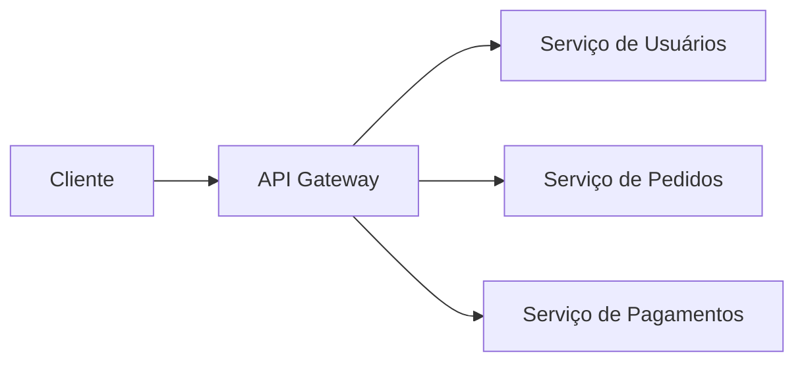
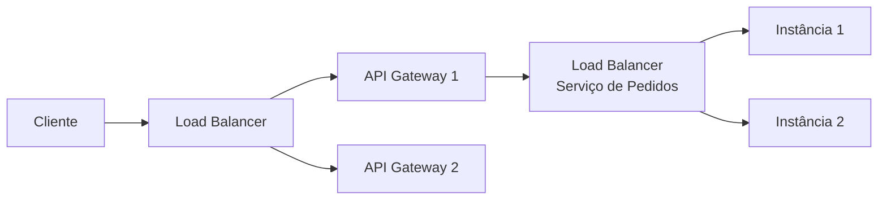
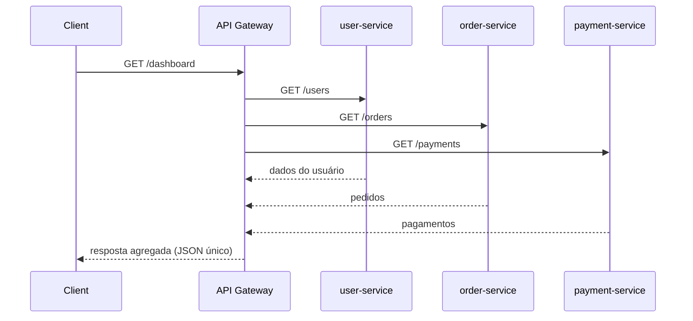
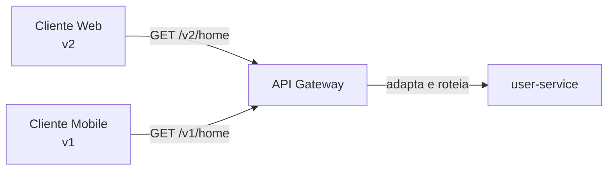

# API Gateway

Um **API Gateway** é a porta de entrada única para os clientes de um sistema baseado em microsserviços. Em vez do cliente conhecer e chamar diretamente cada serviço individual, ele fala só com o gateway, que decide para onde encaminhar cada requisição.

## Responsabilidades

Concentrar as requisições num único ponto de entrada permite centralizar preocupações que, de outra forma, cada microsserviço precisaria implementar por conta própria:

- **Roteamento**: decide, com base na URL ou em outros dados da requisição, qual serviço deve tratá-la (ex: `/usuarios/*` vai para o serviço de usuários).
- **Autenticação**: verifica se quem está fazendo a requisição é quem diz ser (ex: validar um token JWT), antes de deixar a requisição seguir adiante.
- **Autorização**: verifica se, além de autenticado, o usuário tem permissão para aquela ação específica.
- **Rate limiting**: limita quantas requisições um cliente pode fazer num intervalo de tempo, protegendo os serviços de trás contra abuso ou picos excessivos (aprofundado em [Rate Limiting](/labs/web-dev/escalabilidade/09-rate-limiting/)).
- **TLS termination**: o gateway é quem lida com a criptografia HTTPS na borda do sistema; a comunicação entre o gateway e os serviços internos pode acontecer sem esse custo extra, dentro de uma rede já considerada confiável.
- **Logging**: registra as requisições que entram no sistema num único lugar, o que facilita auditoria e depuração.
- **Observabilidade**: como todo tráfego passa por ele, o gateway é um ponto natural para coletar métricas (quantas requisições, quanto tempo cada uma leva, quantos erros) do sistema como um todo, alimentando o que é aprofundado em [Observabilidade](/labs/web-dev/observabilidade/01-logs-metrics-e-traces/).

Sem um API Gateway, cada microsserviço teria que reimplementar autenticação, rate limiting e logging por conta própria, o que gera duplicação de código e inconsistência (um serviço valida o token diferente do outro).

## API Gateway vs Load Balancer

É comum confundir os dois, porque ambos ficam "na frente" dos serviços e distribuem tráfego, mas eles resolvem problemas em camadas diferentes:

|                      | Load Balancer                                                                  | API Gateway                                                                                       |
| -------------------- | ------------------------------------------------------------------------------ | ------------------------------------------------------------------------------------------------- |
| Onde atua            | Tipicamente L4 ou L7, distribuindo tráfego entre réplicas **do mesmo serviço** | L7, roteando entre serviços **diferentes** com base em regras de negócio                          |
| Decisão principal    | "Qual instância está livre para atender?"                                      | "Qual serviço trata esse tipo de requisição, e essa requisição tem permissão para chegar até lá?" |
| Preocupações típicas | Distribuição de carga, health check, failover                                  | Autenticação, autorização, rate limiting, roteamento por rota/versão de API                       |

Na prática, os dois normalmente coexistem no mesmo sistema: o load balancer distribui tráfego entre as réplicas do próprio API Gateway (que também escala horizontalmente), e depois o gateway roteia cada requisição para o load balancer (ou diretamente para as instâncias) do microsserviço correto.

## Padrões avançados de gateway

As responsabilidades já vistas (roteamento, auth, rate limiting) cobrem a maior parte do que um gateway faz no dia a dia. Mas dois problemas específicos, que aparecem sobretudo em sistemas com muitos clientes diferentes consumindo o mesmo backend, merecem um olhar à parte.

### Agregação de requisições (BFF)

Uma tela de dashboard raramente depende de um único serviço. Ela pode precisar do perfil do usuário, dos pedidos recentes e do status de pagamentos, tudo ao mesmo tempo. Sem ajuda do gateway, o cliente teria que fazer três chamadas separadas e juntar o resultado sozinho:

O **BFF** (Backend for Frontend) é esse papel de agregação vivendo no gateway: ele recebe a chamada única do cliente (`GET /dashboard`), dispara as chamadas necessárias para os serviços internos, junta as respostas num JSON só e devolve pro cliente. Isso reduz o número de idas e voltas entre cliente e servidor (roundtrips), o que importa bastante em conexões mais lentas, como redes móveis, onde cada roundtrip a mais custa latência real.

Vale notar uma diferença de escopo: BFF, como padrão, é às vezes implementado como um serviço dedicado por tipo de cliente (um BFF só para mobile, outro só para web), não necessariamente dentro do gateway genérico. Mas a ideia central, agregar múltiplas chamadas de backend numa resposta pensada para o cliente, é a mesma nos dois casos, e um gateway já centralizado é um lugar natural para implementar essa agregação quando não vale a pena manter um serviço BFF separado.

### Adaptação de API

O segundo problema aparece quando clientes diferentes esperam formatos diferentes do mesmo dado. Um app mobile antigo, ainda não atualizado, pode falar a versão `v1` de um endpoint, enquanto a versão web mais nova já fala `v2`, com um payload mais rico:

Em vez de manter duas versões inteiras de cada microsserviço só para atender clientes em versões diferentes, o gateway pode concentrar essa **adaptação**:

- **Versionamento**: rotear `/v1/*` e `/v2/*` para o serviço certo, ou até para a mesma versão do serviço, aplicando uma transformação de payload no meio do caminho, seguindo as estratégias de versionamento já vistas em [Segurança e Evolução de APIs](/labs/web-dev/apis/02-seguranca-e-evolucao-de-apis/).
- **Transformação de payload**: reduzir o payload para o cliente mobile (menos campos, dados mais compactos, pensando em banda e bateria) e manter o payload completo para o cliente web, sem duplicar lógica de negócio no serviço de origem.

Isso mantém os microsserviços de trás enxutos, falando uma única versão do contrato internamente, enquanto o gateway absorve a complexidade de traduzir esse contrato para o que cada geração de cliente espera.

**Quando utilizar um API Gateway**: sistemas com múltiplos microsserviços, especialmente quando existem preocupações transversais (auth, rate limiting) que se repetiriam em cada serviço, ou quando clientes diferentes (app mobile, web, parceiros externos) precisam de formas diferentes de acessar o mesmo conjunto de serviços.

**Quando não utilizar**: em um monólito ou sistema pequeno com poucos serviços, um API Gateway completo pode ser complexidade desnecessária, um load balancer sozinho já resolve o problema de distribuir tráfego, e autenticação pode viver direto na aplicação sem custo real de duplicação.
