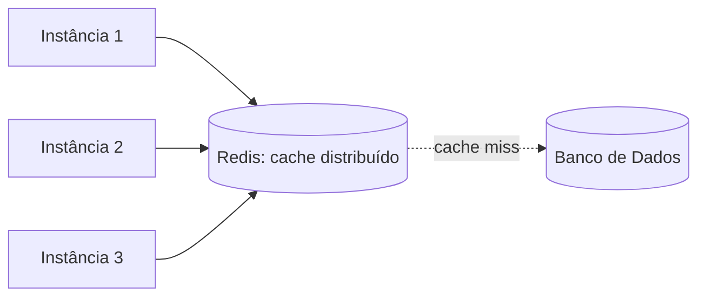
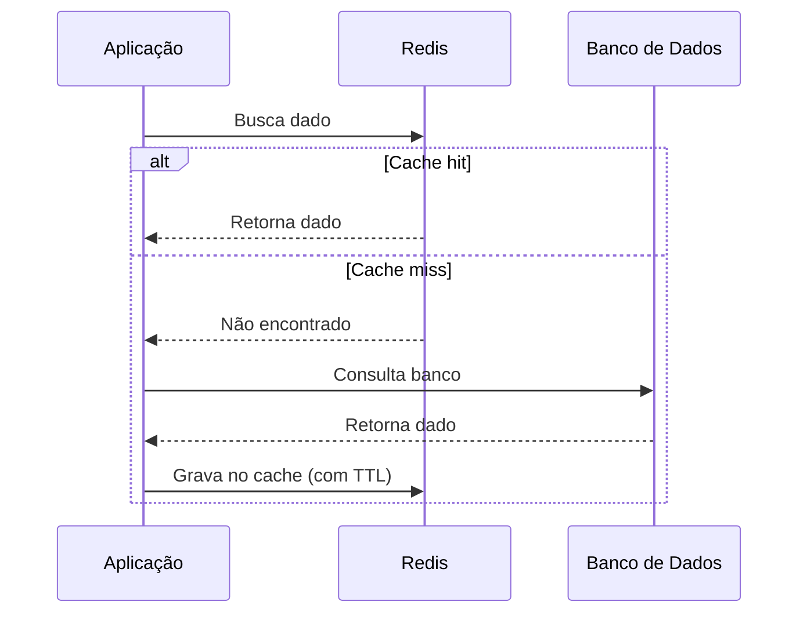
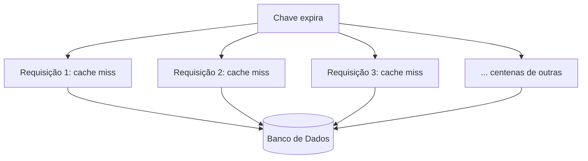

# Cache e Redis

## O que é cache

Cache é uma cópia de um dado guardada num lugar de acesso mais rápido que a fonte original, para evitar refazer um trabalho caro (uma consulta pesada ao banco, uma chamada a uma API externa) toda vez que esse dado é pedido de novo.

**Redis** é o banco de dados em memória mais usado como cache em sistemas web. Por guardar tudo em memória RAM em vez de disco, ele responde em microssegundos, muito mais rápido que uma consulta a um banco relacional tradicional. Além de cache, Redis também é usado para filas simples, contadores, rate limiting (veja [Rate Limiting](/labs/web-dev/escalabilidade/09-rate-limiting/)) e armazenamento de sessão (veja [Stateless, Particionamento e Sharding](/labs/web-dev/escalabilidade/02-stateless-e-particionamento/)), mas o uso mais comum de todos é como cache.

Existem dois níveis de cache, e eles não são excludentes:

- **Cache local**: guardado na memória da própria instância da aplicação. É o mais rápido possível, porque nem sai da máquina, mas cada instância tem sua própria cópia, o que pode gerar dados diferentes entre réplicas (uma instância atualizou o cache, a outra ainda não sabe).
- **Cache distribuído**: guardado num serviço compartilhado (como o Redis), acessível por todas as instâncias da aplicação ao mesmo tempo. Um pouco mais lento que o cache local (precisa de uma chamada de rede), mas garante que todas as réplicas enxerguem o mesmo dado cacheado.

## Estratégias de cache

Existem quatro padrões clássicos que descrevem **quando** e **quem** atualiza o cache em relação ao banco:

- **Cache-aside**: a aplicação é responsável por consultar o cache, e se não encontrar, buscar no banco e escrever no cache manualmente. É o padrão mais comum e mais simples de entender, detalhado na próxima seção.
- **Read-through**: parecido com cache-aside, mas a lógica de buscar no banco em caso de cache miss fica dentro da própria camada de cache, não na aplicação. A aplicação só fala com o cache, e ele decide ir ao banco quando necessário.
- **Write-through**: toda escrita passa primeiro pelo cache, que grava no banco de forma síncrona antes de confirmar a escrita. Garante que cache e banco nunca ficam dessincronizados, ao custo de toda escrita ficar um pouco mais lenta (paga o preço de escrever nos dois lugares).
- **Write-back** (ou write-behind): a escrita vai só para o cache primeiro, que confirma imediatamente, e a gravação no banco acontece depois, de forma assíncrona. Escritas ficam muito rápidas, mas existe uma janela de risco: se o cache falhar antes de persistir no banco, aquele dado se perde.

| Estratégia    | Quem escreve no banco                 | Risco principal                                  |
| ------------- | ------------------------------------- | ------------------------------------------------ |
| Cache-aside   | A aplicação, sob demanda              | Cache pode ficar temporariamente desatualizado   |
| Read-through  | A camada de cache, sob demanda        | Igual ao cache-aside, só muda quem implementa    |
| Write-through | A camada de cache, na hora da escrita | Escrita mais lenta                               |
| Write-back    | A camada de cache, depois, em lote    | Perda de dado se o cache cair antes de persistir |

## Cache-aside em detalhe

Cache-aside é o padrão mais usado na prática porque é simples e dá controle total à aplicação. O fluxo de leitura é:

1. A **aplicação consulta o cache** primeiro, antes de tocar no banco.
2. Se o dado está lá (**cache hit**), retorna direto, sem nunca chegar ao banco.
3. Se não está (**cache miss**), a aplicação faz a **consulta ao banco** normalmente.
4. Depois de obter o resultado, a aplicação faz a **atualização do cache**, salvando esse dado para a próxima leitura já ser um hit.

Escritas, nesse padrão, geralmente invalidam (removem) a entrada do cache em vez de atualizá-la diretamente, deixando a próxima leitura recriar o cache com o dado novo.

## Cache Stampede

**Cache stampede** (também chamado de **thundering herd**, "manada trovejante") é o que acontece quando uma chave de cache muito acessada expira, e um grande número de requisições simultâneas, todas em cache miss ao mesmo tempo, disparam a mesma consulta cara ao banco de uma vez só.

Em vez de uma consulta cara acontecer de vez em quando, ela acontece centenas de vezes ao mesmo tempo, exatamente no instante em que o banco menos aguenta esse volume repentino. Isso pode derrubar o banco mesmo em sistemas que, no dia a dia, dependem pesadamente do cache para nem chegar perto desse limite.

## Estratégias contra Stampede

- **Lock**: quando uma chave expira, só a primeira requisição que perceber o cache miss é autorizada a consultar o banco e repopular o cache; as outras esperam esse resultado (ou recebem um valor levemente desatualizado enquanto isso) em vez de irem todas ao banco ao mesmo tempo.
- **Request coalescing**: parecido com o lock, mas em vez de bloquear as outras requisições, o sistema "junta" todas elas numa única consulta real ao banco, e distribui o mesmo resultado para todas as requisições que estavam esperando.
- **TTL com jitter**: em vez de todas as chaves relacionadas expirarem exatamente no mesmo segundo (o que cria um pico sincronizado), soma-se um valor aleatório pequeno ao TTL de cada uma (ex: `300 segundos + um valor aleatório entre 0 e 30`), espalhando as expirações ao longo do tempo.
- **Refresh antecipado**: em vez de esperar o cache expirar para então buscar o dado novo, um processo em segundo plano atualiza a chave um pouco antes do TTL vencer, para que ela nunca chegue a expirar de fato sob carga alta.

## Problemas de cache

Cache resolve performance, mas introduz uma categoria de problemas própria:

- **Cache invalidation**: decidir quando um dado cacheado deixou de ser válido é, segundo a piada clássica da computação, um dos dois problemas realmente difíceis. Esquecer de invalidar gera dado errado sendo servido; invalidar cedo demais anula o benefício do cache.
- **Stale data**: dado cacheado que ficou desatualizado em relação à fonte real, seja porque o TTL ainda não expirou, seja porque uma invalidação falhou silenciosamente.
- **Cache eviction**: quando o cache está cheio e precisa liberar espaço para novos dados, ele remove entradas segundo alguma política (a mais comum é LRU, "least recently used", remover o que não é acessado há mais tempo).
- **TTL**: escolher um TTL certo é um equilíbrio: muito curto e o cache quase não ajuda (muitos misses); muito longo e o risco de servir dado desatualizado cresce.
- **Hot keys**: quando uma chave específica concentra uma fração desproporcional dos acessos (ex: o produto em promoção do dia), ela pode sobrecarregar um único nó do cache mesmo com o resto do cluster tranquilo, um problema parecido com o de hot partitions em bancos de dados (veja [Replicação e Escalabilidade do Banco de Dados](/labs/web-dev/escalabilidade/03-replicacao-de-banco-de-dados/)).
