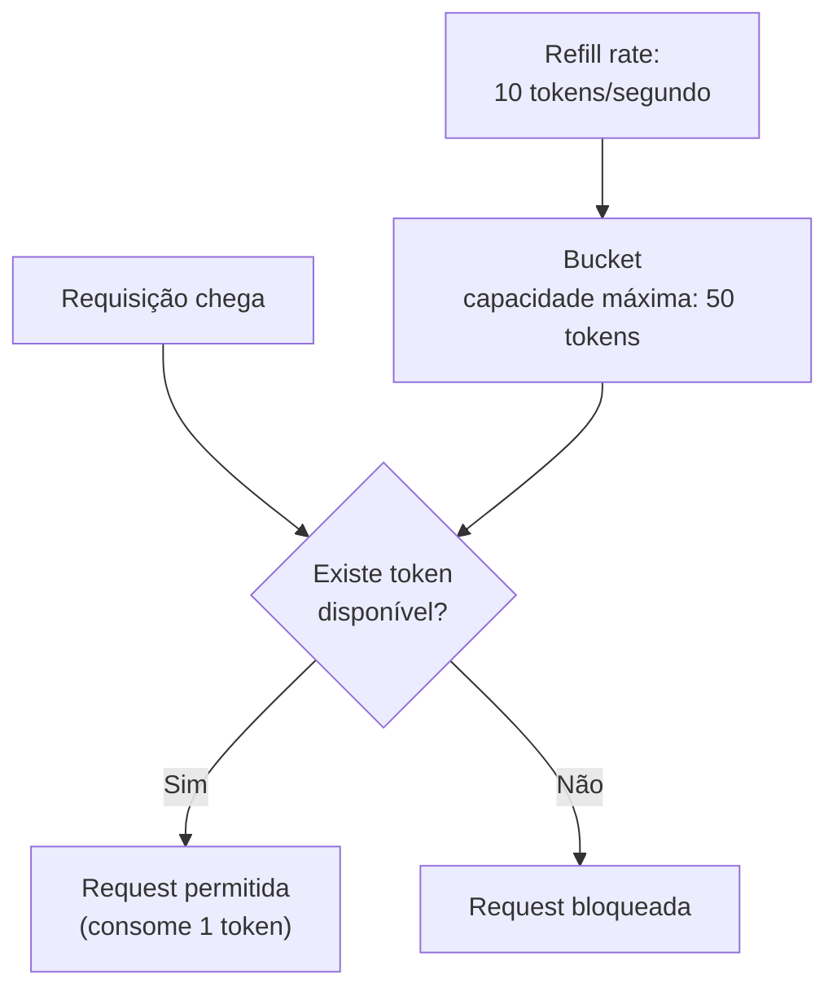

# Rate Limiting

## Conceito

**Rate limiting** é a prática de limitar quantas requisições uma origem específica (um usuário, um IP, uma aplicação parceira) pode fazer dentro de um intervalo de tempo.

Sem esse limite, um único cliente mal comportado (ou malicioso) pode consumir uma fatia desproporcional da capacidade do sistema, degradando a experiência de todo mundo. Os motivos mais comuns para limitar requisições:

- Proteger o sistema contra picos que ultrapassem sua capacidade planejada (veja [Capacity Planning](/labs/web-dev/system-design/capacity-planning/))
- Evitar abuso deliberado, como scraping agressivo ou tentativas de força bruta em login
- Garantir uso justo entre clientes de uma API paga, respeitando o plano contratado por cada um
- Proteger serviços internos mais frágeis (como um banco de dados) de receberem mais carga do que aguentam

## Token Bucket

Token Bucket (balde de tokens) é o algoritmo de rate limiting mais usado na prática, por equilibrar simplicidade com a capacidade de absorver picos curtos sem ser rígido demais.

A ideia: existe um **bucket** (balde) com capacidade para um número máximo de **tokens**. Cada requisição consome um token do balde; se não houver token disponível, a requisição é bloqueada. O balde é reabastecido continuamente a uma taxa fixa, o **refill rate**.

O detalhe importante desse algoritmo é o **burst**: como o bucket acumula tokens até sua capacidade máxima mesmo quando ninguém está fazendo requisições, um cliente que ficou inativo por um tempo consegue disparar uma rajada de requisições de uma vez (até o limite do bucket) sem ser bloqueado, mesmo que essa rajada, momentaneamente, ultrapasse a taxa média configurada. Isso reflete melhor o tráfego real, que raramente é perfeitamente constante.

## Outros algoritmos

- **Fixed Window**: conta requisições dentro de janelas de tempo fixas (ex: "no máximo 100 requisições por minuto", contando de 00 a 59 segundos). Simples de implementar, mas tem um problema conhecido nas bordas da janela: um cliente pode fazer 100 requisições no último segundo de uma janela e mais 100 no primeiro segundo da próxima, totalizando 200 requisições em 2 segundos, mesmo respeitando o limite "por minuto" em cada janela isoladamente.
- **Sliding Window**: em vez de janelas fixas que resetam de uma vez, considera uma janela de tempo que "desliza" continuamente (ex: sempre olhando para os últimos 60 segundos a partir de agora, não para o minuto do relógio). Resolve o problema de borda da Fixed Window, ao custo de mais complexidade de cálculo.
- **Sliding Window Log**: uma variação mais precisa da Sliding Window, que guarda o timestamp exato de cada requisição individual (o "log") para contar com exatidão quantas aconteceram na janela. Mais preciso, mas consome mais memória por cliente, já que precisa lembrar de cada requisição, não só um contador.
- **Leaky Bucket**: parecido com Token Bucket, mas pensado ao contrário: as requisições entram num balde e saem (são processadas) numa taxa fixa e constante, como um balde furado vazando numa velocidade constante. Se as requisições chegam mais rápido do que esse vazamento, o balde enche e transborda (requisições extras são descartadas). Diferente do Token Bucket, ele não permite burst, o processamento é sempre no mesmo ritmo, o que é útil quando o objetivo é suavizar o tráfego para um serviço de trás, não só bloquear excesso.

| Algoritmo          | Permite burst?             | Precisão   | Custo de memória           |
| ------------------ | -------------------------- | ---------- | -------------------------- |
| Fixed Window       | Sim (no problema de borda) | Baixa      | Baixo                      |
| Sliding Window     | Não                        | Média/Alta | Médio                      |
| Sliding Window Log | Não                        | Alta       | Alto (guarda cada request) |
| Leaky Bucket       | Não                        | Alta       | Baixo                      |
| Token Bucket       | Sim (controlado)           | Alta       | Baixo                      |

## Onde aplicar

Rate limiting pode ser configurado em vários níveis, e sistemas maduros normalmente combinam mais de um:

- **API Gateway**: o ponto mais comum de aplicar, porque centraliza todo o tráfego que entra no sistema (veja [API Gateway](/labs/web-dev/escalabilidade/api-gateway/)).
- **Serviço**: um limite específico de um microsserviço particularmente sensível a carga, além do limite geral do gateway.
- **Usuário**: limite por conta autenticada, o mais justo quando o sistema já sabe quem está fazendo a requisição.
- **IP**: útil antes mesmo de autenticação existir (ex: proteção contra força bruta no próprio endpoint de login), mas menos preciso, porque vários usuários podem compartilhar o mesmo IP (ex: numa rede corporativa).
- **API Key**: comum em APIs públicas, onde cada chave representa um cliente ou aplicação integradora.
- **Tenant**: em sistemas multi-inquilino (multi-tenant), o limite é aplicado por cliente empresarial, garantindo que o uso pesado de um tenant não afete os outros que compartilham a mesma infraestrutura.

## Backpressure

Rate limiting rejeita requisições que ultrapassam um limite definido de antemão. **Backpressure** é um mecanismo complementar: em vez de um limite fixo decidido com antecedência, o próprio sistema sinaliza, em tempo real, que está sobrecarregado e que quem está mandando trabalho para ele precisa desacelerar. Isso aparece, por exemplo, quando uma fila cresce além de um limite saudável e passa a rejeitar novas mensagens até os consumers darem conta do que já está acumulado (veja [Filas e Mensageria](/labs/web-dev/mensageria/filas-e-mensageria/)), em vez de aceitar mensagens indefinidamente até a memória do broker se esgotar.
