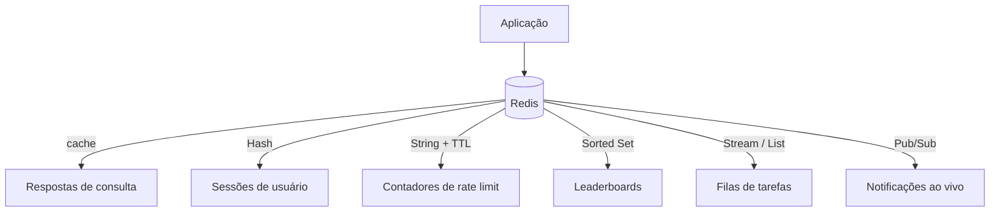
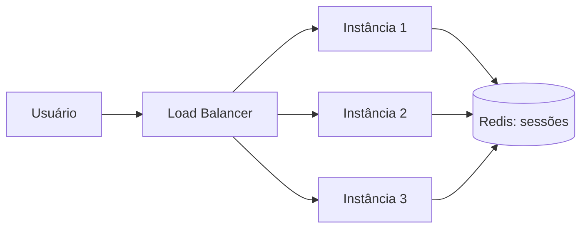

# Casos de Uso do Redis

Quase todo mundo conhece o Redis como cache, e é isso que a nota de [Cache e Redis](/labs/web-dev/escalabilidade/08-cache-e-redis/) cobre a fundo. Mas cache é só o uso mais popular. O mesmo Redis que guarda respostas de consulta também serve de armazenamento de sessão, contador de rate limiting, placar de jogo em tempo real, fila de tarefas e canal de notificação. Esta nota passa por esses outros papéis e mostra qual estrutura de dados sustenta cada um.

## Redis é mais que cache

Redis é um banco de dados que guarda tudo na memória RAM, não no disco. Por causa disso, as respostas saem em frações de milissegundo, mais rápido do que qualquer consulta a um banco relacional que precise ler do disco. Essa é a característica que faz ele ser usado em tantos lugares diferentes.

O que muda de um caso de uso para outro não é o Redis em si, é a estrutura de dados que você escolhe:

| Estrutura  | Para que serve na prática                                           |
| ---------- | ------------------------------------------------------------------- |
| String     | Valor simples: cache de um JSON, contador, flag                     |
| Hash       | Um objeto com vários campos: dados de uma sessão, perfil de usuário |
| List       | Fila simples, lista de itens recentes                               |
| Set        | Coleção sem ordem e sem repetição: tags, quem curtiu um post        |
| Sorted Set | Coleção ordenada por um score: ranking, agendamento por horário     |
| Stream     | Log de eventos append-only, com confirmação de leitura              |
| Pub/Sub    | Canal de transmissão ao vivo, sem guardar nada                      |
| Vector Set | Busca por similaridade entre vetores (embeddings)                   |

Uma dúvida comum de quem está começando: "se está tudo na RAM, eu perco os dados quando o Redis reinicia?". Não necessariamente. O Redis tem dois mecanismos de persistência em disco:

- **RDB** (snapshot): de tempos em tempos, o Redis salva uma cópia completa dos dados num arquivo. Rápido para carregar, mas você pode perder os segundos entre o último snapshot e a queda.
- **AOF** (append-only file): o Redis registra cada comando de escrita num arquivo de log. Perde menos dados numa queda, ao custo de um arquivo maior e de um restart um pouco mais lento.

Dá para usar os dois juntos. Ainda assim, o Redis é pensado para ser rápido primeiro e durável depois, o oposto de um banco relacional. Isso importa na hora de decidir o que pode viver nele.



## Session store

Quando um usuário faz login, o servidor precisa lembrar quem ele é nas próximas requisições. A forma ingênua é guardar essa informação na memória do processo que atendeu o login. O problema aparece assim que a aplicação roda em mais de uma instância atrás de um load balancer: a próxima requisição do mesmo usuário pode cair em outra instância, que não faz ideia de quem ele é.



Colocar a sessão no Redis resolve isso. Qualquer instância consulta o mesmo lugar e enxerga a mesma sessão. Costuma-se usar um Hash por sessão (um campo para o id do usuário, outro para as permissões, etc.), com uma chave tipo `session:abc123`.

O TTL (tempo de vida) do Redis se encaixa bem aqui: você define que a chave da sessão expira em, digamos, 30 minutos, e o Redis apaga sozinho quando o prazo vence. Não precisa de um job de limpeza rodando para remover sessão velha.

Esse mesmo tema aparece pelo lado da aplicação em [Stateless, Particionamento e Sharding](/labs/web-dev/escalabilidade/02-stateless-e-particionamento/): tornar o serviço stateless quase sempre significa empurrar o estado de sessão para um Redis compartilhado.

## Rate limiting

Rate limiting é limitar quantas requisições uma origem (um usuário, um IP, uma API key) pode fazer num intervalo. Os algoritmos por trás disso (Token Bucket, Sliding Window e companhia) estão detalhados na nota de [Rate Limiting](/labs/web-dev/escalabilidade/10-rate-limiting/). Aqui interessa o motivo de o Redis ser a peça usada para implementar quase todos eles.

Dois motivos:

1. **O contador precisa ser compartilhado.** Se cada instância da API contasse as requisições localmente, um cliente batendo numa API com 3 instâncias no ar teria na prática 3x o limite. O contador tem que viver num lugar único, e o Redis é rápido o suficiente para ser consultado a cada requisição sem virar gargalo.
2. **As operações são atômicas.** O comando `INCR` incrementa e devolve o novo valor numa tacada só, sem risco de duas requisições concorrentes lerem o mesmo valor e uma sobrescrever a outra (o problema de race condition que a nota de [Controle de Concorrência](/labs/web-dev/banco-de-dados/07-controle-de-concorrencia/) descreve).

Um rate limiter de janela fixa cabe em poucas linhas:

```
INCR   rate:user:42:1699999860      # incrementa o contador da janela atual
EXPIRE rate:user:42:1699999860 60   # na primeira vez, define expiração de 60s
```

Se o valor retornado passou do limite, a requisição é barrada. Quando a janela vira, a chave nova começa do zero e a antiga expira sozinha.

Para algoritmos que precisam de mais de um passo (Token Bucket, Sliding Window Counter), usa-se um **script Lua**: o Redis executa o script inteiro de forma atômica, então você faz "lê o estado, calcula, escreve o novo estado" sem que outra requisição se meta no meio.

## Leaderboards e rankings em tempo real

Imagine um ranking de um jogo com milhões de jogadores. A cada partida o score de alguém muda, e você precisa responder rápido a três perguntas: quais são os 10 primeiros, qual a posição do jogador X, quem está logo acima e abaixo dele.

Fazer isso com `ORDER BY` num banco relacional fica caro quando a tabela cresce e o score muda toda hora. O Sorted Set do Redis foi feito exatamente para esse formato: cada membro tem um score numérico, e o Redis mantém tudo ordenado o tempo todo. Inserir ou atualizar um score custa O(log N), e pegar uma faixa do ranking custa O(log N + M), onde M é o tamanho da faixa, não o total de jogadores.

Os comandos principais:

```
ZADD    ranking 1500 jogador:42        # define (ou atualiza) o score
ZINCRBY ranking 30 jogador:42          # soma 30 ao score atual
ZREVRANGE ranking 0 9 WITHSCORES       # top 10 (do maior score para o menor)
ZREVRANK  ranking jogador:42           # posição do jogador (0 = primeiro)
```

Fora de jogos, o Sorted Set serve para qualquer coisa que precise de ordem por um número:

- **Fila de prioridade**: o score é a prioridade, você sempre puxa o de menor (ou maior) valor.
- **Agendamento**: o score é um timestamp. Um worker roda de tempos em tempos e pega tudo com score menor ou igual a "agora" para processar.
- **Itens mais acessados / trending**: o score é uma contagem de acessos numa janela de tempo.

## Filas e Streams

Redis atende dois níveis de fila, e a diferença entre eles importa.

### List: a fila simples

Uma List funciona como fila com dois comandos: `LPUSH` coloca um item numa ponta, `BRPOP` tira da outra ponta bloqueando até ter algo para tirar. É simples e rápido, bom para distribuir trabalho entre workers quando você aceita que:

- se o worker pegar o item e cair antes de terminar, o item se perde (não tem confirmação de processamento);
- só um consumidor lê cada item;
- não dá para reprocessar o histórico, porque o item some quando é lido.

### Stream: o log com confirmação

O Redis Stream é um log append-only de eventos, parecido em ideia com o que a nota de [Filas e Mensageria](/labs/web-dev/mensageria/01-filas-e-mensageria/) descreve. Cada entrada ganha um ID com timestamp, e o Stream guarda o histórico em vez de descartar o que já foi lido.

O recurso que muda o jogo é o **consumer group**: um grupo de workers divide as mensagens entre si (cada mensagem vai para um worker do grupo), e o Redis rastreia quais mensagens cada um pegou mas ainda não confirmou.

```
XADD pedidos * cliente 42 valor 199.90        # publica um evento
XREADGROUP GROUP faturamento worker1 COUNT 10 STREAMS pedidos >
XACK pedidos faturamento 1699999999999-0      # confirma que processou
```

Enquanto o worker não manda o `XACK`, a mensagem fica numa lista de pendentes. Se ele cair, outro worker do grupo pode assumir as pendências. Isso dá entrega ao menos uma vez, algo que a List sozinha não oferece.

Quando o Redis basta e quando não: para volume moderado de jobs internos, filas de e-mail, processamento de imagem, o Stream resolve bem e evita mais uma peça de infraestrutura. Quando você precisa de retenção longa (dias ou semanas de histórico), throughput de milhões de mensagens por segundo, ou particionamento pesado, um broker dedicado como o Kafka é a escolha certa.

## Pub/Sub

O Pub/Sub do Redis é um mecanismo de transmissão ao vivo. Um publisher manda uma mensagem para um canal, e todos os subscribers **conectados naquele instante** recebem. Ninguém guarda nada.

```
SUBSCRIBE notificacoes:user:42        # cliente A fica ouvindo
PUBLISH   notificacoes:user:42 "novo comentario no seu post"
```

A palavra-chave é "conectados naquele instante". Se um subscriber estava offline quando a mensagem passou, ele não recebe depois. Não tem histórico, não tem confirmação, não tem reentrega. É fire-and-forget de verdade.

Isso torna o Pub/Sub ótimo para casos onde perder uma mensagem ocasional não é problema:

- empurrar uma notificação ou evento de chat para um usuário que está com a aba aberta;
- avisar todas as instâncias da aplicação de que uma chave de cache mudou, para cada uma limpar seu cache local;
- atualizar um dashboard ao vivo.

E torna ele inadequado quando a entrega precisa ser garantida. Nesse caso a escolha é um Stream (que persiste e confirma) ou um broker completo, assunto da nota de [Arquitetura Orientada a Eventos](/labs/web-dev/mensageria/02-arquitetura-orientada-a-eventos/).

|                                  | Pub/Sub              | Stream                   |
| -------------------------------- | -------------------- | ------------------------ |
| Guarda histórico                 | Não                  | Sim                      |
| Subscriber offline recebe depois | Não                  | Sim                      |
| Confirmação de processamento     | Não                  | Sim (XACK)               |
| Vários grupos de consumidores    | Só quem está ouvindo | Sim, com consumer groups |

## Locks distribuídos

Às vezes você precisa garantir que só um processo por vez execute uma tarefa: rodar um relatório agendado uma única vez mesmo com 5 instâncias no ar, ou impedir que dois serviços mexam no mesmo arquivo ao mesmo tempo. Quando o recurso disputado não está no banco de dados (senão você usaria um lock do próprio banco, como a nota de [Controle de Concorrência](/labs/web-dev/banco-de-dados/07-controle-de-concorrencia/) mostra), um lock distribuído no Redis é uma opção.

A forma básica usa um `SET` com duas opções:

```
SET lock:relatorio-diario <id-unico-do-dono> NX PX 30000
```

- `NX`: só cria a chave se ela ainda não existir. Quem conseguir criar "ganhou" o lock.
- `PX 30000`: a chave expira em 30 segundos. Se o dono do lock travar ou cair sem liberar, o lock some sozinho e não fica preso para sempre.
- o valor é um identificador único do dono, para a liberação ser segura.

Para liberar, não basta um `DEL`: entre você checar que é o dono e apagar, o lock pode ter expirado e sido pego por outro. A liberação correta é um script Lua que checa o dono e apaga na mesma operação atômica:

```lua
if redis.call("GET", KEYS[1]) == ARGV[1] then
    return redis.call("DEL", KEYS[1])
else
    return 0
end
```

Existe também o **Redlock**, um algoritmo que adquire o lock em várias instâncias Redis independentes para tolerar a queda de algumas delas. A documentação oficial descreve ele, mas ele tem uma crítica conhecida e amplamente aceita, do Martin Kleppmann: o Redlock não garante exclusão mútua de verdade quando os relógios das máquinas divergem, quando um processo trava por muito tempo (uma pausa de garbage collection, por exemplo) e volta achando que ainda tem o lock, ou porque não gera um fencing token (um número sempre crescente que o recurso protegido possa usar para rejeitar um dono atrasado).

A conclusão prática: um lock distribuído no Redis serve bem como **otimização de eficiência** (evitar que dois workers façam o mesmo trabalho à toa). Ele não serve como **garantia de correção** quando duas execuções simultâneas causariam um erro grave, tipo cobrar o cliente duas vezes. Para esse caso, você precisa de um mecanismo com fencing token ou de um sistema de consenso de verdade.

## Vector search e cache semântico

Esse é o caso de uso mais recente e vale um aviso: os recursos vetoriais do Redis são novos. Os **Vector Sets** chegaram no Redis 8.0 (lançado em maio de 2025) e ainda estavam marcados como preview, e o serviço gerenciado de cache semântico (LangCache) foi anunciado em 2025. Não é algo com 10 anos de estrada como o resto desta nota.

A ideia: modelos de IA transformam texto (ou imagem, ou áudio) em **embeddings**, que são vetores de centenas ou milhares de números representando o significado daquele conteúdo. Coisas parecidas geram vetores próximos. Uma busca vetorial pega um vetor de consulta e devolve os itens mais próximos dele, usando uma medida como distância de cosseno. O Redis consegue guardar esses vetores e responder esse tipo de busca (KNN, os K vizinhos mais próximos).

Um uso disso é o **cache semântico** para aplicações de LLM. Cache normal só acerta quando a chave é idêntica: "qual a capital da França?" e "me diz a capital da França" seriam duas chaves diferentes e dois misses. O cache semântico compara o significado: se uma pergunta nova é parecida o suficiente com uma já respondida, ele devolve a resposta guardada em vez de chamar o modelo de novo. Isso corta custo (chamada de LLM é cara) e latência.

Em aplicações de RAG (geração aumentada por recuperação), a mesma busca vetorial serve para achar os trechos de documento mais relevantes para a pergunta do usuário antes de montar o prompt.

## Quando não usar Redis

Redis é tentador porque é rápido e versátil, mas ele não é a resposta para tudo:

- **Dado grande demais para a RAM.** Redis guarda tudo na memória. Se seu conjunto de dados tem centenas de gigabytes, o custo de RAM para mantê-lo todo no Redis raramente compensa contra um banco em disco.
- **Fonte de verdade que exige durabilidade forte.** Mesmo com AOF, o modelo do Redis é memória primeiro. Para dados que não podem sumir de jeito nenhum (pedidos, pagamentos, cadastro), o lugar deles é um banco durável, com o Redis do lado só acelerando as leituras.
- **Consultas relacionais.** Joins entre entidades, filtros complexos, transações ACID cobrindo várias tabelas: isso é trabalho para um banco relacional. Forçar isso no Redis significa reimplementar na aplicação o que o SQL já faz.

O padrão comum em sistemas reais é usar os dois: um banco relacional como fonte de verdade e o Redis ao lado para cache, sessão, contadores e rankings.

## Referências

- [O que é o Redis?](https://aws.amazon.com/pt/elasticache/what-is-redis/) - AWS, pt-BR
- [Redis use cases](https://redis.io/docs/latest/develop/use-cases/) - Redis, en
- [Redis data types](https://redis.io/docs/latest/develop/data-types/) - Redis, en
- [Distributed Locks with Redis](https://redis.io/docs/latest/develop/clients/patterns/distributed-locks/) - Redis, en
- [How to do distributed locking](https://martin.kleppmann.com/2016/02/08/how-to-do-distributed-locking.html) - Martin Kleppmann, en
- [Redis 8.0 release notes (Vector Sets)](https://redis.io/docs/latest/develop/whats-new/8-0/) - Redis, en
