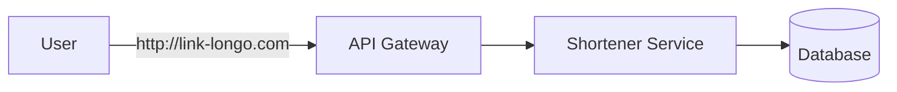

# Encurtador de URL

Um encurtador de URL é um sistema que:

- Recebe uma URL longa
- Gera uma URL curta única
- Redireciona usuários da URL curta para a original

## Estrutura de raciocínio

Um framework útil para entrevistas de system design é o FENCAFA:

1. Funcional
2. Escala
3. Não-funcional
4. Componentes
5. Arquitetura
6. Fluxo
7. Ajustes

## Requisitos do sistema

### Funcionais

- Criar URL curta
- Redirecionar URL
- Métricas de acesso

### Não-funcionais

- Alta disponibilidade
- Baixa latência
- Escalabilidade massiva
- Consistência eventual aceitável

## Estimativa de escala

Você deve pensar em:

- Número de URLs criadas por dia
- Número de redirecionamentos
- Volume de armazenamento

> Esse é um sistema read-heavy.

## Modelo básico

1. Usuário envia URL longa
2. Sistema gera código curto
3. Salva o mapping `short_code -> original_url`
4. O redirecionamento consulta esse mapping

## Geração da URL curta

### Estratégias

**Auto-increment + Base62**

Simples e determinístico, mas previsível.

**Hash da URL**

Pode colidir e dificulta controle.

**ID distribuído**

Escalável e evita gargalo central.

## Escala e otimizações

Como a leitura domina o sistema, o gargalo principal costuma estar no redirecionamento.

### Otimizações

- **Cache** para reduzir latência
- **CDN** para distribuição geográfica
- **Banco distribuído** com sharding por chave

## Arquitetura proposta

Componentes principais:

- API Service
- Banco de dados
- Cache
- Load Balancer
- Pipeline de analytics

### Fluxo de leitura

1. Recebe short URL
2. Busca no cache
3. Se der miss, consulta o banco
4. Retorna redirect HTTP 301 ou 302

### Fluxo de escrita

1. Gera ID
2. Salva mapping
3. Atualiza cache

## Problemas avançados

- Cache invalidation
- Hot keys
- Consistência eventual
- Abuso e segurança
- Analytics em sistema separado

## Trade-offs

| Decisão           | Trade-off    |
| ----------------- | ------------ |
| Cache agressivo   | Consistência |
| ID sequencial     | Segurança    |
| Hash              | Colisão      |
| Banco único       | Escala       |
| Banco distribuído | Complexidade |

## Resumo

- Sistema simples conceitualmente, difícil na escala
- Leitura domina o sistema
- Cache é essencial
- Geração de ID é crítica

## Referências

- [System Design: Encurtador de URL - Desafio Real de Entrevista RESOLVIDO | Leonardo Zamariola](https://www.youtube.com/watch?v=JHavVCLQT4k)

